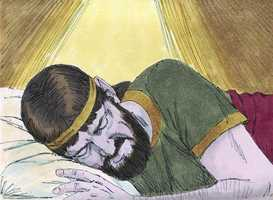

# 2 Samuel Cap 07

**1** 	E SUCEDEU que, estando o rei Davi em sua casa, e tendo o Senhor lhe dado descanso de todos os seus inimigos em redor,

> **Cmt MHenry**: *Versículos 1-3* Já estabelecido em seu palácio, Davi meditava como podia empregar melhor seu tempo e sua prosperidade no serviço de Deus. Se fez o propósito de edificar um templo para a arca. Aqui Natã não fala como profeta, senão como homem piedoso estimulando a Davi com seu juízo particular. Temos de fazer todo o que possamos para animar e promover os bons propósitos e intenções do próximo, e a medida que tivermos a oportunidade, fomentar uma boa obra.

**2** 	Disse o rei ao profeta Natã: Eis que eu moro em casa de cedro, e a arca de Deus mora dentro de cortinas.

**3** 	E disse Natã ao rei: Vai, e faze tudo quanto está no teu coração; porque o Senhor é contigo.

**4** 	Porém sucedeu naquela mesma noite, que a palavra do Senhor veio a Natã, dizendo:

> **Cmt MHenry**: *Versículos 4-17* Prometem-se bênçãos à família e posteridade de Davi. Estas promessas se relacionam com Salomão, o sucessor imediato de Davi, e a linhagem real de Judá. Porém, também se relacionam com Cristo, que é chamado com freqüência de Davi e Filho de Davi. Deus lhe deu toda potestade no céu e na terra, com autoridade para realizar o juízo. Ele construiria o templo do evangelho, uma casa para o nome de Deus; o templo espiritual dos crentes verdadeiros, para ser morada de Deus no Espírito. O estabelecimento de sua casa, seu trono e seu reino eterno, não podem ser aplicados a outro que não seja Cristo e seu reino: a casa e o reino de Davi terminaram há muito. A iniqüidade cometida não pode aplicar-se ao Messias mesmo, senão a sua descendência espiritual; verdadeiros crentes têm doenças, a correção das quais devem esperar, ainda que não sejam rejeitados.

**5** 	Vai, e dize a meu servo Davi: Assim diz o Senhor: Edificar-me-ás tu uma casa para minha habitação?

 

**6** 	Porque em casa nenhuma habitei desde o dia em que fiz subir os filhos de Israel do Egito até ao dia de hoje; mas andei em tenda e em tabernáculo.

**7** 	E em todo o lugar em que andei com todos os filhos de Israel, falei porventura alguma palavra a alguma das tribos de Israel, a quem mandei apascentar o meu povo de Israel, dizendo: Por que não me edificais uma casa de cedro?

> **Cmt MHenry**: *CAPÍTULO 7*

**8** 	Agora, pois, assim dirás ao meu servo Davi: Assim diz o Senhor dos Exércitos: Eu te tomei da malhada, de detrás das ovelhas, para que fosses o soberano sobre o meu povo, sobre Israel.

**9** 	E fui contigo, por onde quer que foste, e destruí a teus inimigos diante de ti; e fiz grande o teu nome, como o nome dos grandes que há na terra.

**10** 	E prepararei lugar para o meu povo, para Israel, e o plantarei, para que habite no seu lugar, e não mais seja removido, e nunca mais os filhos da perversidade o aflijam, como dantes,

**11** 	E desde o dia em que mandei que houvesse juízes sobre o meu povo Israel; a ti, porém, te dei descanso de todos os teus inimigos; também o Senhor te faz saber que te fará casa.

**12** 	Quando teus dias forem completos, e vieres a dormir com teus pais, então farei levantar depois de ti um dentre a tua descendência, o qual sairá das tuas entranhas, e estabelecerei o seu reino.

**13** 	Este edificará uma casa ao meu nome, e confirmarei o trono do seu reino para sempre.

**14** 	Eu lhe serei por pai, e ele me será por filho; e, se vier a transgredir, castigá-lo-ei com vara de homens, e com açoites de filhos de homens.

**15** 	Mas a minha benignidade não se apartará dele; como a tirei de Saul, a quem tirei de diante de ti.

**16** 	Porém a tua casa e o teu reino serão firmados para sempre diante de ti; teu trono será firme para sempre.

**17** 	Conforme a todas estas palavras, e conforme a toda esta visão, assim falou Natã a Davi.

**18** 	Então entrou o rei Davi, e ficou perante o Senhor, e disse: Quem sou eu, Senhor Deus, e qual é a minha casa, para que me tenhas trazido até aqui?

> **Cmt MHenry**: *Versículos 18-29* A oração de Davi está cheia de suspiros de afetuosa devoção a Deus. considerava em pouco seus méritos próprios. Quanto temos deve ser considerado como dom de Deus. fala alta e honrosamente dos favores que Deus lhe dispensara. Considerando o caráter e estado do homem, pode maravilhar-nos a forma em que Deus trata com ele. A promessa de Cristo inclui todo; se o Senhor Deus é nosso, que mais podemos pedir ou pensar? ([Ef 3.20](../49N-Ef/03.md#20)). Ele nos conhece melhor do que nos conhecemos, portanto, contentemo-nos com o que fez por nós. que podemos dizer por nós mesmos em nossas orações que seja mais do que Deus tem dito por nós em suas promessas? Davi atribui todo à livre graça de Deus: as grandes coisas que Ele tinha feito por ele e as grandes que lhe tinha feito conhecer. Todo era por amor a sua palavra, isto é, por amor a Cristo, a Palavra eterna. Muitos têm que esquadrinhar seu coração quando vão orar, mas o coração de Davi estava preparado, estável; terminadas suas peregrinações, se entregou totalmente ao dever, e se aplicou a isso. a oração que somente é da língua não agrada a Deus; o que será elevado e derramado ante Deus deve achar-se no coração. Ele edifica sua fé e espera o bem baseado na certeza da promessa de Deus. Davi ora pelo cumprimento da promessa. Dizer e fazer não são duas coisas com Deus, como costuma acontecer entre os homens; Deus fará como tem falado. As promessas de Deus não nos são feitas por nome, como a Davi, porém pertencem a todos os que crêem em Jesus Cristo e as invocam em Seu nome.

 

**19** 	E ainda foi isto pouco aos teus olhos, Senhor Deus, senão que também falaste da casa de teu servo para tempos distantes; é este o procedimento dos homens, ó Senhor Deus?

**20** 	E que mais te pode dizer ainda Davi? Pois tu conheces bem a teu servo, ó Senhor Deus.

**21** 	Por causa da tua palavra, e segundo o teu coração, fizeste toda esta grandeza; fazendo-a saber a teu servo.

**22** 	Portanto, grandioso és, ó Senhor Deus, porque não há semelhante a ti, e não há outro Deus senão tu só, segundo tudo o que temos ouvido com os nossos ouvidos.

**23** 	E quem há como o teu povo, como Israel, gente única na terra, a quem Deus foi resgatar para seu povo, para fazer-te nome, e para fazer-vos estas grandes e terríveis coisas à tua terra, diante do teu povo, que tu resgataste do Egito, desterrando as nações e a seus deuses?

**24** 	E confirmaste a teu povo Israel por teu povo para sempre, e tu, Senhor, te fizeste o seu Deus.

**25** 	Agora, pois, ó Senhor Deus, esta palavra que falaste acerca de teu servo e acerca da sua casa, confirma-a para sempre, e faze como tens falado.

**26** 	E engrandeça-se o teu nome para sempre, para que se diga: O Senhor dos Exércitos é Deus sobre Israel; e a casa de teu servo será confirmada diante de ti.

**27** 	Pois tu, Senhor dos Exércitos, Deus de Israel, revelaste aos ouvidos de teu servo, dizendo: Edificar-te-ei uma casa. Portanto o teu servo se animou para fazer-te esta oração.

**28** 	Agora, pois, Senhor Deus, tu és o mesmo Deus, e as tuas palavras são verdade, e tens falado a teu servo este bem.

**29** 	Sê, pois, agora servido de abençoar a casa de teu servo, para permanecer para sempre diante de ti, pois tu, ó Senhor Deus, o disseste; e com a tua bênção será para sempre bendita a casa de teu servo.

> **Cmt MHenry** Intro: *• Versículos 1-3*> *O cuidado de Davi pela arca*> *• Versículos 4-17*> *A aliança de Deus com Davi*> *• Versículos 18-29*> *Oração e ação de graças*