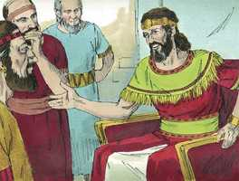
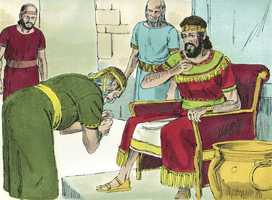
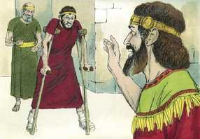
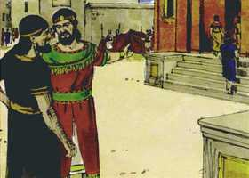
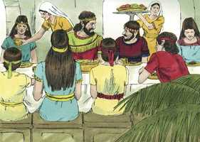

# 2 Samuel Cap 09

**1** 	E DISSE Davi: Há ainda alguém que tenha ficado da casa de Saul, para que lhe faça benevolência por amor de Jônatas?

> **Cmt MHenry**: *Versículos 1-8* Em meio de numerosos assuntos, tendemos a esquecer-nos da gratidão que devemos e os compromissos que temos, não só com nossos amigos, sena para com Deus mesmo. Contudo, as pessoas de verdadeira piedade não descansam até tê-los cumprido. E os objetos mais apropriados para mostrá-lhes bondade e caridade, muitas vezes não se encontram sem serem buscados. Jônatas foi o amigo dileto de Davi, portanto, foi bondoso com Mefibosete, o filho de Jônatas. Deus é fiel conosco; não sejamos infiéis os uns com os outros. se a providência nos faz progredir, e decaem nossas amizades e familiares, devemos ter cuidado de buscar a justa oportunidade de sermos amáveis com eles.

 

**2** 	E havia um servo na casa de Saul cujo nome era Ziba; e o chamaram à presença de Davi. Disse-lhe o rei: És tu Ziba? E ele disse: Servo teu.

 

**3** 	E disse o rei: Não há ainda alguém da casa de Saul para que eu use com ele da benevolência de Deus? Então disse Ziba ao rei: Ainda há um filho de Jônatas, aleijado de ambos os pés.

**4** 	E disse-lhe o rei: Onde está? E disse Ziba ao rei: Eis que está em casa de Maquir, filho de Amiel, em Lo-Debar.

**5** 	Então mandou o rei Davi, e o tomou da casa de Maquir, filho de Amiel, de Lo-Debar.

**6** 	E Mefibosete, filho de Jônatas, o filho de Saul, veio a Davi, e se prostrou com o rosto por terra e inclinou-se; e disse Davi: Mefibosete! E ele disse: Eis aqui teu servo.

 

**7** 	E disse-lhe Davi: Não temas, porque decerto usarei contigo de benevolência por amor de Jônatas, teu pai, e te restituirei todas as terras de Saul, teu pai, e tu sempre comerás pão à minha mesa.

**8** 	Então se inclinou, e disse: Quem é teu servo, para teres olhado para um cão morto tal como eu?

**9** 	Então chamou Davi a Ziba, moço de Saul, e disse-lhe: Tudo o que pertencia a Saul, e a toda a sua casa, tenho dado ao filho de teu senhor.

> **Cmt MHenry**: *Versículos 9-13* Como Davi era um tipo de Cristo, seu Senhor e Filho, sua Raiz e Progênie, deixa que sua bondade com Mefibosete nos lembre a bondade e amor de Deus nosso Salvador para com o homem caído, com quem nada o obriga, como Davi para com Jônatas. O Filho de Deus busca a raça caída e perdida que não buscou a Ele. Ele veio buscar e salvar o que se tinha perdido!

> **Cmt MHenry**: *CAPÍTULO 9*

 

**10** 	Trabalhar-lhe-ás, pois, a terra, tu e teus filhos, e teus servos, e recolherás os frutos, para que o filho de teu senhor tenha pão para comer; mas Mefibosete, filho de teu senhor, sempre comerá pão à minha mesa. E tinha Ziba quinze filhos e vinte servos.

**11** 	E disse Ziba ao rei: Conforme a tudo quanto meu senhor, o rei, manda a seu servo, assim fará teu servo. Quanto a Mefibosete, disse o rei, comerá à minha mesa como um dos filhos do rei.

**12** 	E tinha Mefibosete um filho pequeno, cujo nome era Mica; e todos quantos moravam em casa de Ziba eram servos de Mefibosete.

**13** 	Morava, pois, Mefibosete em Jerusalém, porquanto sempre comia à mesa do rei, e era coxo de ambos os pés.

 

> **Cmt MHenry** Intro: *• Versículos 1-8*> *Davi manda a buscar a Mefibosete*> *• Versículos 9-13*> *E provê para ele*