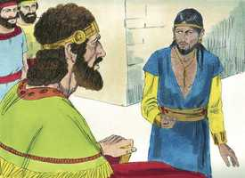
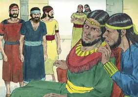
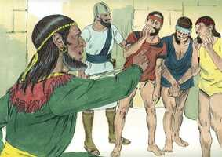
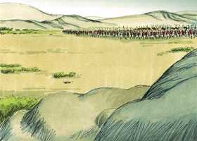
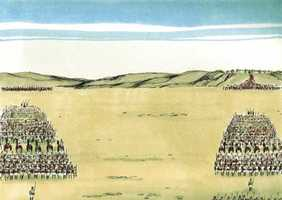
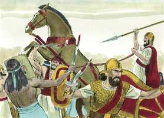
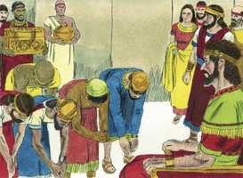

# 2 Samuel Cap 10

**1** 	E ACONTECEU depois disto que morreu o rei dos filhos de Amom, e seu filho Hanum reinou em seu lugar.

> **Cmt MHenry**: *Versículos 1-5* Naás tinha sido inimigo de Israel, porém tinha sido bondoso com Davi. Portanto, este resolve retribui-lhe agradecido. Se um fariseu der esmola com orgulho, embora Deus não o recompense, o que recebe a esmola deve dar graça por isso. Os que têm má vontade com seu próximo têm resolvido acreditar que eles não lhes têm boa vontade. Nada tem boa intenção, e todo pode ser mal-interpretado pelos homens que somente se amam a si mesmos, e não pode ser de outro jeito. Os melhores homens não devem achar estranho se são mal-entendidos. O amor não pensa mal. Conforme com o costume da época e daqueles países, Hanum tratou os embaixadores de Davi na forma mais depreciativa. Davi se afligiu muito por seus servos. Aprendamos a não levar a sério as repreensões injustas que se passarão e serão para vergonha dos que os expressaram ou fizeram; em vez disso, a reputação injustamente ferida em pouco tempo volta a crescer, como a barba. Deus exibirá a justiça de você como a luz, portanto, fique calado ante Jeová e espere nEle ([Sl 37.6-7](../19A-Sl/37.md#6)).

**2** 	Então disse Davi: Usarei de benevolência com Hanum, filho de Naás, como seu pai usou de benevolência comigo. E enviou Davi os seus servos para consolá-lo acerca de seu pai; e foram os servos de Davi à terra dos filhos de Amom.

 

**3** 	Então disseram os príncipes dos filhos de Amom a seu senhor, Hanum: Porventura honra Davi a teu pai aos teus olhos, porque te enviou consoladores? Não te enviou antes Davi os seus servos para reconhecerem esta cidade, e para espiá-la, e para transtorná-la?

 

**4** 	Então tomou Hanum os servos de Davi, e lhes raspou metade da barba, e lhes cortou metade das vestes, até às nádegas, e os despediu.

 

**5** 	Quando isso foi informado a Davi, enviou ele mensageiros a encontrá-los, porque estavam aqueles homens sobremaneira envergonhados. Mandou o rei dizer-lhes: Deixai-vos estar em Jericó, até que vos torne a crescer a barba, e então voltai.

**6** 	Vendo, pois, os filhos de Amom que se tinham feito abomináveis para com Davi, enviaram os filhos de Amom, e alugaram dos sírios de Bete-Reobe e dos sírios de Zobá vinte mil homens de pé, e do rei de Maaca mil homens e dos homens de Tobe doze mil homens.

> **Cmt MHenry**: *Versículos 6-14* Os que estão em guerra com o Filho de Davi não somente provocam, senão que começam a guerra. Deus tem forças para mandar contra os que desafiam sua ira ([Is 5.19](../23A-Is/05.md#19)), as que os convencerão de que nunca ninguém que tenha endurecido seu coração contra Deus tem prosperado. Os soldados de Cristo devem reforçar suas mãos uns aos outros na guerra espiritual. Que nada falte em nós, qualquer seja o êxito. Quando tomamos consciência de cumprirmos nosso dever, com satisfação podemos deixar o fato com Deus, esperando com toda certeza sua salvação a sua maneira e no tempo oportuno.

 

**7** 	E ouvindo Davi, enviou a Joabe e a todo o exército dos valentes.

**8** 	E saíram os filhos de Amom, e ordenaram a batalha à entrada da porta; mas os sírios de Zobá e Reobe, e os homens de Tobe e Maaca estavam à parte no campo.

 

**9** 	Vendo, pois, Joabe que a batalha estava preparada contra ele pela frente e pela retaguarda, escolheu dentre todos os homens de Israel, e formou-os em linha contra os sírios.

**10** 	E o restante do povo entregou na mão de Abisai seu irmão, o qual formou em linha contra os filhos de Amom.

> **Cmt MHenry**: *CAPÍTULO 10A-2Sm

**11** 	E disse: Se os sírios forem mais fortes do que eu, tu me virás em socorro; e, se os filhos de Amom forem mais fortes do que tu, irei a socorrer-te.

**12** 	Esforça-te, pois, e esforcemo-nos pelo nosso povo, e pelas cidades de nosso Deus; e faça o Senhor o que bem parecer aos seus olhos.

**13** 	Então se achegou Joabe, e o povo que estava com ele, à peleja contra os sírios; e fugiram de diante dele.

 

**14** 	E, vendo os filhos de Amom que os sírios fugiam, também eles fugiram de diante de Abisai, e entraram na cidade; e voltou Joabe dos filhos de Amom, e veio para Jerusalém.

**15** 	Vendo, pois, os sírios que foram feridos diante de Israel, tornaram a refazer-se.

> **Cmt MHenry**: *Versículos 15-19* Aqui há uma nova tentativa dos sírios. Até a causa moribunda sairá adiante na medida em que lhe restar algo de vida; os inimigos do Filho de Davi assim agem. Todavia, agora se cumpria a promessa feita a Abraão ([Gn 15.18](../01A-Gn/15.md#18)), e reiterada a Josué ([Js 1.4](../06A-Js/01.md#4)), de que as fronteiras de Israel se estenderiam até o rio Eufrates. Aprendam daqui que é perigoso ajudar os que têm a Deus por inimigo, quando caiam, cairão com eles os que os ajudaram.

**16** 	E mandou Hadadezer, e fez sair os sírios que estavam do outro lado do rio, e vieram a Helã; e Sobaque, capitão do exército de Hadadezer, marchava diante deles.

**17** 	Do que informado Davi, ajuntou a todo o Israel, e passou o Jordão, e foi a Helã; e os sírios se puseram em ordem contra Davi, e pelejaram com ele.

**18** 	Porém os sírios fugiram de diante de Israel, e Davi feriu dentre os sírios aos homens de setecentos carros, e quarenta mil homens de cavalaria; feriu também a Sobaque, capitão do exército, que morreu ali.

**19** 	Vendo, pois, todos os reis, servos de Hadadezer, que foram feridos diante de Israel, fizeram paz com Israel, e o serviram; e temeram os sírios de socorrer aos filhos de Amom.

 

> **Cmt MHenry** Intro: *• Versículos 1-5*> 28A-Os mensageiros de Davi são maltratados por Hanum*> *• Versículos 6-14*> *Derrota dos amonitas*> *• Versículos 15-19*> *Derrota dos sírios*