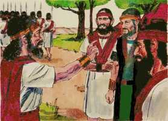

# 2 Samuel Cap 17

**1** 	DISSE mais Aitofel a Absalão: Deixa-me escolher doze mil homens, e me levantarei, e perseguirei a Davi esta noite.

> **Cmt MHenry**: *Versículos 1-21* Aqui houve um efeito maravilhoso da Providência Divina que cegou a mente de Absalão e influenciou em seu coração para não seguir o conselho de Aitofel, e desejar o conselho de Husai. Mas não há discussão com este Deus que pode armar a um homem contra si mesmo, e destruí-lo por seus próprios erros e paixões. O anterior conselho de Aitofel foi seguido, porque Deus queria corrigir a Davi, porém o último não foi seguido porque Deus não queria destruí-lo. Ele pode anular todos os conselhos. O êxito é de Deus sozinho, que não permitirá que seu povo pereça, seja qual for a sabedoria ou ajuda que um homem possa empregar ou permitir-se.

**2** 	E irei sobre ele, pois está cansado e frouxo de mãos; e o espantarei, e fugirá todo o povo que está com ele; e então ferirei somente o rei.

**3** 	E farei tornar a ti todo o povo; pois o homem a quem tu buscas é como se tornassem todos; assim todo o povo estará em paz.

**4** 	E esta palavra pareceu boa aos olhos de Absalão, e aos olhos de todos os anciãos de Israel.

**5** 	Disse, porém, Absalão: Chamai agora também a Husai o arquita; e ouçamos também o que ele dirá.

**6** 	E, chegando Husai a Absalão, lhe falou Absalão, dizendo: Desta maneira falou Aitofel; faremos conforme à sua palavra? Se não, fala tu.

**7** 	Então disse Husai a Absalão: O conselho que Aitofel deu desta vez não é bom.

**8** 	Disse mais Husai: Bem conheces tu a teu pai, e a seus homens, que são valorosos, e que estão com o espírito amargurado, como a ursa no campo, roubada dos cachorros; e também teu pai é homem de guerra, e não passará a noite com o povo.

**9** 	Eis que agora estará escondido nalguma cova, ou em qualquer outro lugar; e será que, caindo no princípio alguns dentre eles, cada um que o ouvir então dirá: Houve derrota no povo que segue a Absalão.

**10** 	Então até o homem valente, cujo coração é como coração de leão, sem dúvida desmaiará; porque todo o Israel sabe que teu pai é valoroso, e homens valentes os que estão com ele.

**11** 	Eu, porém, aconselho que com toda a pressa se ajunte a ti todo o Israel desde Dã até Berseba, em multidão como a areia do mar; e tu em pessoa vás com eles à peleja.

**12** 	Então iremos a ele, em qualquer lugar que se achar, facilmente cairemos sobre ele, como o orvalho cai sobre a terra; e não ficará dele e de todos os homens que estão com ele nem ainda um só.

**13** 	E, se ele se retirar para alguma cidade, todo o Israel levará cordas àquela cidade; e arrastá-la-emos até ao ribeiro, até que não se ache ali nem uma só pedrinha.

**14** 	Então disse Absalão e todos os homens de Israel: Melhor é o conselho de Husai, o arquita, do que o conselho de Aitofel (porém assim o Senhor o ordenara, para aniquilar o bom conselho de Aitofel, para que o Senhor trouxesse o mal sobre Absalão).

**15** 	E disse Husai a Zadoque e a Abiatar, sacerdotes: assim e assim aconselhou Aitofel a Absalão e aos anciãos de Israel; porém assim e assim aconselhei eu.

**16** 	Agora, pois, enviai apressadamente, e avisai a Davi, dizendo: Não passes esta noite nas campinas do deserto; logo também passa ao outro lado, para que o rei e todo o povo que com ele está não seja devorado.

**17** 	Estavam, pois, Jônatas e Aimaás junto à fonte de Rogel; e foi uma criada, e lho disse, e eles foram e o disseram ao rei Davi, porque não podiam ser vistos entrar na cidade.

> **Cmt MHenry**: *CAPÍTULO 17A-Et

**18** 	Mas viu-os todavia um moço, e avisou a Absalão; porém ambos logo partiram apressadamente, e entraram em casa de um homem, em Baurim, o qual tinha um poço no seu pátio, e ali dentro desceram.

**19** 	E tomou a mulher a tampa, e a estendeu sobre a boca do poço, e espalhou grão descascado sobre ela; assim nada se soube.

**20** 	Chegando, pois, os servos de Absalão à mulher, àquela casa, disseram: Onde estão Aimaás e Jônatas? E a mulher lhes disse: Já passaram o vau das águas. E havendo-os buscado, e não os achando, voltaram para Jerusalém.

**21** 	E sucedeu que, depois que se retiraram, Aimaás e Jônatas saíram do poço, e foram, e anunciaram a Davi; e disseram a Davi: Levantai-vos, e passai depressa as águas, porque assim aconselhou contra vós Aitofel.

**22** 	Então Davi e todo o povo que com ele estava se levantou, e passaram o Jordão; e já pela luz da manhã nem ainda faltava um só que não tivesse passado o Jordão.

> **Cmt MHenry**: *Versículos 22-29* Aitofel se enforcou, ressentido porque não se seguirá seu conselho. Destrocará o coração do homem orgulhoso o que não interrompe o sono do homem humilde. Se pensou ameaçado, concluindo que, como seu conselho não foi seguido, a causa de Absalão fracassaria e, para prevenir uma possível execução pública, se fez justiça a si mesmo. Assim se detém seu hálito e se dobra a cabeça da qual nada podia esperar-se, senão maldade. Absalão perseguiu a seu pai. Todavia, observe-se como Deus às vezes dá consolo de estranhos a seu povo, quando não o recebem de sua própria família. Nosso Rei não necessita nossa ajuda, mas nos assegura que o que fazemos por o menor de nossos irmãos, doentes, pobres e necessitados, será aceito e recompensado como se for feito a Ele mesmo.

**23** 	Vendo, pois, Aitofel que se não tinha seguido o seu conselho, albardou o jumento, e levantou-se, e foi para sua casa e para a sua cidade, e deu ordem à sua casa, e se enforcou e morreu, e foi sepultado na sepultura de seu pai.

**24** 	E Davi foi a Maanaim; e Absalão passou o Jordão, ele e todo o homem de Israel com ele.

**25** 	E Absalão constituiu a Amasa em lugar de Joabe sobre o arraial; e era Amasa filho de um homem cujo nome era Itra, o israelita, o qual possuíra a Abigail, filha de Naás, irmã de Zeruia, mãe de Joabe.

**26** 	Israel, pois, e Absalão acamparam na terra de Gileade.

**27** 	E sucedeu que, chegando Davi a Maanaim, Sobi, filho de Naás, de Rabá, dos filhos de Amom, e Maquir, filho de Amiel, de Lo-Debar, e Barzilai, o gileadita, de Rogelim,

 

**28** 	Tomaram camas e bacias, e vasilhas de barro, e trigo, e cevada, e farinha, e grão torrado, e favas, e lentilhas, também torradas,

**29** 	E mel, e manteiga, e ovelhas, e queijos de vacas, e os trouxeram a Davi e ao povo que com ele estava, para comerem, porque disseram: Este povo no deserto está faminto, cansado e sedento.

> **Cmt MHenry** Intro: *• Versículos 1-21*> *O conselho de Aitofel é frustrado*> *• Versículos 22-29*> *Aitofel se enforca – Absalão persegue a Davi*