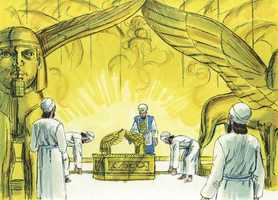
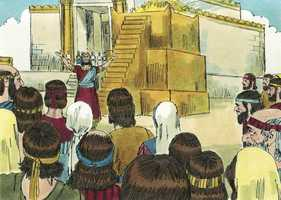
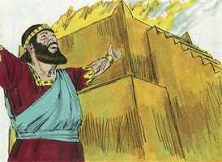

# 1 Reis Cap 08

**1** 	ENTÃO congregou Salomão os anciãos de Israel, e todos os cabeças das tribos, os chefes dos pais dos filhos de Israel, diante de si em Jerusalém; para fazerem subir a arca da aliança do Senhor da cidade de Davi, que é Sião.

> **Cmt MHenry**: *Versículos 1-11* Entrar com a arca é a finalidade que deve coroar a obra: foi feito com muita solenidade. A arca foi instalada no lugar indicado para seu repouso, na particular interior da casa, desde onde eles esperavam que Deus lhes falasse: o Lugar Santíssimo. As varas da arca foram tiradas, como para dirigir ao sumo sacerdote para o propiciatório sobre a arca, quando este entrasse, uma vez ao ano, para aspergir o sangue; de modo que continuaram sendo úteis, embora não houve já ocasião de usá-las para o transporte da arca. A glória de Deus que apareceu numa nuvem pode significar: 1) A escuridão dessa dispensação comparada com a luz do evangelho pela qual, a face descoberta, contemplamos como em espelho a glorioso do Senhor. 2) A escuridão de nosso estado presente, em comparação com a presença de Deus, que será a felicidade do céu, onde a glória divina é desvelada.

**2** 	E todos os homens de Israel se congregaram ao rei Salomão, na ocasião da festa, no mês de Etanim, que é o sétimo mês.

**3** 	E vieram todos os anciãos de Israel; e os sacerdotes alçaram a arca.

**4** 	E trouxeram a arca do Senhor para cima, e o tabernáculo da congregação, juntamente com todos os objetos sagrados que havia no tabernáculo; assim os trouxeram para cima os sacerdotes e os levitas.

 

**5** 	E o rei Salomão, e toda a congregação de Israel que se congregara a ele, estava com ele diante da arca, sacrificando ovelhas e vacas, que não se podiam contar nem numerar pela sua quantidade.

**6** 	Assim trouxeram os sacerdotes a arca da aliança do Senhor ao seu lugar, ao oráculo da casa, ao lugar santíssimo, até debaixo das asas dos querubins.

 

**7** 	Porque os querubins estendiam ambas as asas sobre o lugar da arca; e os querubins cobriam, por cima, a arca e os seus varais.

**8** 	E os varais sobressaíram tanto, que as pontas dos varais se viam desde o santuário diante do oráculo, porém de fora não se viam; e ficaram ali até ao dia de hoje.

> **Cmt MHenry**: *CAPÍTULO 8*

**9** 	Na arca nada havia, senão só as duas tábuas de pedra, que Moisés ali pusera junto a Horebe, quando o Senhor fez a aliança com os filhos de Israel, saindo eles da terra do Egito.

**10** 	E sucedeu que, saindo os sacerdotes do santuário, uma nuvem encheu a casa do Senhor.

 

**11** 	E os sacerdotes não podiam permanecer em pé para ministrar, por causa da nuvem, porque a glória do Senhor enchera a casa do Senhor.

**12** 	Então falou Salomão: O Senhor disse que ele habitaria nas trevas.

> **Cmt MHenry**: *Versículos 12-21* Salomão anima os sacerdotes que ficaram estupefatos com a nuvem escura. As escuras dispensações da Providência deveriam vivificar-nos para fugir a refugiar-nos na esperança do Evangelho. Nada pode reconciliar-nos mais com elas que considerar o que Deus tem falado, e comparar sua palavra com suas obras. Qualquer seja o bem que façamos, devemos olhá-lo como o cumprimento da promessa de Deus para conosco, não como o cumprimento de nossas promessas a Ele.

**13** 	Certamente te edifiquei uma casa para morada, assento para a tua eterna habitação.

**14** 	Então virou o rei o seu rosto, e abençoou toda a congregação de Israel; e toda a congregação de Israel estava em pé.

 

**15** 	E disse: Bendito seja o Senhor Deus de Israel, que falou pela sua boca a Davi, meu pai, e pela sua mão o cumpriu, dizendo:

**16** 	Desde o dia em que eu tirei o meu povo Israel do Egito, não escolhi cidade alguma de todas as tribos de Israel, para edificar alguma casa para ali estabelecer o meu nome; porém escolhi a Davi, para que presidisse sobre o meu povo Israel.

**17** 	Também Davi, meu pai, propusera em seu coração o edificar casa ao nome do Senhor Deus de Israel.

**18** 	Porém o Senhor disse a Davi, meu pai: Porquanto propuseste no teu coração o edificar casa ao meu nome, bem fizeste em o propor no teu coração.

**19** 	Todavia tu não edificarás esta casa; porém teu filho, que sair de teus lombos, edificará esta casa ao meu nome.

**20** 	Assim confirmou o Senhor a sua palavra que falou; porque me levantei em lugar de Davi, meu pai, e me assentei no trono de Israel, como tem falado o Senhor; e edifiquei uma casa ao nome do Senhor Deus de Israel.

**21** 	E constituí ali lugar para a arca em que está a aliança do Senhor, a qual fez com nossos pais, quando os tirou da terra do Egito.

**22** 	E pôs-se Salomão diante do altar do Senhor, na presença de toda a congregação de Israel; e estendeu as suas mãos para os céus,

> **Cmt MHenry**: *Versículos 22-53* Em sua excelente oração, Salomão faz como nós deveríamos fazer em toda oração: dá glória a Deus. As novas experiências da verdade das promessas de Deus pedem maiores louvores. Ele pede a graça e o favor de Deus. as experiências que tenhamos do cumprimento de Suas promessas, deveriam animar-nos a dependermos delas e a reclamá-las; e os que esperam novas misericórdias, devem estar agradecidos pelas anteriores. As promessas de Deus devem ser as que dirigem nossos desejos e a base de nossa esperança e de nossas expectativas na oração. Os sacrifícios, o incenso e todo o serviço do templo eram tipo dos oficiais, a oblação e a intercessão do Redentor. Portanto, o templo tinha que ser lembrado continuamente. Com uma só palavra, "perdoar", Salomão expressa todo quanto podia pedir em favor de seu povo. Porque assim como todas as misérias surgem do pecado, assim o perdão do pecado prepara o caminho para tirar todo mal e receber todo bem. Sem isso, nenhuma liberação resulta em bênção. Além de ensinar a Palavra de Deus, Salomão suplica ao Senhor mesmo que ensine ao povo a obter proveito de tudo, até de seus castigos. Eles farão conhecer a cada homem a praga de seu coração, o que é o que lhe provoca dor; e estenderão suas mãos em oração por esta casa; seja o problema corporal ou mental, o apresentarão perante Deus. parece que se refere especialmente às cargas interiores. O pecado é a praga de nossos corações; as corrupções que moram em nós são nossas doenças espirituais: todo israelita verdadeiro se esforça por conhecê-las para mortificá-las e vigiar contra sua aparição. Isto o leva a ajoelhar-se; lamentando-as, estende suas mãos em oração. Depois de muitos detalhes, Salomão conclui com a petição geral a Deus para que escute a seu povo que ora. Nenhum lugar agora, no evangelho, pode agregar às orações feitas nEle ou dirigidas a Ele. A substância é Cristo; todo o que peçamos em seu nome será dado. Deste modo, se estabelece e santifica o Israel de Deus, se recupera e sara o descaminhado. Assim, o estrangeiro se faz próximo, se consola o doente, se glorifica o nome de Deus. o pecado é a causa de todos nossos problemas; o arrependimento e o perdão conduzem a toda felicidade humana.

**23** 	E disse: Ó Senhor Deus de Israel, não há Deus como tu, em cima nos céus nem em baixo na terra; que guardas a aliança e a beneficência a teus servos que andam com todo o seu coração diante de ti.

**24** 	Que guardaste a teu servo Davi, meu pai, o que lhe disseras; porque com a tua boca o disseste, e com a tua mão o cumpriste, como neste dia se vê.

**25** 	Agora, pois, ó Senhor Deus de Israel, guarda a teu servo Davi, meu pai, o que lhe falaste, dizendo: Não te faltará sucessor diante de mim, que se assente no trono de Israel; somente que teus filhos guardem o seu caminho, para andarem diante de mim como tu andaste diante de mim.

**26** 	Agora também, ó Deus de Israel, cumpra-se a tua palavra que disseste a teu servo Davi, meu pai.

**27** 	Mas, na verdade, habitaria Deus na terra? Eis que os céus, e até o céu dos céus, não te poderiam conter, quanto menos esta casa que eu tenho edificado.

**28** 	Volve-te, pois, para a oração de teu servo, e para a sua súplica, ó Senhor meu Deus, para ouvires o clamor e a oração que o teu servo hoje faz diante de ti.

**29** 	Para que os teus olhos noite e dia estejam abertos sobre esta casa, sobre este lugar, do qual disseste: O meu nome estará ali; para ouvires a oração que o teu servo fizer neste lugar.

**30** 	Ouve, pois, a súplica do teu servo, e do teu povo Israel, quando orarem neste lugar; também ouve tu no lugar da tua habitação nos céus; ouve também, e perdoa.

**31** 	Quando alguém pecar contra o seu próximo, e puserem sobre ele juramento de maldição, fazendo-o jurar, e vier juramento de maldição diante do teu altar nesta casa,

**32** 	Ouve tu, então, nos céus e age e julga a teus servos, condenando ao injusto, fazendo recair o seu proceder sobre a sua cabeça, e justificando ao justo, rendendo-lhe segundo a sua justiça.

**33** 	Quando o teu povo Israel for ferido diante do inimigo, por ter pecado contra ti, e se converterem a ti, e confessarem o teu nome, e orarem e suplicarem a ti nesta casa,

**34** 	Ouve tu então nos céus, e perdoa o pecado do teu povo Israel, e torna-o a levar à terra que tens dado a seus pais.

**35** 	Quando os céus se fechar, e não houver chuva, por terem pecado contra ti, e orarem neste lugar, e confessarem o teu nome, e se converterem dos seus pecados, havendo-os tu afligido,

**36** 	Ouve tu então nos céus, e perdoa o pecado de teus servos e do teu povo Israel, ensinando-lhes o bom caminho em que andem, e dá chuva na tua terra que deste ao teu povo em herança.

**37** 	Quando houver fome na terra, quando houver peste, quando houver queima de searas, ferrugem, gafanhotos ou pulgão, quando o seu inimigo o cercar na terra das suas portas, ou houver alguma praga ou doença,

**38** 	Toda a oração, toda a súplica, que qualquer homem de todo o teu povo Israel fizer, conhecendo cada um a chaga do seu coração, e estendendo as suas mãos para esta casa,

**39** 	Ouve tu então nos céus, assento da tua habitação, e perdoa, e age, e dá a cada um conforme a todos os seus caminhos, e segundo vires o seu coração, porque só tu conheces o coração de todos os filhos dos homens.

**40** 	Para que te temam todos os dias que viverem na terra que deste a nossos pais.

**41** 	E também ouve ao estrangeiro, que não for do teu povo Israel, quando vier de terras remotas, por amor do teu nome

**42** 	(Porque ouvirão do teu grande nome, e da tua forte mão, e do teu braço estendido), e vier orar voltado para esta casa,

**43** 	Ouve tu nos céus, assento da tua habitação, e faze conforme a tudo o que o estrangeiro a ti clamar, a fim de que todos os povos da terra conheçam o teu nome, para te temerem como o teu povo Israel, e para saberem que o teu nome é invocado sobre esta casa que tenho edificado.

**44** 	Quando o teu povo sair à guerra contra o seu inimigo, pelo caminho por que os enviares, e orarem ao Senhor, para o lado desta cidade, que tu elegeste, e desta casa, que edifiquei ao teu nome,

**45** 	Ouve, então, nos céus a sua oração e a sua súplica, e faze-lhes justiça.

**46** 	Quando pecarem contra ti (pois não há homem que não peque), e tu te indignares contra eles, e os entregares às mãos do inimigo, de modo que os levem em cativeiro para a terra inimiga, quer longe ou perto esteja,

**47** 	E na terra aonde forem levados em cativeiro caírem em si, e se converterem, e na terra do seu cativeiro te suplicarem, dizendo: Pecamos, e perversamente procedemos, e cometemos iniqüidade,

**48** 	E se converterem a ti com todo o seu coração e com toda a sua alma, na terra de seus inimigos que os levarem em cativeiro, e orarem a ti para o lado da sua terra que deste a seus pais, para esta cidade que elegeste, e para esta casa que edifiquei ao teu nome;

**49** 	Ouve então nos céus, assento da tua habitação, a sua oração e a sua súplica, e faze-lhes justiça.

**50** 	E perdoa ao teu povo que houver pecado contra ti, todas as transgressões que houverem cometido contra ti; e dá-lhes misericórdia perante aqueles que os têm cativos, para que deles tenham compaixão.

**51** 	Porque são o teu povo e a tua herança que tiraste da terra do Egito, do meio do forno de ferro.

**52** 	Para que teus olhos estejam abertos à súplica do teu servo e à súplica do teu povo Israel, a fim de os ouvires em tudo quanto clamarem a ti.

**53** 	Pois tu para tua herança os elegeste de todos os povos da terra, como tens falado pelo ministério de Moisés, teu servo, quando tiraste a nossos pais do Egito, Senhor Deus.

**54** 	Sucedeu, pois, que, acabando Salomão de fazer ao Senhor esta oração e esta súplica, estando de joelhos e com as mãos estendidas para os céus, se levantou de diante do altar do Senhor.

> **Cmt MHenry**: *Versículos 54-61* Nunca uma congregação foi despedida com o que mais provavelmente os afetaria e permaneceria neles. O que Salomão pede nesta oração ainda o outorga a intercessão de Cristo, de quem a súplica de Salomão foi um tipo. Receberemos suficiente graça, conveniente e oportuna em todo momento de necessidade. Nenhum coração humano por si só está disposto a obedecer ao chamado do arrependimento, à fé e a novidade de vida que formula o evangelho, andando em todos os mandamentos do Senhor; contudo, Salomão exorta a gente a ser perfeita. Este é o método bíblico, nosso dever é obedecer a o mandamento da lei e o chamado do evangelho, vendo que temos quebrantado a lei. Quando nosso coração se inclina a isso, sentindo nossa devassidão e fraqueza, oramos pedindo a ajuda divina; assim, somos capacitados para servir a Deus por meio de Jesus Cristo.

**55** 	E pôs-se em pé, e abençoou a toda a congregação de Israel em alta voz, dizendo:

**56** 	Bendito seja o Senhor, que deu repouso ao seu povo Israel, segundo tudo o que disse; nem uma só palavra caiu de todas as suas boas palavras que falou pelo ministério de Moisés, seu servo.

**57** 	O Senhor nosso Deus seja conosco, como foi com nossos pais; não nos desampare, e não nos deixe.

**58** 	Inclinando a si o nosso coração, para andar em todos os seus caminhos, e para guardar os seus mandamentos, e os seus estatutos, e os seus juízos que ordenou a nossos pais.

**59** 	E que estas minhas palavras, com que supliquei perante o Senhor, estejam perto, diante do Senhor nosso Deus, de dia e de noite, para que execute o juízo do seu servo e o juízo do seu povo Israel, a cada qual no seu dia.

**60** 	Para que todos os povos da terra saibam que o Senhor é Deus, e que não há outro.

**61** 	E seja o vosso coração inteiro para com o Senhor nosso Deus, para andardes nos seus estatutos, e guardardes os seus mandamentos como hoje.

**62** 	E o rei e todo o Israel com ele ofereceram sacrifícios perante a face do Senhor.

> **Cmt MHenry**: *Versículos 62-66* Salomão ofereceu um grande sacrifício. Observou a festa dos tabernáculos, segundo parece, depois da festa da dedicação. Deste modo deveríamos ir-nos a casa, regozijando-nos pelas santas ordenanças, agradecidos pela bondade de Deus. "

 

**63** 	E deu Salomão para o sacrifício pacífico que ofereceu ao Senhor, vinte e duas mil vacas e cento e vinte mil ovelhas; assim o rei e todos os filhos de Israel consagraram a casa do Senhor.

**64** 	No mesmo dia santificou o rei o meio do átrio que estava diante da casa do Senhor; porquanto ali preparara os holocaustos e as ofertas com a gordura dos sacrifícios pacíficos; porque o altar de cobre que estava diante da face do Senhor era muito pequeno para nele caberem os holocaustos e as ofertas, e a gordura dos sacrifícios pacíficos.

**65** 	No mesmo tempo celebrou Salomão a festa, e todo o Israel com ele, uma grande congregação, desde a entrada de Hamate até ao rio do Egito, perante a face do Senhor nosso Deus; por sete dias, e mais sete dias; catorze dias.

**66** 	E no oitavo dia despediu o povo, e eles abençoaram o rei; então se foram às suas tendas, alegres e felizes de coração, por causa de todo o bem que o Senhor fizera a Davi seu servo, e a Israel seu povo.

> **Cmt MHenry** Intro: *• Versículos 1-11*> *Dedicação do Templo*> *• Versículos 12-21*> *A ocasião*> *• Versículos 22-53*> *A oração de Salomão*> *• Versículos 54-61*> *Bênção e exortação*> *• Versículos 62-66*> *As ofertas de paz de Salomão*