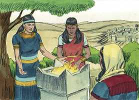
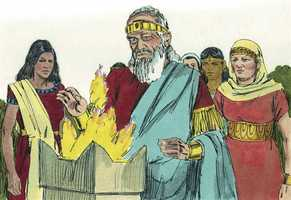
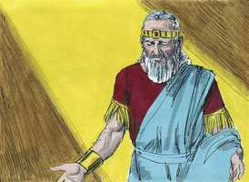
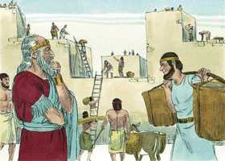
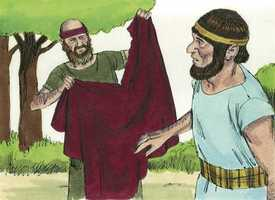
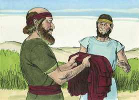
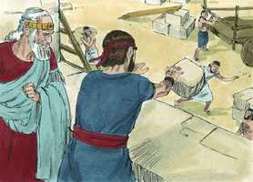
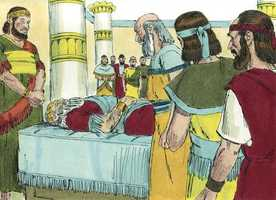

# 1 Reis Cap 11

**1** 	E O REI Salomão amou muitas mulheres estrangeiras, além da filha de Faraó: moabitas, amonitas, edomitas, sidônias e hetéias,

> **Cmt MHenry**: *Versículos 1-8* Não há nas Sagradas Escrituras um caso mais triste e assombroso sobre a depravação humana que o aqui registrado: Salomão se tornou adorador público de ídolos abomináveis! Provavelmente tenha ido cedendo paulatinamente ao orgulho e à concupiscência, perdendo assim seu gosto pela verdadeira sabedoria. Nada constitui em si mesmo um seguro contra o enganoso e perverso coração humano. A idade avançada não cura o coração de nenhuma propensão ao mal, se nossas paixões pecaminosas não são crucificadas e mortificadas pela graça de Deus, nunca morrerão por si mesmas, antes durarão ainda que as oportunidades de satisfazê-las tenham sido eliminadas. Quem pensa estar firme, olhe que não caia. Vemos quão fracos somos em nós mesmos sem a graça de Deus; portanto, vivamos em constante dependência da graça. Vigiemos e estejamos sóbrios: a nossa é uma guerra perigosa e em território inimigo, embora nossos piores inimigos são os traidores que há em nosso próprio coração.

**2** 	Das nações de que o Senhor tinha falado aos filhos de Israel: Não chegareis a elas, e elas não chegarão a vós; de outra maneira perverterão o vosso coração para seguirdes os seus deuses. A estas se uniu Salomão com amor.

**3** 	E tinha setecentas mulheres, princesas, e trezentas concubinas; e suas mulheres lhe perverteram o coração.

**4** 	Porque sucedeu que, no tempo da velhice de Salomão, suas mulheres lhe perverteram o coração para seguir outros deuses; e o seu coração não era perfeito para com o Senhor seu Deus, como o coração de Davi, seu pai,

 

**5** 	Porque Salomão seguiu a Astarote, deusa dos sidônios, e Milcom, a abominação dos amonitas.

**6** 	Assim fez Salomão o que parecia mal aos olhos do Senhor; e não perseverou em seguir ao Senhor, como Davi, seu pai.

**7** 	Então edificou Salomão um alto a Quemós, a abominação dos moabitas, sobre o monte que está diante de Jerusalém, e a Moloque, a abominação dos filhos de Amom.

 

**8** 	E assim fez para com todas as suas mulheres estrangeiras, as quais queimavam incenso e sacrificavam a seus deuses.

**9** 	Pelo que o Senhor se indignou contra Salomão; porquanto desviara o seu coração do Senhor Deus de Israel, o qual duas vezes lhe aparecera.

> **Cmt MHenry**: *Versículos 9-13* O Senhor disse a Salomão, provavelmente por um profeta, o que devia esperar de sua apostasia. Ainda que tenhamos razão para esperar que se tenha arrependido e achado misericórdia, o Espírito Santo não o registra expressamente, mas o deixa na dúvida, como advertência para que os outros não pequem. Pode que tenha eliminado a culpa, porém não a repreensão; isso resta. Assim sendo, deve continuar em dúvida para nós até o dia do juízo, se Salomão foi deixado ou não para sofrer o eterno desagrado de Deus ofendido.

**10** 	E acerca deste assunto lhe tinha dado ordem que não seguisse a outros deuses; porém não guardou o que o Senhor lhe ordenara.

**11** 	Assim disse o Senhor a Salomão: Pois que houve isto em ti, que não guardaste a minha aliança e os meus estatutos que te mandei, certamente rasgarei de ti este reino, e o darei a teu servo.

> **Cmt MHenry**: *CAPÍTULO 11A-1Rs

 

**12** 	Todavia nos teus dias não o farei, por amor de Davi, teu pai; da mão de teu filho o rasgarei;

**13** 	Porém todo o reino não rasgarei; uma tribo darei a teu filho, por amor de meu servo Davi, e por amor a Jerusalém, que tenho escolhido.

**14** 	Levantou, pois, o Senhor contra Salomão um adversário, Hadade, o edomeu; ele era da descendência do rei em Edom.

> **Cmt MHenry**: *Versículos 14-25* Enquanto Salomão se manteve perto de Deus e de seu dever, não houve inimigo que o inquietasse, porém aqui temos o relato de dois. Se Deus está de nosso lado não temos que temer o maior adversário; mas se Deus está contra nós, Ele pode fazer-nos temer até o menor de todos, e o mesmo gafanhoto será uma carga. Embora eles estavam motivados pelos princípios de ambição ou vingança, Deus os usou para corrigir a Salomão.

**15** 	Porque sucedeu que, estando Davi em Edom, e subindo Joabe, o capitão do exército, a enterrar os mortos, feriu a todo o homem em Edom

**16** 	(Porque Joabe ficou ali seis meses com todo o Israel, até que destruiu a todo o homem em Edom).

**17** 	Hadade, porém, fugiu, ele e alguns homens edomeus, dos servos de seu pai, com ele, para ir ao Egito; era, porém, Hadade muito jovem.

**18** 	E levantaram-se de Midiã, e foram a Parã, e tomaram consigo homens de Parã, e foram ao Egito ter com Faraó, rei do Egito, o qual lhe deu uma casa, e lhe prometeu sustento, e lhe deu uma terra.

**19** 	E achou Hadade grande graça diante de Faraó, de maneira que lhe deu por mulher a irmã de sua mulher, a irmã de Tafnes, a rainha.

**20** 	E a irmã de Tafnes deu-lhe um filho, Genubate, o qual Tafnes criou na casa de Faraó; e Genubate estava na casa de Faraó, entre os filhos de Faraó.

**21** 	Ouvindo, pois, Hadade, no Egito, que Davi adormecera com seus pais, e que Joabe, capitão do exército, era morto, disse Hadade a Faraó: Despede-me, para que vá à minha terra.

**22** 	Porém Faraó lhe disse: Pois que te falta comigo, que procuras partir para a tua terra? E disse ele: Nada, mas todavia despede-me.

**23** 	Também Deus lhe levantou outro adversário, a Rezom, filho de Eliada, que tinha fugido de seu senhor Hadadezer, rei de Zobá,

**24** 	Contra quem também ajuntou homens, e foi capitão de um esquadrão, quando Davi os matou; e, indo-se para Damasco, habitaram ali, e reinaram em Damasco.

**25** 	E foi adversário de Israel, por todos os dias de Salomão, e isto além do mal que Hadade fazia; porque detestava a Israel, e reinava sobre a Síria.

**26** 	Até Jeroboão, filho de Nebate, efrateu, de Zereda, servo de Salomão (cuja mãe era mulher viúva, por nome Zerua), também levantou a mão contra o rei.

> **Cmt MHenry**: *Versículos 26-40* Ao narrar a razão porque Deus dividiu o reino da casa de Salomão, Aías adverte a Jeroboão que se cuide de pecar por sua subida. Porém a casa de Davi deve continuar; dela sairia o Messias. Salomão tratou de matar a seu sucessor; não tinha ele mesmo ensinado que quaisquer que sejam os planos do coração do homem, o conselho do Senhor prevalece? Porém ele mesmo crê que pode derrotar esse conselho. Jeroboão se retirou ao Egito e se contentou com viver no exílio e na escuridão por um tempo, seguro de que teria um reino afinal. Não deveríamos estar contentes porque temos um melhor reino reservado?

**27** 	E esta foi a causa por que levantou a mão contra o rei: Salomão tinha edificado a Milo, e cerrou as aberturas da cidade de Davi, seu pai.

**28** 	E o homem Jeroboão era forte e valente; e vendo Salomão a este jovem, que era laborioso, ele o pôs sobre todo o cargo da casa de José.

 

**29** 	Sucedeu, pois, naquele tempo que, saindo Jeroboão de Jerusalém, o profeta Aías, o silonita, o encontrou no caminho, e ele estava vestido com uma roupa nova, e os dois estavam sós no campo.

 

**30** 	E Aías pegou na roupa nova que tinha sobre si, e a rasgou em doze pedaços.

**31** 	E disse a Jeroboão: Toma para ti os dez pedaços, porque assim diz o Senhor Deus de Israel: Eis que rasgarei o reino da mão de Salomão, e a ti darei as dez tribos.

 

**32** 	Porém ele terá uma tribo, por amor de Davi, meu servo, e por amor de Jerusalém, a cidade que escolhi de todas as tribos de Israel.

 

**33** 	Porque me deixaram, e se encurvaram a Astarote, deusa dos sidônios, a Quemós, deus dos moabitas, e a Milcom, deus dos filhos de Amom; e não andaram pelos meus caminhos, para fazerem o que é reto aos meus olhos, a saber, os meus estatutos e os meus juízos, como Davi, seu pai.

**34** 	Porém não tomarei nada deste reino da sua mão; mas por príncipe o ponho por todos os dias da sua vida, por amor de Davi, meu servo, a quem escolhi, o qual guardou os meus mandamentos e os meus estatutos.

 

**35** 	Mas da mão de seu filho tomarei o reino, e darei a ti, as dez tribos dele.

**36** 	E a seu filho darei uma tribo; para que Davi, meu servo, sempre tenha uma lâmpada diante de mim em Jerusalém, a cidade que escolhi para pôr ali o meu nome.

**37** 	E te tomarei, e reinarás sobre tudo o que desejar a tua alma; e serás rei sobre Israel.

**38** 	E há de ser que, se ouvires tudo o que eu te mandar, e andares pelos meus caminhos, e fizeres o que é reto aos meus olhos, guardando os meus estatutos e os meus mandamentos, como fez Davi, meu servo, eu serei contigo, e te edificarei uma casa firme, como edifiquei a Davi, e te darei Israel.

**39** 	E por isso afligirei a descendência de Davi; todavia não para sempre.

**40** 	Assim Salomão procurou matar Jeroboão; porém Jeroboão se levantou, e fugiu para o Egito, a ter com Sisaque, rei do Egito; e esteve no Egito até que Salomão morreu.

 

**41** 	Quanto ao mais dos atos de Salomão, e a tudo quanto fez, e à sua sabedoria, porventura não está escrito no livro dos feitos de Salomão?

> **Cmt MHenry**: *Versículos 41-43* O reino de Salomão foi tão longo como o de seu pai, mas não assim sua vida. o pecado encurtou seus dias. Se o mundo, com todas suas vantagens, puder satisfazer a alma e dar gozo real, Salomão o teria achado assim. Porém ele se desiludiu de tudo, e para advertência nossa, deixou este registro escrito de todos os prazeres terrenos. "Vaidade e aflição de espírito". O Novo Testamento declara que um maior que Salomão vem a reinar sobre nós, e a tomar posse do trono de Davi, seu pai. Não podemos ver algo da excelência de Cristo representada debilmente nessa figura, para nós? "

**42** 	E o tempo que reinou Salomão, em Jerusalém, sobre todo o Israel foi quarenta anos.

**43** 	E adormeceu Salomão com seus pais, e foi sepultado na cidade de Davi, seu pai; e Roboão, seu filho, reinou em seu lugar.

 

> **Cmt MHenry** Intro: *• Versículos 1-8*> *As esposas e concubinas de Salomão – Sua idolatria*> *• Versículos 9-13*> *A ira de Deus*> *• Versículos 14-25*> 28A-Os adversários de Salomão*> *• Versículos 26-40*> *A subida de Jeroboão*> *• Versículos 41-43*> *Morte de Salomão*