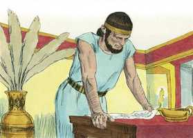
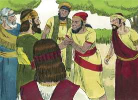
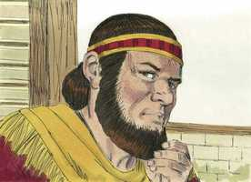
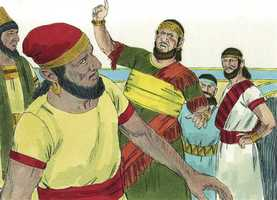
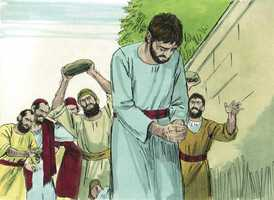
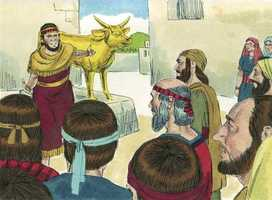

# 1 Reis Cap 12

**1** 	E FOI Roboão para Siquém; porque todo o Israel se reuniu em Siquém, para o fazerem rei.

> **Cmt MHenry**: *Versículos 1-15* As tribos não se queixaram a Roboão pela idolatria de seu pai e sua rebelião contra Deus. a ofensa mais grave não era nada para eles; tão negligentes eram em matéria de religião, se podiam viver cômodos e sem pagar tributos. Aos espíritos contenciosos nunca lhes faltará de que queixar-se. Quando vemos o relato bíblico do reino de Salomão, a paz, a riqueza e a prosperidade que então desfrutou Israel, não podemos duvidar que suas acusações eram falsas, ou alheias à verdade. Roboão respondeu ao povo conforme ao conselho dos jovens. Não há homem mais cegado pelo orgulho e o desejo do poder arbitrário, que o que pensa que isso não é fatal. Assim foram cumpridos os conselhos de Deus. deixou a Roboão livrado a sua insensatez e escondeu de seus olhos as coisas que correspondiam a sua paz, para que o reino lhe fosse tirado e dividido. Deus usa para seus propósitos sábios e justos as imprudências e os pecados dos homens. Os que perdem o Reino dos Céus é porque o lançam longe, voluntária e tolamente, como Roboão.

**2** 	Sucedeu que, Jeroboão, filho de Nebate, achando-se ainda no Egito, para onde fugira de diante do rei Salomão, voltou do Egito,

**3** 	Porque mandaram chamá-lo; veio, pois, Jeroboão e toda a congregação de Israel, e falaram a Roboão, dizendo:

 

**4** 	Teu pai agravou o nosso jugo; agora, pois, alivia tu a dura servidão de teu pai, e o pesado jugo que nos impôs, e nós te serviremos.

 

**5** 	E ele lhes disse: Ide-vos até ao terceiro dia, e então voltai a mim. E o povo se foi.

**6** 	E teve o rei Roboão conselho com os anciãos que estiveram na presença de Salomão, seu pai, quando este ainda vivia, dizendo: Como aconselhais vós que se responda a este povo?

**7** 	E eles lhe falaram, dizendo: Se hoje fores servo deste povo, e o servires, e respondendo-lhe, lhe falares boas palavras, todos os dias serão teus servos.

**8** 	Porém ele deixou o conselho que os anciãos lhe tinham dado, e teve conselho com os jovens que haviam crescido com ele, que estavam diante dele.

 

**9** 	E disse-lhes: Que aconselhais vós que respondamos a este povo, que me falou, dizendo: Alivia o jugo que teu pai nos impôs?

**10** 	E os jovens que haviam crescido com ele lhe falaram: Assim dirás a este povo que te falou: Teu pai fez pesadíssimo o nosso jugo, mas tu o alivia de sobre nós; assim lhe falarás: Meu dedo mínimo é mais grosso do que os lombos de meu pai.

**11** 	Assim que, se meu pai vos carregou de um jugo pesado, ainda eu aumentarei o vosso jugo; meu pai vos castigou com açoites, porém eu vos castigarei com escorpiões.

**12** 	Veio, pois, Jeroboão e todo o povo, ao terceiro dia, a Roboão, como o rei havia ordenado, dizendo: Voltai a mim ao terceiro dia.

> **Cmt MHenry**: *CAPÍTULO 12A-2Rs

**13** 	E o rei respondeu ao povo duramente; porque deixara o conselho que os anciãos lhe haviam dado.

 

**14** 	E lhe falou conforme ao conselho dos jovens, dizendo: Meu pai agravou o vosso jugo, porém eu ainda aumentarei o vosso jugo; meu pai vos castigou com açoites, porém eu vos castigarei com escorpiões.

**15** 	O rei, pois, não deu ouvidos ao povo; porque esta revolta vinha do Senhor, para confirmar a palavra que o Senhor tinha falado pelo ministério de Aías, o silonita, a Jeroboão, filho de Nebate.

**16** 	Vendo, pois, todo o Israel que o rei não lhe dava ouvidos, tornou-lhe o povo a responder, dizendo: Que parte temos nós com Davi? Não há para nós herança no filho de Jessé. Às tuas tendas, ó Israel! Provê agora a tua casa, ó Davi. Então Israel se foi às suas tendas.

> **Cmt MHenry**: *Versículos 16-24* O povo falou de Davi em forma conveniente. Quão logo se esquecem os homens bons e seus bons serviços ao público! Estas considerações deveriam reconciliar-nos com nossas perdas e problemas, que Deus é o Autor deles e nossos irmãos são seus instrumentos: não abriguemos desejos de vingança. Roboão e sua gente escutaram a palavra do Senhor. quando sabemos que pensa Deus, devemos submeter-nos, por mais que isto incomode nossa mente. Se tivermos a certeza do favor de Deus, nem sequer todo o universo pode machucar-nos.

 

**17** 	No tocante, porém, aos filhos de Israel que habitavam nas cidades de Judá, também sobre eles reinou Roboão.

**18** 	Então o rei Roboão enviou a Adorão, que estava sobre os tributos; e todo o Israel o apedrejou, e ele morreu; mas o rei Roboão se animou a subir ao carro para fugir para Jerusalém.

 

**19** 	Assim se rebelaram os israelitas contra a casa de Davi, até ao dia de hoje.

**20** 	E sucedeu que, ouvindo todo o Israel que Jeroboão tinha voltado, enviaram, e o chamaram para a congregação, e o fizeram rei sobre todo o Israel; e ninguém seguiu a casa de Davi senão somente a tribo de Judá.

**21** 	Vindo, pois, Roboão a Jerusalém, reuniu toda a casa de Judá e a tribo de Benjamim, cento e oitenta mil escolhidos, destros para a guerra, para pelejar contra a casa de Israel, para restituir o reino a Roboão, filho de Salomão.

**22** 	Porém veio a palavra de Deus a Semaías, homem de Deus, dizendo:

**23** 	Fala a Roboão, filho de Salomão, rei de Judá, e a toda a casa de Judá, e a Benjamim, e ao restante do povo, dizendo:

**24** 	Assim diz o Senhor: Não subireis nem pelejareis contra vossos irmãos, os filhos de Israel; volte cada um para a sua casa, porque eu é que fiz esta obra. E ouviram a palavra do Senhor, e voltaram segundo a palavra do Senhor.

**25** 	E Jeroboão edificou a Siquém, no monte de Efraim, e habitou ali; e saiu dali, e edificou a Penuel.

> **Cmt MHenry**: *Versículos 25-33* Jeroboão desconfiava da providência de Deus; ele conceberia formas e médios, pecaminosos também, para sua própria seguridade. A incredulidade na suficiência total de Deus está no fundo de todos nossos afastamentos dEle. Embora seja provável que sua adoração estivesse dirigida a Jeová, o Deus de Israel, era contrário à lei divina, e desonroso para a majestade divina, ser representada desta forma. A gente pode ter-se incomodado menos de adorar o Deus de Israel em forma de uma imagem, que se lhe for pedido logo que adorassem a Baal; mas isso abriu o caminho à idolatria. Bendito Senhor, dá-nos graça para reverenciar teu templo, tuas ordenanças, tua casa de oração, teus dias de repouso, e que nunca mais, como Jeroboão, ponhamos em nosso coração nenhum ídolo abominável. Sê Tu para nós todo o que nos é precioso; que Tu reines e governes nosso coração, esperança de glória.

**26** 	E disse Jeroboão no seu coração: Agora tornará o reino à casa de Davi.

**27** 	Se este povo subir para fazer sacrifícios na casa do Senhor, em Jerusalém, o coração deste povo se tornará a seu senhor, a Roboão, rei de Judá; e me matarão, e tornarão a Roboão, rei de Judá.

**28** 	Assim o rei tomou conselho, e fez dois bezerros de ouro; e lhes disse: Muito trabalho vos será o subir a Jerusalém; vês aqui teus deuses, ó Israel, que te fizeram subir da terra do Egito.

 

**29** 	E pôs um em Betel, e colocou o outro em Dã.

**30** 	E este feito se tornou em pecado; pois que o povo ia até Dã para adorar o bezerro.

**31** 	Também fez casa nos altos; e constituiu sacerdotes dos mais baixos do povo, que não eram dos filhos de Levi.

**32** 	E fez Jeroboão uma festa no oitavo mês, no dia décimo quinto do mês, como a festa que se fazia em Judá, e sacrificou no altar; semelhantemente fez em Betel, sacrificando aos bezerros que fizera; também em Betel estabeleceu sacerdotes dos altos que fizera.

**33** 	E sacrificou no altar que fizera em Betel, no dia décimo quinto do oitavo mês, que ele tinha imaginado no seu coração; assim fez a festa aos filhos de Israel, e sacrificou no altar, queimando incenso.

> **Cmt MHenry** Intro: *• Versículos 1-15*> *Ascensão de Roboão – A petição do povo – Sua resposta*> *• Versículos 16-24*> *Rebelião de dez tribos*> *• Versículos 25-33*> *A idolatria de Jeroboão*