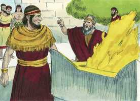

# 1 Reis Cap 13

**1** 	E EIS que, por ordem do Senhor, veio, de Judá a Betel, um homem de Deus; e Jeroboão estava junto ao altar, para queimar incenso.

> **Cmt MHenry**: *Versículos 1-10* Ao ameaçar o altar, o profeta ameaça o fundador e os adoradores. O culto idolátrico não continuará, mas a palavra de Jeová permanecerá para sempre. A predição afirma claramente que a família de Davi continuaria, e apoiaria a verdadeira religião, quando as dez tribos já não fossem capazes de resisti-los. Se Deus, com justiça, endurece o coração dos pecadores, para que não possam retirar arrependidos a mão que estenderam ao pecado, isso é um juízo espiritual, representado por isto, e muito mais espantoso. Jeroboão buscou ajuda, não de seus bezerros, senão somente de Deus, de Seu poder e favor. Pode chegar o momento em que os que aborrecem a predicação se alegrem das orações dos ministros fiéis. Jeroboão não deseja que o profeta ore para que seu pecado seja perdoado e mudado seu coração, senão somente que sua mão seja restaurada. Ele pareceu afetado momentaneamente pelo juízo e pela misericórdia, mas a impressão se esvaeceu. Deus proibiu a seu mensageiro que comesse ou bebesse em Betel para mostrar seu aborrecimento de Deus pela idolatria e apostasia, e para ensinar-nos que não termos comunhão com as obras das trevas. Não aprenderam a negar a si mesmos os que não podem rejeitar uma comida proibida.

**2** 	E ele clamou contra o altar por ordem do Senhor, e disse: Altar, altar! Assim diz o Senhor: Eis que um filho nascerá à casa de Davi, cujo nome será Josias, o qual sacrificará sobre ti os sacerdotes dos altos que sobre ti queimam incenso, e ossos de homens se queimarão sobre ti.

 

**3** 	E deu, naquele mesmo dia, um sinal, dizendo: Este é o sinal de que o Senhor falou: Eis que o altar se fenderá, e a cinza, que nele está, se derramará.

**4** 	Sucedeu, pois, que, ouvindo o rei a palavra do homem de Deus, que clamara contra o altar de Betel, Jeroboão estendeu a sua mão de sobre o altar, dizendo: Pegai-o! Mas a sua mão, que estendera contra ele, se secou, e não podia tornar a trazê-la a si.

**5** 	E o altar se fendeu, e a cinza se derramou do altar, segundo o sinal que o homem de Deus apontara por ordem do Senhor.

**6** 	Então respondeu o rei, e disse ao homem de Deus: Suplica ao Senhor teu Deus, e roga por mim, para que se me restitua a minha mão. Então o homem de Deus suplicou ao Senhor, e a mão do rei se lhe restituiu, e ficou como dantes.

**7** 	E o rei disse ao homem de Deus: Vem comigo para casa, e conforta-te; e dar-te-ei um presente.

**8** 	Porém o homem de Deus disse ao rei: Ainda que me desses metade da tua casa, não iria contigo, nem comeria pão nem beberia água neste lugar.

**9** 	Porque assim me ordenou o Senhor pela sua palavra, dizendo: Não comerás pão nem beberás água; e não voltarás pelo caminho por onde vieste.

**10** 	Assim foi por outro caminho; e não voltou pelo caminho, por onde viera a Betel.

**11** 	E morava em Betel um velho profeta; e vieram seus filhos, e contaram-lhe tudo o que o homem de Deus fizera aquele dia em Betel, e as palavras que dissera ao rei; e as contaram a seu pai.

> **Cmt MHenry**: *Versículos 11-22* A conduta do velho profeta prova que realmente não era um homem bom. Quando a mudança aconteceu sob Jeroboão, aquele preferiu sua comodidade e interesse a sua religião. Ele usou um método muito mau para fazer voltar o profeta bom. Tudo era mentira. Os crentes estão em maior perigo de serem desviados de seu dever pelas pretensões enganosas de santidade. Pode chamar-nos a atenção que o profeta mau não foi castigado, enquanto que o santo varão de Deus foi castigado súbita e severamente. Que faremos com tudo isto? Os juízos de Deus transcendem nosso poder de compreensão, e há um juízo vindouro. Nada pode escusar um ato voluntário de desobediência. Isto demonstra o que devem esperar os que escutam o grande enganador. Os que cedem ante ele como tentador, serão aterrorizados por ele como atormentador. Aos que agora lisonjeia, depois atacará violentamente; e aos que leva ao pecado, tratará de levá-los ao desespero.

**12** 	E disse-lhes seu pai: Por que caminho se foi? E seus filhos lhe mostraram o caminho por onde fora o homem de Deus que viera de Judá.

**13** 	Então disse a seus filhos: Albardai-me um jumento. E albardaram-lhe o jumento no qual ele montou.

> **Cmt MHenry**: *CAPÍTULO 13A-1Cr

**14** 	E foi após o homem de Deus, e achou-o assentado debaixo de um carvalho, e disse-lhe: És tu o homem de Deus que vieste de Judá? E ele disse: Sou.

**15** 	Então lhe disse: Vem comigo à casa, e come pão.

**16** 	Porém ele disse: Não posso voltar contigo, nem entrarei contigo; nem tampouco comerei pão, nem beberei contigo água neste lugar.

**17** 	Porque me foi mandado pela palavra do Senhor: Ali não comerás pão, nem beberás água; nem voltarás pelo caminho por onde vieste.

**18** 	E ele lhe disse: Também eu sou profeta como tu, e um anjo me falou por ordem do Senhor, dizendo: Faze-o voltar contigo à tua casa, para que coma pão e beba água (porém mentiu-lhe).

**19** 	Assim voltou com ele, e comeu pão em sua casa e bebeu água.

**20** 	E sucedeu que, estando eles à mesa, a palavra do Senhor veio ao profeta que o tinha feito voltar.

**21** 	E clamou ao homem de Deus, que viera de Judá, dizendo: Assim diz o Senhor: Porquanto foste rebelde à ordem do Senhor, e não guardaste o mandamento que o Senhor teu Deus te mandara,

**22** 	Antes voltaste, e comeste pão e bebeste água no lugar de que o Senhor te dissera: Não comerás pão nem beberás água; o teu cadáver não entrará no sepulcro de teus pais.

**23** 	E sucedeu que, depois que comeu pão, e depois que bebeu, albardou ele o jumento para o profeta que fizera voltar.

> **Cmt MHenry**: *Versículos 23-34* Deus se desagrada dos pecados de seu povo; ninguém será protegido em sua desobediência, pelo ofício que exerce, por sua proximidade a Deus, nem por nenhum outro serviço que tiver feito por Ele. A todos os que O servem, Deus os adverte que observem estritamente suas ordens. Não podemos ser juízes dos homens por seus sofrimentos, nem de pecados pelos castigos presentes; a carne é destruída em alguns para que o espírito seja salvo; a carne é obsequiada em outros para que a alma amadureça para o inferno. Jeroboão não se arrependeu de seu mau caminho. Prometeu a si mesmo que os bezerros assegurariam a coroa a sua família, mas a perderam e ele a fez afundar. Traem-se a si mesmos os que pensam sustentar-se por qualquer pecado. temamos prosperar por médios pecaminosos, oremos para sermos resguardados de todo engano e tentação, e para sermos capacitados para andar com perseverança abnegada no caminho dos mandamentos de Deus.

**24** 	Este, pois, se foi, e um leão o encontrou no caminho, e o matou; e o seu cadáver ficou estendido no caminho, e o jumento estava parado junto a ele, e também o leão estava junto ao cadáver.

**25** 	E eis que alguns homens passaram, e viram o corpo lançado no caminho, como também o leão, que estava junto ao corpo; e foram, e o disseram na cidade onde o velho profeta habitava.

**26** 	E, ouvindo-o o profeta que o fizera voltar do caminho, disse: É o homem de Deus, que foi rebelde à ordem do Senhor; por isso o Senhor o entregou ao leão, que o despedaçou e matou, segundo a palavra que o Senhor lhe dissera.

**27** 	Então disse a seus filhos: Albardai-me o jumento. Eles o albardaram.

**28** 	Então foi, e achou o cadáver estendido no caminho, e o jumento e o leão, que estavam parados junto ao cadáver; e o leão não tinha devorado o corpo, nem tinha despedaçado o jumento.

**29** 	Então o profeta levantou o cadáver do homem de Deus, e pô-lo em cima do jumento levando-o consigo; assim veio o velho profeta à cidade, para o chorar e enterrar.

**30** 	E colocou o cadáver no seu próprio sepulcro; e prantearam-no, dizendo: Ah, irmão meu!

**31** 	E sucedeu que, depois de o haver sepultado, disse a seus filhos: Morrendo eu, sepultai-me no sepulcro em que o homem de Deus está sepultado; ponde os meus ossos junto aos ossos dele.

**32** 	Porque certamente se cumprirá o que pela palavra do Senhor exclamou contra o altar que está em Betel, como também contra todas as casas dos altos que estão nas cidades de Samaria.

**33** 	Nem depois destas coisas deixou Jeroboão o seu mau caminho; antes, de todo o povo, tornou a constituir sacerdotes dos lugares altos; e a qualquer que queria consagrava sacerdote dos lugares altos.

**34** 	E isso foi causa de pecado à casa de Jeroboão, para destruí-la e extingui-la da terra.

> **Cmt MHenry** Intro: *• Versículos 1-10*> *Reprovação do pecado de Jeroboão*> *• Versículos 11-22*> *O profeta enganado*> *• Versículos 23-34*> *Morte do profeta desobediente – Obstinação de Jeroboão*