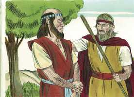

# 1 Reis Cap 19

**1** 	E ACABE fez saber a Jezabel tudo quanto Elias havia feito, e como totalmente matara todos os profetas à espada.

> **Cmt MHenry**: *Versículos 1-8* Jezabel enviou uma mensagem ameaçadora a Elias. Os corações carnais são endurecidos e enfurecidos contra Deus, por aquilo que deve convencê-los de pecado e vencê-los. A muita fé nem sempre é sinônimo de fé firme ou forte. Elias podia ser útil a Israel neste momento, e tinha toda a razão para depender da proteção de Deus enquanto realizava Sua obra, porém fugiu. O seu não era o desejo deliberado da graça, como o de Paulo, de ir e estar com Cristo. assim, Deus deixou sozinho a Elias, para mostrar que quando era ousado e forte, o era no Senhor e no poder de Sua força; porém sozinho não era melhor que seus pais. Ainda que nós não saibamos, Deus conhece que desígnio tem para conosco, que serviços, que provas, e Ele se encarregará de dar-nos graça suficiente.

**2** 	Então Jezabel mandou um mensageiro a Elias, a dizer-lhe: Assim me façam os deuses, e outro tanto, se de certo amanhã a estas horas não puser a tua vida como a de um deles.

**3** 	O que vendo ele, se levantou e, para escapar com vida, se foi, e chegando a Berseba, que é de Judá, deixou ali o seu servo.

**4** 	Ele, porém, foi ao deserto, caminho de um dia, e foi sentar-se debaixo de um zimbro; e pediu para si a morte, e disse: Já basta, ó Senhor; toma agora a minha vida, pois não sou melhor do que meus pais.

**5** 	E deitou-se, e dormiu debaixo do zimbro; e eis que então um anjo o tocou, e lhe disse: Levanta-te, come.

**6** 	E olhou, e eis que à sua cabeceira estava um pão cozido sobre as brasas, e uma botija de água; e comeu, e bebeu, e tornou a deitar-se.

**7** 	E o anjo do Senhor tornou segunda vez, e o tocou, e disse: Levanta-te e come, porque te será muito longo o caminho.

**8** 	Levantou-se, pois, e comeu e bebeu; e com a força daquela comida caminhou quarenta dias e quarenta noites até Horebe, o monte de Deus.

**9** 	E ali entrou numa caverna e passou ali a noite; e eis que a palavra do Senhor veio a ele, e lhe disse: Que fazes aqui Elias?

> **Cmt MHenry**: *Versículos 9-13* A pergunta que Deus faz, "Que fazes aqui, Elias?", é uma repreensão. Amiúde nos corresponde perguntar se estamos em nosso lugar, e na senda do dever: estou onde devo estar? Aonde me chama Deus, onde está minha obra, e onde posso ser útil? Elias se queixa da gente e de sua obstinação para pecar; eu sou o único que resta. Desesperar do êxito pode estorvar muitas boas empresas. Foi Elias até ali para encontrar-se com Deus? Ele descobrirá que Deus lhe sairá ao encontro. O vento, o terremoto, o fogo não o fizeram cobrir seu rosto, porém sim o silvo suave a aprazível. As almas bondosas são mais afetadas pelas tenras misericórdias do Senhor que por seus terrores. A suave voz dAquele que fala desde a cruz, ou do trono da graça, vai acompanhada de um poder peculiar para tomar possessão do coração.

**10** 	E ele disse: Tenho sido muito zeloso pelo Senhor Deus dos Exércitos, porque os filhos de Israel deixaram a tua aliança, derrubaram os teus altares, e mataram os teus profetas à espada, e só eu fiquei, e buscam a minha vida para ma tirarem.

**11** 	E Deus lhe disse: Sai para fora, e põe-te neste monte perante o Senhor. E eis que passava o Senhor, como também um grande e forte vento que fendia os montes e quebrava as penhas diante do Senhor; porém o Senhor não estava no vento; e depois do vento um terremoto; também o Senhor não estava no terremoto;

**12** 	E depois do terremoto um fogo; porém também o Senhor não estava no fogo; e depois do fogo uma voz mansa e delicada.

**13** 	E sucedeu que, ouvindo-a Elias, envolveu o seu rosto na sua capa, e saiu para fora, e pôs-se à entrada da caverna; e eis que veio a ele uma voz, que dizia: Que fazes aqui, Elias?

**14** 	E ele disse: Eu tenho sido em extremo zeloso pelo Senhor Deus dos Exércitos, porque os filhos de Israel deixaram a tua aliança, derrubaram os teus altares, e mataram os teus profetas à espada, e só eu fiquei; e buscam a minha vida para ma tirarem.

> **Cmt MHenry**: *Versículos 14-18* Deus repete a pergunta: "Que fazes aqui?". Então ele se lamenta de seu desconforto, e, para onde irão os profetas de Deus com essa classe de queixas senão a seu Senhor? O Senhor lhe deu uma resposta. Declara que a malvada casa de Acabe será desarraigada, que o povo de Israel será castigado por seus pecados; e mostra que Elias não tinha ficado sozinho, como ele achava, e que, além disso, lhe daria um ajudante. Assim foram respondidas e satisfeitas todas suas queixas. Os fiéis de Deus costumam ser amiúde seus protegidos ([Sl 83.3](../19A-Sl/83.md#3)), e a igreja visível apenas pode ser vista: o trigo se perde entre o joio, e o ouro no ouropel, até que chegue o dia de separar, refinar e peneirar. Conhece o Senhor aos que são Seus, embora nos não; Ele vê no secreto. Quando cheguemos ao céu estranharemos muitos que pensamos encontraremos lá, e encontraremos a muitos que não pensamos achar lá. O amor de Deus freqüentemente resulta ser maior que a caridade do homem, e muito mais amplo.

**15** 	E o Senhor lhe disse: Vai, volta pelo teu caminho para o deserto de Damasco; e, chegando lá, unge a Hazael rei sobre a Síria.

**16** 	Também a Jeú, filho de Ninsi, ungirás rei de Israel; e também a Eliseu, filho de Safate de Abel-Meolá, ungirás profeta em teu lugar.

**17** 	E há de ser que o que escapar da espada de Hazael, matá-lo-á Jeú; e o que escapar da espada de Jeú, matá-lo-á Eliseu.

**18** 	Também deixei ficar em Israel sete mil: todos os joelhos que não se dobraram a Baal, e toda a boca que não o beijou.

**19** 	Partiu, pois, Elias dali, e achou a Eliseu, filho de Safate, que andava lavrando com doze juntas de bois adiante dele, e ele estava com a duodécima; e Elias passou por ele, e lançou a sua capa sobre ele.

> **Cmt MHenry**: *Versículos 19-21* Elias encontrou a Eliseu por ordem divina, não na escola dos profetas senão no campo; não lendo, orando ou sacrificando, senão arando a terra. A ociosidade não honra o homem, nem a agricultura é desgraça para homem algum. Um chamado honesto no mundo não nos tira do caminho de nosso chamamento celestial, mais do que afetou a Eliseu. Seu coração foi tocado pelo Espírito Santo e ele ficou pronto para deixar tudo para ajudar a Elias. É no dia de seu poder que seu povo se oferecerá voluntário; nem tampouco irá ninguém a Cristo, a menos que sejam levados a Ele. Era uma época desalentadora para que os profetas saíssem. Um homem que consultasse com carne e sangue não teria querido o manto de Elias, porém Eliseu deixa tudo alegremente para acompanhá-lo. quando o Salvador disse: "Sigam-me", foram abandonados alegremente os amigos mais queridos e as ocupações mais proveitosas, e se cumpriram os deveres mais árduos por amor a Seu nome. Que nós, em forma similar, sintamos a energia de Sua graça operando poderosamente em nós, e quem, por uma submissão sem reservas, possamos de imediato assegurar nosso chamamento e eleição. "

> **Cmt MHenry**: *CAPÍTULO 19A-Sl

 

**20** 	Então deixou ele os bois, e correu após Elias; e disse: Deixa-me beijar a meu pai e a minha mãe, e então te seguirei. E ele lhe disse: Vai, e volta; pois, que te fiz eu?

**21** 	Voltou, pois, de o seguir, e tomou a junta de bois, e os matou, e com os aparelhos dos bois cozeu as carnes, e as deu ao povo, e comeram; então se levantou e seguiu a Elias, e o servia.

> **Cmt MHenry** Intro: *• Versículos 1-8*> *Elias foge ao deserto*> *• Versículos 9-13*> *Deus se manifesta a Elias*> *• Versículos 14-18*> *A resposta de Deus para Elias*> *• Versículos 19-21*> *O chamamento de Eliseu*