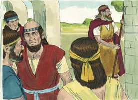
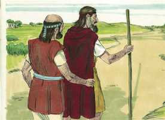
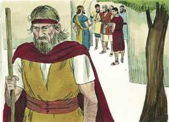
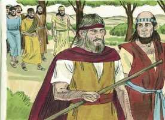
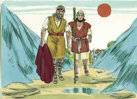
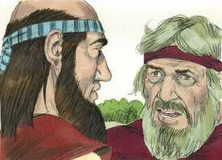
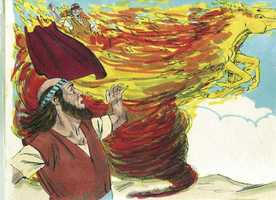
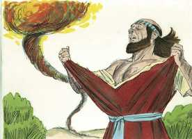
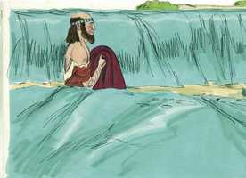
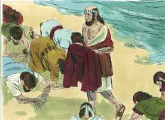

# 2 Reis Cap 02

**1** 	SUCEDEU que, quando o Senhor estava para elevar a Elias num redemoinho ao céu, Elias partiu de Gilgal com Eliseu.

> **Cmt MHenry**: *Versículos 1-8* O Senhor fez saber a Elias que seu tempo estava próximo. Portanto, foi às diversas escolas dos profetas para dá-lhes suas últimas exortações e sua bênção. A partida de Elias é um tipo e figura da ascensão de Cristo, e a apertura do Reino dos Céus para todos os crentes. Eliseu tinha seguido por muito tempo a Elias e não o abandonaria agora que esperava a bênção de sua partida. Os que seguem a Cristo não se percam, cansando-se no final. As águas do Jordão, antes, cederam ante a arca; agora, ante o manto do profeta, como sinal da presença de Deus. Quando Deus leva ao céu a seus fiéis, a morte é o Jordão que devem cruzar, e encontram um caminho por onde passar. A morte de Cristo dividiu as águas para que passem os remidos do Senhor. onde está, oh morte, teu aguilhão, o dano que podes fazer, teu terror?

**2** 	E disse Elias a Eliseu: Fica-te aqui, porque o Senhor me enviou a Betel. Porém Eliseu disse: Vive o Senhor, e vive a tua alma, que não te deixarei. E assim foram a Betel.

> **Cmt MHenry**: *CAPÍTULO 20A-Pv 21A-Ec 22A-Ct 23A-Is 24A-Jr 25A-Lm 26A-Ez 27A-Dn 28A-Os 29A-Jl

 

**3** 	Então os filhos dos profetas que estavam em Betel saíram ao encontro de Eliseu, e lhe disseram: Sabes que o Senhor hoje tomará o teu senhor por sobre a tua cabeça? E ele disse: Também eu bem o sei; calai-vos.

 

**4** 	E Elias lhe disse: Eliseu, fica-te aqui, porque o Senhor me enviou a Jericó. Porém ele disse: Vive o Senhor, e vive a tua alma, que não te deixarei. E assim foram a Jericó.

 

**5** 	Então os filhos dos profetas que estavam em Jericó se chegaram a Eliseu, e lhe disseram: Sabes que o Senhor hoje tomará o teu senhor por sobre a tua cabeça? E ele disse: Também eu bem o sei; calai-vos.

 

**6** 	E Elias disse: Fica-te aqui, porque o Senhor me enviou ao Jordão. Mas ele disse: Vive o Senhor, e vive a tua alma, que não te deixarei. E assim ambos foram juntos.

**7** 	E foram cinqüenta homens dos filhos dos profetas, e pararam defronte deles, de longe: e assim ambos pararam junto ao Jordão.

 

**8** 	Então Elias tomou a sua capa e a dobrou, e feriu as águas, as quais se dividiram para os dois lados; e passaram ambos em seco.

 

**9** 	Sucedeu que, havendo eles passado, Elias disse a Eliseu: Pede-me o que queres que te faça, antes que seja tomado de ti. E disse Eliseu: Peço-te que haja porção dobrada de teu espírito sobre mim.

> **Cmt MHenry**: *Versículos 9-12* Essa plenitude da qual profetas e apóstolos obtiveram sua provisão, ainda existe como antes, e nos é dito que peçamos grandes porções dela. A assistência diligente a Elias, particularmente em suas últimas horas, seria o modo apropriado para que Eliseu obtivesse muito de seu espírito. As consolações dos santos que partem, e suas experiências, ajudam a dar brilho a nosso consolo e a fortalecer nossas resoluções. Elias é levado para o céu num carro de fogo. Podem fazer-se muitas perguntas acerca disto, que não podem ser respondidas. Baste com o que nos é dito, o que seu Senhor o encontrou fazendo quando veio. Ele estava comprometido num sério discurso, exortando e instruindo a Eliseu sobre o Reino de Deus entre os homens. Erramos se pensarmos que a preparação para o céu se realiza somente pela contemplação e por atos de devoção. O carro e os cavalos pareciam como de fogo, algo muito glorioso, não por arder senão por seu fulgor. Pela forma em que Elias e Enoque foram tirados deste mundo, Deus nos permite dar uma olhada na vida eterna apresentada pelo evangelho, na glória reservada para os corpos dos santos, e na apertura do Reino dos Céus a todos os crentes. Também foi uma figura da ascensão de Cristo. Embora Elias partiu de forma triunfal para o céu, este mundo mal podia permitir-se deixá-lo ir. Certamente estão endurecidos os corações dos que não se sentem chamados por Deus a chorar e fazer duelo quando Ele se leva os homens fiéis e úteis. Elias foi, para Israel, por seus conselhos, repreensões e orações, melhor que a força mais poderosa de carro e cavalo, e deteve os juízos de Deus. Cristo legou a seus discípulos seu precioso evangelho, como o manto de Elias; a prenda do poder divino exercido para derrubar o império de Satanás, e estabelecer o Reino de Deus no mundo. O mesmo evangelho permanece conosco ainda que os poderes miraculosos tenham sido retirados, e tem força divina para a conversão e salvação dos pecadores.

 

**10** 	E disse: Coisa difícil pediste; se me vires quando for tomado de ti, assim se te fará, porém, se não, não se fará.

**11** 	E sucedeu que, indo eles andando e falando, eis que um carro de fogo, com cavalos de fogo, os separou um do outro; e Elias subiu ao céu num redemoinho.

 

**12** 	O que vendo Eliseu, clamou: Meu pai, meu pai, carros de Israel, e seus cavaleiros! E nunca mais o viu; e, pegando as suas vestes, rasgou-as em duas partes.

 

**13** 	Também levantou a capa de Elias, que dele caíra; e, voltando-se, parou à margem do Jordão.

> **Cmt MHenry**: *Versículos 13-18* Elias deixou seu manto a Eliseu como sinal da descida do Espírito sobre ele; era mais que se lhe tiver deixado milhares em ouro e prata. Eliseu o tomou, não como relíquia sagrada que se deve adorar, senão como veste significativa para ser usada. Agora que Elias foi levado ao céu, Eliseu pergunta: 1) *Por Deus;* quando nossa consolação de criaturas nos foi tirada, temos um Deus ao qual acudirmos, que vive para sempre. 2) *Pelo* *Deus que Elias servia, honrava e ao qual suplicava.* O Senhor Deus dos santos profetas é o mesmo ontem, hoje e pelos séculos, mas, de que nos servirá termos os mantos daqueles que partiram, seus lugares, seus livros, se não tivermos o espírito deles, o Deus deles? Veja aqui a Eliseu dividindo o rio; o povo de Deus não tem de temer o passo final pelo Jordão da morte como por terra seca. Os filhos dos profetas realizaram uma busca desnecessária de Elias. Os homens sábios podem ceder, em aras da paz e a boa opinião dos outros, para aqueles contra o qual seu juízo se opõe, em forma tão desnecessária como infrutífera. Atravessar colinas e vales nunca nos conduzirá a Elias, mas sim o fará, a seu devido momento, seguir o exemplo de sua santa fé e seu zelo.

**14** 	E tomou a capa de Elias, que dele caíra, e feriu as águas, e disse: Onde está o Senhor Deus de Elias? Quando feriu as águas elas se dividiram de um ao outro lado; e Eliseu passou.

 

**15** 	Vendo-o, pois, os filhos dos profetas que estavam defronte em Jericó, disseram: O espírito de Elias repousa sobre Eliseu. E vieram-lhe ao encontro, e se prostraram diante dele em terra.

 

**16** 	E disseram-lhe: Eis que agora entre os teus servos há cinqüenta homens valentes; ora deixa-os ir para buscar a teu senhor; pode ser que o elevasse o Espírito do Senhor e o lançasse em algum dos montes, ou em algum dos vales. Porém ele disse: Não os envieis.

**17** 	Mas eles insistiram com ele, até que, constrangido, disse-lhes: Enviai. E enviaram cinqüenta homens, que o buscaram três dias, porém não o acharam.

**18** 	Então voltaram para ele, pois ficara em Jericó; e disse-lhes: Eu não vos disse que não fôsseis?

**19** 	E os homens da cidade disseram a Eliseu: Eis que é boa a situação desta cidade, como o meu senhor vê; porém as águas são más, e a terra é estéril.

> **Cmt MHenry**: *Versículos 19-25* Observe-se o milagre de sarar as águas. Os profetas deveriam melhorar para eles todo lugar aonde chegam, propondo-se adoçar os espíritos amargurados e fazer frutíferas as almas estéreis, pela palavra de Deus, que é como o sal lançado na água por Eliseu. Isso foi um emblema adequado do efeito produzido pela graça de Deus no coração pecador do homem. Às vezes há famílias, povos e cidades inteiros que têm um novo aspecto pela predicação do evangelho; a maldade e o mal foram mudados por fruto das obras de justiça, que são, por meio de Cristo, para louvor e glória de Deus. Eis aqui uma maldição sobre uns jovens de Betel, suficiente para destruí-los; não foi uma maldição sem causa, pois eles abusaram do caráter de Eliseu em quanto profeta de Deus. zombaram dele, incitando-o a "subir", refletindo o arrependimento de Elias para o céu. O profeta agiu por impulso divino. Se o Espírito Santo não tiver dirigido a solene maldição de Eliseu, a providência de Deus não a teria seguido com um juízo. O Senhor deve ser glorificado como Deus justo que odeia o pecado e o castigará. Os jovens temam dizer más palavras, pois Deus percebe o que dizem. Que não zombem de ninguém por defeitos de mente ou corpo; é para seu especial perigo zombar de qualquer por fazer o bem. Os pais que desejem consolo para seus filhos, que os eduquem bem e façam todo o que possam para eliminar a tolice que está ligada a seus corações. Qual será a angústia dos pais que, no dia do juízo, presenciem a condenação eterna de sua progênie, ocasionada por seu próprio mau exemplo, negligência ou má criadagem! "

**20** 	E ele disse: Trazei-me um prato novo, e ponde nele sal. E lho trouxeram.

**21** 	Então saiu ele ao manancial das águas, e deitou sal nele; e disse: Assim diz o Senhor: Sararei a estas águas; e não haverá mais nelas morte nem esterilidade.

**22** 	Ficaram, pois, sãs aquelas águas, até ao dia de hoje, conforme a palavra que Eliseu tinha falado.

**23** 	Então subiu dali a Betel; e, subindo ele pelo caminho, uns meninos saíram da cidade, e zombavam dele, e diziam-lhe: Sobe, calvo; sobe, calvo!

**24** 	E, virando-se ele para trás, os viu, e os amaldiçoou no nome do Senhor; então duas ursas saíram do bosque, e despedaçaram quarenta e dois daqueles meninos.

**25** 	E dali foi para o monte Carmelo de onde voltou para Samaria.

> **Cmt MHenry** Intro: *• Versículos 1-8*> *Elias divide o Jordão*> *• Versículos 9-12*> *Elias levado ao céu*> *• Versículos 13-18*> *Eliseu manifestado como sucessor de Elias*> *• Versículos 19-25*> *Eliseu sara as águas de Jericó – Destruição dos que zombam*> *de Eliseu*