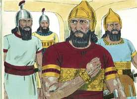
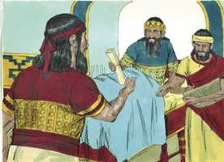
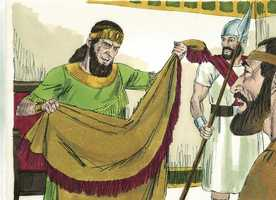
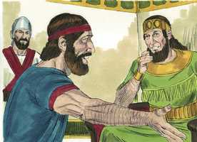
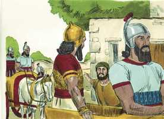
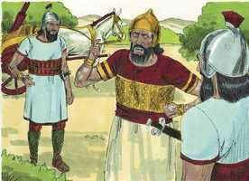
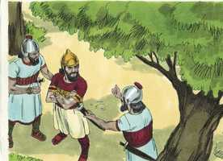
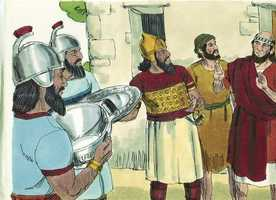
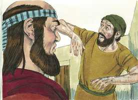

# 2 Reis Cap 05

**1** 	E NAAMÃ, capitão do exército do rei da Síria, era um grande homem diante do seu senhor, e de muito respeito; porque por ele o Senhor dera livramento aos sírios; e era este homem herói valoroso, porém leproso.

> **Cmt MHenry**: *Versículos 1-8* Ainda que os sírios eram idólatras que oprimiam o povo de Deus, aqui se atribui ao Senhor a liberação da qual Naamã foi beneficiado. Tal é a linguagem correta da Escritura, enquanto que os que escrevem a história comum demonstram claramente que Deus não está em seus pensamentos. A grandeza e a honra de um homem não podem colocá-lo fora do alcance das calamidades mais penosas da vida humana: há mais de um corpo louco e doente sob uma roupagem rica e alegre. Todo homem tem um que outro *porém*, algo que o macula e rebaixa, uma impureza em sua grandeza, um escurecimento de seu gozo. Esta rapazinha, ainda que só uma menina, pôde dar conta do famoso profeta que os israelitas tinham. Deveria ser ensinado às crianças em idade precoce acerca das prodigiosas obras de Deus para que, onde quer que vão, possam falar delas. Como corresponde a um bom servo, ela desejava a saúde e o bem-estar de seu amo. Os servos podem ser bênção para as famílias onde estão, dizendo o que sabem acerca da glória de Deus e da honra dos profetas. Naamã não desprezou pela baixeza dela o que disse. Bom seria se os homens fossem tão sensíveis à carga do pecado como o são às doenças do corpo. E quando andam procurando as bênçãos que o Senhor envia respondendo às orações de seu povo fiel, eles acharão que nosso Senhor pode ser recebido salvo que vão como mendigos em busca de um presente, não como senhores a exigir e comprar.

  

**2** 	E saíram tropas da Síria, da terra de Israel, e levaram presa uma menina que ficou ao serviço da mulher de Naamã.

**3** 	E disse esta à sua senhora: Antes o meu senhor estivesse diante do profeta que está em Samaria; ele o restauraria da sua lepra.

 

**4** 	Então foi Naamã e notificou ao seu senhor, dizendo: Assim e assim falou a menina que é da terra de Israel.

**5** 	Então disse o rei da Síria: Vai, anda, e enviarei uma carta ao rei de Israel. E foi, e tomou na sua mão dez talentos de prata, seis mil siclos de ouro e dez mudas de roupas.

> **Cmt MHenry**: *CAPÍTULO 50N-Fp 51N-Cl 52N-1Ts 53N-2Ts 54N-1Tm 55N-2Tm 56N-Tt 57N-Fm 58N-Hb 59N-Tg

 

**6** 	E levou a carta ao rei de Israel, dizendo: Logo, em chegando a ti esta carta, saibas que eu te enviei Naamã, meu servo, para que o cures da sua lepra.

**7** 	E sucedeu que, lendo o rei de Israel a carta, rasgou as suas vestes, e disse: Sou eu Deus, para matar e para vivificar, para que este envie a mim um homem, para que eu o cure da sua lepra? Pelo que deveras notai, peço-vos, e vede que busca ocasião contra mim.

 

**8** 	Sucedeu, porém, que, ouvindo Eliseu, homem de Deus, que o rei de Israel rasgara as suas vestes, mandou dizer ao rei: Por que rasgaste as tuas vestes? Deixa-o vir a mim, e saberá que há profeta em Israel.

 

**9** 	Veio, pois, Naamã com os seus cavalos, e com o seu carro, e parou à porta da casa de Eliseu.

> **Cmt MHenry**: *Versículos 9-14* Eliseu sabia que Naamã era orgulhoso e lhe faria saber que ante o grande Deus todos os homens estão ao mesmo nível. Todos os mandamentos de Deus ajuízam os espíritos dos homens, especialmente os que instruem o pecador sobre como solicitar as bênçãos da salvação. Veja-se a tolice do orgulho de Naamã; uma cura não o contentaria, a menos que for curado com pompa e ostentação. Rejeita sua cura a menos que seja comprazido. A forma em que o pecador é recebido e feito santo, por meio do sangue e pelo Espírito de Cristo, pela só fé em seu Nome, não dá o gosto nem se esforça como para comprazer o coração do pecador. A sabedoria humana pensa que pode proporcionar métodos melhores e mais sábios para a purificação. Observe que os amos deveriam estar dispostos a ouvir razões. Como deveríamos estar surdos ao conselho do ímpio, mesmo que seja dado por homens grandes e respeitados, assim devemos ter abertos os ouvidos ao bom conselho, embora seja trazido pelos que estão embaixo nosso. Não faria qualquer coisa você? quando os pecadores doentes se contentam com fazem qualquer coisa, submeter-se a qualquer coisa, deixar qualquer coisa, por sua cura, então, e não antes, há esperança para eles. Os métodos para a cura da lepra do pecado são tão simples que não temos escusa se não os notamos. Não é mais que "crê e serás salvo"; "arrepende-te e serás perdoado"; "lava-te e serás limpo". O crente pede a salvação sem descuidar, alterar nem agregar às instruções do Salvador; deste modo é limpo da culpa, enquanto outros que as rejeitam, vivem e morrem na lepra do pecado.

**10** 	Então Eliseu lhe mandou um mensageiro, dizendo: Vai, e lava-te sete vezes no Jordão, e a tua carne será curada e ficarás purificado.

 

**11** 	Porém, Naamã muito se indignou, e se foi, dizendo: Eis que eu dizia comigo: Certamente ele sairá, pôr-se-á em pé, invocará o nome do Senhor seu Deus, e passará a sua mão sobre o lugar, e restaurará o leproso.

 

**12** 	Não são porventura Abana e Farpar, rios de Damasco, melhores do que todas as águas de Israel? Não me poderia eu lavar neles, e ficar purificado? E voltou-se, e se foi com indignação.

**13** 	Então chegaram-se a ele os seus servos, e lhe falaram, e disseram: Meu pai, se o profeta te dissesse alguma grande coisa, porventura não a farias? Quanto mais, dizendo-te ele: Lava-te, e ficarás purificado.

 

**14** 	Então desceu, e mergulhou no Jordão sete vezes, conforme a palavra do homem de Deus; e a sua carne tornou-se como a carne de um menino, e ficou purificado.

 

**15** 	Então voltou ao homem de Deus, ele e toda a sua comitiva, e chegando, pôs-se diante dele, e disse: Eis que agora sei que em toda a terra não há Deus senão em Israel; agora, pois, peço-te que aceites uma bênção do teu servo.

> **Cmt MHenry**: *Versículos 15-19* A misericórdia da cura afetou a Naamã mais que o milagre. Os que experimentam por si mesmos o poder da graça divina são os mais capazes para falar disso. Ele também se mostra agradecido para com o profeta Eliseu, que rejeitou toda recompensa, não porque acreditasse que era ilícita, já que recebeu presentes de outros, senão para mostrar a este novo convertido que os servos do Deus de Israel consideram com santo desprezo as riquezas do mundo. Toda a obra era de Deus e ao ponto que o profeta não dava conselho quando não tinha instruções do Senhor. não é bom opor-se drasticamente aos erros menores que acompanham as primeiras convicções dos homens; não podemos levar adiante os homens com maior rapidez que o Senhor que os prepara para receber instrução. Quanto a nós, se ao estabelecermos a aliança com Deus, desejamos reservar algum pecado conhecido para continuar deleitando-nos com ele, isto é uma ruptura de sua aliança. Os que verdadeiramente odeiam o mal, terão consciência de abster-se de todas as formas do mal.

 

**16** 	Porém ele disse: Vive o Senhor, em cuja presença estou, que não a aceitarei. E instou com ele para que a aceitasse, mas ele recusou.

**17** 	E disse Naamã: Se não queres, dê-se a este teu servo uma carga de terra que baste para carregar duas mulas; porque nunca mais oferecerá este teu servo holocausto nem sacrifício a outros deuses, senão ao Senhor.

**18** 	Nisto perdoe o Senhor a teu servo; quando meu senhor entrar na casa de Rimom para ali adorar, e ele se encostar na minha mão, e eu também tenha de me encurvar na casa de Rimom; quando assim me encurvar na casa de Rimom, nisto perdoe o Senhor a teu servo.

**19** 	E ele lhe disse: Vai em paz. E foi dele a uma pequena distância.

**20** 	Então Geazi, servo de Eliseu, homem de Deus, disse: Eis que meu senhor poupou a este sírio Naamã, não recebendo da sua mão alguma coisa do que trazia; porém, vive o Senhor que hei de correr atrás dele, e receber dele alguma coisa.

> **Cmt MHenry**: *Versículos 20-27* Naamã, sírio, cortesão, tinha muitos servos e lemos quão sábios e bons eram. Eliseu, um santo profeta, um homem de Deus, não tinha senão um servo que resulta ser um exímio mentiroso. O amor pelo dinheiro, a raiz de todo mal, estava no fundo do pecado de Geazi. Pensou impor-se ao profeta, mas logo viu que o Espírito de profecia não podia ser enganado e que era vão mentir ao Espírito Santo. Estultícia é atrever-se a pecar com esperanças de guardar o segredo. Quando se distancia por qualquer senda extraviada, não vai com você sua consciência? O olho de Deus não vai com você? Quem encobrir seu pecado não prosperará; particularmente a língua mentirosa durará só um instante. Todas as esperanças e invenções néscias da carnal mundanalidade estão abertas ante Deus. Não é o momento de aumentar nossa riqueza quando só podemos fazê-lo de forma que desonre a Deus e a fé, ou de forma que prejudique o próximo. Geazi foi castigado. Se quisesse o dinheiro de Naamã, teria a doença deste. De que aproveitou a Geazi ganhar dois talentos, quando com isso perdeu saúde, paz, serviço, e se não se arrependeu, também perdeu a alma para sempre? cuidemo-nos da hipocrisia e da cobiça, e temamos a maldição da lepra espiritual que permanece em nossa alma. "

**21** 	E foi Geazi a alcançar Naamã; e Naamã, vendo que corria atrás dele, desceu do carro a encontrá-lo, e disse-lhe: Vai tudo bem?

**22** 	E ele disse: Tudo vai bem; meu senhor me mandou dizer: Eis que agora mesmo vieram a mim dois jovens dos filhos dos profetas da montanha de Efraim; dá-lhes, pois, um talento de prata e duas mudas de roupas.

**23** 	E disse Naamã: Sê servido tomar dois talentos. E instou com ele, e amarrou dois talentos de prata em dois sacos, com duas mudas de roupas; e pô-los sobre dois dos seus servos, os quais os levaram diante dele.

**24** 	E, chegando ele a certa altura, tomou-os das suas mãos, e os depositou na casa; e despediu aqueles homens, e foram-se.

**25** 	Então ele entrou, e pôs-se diante de seu senhor. E disse-lhe Eliseu: Donde vens, Geazi? E disse: Teu servo não foi nem a uma nem a outra parte.

**26** 	Porém ele lhe disse: Porventura não foi contigo o meu coração, quando aquele homem voltou do seu carro a encontrar-te? Era a ocasião para receberes prata, e para tomares roupas, olivais e vinhas, ovelhas e bois, servos e servas?

**27** 	Portanto a lepra de Naamã se pegará a ti e à tua descendência para sempre. Então saiu de diante dele leproso, branco como a neve.

 

> **Cmt MHenry** Intro: *• Versículos 1-8*> *A lepra de Naamã*> *• Versículos 9-14*> *A cura da lepra*> *• Versículos 15-19*> *Eliseu rejeita os presentes de Naamã*> *• Versículos 20-27*> *A cobiça e falsidade de Geazi*