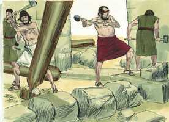
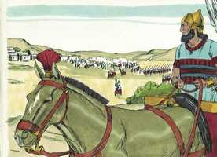
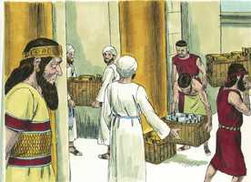
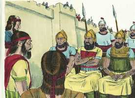
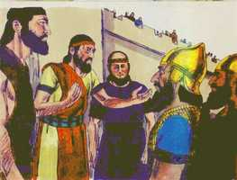
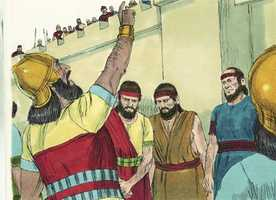

# 2 Reis Cap 18

**1** 	E SUCEDEU que, no terceiro ano de Oséias, filho de Elá, rei de Israel, começou a reinar Ezequias, filho de Acaz, rei de Judá.

> **Cmt MHenry**: *Versículos 1-8* Ezequias foi um filho verdadeiro de Davi. Outros fizeram o bom, mas não como Davi. Não suponhamos que quando os tempos e os homens são maus, têm de piorar gradual e necessariamente; não é necessário que seja assim: depois de vários reis maus, Deus levantou a um como o próprio Davi. A serpente de bronze tinha sido conservada com todo cuidado, como monumento da bondade de Deus com seus pais no deserto, mas era ocioso e perverso queimá-lhe incenso. Toda ajuda à devoção que não esteja respaldada pela palavra de Deus interrompe o exercício da fé; sempre conduz à superstição e a outros males perigosos. A natureza humana perverte toda coisa desta classe. A fé verdadeira não necessita esse tipo de ajudas; a Palavra de Deus ensinada e a oração diária é toda a ajuda externa que necessitamos.

**2** 	Tinha vinte e cinco anos de idade quando começou a reinar, e vinte e nove anos reinou em Jerusalém; e era o nome de sua mãe Abi, filha de Zacarias.

**3** 	E fez o que era reto aos olhos do Senhor, conforme tudo o que fizera Davi, seu pai.

**4** 	Ele tirou os altos, quebrou as estátuas, deitou abaixo os bosques, e fez em pedaços a serpente de metal que Moisés fizera; porquanto até àquele dia os filhos de Israel lhe queimavam incenso, e lhe chamaram Neustã.

 

**5** 	No Senhor Deus de Israel confiou, de maneira que depois dele não houve quem lhe fosse semelhante entre todos os reis de Judá, nem entre os que foram antes dele.

**6** 	Porque se chegou ao Senhor, não se apartou dele, e guardou os mandamentos que o Senhor tinha dado a Moisés.

**7** 	Assim foi o Senhor com ele; para onde quer que saía se conduzia com prudência; e se rebelou contra o rei da Assíria, e não o serviu.

**8** 	Ele feriu os filisteus até Gaza, como também os seus termos, desde a torre dos atalaias até à cidade fortificada.

**9** 	E sucedeu, no quarto ano do rei Ezequias (que era o sétimo ano de Oséias, filho de Elá, rei de Israel), que Salmaneser, rei da Assíria, subiu contra Samaria, e a cercou.

> **Cmt MHenry**: *Versículos 9-16* A incursão de Senaqueribe sobre Judá foi uma grande calamidade para esse reino, pela qual Deus prova a fé de Ezequias e castiga o povo. o desgosto secreto, a hipocrisia, a tibieza da maioria requer correição; tais provas purificam a fé e a esperança do justo e o leva à simples dependência de Deus.

**10** 	E a tomaram ao fim de três anos, no ano sexto de Ezequias, que era o ano nono de Oséias, rei de Israel, quando tomaram Samaria.

**11** 	E o rei da Assíria transportou a Israel para a Assíria; e os fez levar a Hala e a Habor, junto ao rio de Gozã, e às cidades dos medos;

**12** 	Porquanto não obedeceram à voz do Senhor seu Deus, antes transgrediram a sua aliança; e tudo quanto Moisés, servo do Senhor, tinha ordenado, nem o ouviram nem o fizeram.

**13** 	Porém no ano décimo quarto do rei Ezequias subiu Senaqueribe, rei da Assíria, contra todas as cidades fortificadas de Judá, e as tomou.

 

**14** 	Então Ezequias, rei de Judá, enviou ao rei da Assíria, a Laquis, dizendo: Pequei; retira-te de mim; tudo o que me impuseres suportarei. Então o rei da Assíria impôs a Ezequias, rei de Judá, trezentos talentos de prata e trinta talentos de ouro.

**15** 	Assim deu Ezequias toda a prata que se achou na casa do Senhor e nos tesouros da casa do rei.

 

**16** 	Naquele tempo cortou Ezequias o ouro das portas do templo do Senhor, e das ombreiras, de que ele, rei de Judá, as cobrira, e o deu ao rei da Assíria.

**17** 	Contudo enviou o rei da Assíria a Tartã, e a Rabe-Saris, e a Rabsaqué, de Laquis, com grande exército ao rei Ezequias, a Jerusalém; subiram, e vieram a Jerusalém. E, subindo e vindo eles, pararam ao pé do aqueduto da piscina superior, que está junto ao caminho do campo do lavandeiro.

> **Cmt MHenry**: *Versículos 17-37* O Rabsaqué tenta convencer aos judeus que era inútil oferecer resistência. Que confiança é esta na qual você se apóia? Bom seria que os pecadores se submetessem à força deste argumento procurando a paz com Deus. portanto, é sábio de parte nossa render-se a Ele, porque é vão contender com Ele: que confiança é esta em que se apóiam os que resistem? Muita esperteza há nesta arenga do Rabsaqué e muito orgulho, malícia, falsidade e blasfêmia. Os nobres de Ezequias conservaram a paz. Há tempo de calar como também tempo de falar; há gente à qual oferecer qualquer coisa religiosa ou racional é como lançar pérolas aos porcos. O silêncio deles fez que o Rabsaqué se sentisse mais orgulhoso e seguro. Freqüentemente é melhor deixar que este tipo de pessoas vociferem e blasfemem; uma expressão decidida de aborrecimento é o melhor testemunho contra eles. O assunto deve deixar-se ao Senhor que tem todos os corações em suas mãos, encomendando-nos a Ele com humilde submissão, esperança de fé e oração fervorosa.

**18** 	E chamaram o rei; e saíram a eles Eliaquim, filho de Hilquias, o mordomo, e Sebna, o escrivão, e Joá, filho de Asafe, o cronista.

> **Cmt MHenry**: *CAPÍTULO 18A-Jo

 

**19** 	E Rabsaqué lhes disse: Ora, dizei a Ezequias: Assim diz o grande rei, o rei da Assíria: Que confiança é esta em que te estribas?

**20** 	Dizes tu (porém são palavras só de lábios): Há conselho e poder para a guerra. Em quem, pois, agora confias, que contra mim te rebelas?

**21** 	Eis que agora tu confias naquele bordão de cana quebrada, no Egito, no qual, se alguém se encostar, entrar-lhe-á pela mão e a furará; assim é Faraó, rei do Egito, para com todos os que nele confiam.

**22** 	Se, porém, me disserdes: No Senhor nosso Deus confiamos; porventura não é esse aquele cujos altos e cujos altares Ezequias tirou, dizendo a Judá e a Jerusalém: Perante este altar vos inclinareis em Jerusalém?

**23** 	Ora, pois, dá agora reféns ao meu senhor, o rei da Assíria, e dar-te-ei dois mil cavalos, se tu puderes dar cavaleiros para eles.

**24** 	Como, pois, farias virar o rosto de um só capitão dos menores servos de meu senhor, quando tu confias no Egito, por causa dos carros e cavaleiros?

**25** 	Agora, pois, subi eu porventura sem o Senhor contra este lugar, para o destruir? O Senhor me disse: Sobe contra esta terra, e destrói-a.

**26** 	Então disse Eliaquim, filho de Hilquias, e Sebna e Joá, a Rabsaqué: Rogamos-te que fales aos teus servos em siríaco; porque bem o entendemos; e não nos fales em judaico, aos ouvidos do povo que está em cima do muro.

 

**27** 	Porém Rabsaqué lhes disse: Porventura mandou-me meu senhor somente a teu senhor e a ti, para falar estas palavras e não antes aos homens, que estão sentados em cima do muro, para que juntamente convosco comam o seu excremento e bebam a sua urina?

 

**28** 	Rabsaqué, pois, se pôs em pé, e clamou em alta voz em judaico, e respondeu, dizendo: Ouvi a palavra do grande rei, do rei da Assíria.

**29** 	Assim diz o rei: Não vos engane Ezequias; porque não vos poderá livrar da sua mão;

**30** 	Nem tampouco vos faça Ezequias confiar no Senhor, dizendo: Certamente nos livrará o Senhor, e esta cidade não será entregue na mão do rei da Assíria.

**31** 	Não deis ouvidos a Ezequias; porque assim diz o rei da Assíria: Contratai comigo por presentes, e saí a mim, e coma cada um da sua vide e da sua figueira, e beba cada um a água da sua cisterna;

**32** 	Até que eu venha, e vos leve para uma terra como a vossa, terra de trigo e de mosto, terra de pão e de vinhas, terra de oliveiras, de azeite e de mel; e assim vivereis, e não morrereis; e não deis ouvidos a Ezequias; porque vos incita, dizendo: O Senhor nos livrará.

**33** 	Porventura os deuses das nações puderam livrar, cada um a sua terra, das mãos do rei da Assíria?

**34** 	Que é feito dos deuses de Hamate e de Arpade? Que é feito dos deuses de Sefarvaim, Hena e Iva? Porventura livraram a Samaria da minha mão?

**35** 	Quais são eles, dentre todos os deuses das terras, que livraram a sua terra da minha mão, para que o Senhor livrasse a Jerusalém da minha mão?

**36** 	Porém calou-se o povo, e não lhe respondeu uma só palavra; porque mandado do rei havia, dizendo: Não lhe respondereis.

**37** 	Então Eliaquim, filho de Hilquias, o mordomo, e Sebna, o escrivão, e Joá, filho de Asafe, o cronista, vieram a Ezequias com as vestes rasgadas, e lhe fizeram saber as palavras de Rabsaqué.

> **Cmt MHenry** Intro: *• Versículos 1-8*> *Bom reinado de Ezequias em Judá – Idolatria*> *• Versículos 9-16*> *Senaqueribe invade Judá*> *• Versículos 17-37*> *Blasfêmias do Rabsaqué*