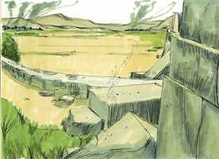
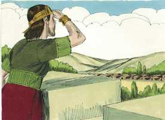
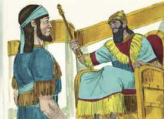

# 2 Reis Cap 24

**1** 	NOS seus dias subiu Nabucodonosor, rei de Babilônia, e Jeoiaquim ficou três anos seu servo; depois se virou, e se rebelou contra ele.

> **Cmt MHenry**: *Versículos 1-7* Se Jeoiaquim tivesse servido ao Senhor, não teria servido a Nabucodonosor. Se se tiver contentado com sua servidão, sua condição não teria piorado, porém, ao rebelar-se contra a Babilônia, se submergiu em maiores problemas. Veja-se quanta necessidade têm as nações de lamentar os pecados de seus pais, para não pagar as conseqüências. As ameaças se cumprirão tão certamente como são prometidas, se não o impedir o arrependimento dos pecadores.

**2** 	E o Senhor enviou contra ele as tropas dos caldeus, as tropas dos sírios, as tropas dos moabitas e as tropas dos filhos de Amom; e as enviou contra Judá, para o destruir, conforme a palavra do Senhor, que falara pelo ministério de seus servos, os profetas.

 

**3** 	E, na verdade, conforme o mandado do Senhor, assim sucedeu a Judá, para o afastar da sua presença por causa dos pecados de Manassés, conforme tudo quanto fizera.

**4** 	Como também por causa do sangue inocente que derramou; pois encheu a Jerusalém de sangue inocente; e por isso o Senhor não quis perdoar.

**5** 	Ora, o mais dos atos de Jeoiaquim, e tudo quanto fez, porventura não está escrito no livro das crônicas dos reis de Judá?

**6** 	E Jeoiaquim dormiu com seus pais; e Joaquim, seu filho, reinou em seu lugar.

**7** 	E o rei do Egito nunca mais saiu da sua terra; porque o rei de Babilônia tomou tudo quanto era do rei do Egito, desde o rio do Egito até ao rio Eufrates.

**8** 	Tinha Joaquim dezoito anos de idade quando começou a reinar, e reinou três meses em Jerusalém; e era o nome de sua mãe, Neusta, filha de Elnatã, de Jerusalém.

> **Cmt MHenry**: *Versículos 8-20* Joaquim reinou somente três meses, mas foi tempo suficiente para demonstrar que pagou as conseqüências dos pecados de seus pais, porque seguiu suas pegadas. O governo foi confiado a seu tio. Zedequias foi o último dos reis de Judá. Embora os juízos de Deus contra os três reis anteriores a ele deveriam tê-lhe servido de advertência, fez o mau, como eles. Quando os encarregados dos conselhos de uma nação agem sem sabedoria e contra seu verdadeiro interesse, devemos notar nisto o desagrado de Deus. Deus lhes oculta o que pertence à paz pública a causa dos pecados do povo. e para cumprir os propósitos secretos de sua justiça, o Senhor só tem de deixar os homens entregues à cegueira de sua mente, ou livrados à luxúria de seus próprios corações. A aproximação paulatina dos juízos divinos permite aos pecadores arrepender-se, e dá tempo aos crente para preparar-se para enfrentar a calamidade, enquanto mostra a obstinação dos que não abandonarão seus pecados.

**9** 	E fez o que era mau aos olhos do Senhor, conforme tudo quanto fizera seu pai.

**10** 	Naquele tempo subiram os servos de Nabucodonosor, rei de Babilônia, a Jerusalém; e a cidade foi cercada.

 

**11** 	Também veio Nabucodonosor, rei de Babilônia, contra a cidade, quando já os seus servos a estavam sitiando.

**12** 	Então saiu Joaquim, rei de Judá, ao rei de Babilônia, ele, sua mãe, seus servos, seus príncipes e seus oficiais; e o rei de Babilônia o tomou preso, no ano oitavo do seu reinado.

 

**13** 	E tirou dali todos os tesouros da casa do Senhor e os tesouros da casa do rei; e partiu todos os vasos de ouro, que fizera Salomão, rei de Israel, no templo do Senhor, como o Senhor tinha falado.

**14** 	E transportou a toda a Jerusalém como também a todos os príncipes, e a todos os homens valorosos, dez mil presos, e a todos os artífices e ferreiros; ninguém ficou senão o povo pobre da terra.

**15** 	Assim transportou Joaquim à Babilônia; como também a mãe do rei, as mulheres do rei, os seus oficiais e os poderosos da terra levou presos de Jerusalém à Babilônia.

**16** 	E todos os homens valentes, até sete mil, e artífices e ferreiros até mil, e todos os homens destros na guerra, a estes o rei de Babilônia levou presos para Babilônia.

**17** 	E o rei de Babilônia estabeleceu a Matanias, seu tio, rei em seu lugar; e lhe mudou o nome para Zedequias.

  

**18** 	Tinha Zedequias vinte e um anos de idade quando começou a reinar, e reinou onze anos em Jerusalém; e era o nome de sua mãe Hamutal, filha de Jeremias, de Libna.

**19** 	E fez o que era mau aos olhos do Senhor, conforme tudo quanto fizera Jeoiaquim.

**20** 	Porque assim sucedeu por causa da ira do Senhor contra Jerusalém, e contra Judá, até os rejeitar de diante da sua presença; e Zedequias se rebelou contra o rei de Babilônia.

> **Cmt MHenry** Intro: *CAPÍTULO 24A-Jr> *• Versículos 1-7*> *Jeoiaquim vencido por Nabucodonosor*> *• Versículos 8-20*> *Joaquim, cativo em Babilônia*