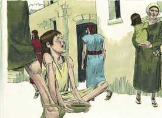
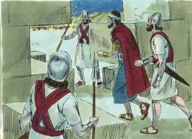
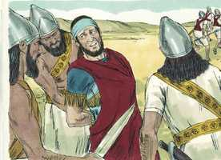
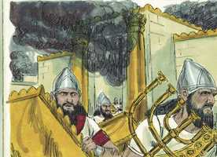
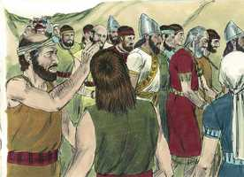
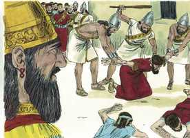

# 2 Reis Cap 25

**1** 	E SUCEDEU que, no nono ano do seu reinado, no mês décimo, aos dez do mês, Nabucodonosor, rei de Babilônia, veio contra Jerusalém, ele e todo o seu exército, e se acampou contra ela, e levantaram contra ela trincheiras em redor.

> **Cmt MHenry**: *Versículos 1-7* Jerusalém estava tão fortificada que não podia ser tomada até que a fome voltasse os sitiados incapazes de resistir. Encontramos mais sobre este acontecimento na profecia de Jeremias e nas Lamentações; baste aqui dizer que a impiedade e a desgraça dos sitiados foram muito grandes. Afinal, a cidade foi tomada por assalto. O rei, sua família e seus grandes homens escaparam de noite por passagens secretas. Porém se enganam os que pensam fugir dos juízos de Deus, tanto como os que se crêem capazes de desafiá-los. Pelo que aconteceu a Zedequias se cumpriram duas profecias, ainda que pareçam contradizer-se. Jeremias profetizou que Zedequias seria levado a Babilônia ([Jr 32.5](../24A-Jr/32.md#5), [34](../24A-Jr/32.md#34).3); Ezequiel, que não veria Babilônia ([Ez 12.13](../26A-Ez/12.md#13)). Foi levado lá, mas lhe foram tirados os olhos, assim que não a viu.

**2** 	E a cidade foi sitiada até ao undécimo ano do rei Zedequias.

**3** 	Aos nove do mês quarto, quando a cidade se via apertada pela fome, nem havia pão para o povo da terra,

 

**4** 	Então a cidade foi invadida, e todos os homens de guerra fugiram de noite pelo caminho da porta, entre os dois muros que estavam junto ao jardim do rei (porque os caldeus estavam contra a cidade em redor), e o rei se foi pelo caminho da campina.

 

**5** 	Porém o exército dos caldeus perseguiu o rei, e o alcançou nas campinas de Jericó; e todo o seu exército se dispersou.

**6** 	E tomaram o rei, e o fizeram subir ao rei de Babilônia, a Ribla; e foi-lhe pronunciada a sentença.

 

**7** 	E aos filhos de Zedequias mataram diante dos seus olhos; e vazaram os olhos de Zedequias, e o ataram com duas cadeias de bronze, e o levaram a Babilônia.

 

**8** 	E no quinto mês, no sétimo dia do mês (este era o ano décimo nono de Nabucodonosor, rei de Babilônia), veio Nebuzaradã, capitão da guarda, servo do rei de Babilônia, a Jerusalém.

> **Cmt MHenry**: *Versículos 8-21* A cidade e o templo foram incendiados e, provavelmente, a arca dentro do templo. Deus mostrou com isto quão pouco se importa da pompa externa de sua adoração, quando se descuidam a vida e o poder da religião. As muralhas de Jerusalém foram derrubadas, e o povo levado cativo à Babilônia. levaram-se os utensílios do templo. Quando se peca contra as coisas representadas, para que servem os símbolos? Foi justo que Deus privasse do benefício de sua adoração aos que preferiram os cultos falsos antes que a Ele; os que tiveram muitos altares agora não têm nenhum. Assim como o Senhor não perdoou os anjos que pecaram, assim como condenou ao túmulo a toda a raça de homens caídos, e a todos os incrédulos ao inferno, e assim como não poupou seu próprio Filho, senão que o entregou por todos nós, assim não devem surpreender-nos as misérias que pode trazer sobre nações, igrejas e pessoas culpáveis.

**9** 	E queimou a casa do Senhor e a casa do rei, como também todas as casas de Jerusalém, e todas as casas dos grandes queimou.

 

**10** 	E todo o exército dos caldeus, que estava com o capitão da guarda, derrubou os muros em redor de Jerusalém.

**11** 	E o mais do povo que deixaram ficar na cidade, os rebeldes que se renderam ao rei de Babilônia e o mais da multidão, Nebuzaradã, o capitão da guarda, levou presos.

 

**12** 	Porém dos mais pobres da terra deixou o capitão da guarda ficar alguns para vinheiros e para lavradores.

**13** 	Quebraram mais, os caldeus, as colunas de cobre que estavam na casa do Senhor, como também as bases e o mar de cobre que estavam na casa do Senhor; e levaram o seu bronze para Babilônia.

**14** 	Também tomaram as caldeiras, as pás, os apagadores, as colheres e todos os vasos de cobre, com que se ministrava.

**15** 	Também o capitão-da-guarda tomou os braseiros, e as bacias, o que era de ouro puro, em ouro e o que era de prata, em prata.

**16** 	As duas colunas, um mar, e as bases, que Salomão fizera para a casa do Senhor; o cobre de todos estes vasos não tinha peso.

**17** 	A altura de uma coluna era de dezoito côvados, e sobre ela havia um capitel de cobre, e de altura tinha o capitel três côvados; e a rede e as romãs em redor do capitel, tudo era de cobre; e semelhante a esta era a outra coluna com a rede.

**18** 	Também o capitão-da-guarda tomou a Seraías, primeiro sacerdote, e a Sofonias, segundo sacerdote, e aos três guardas do umbral da porta.

**19** 	E da cidade tomou a um oficial, que tinha cargo dos homens de guerra, e a cinco homens dos que estavam na presença do rei, e se achavam na cidade, como também ao escrivão-mor do exército, que registrava o povo da terra para a guerra, e a sessenta homens do povo da terra, que se achavam na cidade.

**20** 	E tomando-os Nebuzaradã, o capitão da guarda, os levou ao rei de Babilônia, a Ribla.

**21** 	E o rei de Babilônia os feriu e os matou em Ribla, na terra de Hamate; e Judá foi levado preso para fora da sua terra.

 

**22** 	Porém, quanto ao povo que ficara na terra de Judá, que Nabucodonosor, rei de Babilônia, deixou ficar, pôs sobre ele, por governador a Gedalias, filho de Aicão, filho de Safã.

> **Cmt MHenry**: *Versículos 22-30* O rei da Babilônia nomeou a Gedalias para que fosse o governador e protetor dos judeus que ficaram em sua terra. Mas as coisas pertencentes a sua paz estavam tão escondidas de seus olhos que não se deram conta do bem que possuíam. Ismael matou malignamente a ele e a todos seus amigos e, contra o conselho de Jeremias, o resto se foi para o Egito. Assim se realizou o final definitivo deles por sua própria maldade e desobediência; veja-se Jeremias capítulos 40 a 45. Joaquim foi liberado do cárcere onde esteve por 37 anos. que ninguém diga que nunca mais tornará a ver o bem por levar muito tempo vendo somente o mal: até o mais miserável não sabe quando a providência dará uma virada, nem que consolos lhe estão reservados, conforme aos dias em que foram afligidos. Ainda neste mundo o Salvador traz liberação da escravidão Ap pecador aflito que a busca, e lhe concede provar antecipadamente algo dos prazeres que há a sua destra por sempre. o pecado somente pode ferir-nos; Jesus somente pode fazer o bem aos pecadores.

**23** 	Ouvindo, pois, os capitães dos exércitos, eles e os seus homens, que o rei de Babilônia pusera a Gedalias por governador, vieram a Gedalias, a Mizpá, a saber: Ismael, filho de Netanias, e Joanã, filho de Careá, e Seraías, filho de Tanumete, o netofatita, e Jazanias, filho do maacatita, eles e os seus homens.

**24** 	E Gedalias jurou a eles e aos seus homens, e lhes disse: Não temais ser servos dos caldeus; ficai na terra, servi ao rei de Babilônia, e bem vos irá.

**25** 	Sucedeu, porém, que, no sétimo mês, veio Ismael, filho de Netanias, o filho de Elisama, da descendência real, e dez homens com ele, e feriram a Gedalias, e ele morreu, como também aos judeus, e aos caldeus que estavam com ele em Mizpá.

> **Cmt MHenry**: *CAPÍTULO 25A-Lm

**26** 	Então todo o povo se levantou, desde o menor até ao maior, como também os capitães dos exércitos, e foram ao Egito, porque temiam os caldeus.

**27** 	Depois disto sucedeu que, no ano trinta e sete do cativeiro de Joaquim, rei de Judá, no mês duodécimo, aos vinte e sete do mês, Evil-Merodaque, rei de Babilônia, no ano em que reinou, levantou a cabeça de Joaquim, rei de Judá, tirando-o da casa da prisão.

**28** 	E lhe falou benignamente; e pôs o seu trono acima do trono dos reis que estavam com ele em Babilônia.

**29** 	E lhe mudou as roupas de prisão, e de contínuo comeu pão na sua presença todos os dias da sua vida.

**30** 	E, quanto à sua subsistência, pelo rei lhe foi dada subsistência contínua, a porção de cada dia no seu dia, todos os dias da sua vida.

> **Cmt MHenry** Intro: *• Versículos 1-7*> *Jerusalém sitiada – Zedequias arrestado*> *• Versículos 8-21*> *O templo é queimado – O povo é levado ao cativeiro*> *• Versículos 22-30*> *O resto dos judeus foge ao Egito – Evil-Merodaque alivia o*> *cativeiro de Joaquim*