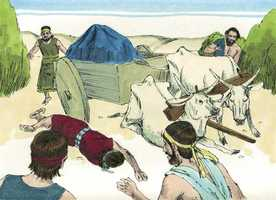

# 1 Crônicas Cap 13

**1** 	E DAVI tomou conselho com os capitães dos milhares, e das centenas, e com todos os líderes.

> **Cmt MHenry**: *Versículos 1-5* Davi não disse: "Que coisa magnifica farei hoje?", nem "Que coisa agradável?", senão: "Que coisa piedosa?", para que pudesse ter o consolo e o benefício do oráculo sagrado. Tragamos a arca a nós, para que seja uma bênção para nós. Os que honram a Deus, se beneficiam a si mesmos. É sabedoria dos que saem ao mundo levar consigo a arca de Deus. provavelmente vão com o favor de Deus os que começam com o temor de Deus.

**2** 	E disse Davi a toda a congregação de Israel: Se bem vos parece, e se isto vem do Senhor nosso Deus, enviemos depressa mensageiros a todos os nossos outros irmãos em todas as terras de Israel, e aos sacerdotes, e aos levitas nas suas cidades e nos seus arrabaldes, para que se reúnam conosco;

**3** 	E tornemos a trazer para nós a arca do nosso Deus; porque não a buscamos nos dias de Saul.

**4** 	Então disse toda a congregação que se fizesse assim; porque este negócio pareceu reto aos olhos de todo o povo.

**5** 	Convocou, pois, Davi a todo o Israel desde Sior do Egito até chegar a Hamate; para trazer a arca de Deus de Quiriate-Jearim.

**6** 	E então Davi com todo o Israel subiu a Baalá de Quiriate-Jearim, que está em Judá, para fazer subir dali a arca de Deus, o Senhor que habita entre os querubins, sobre a qual é invocado o seu nome.

> **Cmt MHenry**: *Versículos 6-14* Que o pecado de Uzá advirta a todos para cuidar-se da presunção, a pressa e a irreverência ao tratar das coisas sagradas; e que ninguém pense que um bom fim justifica uma má ação. Que o castigo de Uzá nos ensine a não atrever=-nos a brincar com Deus quando nos aproximamos a Ele; mas que através de Cristo vamos diretamente ao trono de graça. Se o evangelho é para alguns sabor de morte para morte, como a arca foi para Uzá, que nós o recebamos com amor por Ele e seja para nós um sabor de vida para vida. "

**7** 	E levaram a arca de Deus, da casa de Abinadabe, sobre um carro novo; e Uzá e Aiô guiavam o carro.

 

**8** 	E Davi e todo o Israel, alegraram-se perante Deus com todas as suas forças; com cânticos, e com harpas, e com saltérios, e com tamborins, e com címbalos, e com trombetas.

**9** 	E, chegando à eira de Quidom, estendeu Uzá a sua mão, para segurar a arca, porque os bois tropeçavam.

 

**10** 	Então se acendeu a ira do Senhor contra Uzá, e o feriu, por ter estendido a sua mão à arca; e morreu ali perante Deus.

**11** 	E Davi se encheu de tristeza porque o Senhor havia aberto brecha em Uzá; por isso chamou aquele lugar Perez-Uzá, até ao dia de hoje.

**12** 	E aquele dia temeu Davi a Deus, dizendo: Como trarei a mim a arca de Deus?

**13** 	Por isso Davi não trouxe a arca a si, à cidade de Davi; porém a fez levar à casa de Obede-Edom, o giteu.

> **Cmt MHenry**: *CAPÍTULO 13A-1Cr

 

**14** 	Assim ficou a arca de Deus com a família de Obede-Edom, três meses em sua casa; e o Senhor abençoou a casa de Obede-Edom, e tudo quanto tinha.

> **Cmt MHenry** Intro: *• Versículos 1-5*> *Davi consulta pela arca*> *• Versículos 6-14*> *O traslado da arca*