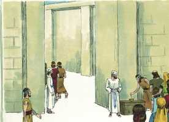
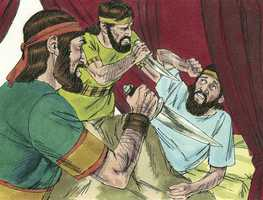

# 2 Crônicas Cap 24

**1** 	TINHA Joás sete anos de idade quando começou a reinar, e quarenta anos reinou em Jerusalém; e era o nome da sua mãe Zíbia, de Berseba.

> **Cmt MHenry**: *Versículos 1-14* Joás é mais zeloso que o próprio Joiada em quanto à reparação do templo. É mais fácil *edificar* templos que *ser* templos de Deus, porém reparar lugares para a adoração pública é uma boa obra que todos devem fomentar. Seria feita mais de uma boa obra, que agora está sem ser realizada, se homens ativos a promovessem.

 

**2** 	E fez Joás o que era reto aos olhos do Senhor, todos os dias do sacerdote Joiada.

**3** 	E tomou-lhe Joiada duas mulheres, e gerou filhos e filhas.

**4** 	E, depois disto, Joás resolveu renovar a casa do Senhor.

**5** 	Reuniu, pois, os sacerdotes e os levitas, e disse-lhes: Saí pelas cidades de Judá, e levantai dinheiro de todo o Israel para reparar a casa do vosso Deus de ano em ano; e vós, apressai este negócio. Porém os levitas não se apressaram.

**6** 	E o rei chamou a Joiada, o chefe, e disse-lhe: Por que não requereste dos levitas, que trouxessem de Judá e de Jerusalém o tributo que Moisés, servo do Senhor, ordenou à congregação de Israel, para a tenda do testemunho?

**7** 	Porque, sendo Atalia ímpia, seus filhos arruinaram a casa de Deus, e até todas as coisas sagradas da casa do Senhor empregaram em Baalins.

**8** 	E o rei, pois, deu ordem e fizeram um cofre, e o puseram fora, à porta da casa do Senhor.

 

**9** 	E publicou-se em Judá e em Jerusalém que trouxessem ao Senhor o tributo de Moisés, o servo de Deus, ordenado a Israel no deserto.

**10** 	Então todos os príncipes e todo o povo se alegraram, e o trouxeram e o lançaram no cofre, até que ficou cheio.

**11** 	E sucedia que, quando levavam o cofre pelas mãos dos levitas, segundo o mandado do rei, e vendo-se que já havia muito dinheiro, vinha o escrivão do rei, e o oficial do sumo sacerdote, e esvaziavam o cofre, e tomavam-no e levavam-no de novo ao seu lugar; assim faziam de dia em dia, e ajuntaram dinheiro em abundância.

**12** 	O qual o rei e Joiada davam aos que tinham o encargo da obra do serviço da casa do Senhor; e contrataram pedreiros e carpinteiros, para renovarem a casa do Senhor; como também ferreiros e serralheiros, para repararem a casa do Senhor.

**13** 	E os que tinham o encargo da obra faziam com que o trabalho de reparação fosse crescendo pelas suas mãos; e restauraram a casa de Deus no seu estado, e a fortaleceram.

**14** 	E, depois de acabarem, trouxeram ao rei e a Joiada o resto do dinheiro, e dele fizeram utensílios para a casa do Senhor, objetos para ministrar e oferecer, colheres, vasos de ouro e de prata. E continuamente sacrificaram holocaustos na casa do Senhor, todos os dias de Joiada.

**15** 	E envelheceu Joiada, e morreu farto de dias; era da idade de cento e trinta anos quando morreu.

> **Cmt MHenry**: *Versículos 15-27* Veja-se que juízo é para qualquer príncipe ou povo a morte de homens santos, zelosos, úteis. Observe-se quão necessário é que em matéria de fé ajamos baseados em princípios internos. Então, perder um pai, um ministro ou um amigo não seria perder nossa religião. Freqüentemente os príncipes e a gente inferior tem sido elogiados para sua própria ruína. Somente a verdadeira graça capacitará o homem para dar fruto até o fim. Zacarias, filho de Joiada, cheio do Espírito de profecia, se pôs em pé e falou ao povo acerca de seu pecado. A obra dos ministros é descobrir o pecado dos homens por meio da Palavra de Deus, como lâmpada e luz, e expor as providências de Deus. Eles mataram a pedradas a Zacarias no átrio da casa do Senhor. Atentem para as palavras do mártir moribundo: "Jeová o veja e o demande", que não procederam de um espírito de vingança, senão de um espírito de profecia. Deus golpeou a Joás com graves enfermidades, de corpo ou de mente, ou ambas, antes que os sírios partissem. Se a vingança persegue os homens, o final de uma tribulação não será senão o começo de outra. Seus próprios servos o mataram. Estes juízos são chamados cargas, porque a ira de Deus é uma carga pesada, demasiado pesada para que a suporte um homem. Que Deus nos ajude a ouvir a advertência, a sermos retos de coração, e a perseverar em seus caminhos até o fim. "

**16** 	E o sepultaram na cidade de Davi com os reis; porque tinha feito bem em Israel, e para com Deus e a sua casa.

**17** 	Porém, depois da morte de Joiada vieram os príncipes de Judá e prostraram-se perante o rei; e o rei os ouviu.

**18** 	E deixaram a casa do Senhor Deus de seus pais, e serviram às imagens do bosque e aos ídolos. Então, por causa desta sua culpa, veio grande ira sobre Judá e Jerusalém.

**19** 	Porém enviou profetas entre eles, para os reconduzir ao Senhor, os quais protestaram contra eles; mas eles não deram ouvidos.

**20** 	E o Espírito de Deus revestiu a Zacarias, filho do sacerdote Joiada, o qual se pôs em pé acima do povo, e lhes disse: Assim diz Deus: Por que transgredis os mandamentos do Senhor, de modo que não possais prosperar? Porque deixastes ao Senhor, também ele vos deixará.

**21** 	E eles conspiraram contra ele, e o apedrejaram por mandado do rei, no pátio da casa do Senhor.

**22** 	Assim o rei Joás não se lembrou da beneficência que Joiada, pai de Zacarias, lhe fizera; porém matou-lhe o filho, o qual, morrendo, disse: O Senhor o verá, e o requererá.

**23** 	E sucedeu que, decorrido um ano, o exército da Síria subiu contra ele; e vieram a Judá e a Jerusalém, e destruíram dentre o povo a todos os seus príncipes; e enviaram todo o seu despojo ao rei de Damasco.

**24** 	Porque ainda que o exército dos sírios viera com poucos homens, contudo o Senhor entregou na sua mão um exército mui numeroso, porquanto deixaram ao Senhor Deus de seus pais. Assim executaram juízos contra Joás.

> **Cmt MHenry**: *CAPÍTULO 24A-Jr

**25** 	E, quando os sírios se retiraram, deixaram-no gravemente ferido; então seus servos conspiraram contra ele por causa do sangue do filho do sacerdote Joiada, e o feriram na sua cama, e morreu; e o sepultaram na cidade de Davi, porém não nos sepulcros dos reis.

 

**26** 	Estes, pois, foram os que conspiraram contra ele; Zabade, filho de Simeate, a amonita, e Jeozabade, filho de Sinrite, a moabita.

**27** 	E, quanto a seus filhos, e à grandeza do cargo que se lhe impôs, e à restauração da casa de Deus, eis que estão escritos no livro da história dos reis; e Amazias, seu filho, reinou em seu lugar.

> **Cmt MHenry** Intro: *• Versículos 1-14*> *Joás de Judá – Reparação do templo*> *• Versículos 15-27*> *Joás cai na idolatria – Seus servos o matam*