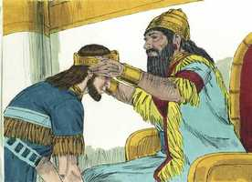

# 2 Crônicas Cap 36

**1** 	ENTÃO o povo da terra tomou a Jeoacaz, filho de Josias, e o fez rei em lugar de seu pai, em Jerusalém.

> **Cmt MHenry**: *Versículos 1-21* A ruína de Judá e Jerusalém foi gradual. Os métodos que Deus adota para chamar de volta os pecadores por sua Palavra, por meio dos ministros, pela consciência, por providências, são todos exemplos de sua compaixão para com eles, e de seu desejo de nenhum deles pereça. Veja-se aqui que caos terrível produz o pecado e, a medida que valorizamos o consolo e continuidade de nossas bênçãos terrenas, mantenhamos afastado esse verme de suas raízes. Eles tinham arado e semeado muitas vezes sua terra num ano sétimo, quando ela deveria ter repousado, e agora tinha permanecido sem arar nem semear durante dez vezes sete anos. Deus não sairá perdendo sua glória afinal, por causa da desobediência dos homens. se eles se negarem a deixar que a terra repousasse, Deus a faria descansar. Que lugar, oh Deus, perdoará tua justiça, se Jerusalém tiver perecido? Se essa delícia for cortada por má, não sejamos altivos, porém temamos.

**2** 	Tinha Jeoacaz a idade de vinte e três anos, quando começou a reinar; e três meses reinou em Jerusalém,

**3** 	Porque o rei do Egito o depôs em Jerusalém, e condenou a terra à contribuição de cem talentos de prata e um talento de ouro.

**4** 	E o rei do Egito pôs a Eliaquim, irmão de Jeoacaz, rei sobre Judá e Jerusalém, e mudou-lhe o nome em Jeoiaquim; mas a seu irmão Jeoacaz tomou Neco, e levou-o para o Egito.

**5** 	Tinha Jeoiaquim vinte e cinco anos de idade, quando começou a reinar, e reinou onze anos em Jerusalém; e fez o que era mau aos olhos do Senhor seu Deus.

**6** 	Subiu, pois, contra ele Nabucodonosor, rei de Babilônia, e o amarrou com cadeias, para o levar a Babilônia.

**7** 	Também alguns dos vasos da casa do Senhor levou Nabucodonosor a Babilônia, e pô-los no seu templo em Babilônia.

**8** 	Quanto ao mais dos atos de Jeoiaquim, e as abominações que fez, e o mais que se achou nele, eis que estão escritos no livro dos reis de Israel e de Judá; e Joaquim, seu filho, reinou em seu lugar.

**9** 	Tinha Joaquim a idade de oito anos, quando começou a reinar; e reinou três meses e dez dias em Jerusalém; e fez o que era mau aos olhos do Senhor.

**10** 	E no decurso de um ano enviou o rei Nabucodonosor, e mandou trazê-lo a Babilônia, com os mais preciosos vasos da casa do Senhor; e pôs a Zedequias, seu irmão, rei sobre Judá e Jerusalém.

 

**11** 	Tinha Zedequias a idade de vinte e um anos, quando começou a reinar; e onze anos reinou em Jerusalém.

**12** 	E fez o que era mau aos olhos do Senhor seu Deus; nem se humilhou perante o profeta Jeremias, que falava da parte do Senhor.

**13** 	Além disto, também se rebelou contra o rei Nabucodonosor, que o tinha ajuramentado por Deus. Mas endureceu a sua cerviz, e tanto se obstinou no seu coração, que não se converteu ao Senhor Deus de Israel.

**14** 	Também todos os chefes dos sacerdotes e o povo aumentavam de mais em mais as transgressões, segundo todas as abominações dos gentios; e contaminaram a casa do Senhor, que ele tinha santificado em Jerusalém.

**15** 	E o Senhor Deus de seus pais, falou-lhes constantemente por intermédio dos mensageiros, porque se compadeceu do seu povo e da sua habitação.

**16** 	Eles, porém, zombaram dos mensageiros de Deus, e desprezaram as suas palavras, e mofaram dos seus profetas; até que o furor do Senhor tanto subiu contra o seu povo, que mais nenhum remédio houve.

**17** 	Porque fez subir contra eles o rei dos caldeus, o qual matou os seus jovens à espada, na casa do seu santuário, e não teve piedade nem dos jovens, nem das donzelas, nem dos velhos, nem dos decrépitos; a todos entregou na sua mão.

**18** 	E todos os vasos da casa de Deus, grandes e pequenos, os tesouros da casa do Senhor, e os tesouros do rei e dos seus príncipes, tudo levou para Babilônia.

**19** 	E queimaram a casa de Deus, e derrubaram os muros de Jerusalém, e todos os seus palácios queimaram a fogo, destruindo também todos os seus preciosos vasos.

**20** 	E os que escaparam da espada levou para Babilônia; e fizeram-se servos dele e de seus filhos, até ao tempo do reino da Pérsia.

**21** 	Para que se cumprisse a palavra do Senhor, pela boca de Jeremias, até que a terra se agradasse dos seus sábados; todos os dias da assolação repousou, até que os setenta anos se cumpriram.

**22** 	Porém, no primeiro ano de Ciro, rei da Pérsia (para que se cumprisse a palavra do Senhor pela boca de Jeremias), despertou o Senhor o espírito de Ciro, rei da Pérsia, o qual fez passar pregão por todo o seu reino, como também por escrito, dizendo:

> **Cmt MHenry**: *Versículos 22-23* Deus tinha prometido restaurar os cativos e reconstruir Jerusalém no final de setenta anos e, o tempo fixado, o tempo de favorecer a Sião, chegou finalmente. Ainda que a igreja de Deus seja *derrubada*, não será *expulsa*; ainda que seu povo seja *corrigido*, não será *abandonado*; ainda que *lançado no fogo*, não se *perde* ali, nem será deixado mais tempo do necessário para separar o espúrio. Mesmo que Deus contenda por muito tempo, não contenderá para sempre. Antes de fechar os livros das Crônicas, que contêm o fiel registro dos fatos, pensem que desolação introduziu o pecado no mundo e, sim, até na igreja de Deus. tremamos pelo que aqui nos é narrado, embora no caráter de algumas poucas almas bondosas descubramos que o Senhor não fica sem testemunhas. E quando tenhamos olhado este fiel retrato da natureza do homem, comparemo-lo com a mesma natureza renovadora pela graça do Todo-Poderoso, por meio da justiça de Cristo, nosso Salvador que justifica e justifica e adorna a alma.

**23** 	Assim diz Ciro, rei da Pérsia: O Senhor Deus dos céus me deu todos os reinos da terra, e me encarregou de lhe edificar uma casa em Jerusalém, que está em Judá. Quem há entre vós, de todo o seu povo, o Senhor seu Deus seja com ele, e suba.

> **Cmt MHenry** Intro: *CAPÍTULO 36A-Sf> *• Versículos 1-21*> *A destruição de Jerusalém*> *• Versículos 22-23*> *A proclama de Ciro*