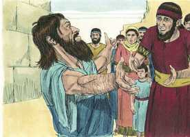
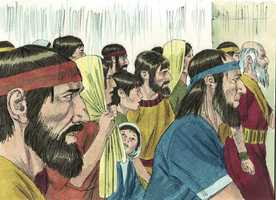
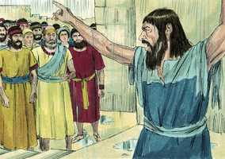
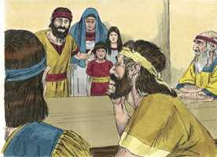

# Esdras Cap 10

**1** 	E ENQUANTO Esdras orava, e fazia confissão, chorando e prostrando-se diante da casa de Deus, ajuntou-se a ele, de Israel, uma grande congregação de homens, mulheres e crianças; pois o povo chorava com grande choro.

> **Cmt MHenry**: *Versículos 1-5* Secanias admitiu a culpa nacional. O caso é triste porém não desesperado; a doença é ameaçadora, mas não incurável. Agora que o povo começa a lamentar-se, pareceria que é derramado um espírito de arrependimento; agora há esperança de que Deus perdoe e tenha misericórdia. O pecado que retamente nos perturba não nos destruirá. Em momentos melancólicos devemos observar que está por nós como também está em nossa contra. E pode que existam boas esperanças por meio da graça até onde houver um sentido de grande culpabilidade perante Deus. O caso é simples: o que foi mal feito deve ser desfeito novamente, na maior medida possível; nada menos que isto é o arrependimento verdadeiro. O pecado deve eliminar-se, resolvidos a não termos nunca nada mais a ver com isso. o que se obteve injustamente, deve restaurar-se. Levante-se e tenha bom ânimo. Chorar é bom neste caso, mas reformar é melhor. Em quanto a estar desigualmente unido em jugo com incrédulos, tais matrimônios são certamente pecadores e não devem ser efetuados, porém *agora* não são nulos como o eram antes que o evangelho terminasse a separação de judeus e gentios.

**2** 	Então Secanias, filho de Jeiel, um dos filhos de Elão, tomou a palavra e disse a Esdras: Nós temos transgredido contra o nosso Deus, e casamos com mulheres estrangeiras dentre os povos da terra, mas, no tocante a isto, ainda há esperança para Israel.

 

**3** 	Agora, pois, façamos aliança com o nosso Deus de que despediremos todas as mulheres, e os que delas são nascidos, conforme ao conselho do meu senhor, e dos que tremem ao mandado do nosso Deus; e faça-se conforme a lei.

**4** 	Levanta-te, pois, porque te pertence este negócio, e nós seremos contigo; esforça-te, e age.

**5** 	Então Esdras se levantou, e ajuramentou os chefes dos sacerdotes e dos levitas, e a todo o Israel, de que fariam conforme a esta palavra; e eles juraram.

**6** 	E Esdras se levantou de diante da casa de Deus, e entrou na câmara de Joanã, filho de Eliasibe; e, chegando lá, não comeu pão, e nem bebeu água; porque lamentava pela transgressão dos do cativeiro.

> **Cmt MHenry**: *Versículos 6-14* Há esperanças concernentes ao povo quando eles estejam convencidos de que não só é bom separar-se de seus pecados, senão que é necessário; devemos fazê-lo ou seremos desfeitos. Tão rica é a misericórdia e tão abundante a redenção de Deus, que há esperança para o mais vil que ouça o evangelho e estiver disposto a aceitar sua salvação gratuita. Quando os pecadores se lamentam de seus pecados e tremem ante a palavra de Deus, há esperança de que os abandonem. Para afetar os outros com pena ou amor santos para com Deus, devemos nós mesmos estarmos afetados. Foi acordado, cuidadosamente, como devia realizar-se este assunto. O que for resolvido apressadamente rara vez resulta duradouro.

**7** 	E fizeram passar pregão por Judá e Jerusalém, a todos os que vieram do cativeiro, para que se ajuntassem em Jerusalém.

**8** 	E que todo aquele que em três dias não viesse, segundo o conselho dos príncipes e dos anciãos, toda a sua fazenda se poria em interdito, e ele seria separado da congregação dos do cativeiro.

**9** 	Então todos os homens de Judá e Benjamim em três dias se ajuntaram em Jerusalém; era o nono mês, aos vinte dias do mês; e todo o povo se assentou na praça da casa de Deus, tremendo por este negócio e por causa das grandes chuvas.

 

**10** 	Então se levantou Esdras, o sacerdote, e disse-lhes: Vós tendes transgredido, e casastes com mulheres estrangeiras, aumentando a culpa de Israel.

> **Cmt MHenry**: *CAPÍTULO 10A-2Sm

 

**11** 	Agora, pois, fazei confissão ao Senhor Deus de vossos pais, e fazei a sua vontade; e apartai-vos dos povos das terras, e das mulheres estrangeiras.

**12** 	E respondeu toda a congregação, e disse em altas vozes: Assim seja, conforme às tuas palavras nos convém fazer.

 

**13** 	Porém o povo é muito, e também é tempo de grandes chuvas, e não se pode estar aqui fora; nem é obra de um dia nem de dois, porque somos muitos os que transgredimos neste negócio.

**14** 	Ora, ponham-se os nossos líderes, por toda a congregação sobre este negócio; e todos os que em nossas cidades casaram com mulheres estrangeiras venham em tempos apontados, e com eles os anciãos de cada cidade, e os seus juízes, até que desviemos de nós o ardor da ira do nosso Deus, por esta causa.

**15** 	Porém, somente Jônatas, filho de Asael, e Jaseías, filho de Ticva, se opuseram a isto; e Mesulão, e Sabetai, levita, os ajudaram.

> **Cmt MHenry**: *Versículos 15-44* Os melhores reformadores não podem senão realizar sua empresa; quando o Redentor mesmo vir a Sião, efetivamente eliminará a impiedade de Jacó. Quando se arrepender e abandonar o pecado, Deus o perdoará, porém o sangue de Cristo, nossa oferta pelo pecado, é a única expiação que tira nossa culpa. Nenhum arrependimento ou emenda aparentes beneficiará os que o rejeitam a Ele, pois a dependência de si mesmos os mostra ainda sem humilhar-se. Todos os nomes escritos no livro da vida são os de pecadores penitentes, não de pessoas com justiça própria que pensam que não necessitam arrepender-se.

**16** 	E assim o fizeram os que voltaram do cativeiro; e o sacerdote Esdras e os homens, chefes dos pais, segundo a casa de seus pais, e todos pelos seus nomes, foram apontados; e assentaram-se no primeiro dia do décimo mês, para inquirirem neste negócio.

 

**17** 	E no primeiro dia do primeiro mês acabaram de tratar com todos os homens que casaram com mulheres estrangeiras.

**18** 	E acharam-se dos filhos dos sacerdotes que casaram com mulheres estrangeiras: Dos filhos de Jesuá, filho de Jozadaque, e seus irmãos, Maaséias, e Eliezer, e Jaribe, e Gedalias.

**19** 	E deram as suas mãos prometendo que despediriam suas mulheres; e, achando-se culpados, ofereceram um carneiro do rebanho pelo seu delito.

 

**20** 	E dos filhos de Imer: Hanani e Zebadias.

**21** 	E dos filhos de Harim: Maaséias, Elias, Semaías, Jeiel e Uzias.

**22** 	E dos filhos de Pasur: Elioenai, Maaséias, Ismael, Netanel, Jozabade e Eleasa.

**23** 	E dos levitas: Jozabade, Simei, Quelaías (este é Quelita), Petaías, Judá e Eliezer.

**24** 	E dos cantores: Eliasibe; e dos porteiros: Salum, Telém e Uri.

**25** 	E de Israel, dos filhos de Parós: Ramias, Jezias, Malquias, Miamim, Eleazar, Malquias e Benaia.

**26** 	E dos filhos de Elão: Matanias, Zacarias, Jeiel, Abdi, Jeremote e Elias.

**27** 	E dos filhos de Zatu: Elioenai, Eliasibe, Matanias, Jeremote, Zabade e Aziza.

**28** 	E dos filhos de Bebai: Joanã, Hananias, Zabai e Atlai.

**29** 	E dos filhos de Bani: Mesulão, Maluque, Adaías, Jasube, Seal, Jeremote.

**30** 	E dos filhos de Paate-Moabe: Adna, Quelal, Benaia, Maséias, Matanias, Bezalel, Binui e Manassés.

**31** 	E dos filhos de Harim: Eliezer, Josias, Malquias, Semaías, Simeão,

**32** 	Benjamim, Maluque, Semarias.

**33** 	Dos filhos de Hasum: Matenai, Matatá, Zabade, Elifelete, Jeremai, Manassés e Simei.

**34** 	Dos filhos de Bani: Maadai, Anrão, e Uel,

**35** 	Benaia, Bedias, Queluí,

**36** 	Vanias, Meremote, Eliasibe,

**37** 	Matanias, Matnai e Jaasai,

**38** 	E Bani, Binui, Simei,

**39** 	E Selemias, Natã e Adaías,

**40** 	Macnadbai, Sasai, Sarai,

**41** 	Azareel, Selemias, Semarias,

**42** 	Salum, Amarias e José.

**43** 	Dos filhos de Nebo: Jeiel, Matitias, Zabade, Zebina, Jadai, Joel e Benaia.

**44** 	Todos estes tomaram mulheres estrangeiras; e alguns deles tinham mulheres de quem tiveram filhos.

> **Cmt MHenry** Intro: *• Versículos 1-5*> *Esdras anima a reforma*> *• Versículos 6-14*> *Ele reúne o povo*> *• Versículos 15-44*> *Se efetua a reforma*