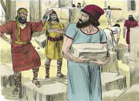
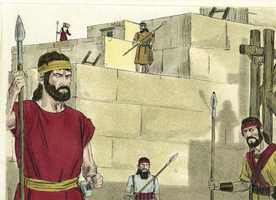
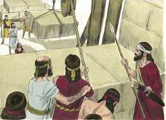

# Neemias Cap 04

**1** 	E SUCEDEU que, ouvindo Sambalate que edificávamos o muro, ardeu em ira, e se indignou muito; e escarneceu dos judeus.

> **Cmt MHenry**: *Versículos 1-6* Mais de uma boa obra tem sido olhada com desdém por escarnecedores orgulhosos e altaneiros. Pessoas que discrepam entre si quase em tudo, se unem para a perseguição. Neemias não contestou aos néscios conforme a sua estultícia; antes recorrei a Deus em oração. Freqüentemente o povo de Deus tem sido desprezado, mas Ele ouve todos os dardos que lhe são lançados e é para consolo deles que assim o faça. Neemias tinha razão para pensar que os corações desses pecadores estavam completamente endurecidos, caso contrário não teria orado que seus pecados nunca fossem apagados. A boa obra continua avançando quando a gente se preocupa por ela. As repreensões dos inimigos deveriam alentar-nos em nosso dever, em lugar de afastar-nos dele.

**2** 	E falou na presença de seus irmãos, e do exército de Samaria, e disse: Que fazem estes fracos judeus? Permitir-se-lhes-á isto? Sacrificarão? Acabá-lo-ão num só dia? Vivificarão dos montões do pó as pedras que foram queimadas?

**3** 	E estava com ele Tobias, o amonita, e disse: Ainda que edifiquem, contudo, vindo uma raposa, derrubará facilmente o seu muro de pedra.

 

**4** 	Ouve, ó nosso Deus, que somos tão desprezados, e torna o seu opróbrio sobre a sua cabeça, e dá-os por presa, na terra do cativeiro.

> **Cmt MHenry**: *CAPÍTULO 40N-Mt 41N-Mc 42N-Lc 43N-Joa 44N-At 45N-Rm 46N-1Co 47N-2Co 48N-Gl 49N-Ef

**5** 	E não cubras a sua iniqüidade, e não se risque de diante de ti o seu pecado, pois que te irritaram na presença dos edificadores.

**6** 	Porém edificamos o muro, e todo o muro se fechou até sua metade; porque o coração do povo se inclinava a trabalhar.

**7** 	E sucedeu que, ouvindo Sambalate e Tobias, e os árabes, os amonitas, e os asdoditas, que tanto ia crescendo a reparação dos muros de Jerusalém, que já as roturas se começavam a tapar, iraram-se sobremodo,

> **Cmt MHenry**: *Versículos 7-15* Os homens malvados procuram obstruir a boa obra, e se prometem alcançar o êxito nisso, mas a boa obra é obra de Deus e prosperará. Deus tem muitas formas de levar a luz, e assim, reduzir à nada as estratagemas e desígnios dos inimigos de Sua igreja. Se nossos inimigos não podem assustar-nos para afastar-nos de nosso dever, nem enganar-nos para que pequemos, não podem prejudicar-nos. Neemias se colocou sob a proteção divina, ele mesmo e sua causa. Foi o método deste bom homem e deveria ser o nosso. Todas suas preocupações, todas suas penas, todos seus temores, os depositou diante de Deus. antes de usar um meio, ele o apresentava em oração a Deus. Tendo orado, pôs uma guarda contra o inimigo. Se pensarmos nos assegurar por meio da oração, sem vigiar e estarmos alertas, somos preguiçosos e tentamos a Deus; porém, vigiar alertas, sem orar, é sermos orgulhosos e insolentes com Deus: Deus qualquer forma, abandonamos Sua proteção. O cuidado que Deus tem de nossa seguridade deveria comprometer-nos e estimular-nos a continuar avançando com vigor cumprindo nosso dever. Tão logo como termine um perigo, regressemos à nossa obra e confiemos em Deus novamente.

**8** 	E ligaram-se entre si todos, para virem guerrear contra Jerusalém, e para os desviarem do seu intento.

**9** 	Porém nós oramos ao nosso Deus e pusemos uma guarda contra eles, de dia e de noite, por causa deles.

**10** 	Então disse Judá: Já desfaleceram as forças dos carregadores, e o pó é muito, e nós não poderemos edificar o muro.

**11** 	Disseram, porém, os nossos inimigos: Nada saberão disto, nem verão, até que entremos no meio deles, e os matemos; assim faremos cessar a obra.

**12** 	E sucedeu que, vindo os judeus que habitavam entre eles, dez vezes nos disseram: De todos os lugares, tornarão contra nós.

**13** 	Então pus guardas nos lugares baixos por detrás do muro e nos altos; e pus ao povo pelas suas famílias com as suas espadas, com as suas lanças, e com os seus arcos.

 

**14** 	E olhei, e levantei-me, e disse aos nobres, aos magistrados, e ao restante do povo: Não os temais; lembrai-vos do grande e terrível Senhor, e pelejai pelos vossos irmãos, vossos filhos, vossas mulheres e vossas casas.

**15** 	E sucedeu que, ouvindo os nossos inimigos que já o sabíamos, e que Deus tinha dissipado o conselho deles, todos voltamos ao muro, cada um à sua obra.

**16** 	E sucedeu que, desde aquele dia, metade dos meus servos trabalhava na obra, e metade deles tinha as lanças, os escudos, os arcos e as couraças; e os líderes estavam por detrás de toda a casa de Judá.

> **Cmt MHenry**: *Versículos 16-23* Sempre devemos estar em guarda contra os inimigos espirituais, sem esperar que nossa guerra termine quando acabe nossa obra. A palavra de Deus é a espada do Espírito, a qual sempre devemos ter na mão, e nunca teremos que buscá-la em nossas tarefas e em nossos conflitos como cristãos. Todo cristão verdadeiro é trabalhador e soldado que opera com uma mão e luta com a outra. Provavelmente a boa obra siga adiante com êxito quando os que trabalham nela o façam com diligência. Satanás teme atacar o cristão alerta, porque, se for tentado, o Senhor peleja por ele. assim, temos de esperar o fim da vida, sem tirar-nos a armadura até que terminem nossa obra e nossa guerra; então seremos recebidos no repouso e no gozo de nosso Senhor.

 

**17** 	Os que edificavam o muro, os que traziam as cargas e os que carregavam, cada um com uma das mãos fazia a obra e na outra tinha as armas.

**18** 	E os edificadores cada um trazia a sua espada cingida aos lombos, e edificavam; e o que tocava a trombeta estava junto comigo.

**19** 	E disse eu aos nobres, aos magistrados e ao restante do povo: Grande e extensa é a obra, e nós estamos apartados do muro, longe uns dos outros.

**20** 	No lugar onde ouvirdes o som da buzina, ali vos ajuntareis conosco; o nosso Deus pelejará por nós.

**21** 	Assim trabalhávamos na obra; e metade deles tinha as lanças desde a subida da alva até ao sair das estrelas.

**22** 	Também naquele tempo disse ao povo: Cada um com o seu servo fique em Jerusalém, para que à noite nos sirvam de guarda, e de dia na obra.

**23** 	E nem eu, nem meus irmãos, nem meus servos, nem os homens da guarda que me seguiam largávamos as nossas vestes; cada um tinha suas armas e água.

> **Cmt MHenry** Intro: *• Versículos 1-6*> *Oposição de Sambalate e outros*> *• Versículos 7-15*> 28A-Os desígnios dos adversários*> *• Versículos 16-23*> *As precauções de Neemias*