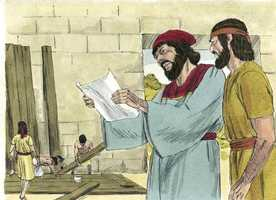
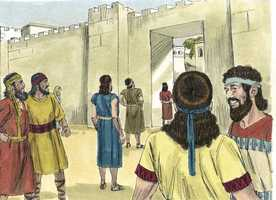

# Neemias Cap 06

**1** 	SUCEDEU que, ouvindo Sambalate, Tobias, Gesém, o árabe, e o resto dos nossos inimigos, que eu tinha edificado o muro, e que nele já não havia brecha alguma, ainda que até este tempo não tinha posto as portas nos portais,

> **Cmt MHenry**: *Versículos 1-9* Os que sejam convidados ao ócio em alegres reuniões por vãs companhias, respondam assim à tentação: "Temos obra a fazer e não devemos descuidá-la". Nunca devemos deixar-nos arrastar pelo convite reiterado a fazer algo pecaminoso ou imprudente; antes, quando sejamos atacados pela tentação, resistamo-la com a mesma razão e decisão. É comum que o desejado pelos malvados seja representado falsamente como algo desejável para muitos. Porém Neemias sabia ao que apontavam, e não somente negou que tais coisas fossem verdadeiras, senão que estava informado ao respeito; era melhor que o conhecessem em sua posição, e não que suspeitassem dele. Nunca devemos omitir um dever conhecido por medo de sermos mal-interpretados; confiemos a Deus nosso bom nome enquanto mantemos uma boa consciência. O povo de Deus, ainda que carregado de repreensões, não caiu tão baixo em sua reputação como alguns gostariam que se pensasse. Neemias elevou seu coração ao Céu uma oração curta. Quando entramos num serviço ou conflito na obra e na guerra cristãs, esta é uma boa oração: "Tenho tal dever a realizar, tal tentação que enfrentar, agora, oh Deus, fortalece minhas mãos". Toda tentação a desviar-nos bible_markdown.sh markdown2html.sh Notas Bíblia de Estudo NVI-out_images.txt dever deve estimular-nos mais *ao* dever.

**2** 	Sambalate e Gesém mandaram dizer-me: Vem, e congreguemo-nos juntamente nas aldeias, no vale de Ono. Porém intentavam fazer-me mal.

 

**3** 	E enviei-lhes mensageiros a dizer: Faço uma grande obra, de modo que não poderei descer; por que cessaria esta obra, enquanto eu a deixasse, e fosse ter convosco?

**4** 	E do mesmo modo enviaram a mim quatro vezes; e da mesma forma lhes respondi.

**5** 	Então Sambalate ainda pela quinta vez me enviou seu servo com uma carta aberta na sua mão;

**6** 	E na qual estava escrito: Entre os gentios se ouviu, e Gasmu diz: Tu e os judeus intentais rebelar-vos, então edificas o muro; e tu te farás rei deles segundo estas palavras;

> **Cmt MHenry**: *CAPÍTULO 60N-1Pe 61N-2Pe 62N-1Jo 63N-2Jo 64N-3Jo 65N-Jd 66N-Ap

**7** 	E que puseste profetas, para pregarem de ti em Jerusalém, dizendo: Este é rei em Judá; de modo que o rei o ouvirá, segundo estas palavras; vem, pois, agora, e consultemos juntamente.

**8** 	Porém eu mandei dizer-lhe: De tudo o que dizes coisa nenhuma sucedeu; mas tu, do teu coração, o inventas.

**9** 	Porque todos eles procuravam atemorizar-nos, dizendo: As suas mãos largarão a obra, e não se efetuará. Agora, pois, ó Deus, fortalece as minhas mãos.

**10** 	E, entrando eu em casa de Semaías, filho de Delaías, o filho de Meetabel (que estava encerrado), disse ele: Vamos juntamente à casa de Deus, ao meio do templo, e fechemos as portas do templo; porque virão matar-te; sim, de noite virão matar-te.

> **Cmt MHenry**: *Versículos 10-14* O maior mal que podem fazer-nos nossos inimigos é assustar-nos, afastando-nos de nosso dever e levar-nos a fazer o que é pecaminoso. Nunca declinemos uma boa obra, mas nunca realizemos uma má. Devemos provar todo conselho e rejeitar o que for contrário à Palavra de Deus. todo homem deve refletir para ser conseqüente: Devo eu, cristão professo, chamado a ser santo, filho de Deus,, membro do Corpo de Cristo, templo do Espírito Santo, ser cobiçoso, sensual, orgulhoso ou invejoso? Devo render-me à impaciência, ao descontentamento ou à ira? Devo ser preguiçoso, incrédulo ou impiedoso? Que efeitos terá tal conduta nos outros? tudo o que Deus tem feito por nós ou por nosso intermédio, ou tudo o que nos foi dado, deve levar-nos a vigiar, a negar a nós mesmos e à diligência. Depois da devassidão do pecado devemos aborrecer o escândalo.

**11** 	Porém eu disse: Um homem como eu fugiria? E quem há, como eu, que entre no templo para que viva? De maneira nenhuma entrarei.

**12** 	E percebi que não era Deus quem o enviara; mas esta profecia falou contra mim, porquanto Tobias e Sambalate o subornaram.

**13** 	Para isto o subornaram, para me atemorizar, e para que assim fizesse, e pecasse, para que tivessem alguma causa para me infamarem, e assim me vituperarem.

**14** 	Lembra-te, meu Deus, de Tobias e de Sambalate, conforme a estas suas obras, e também da profetisa Noadia, e dos mais profetas que procuraram atemorizar-me.

**15** 	Acabou-se, pois, o muro aos vinte e cinco do mês de Elul; em cinqüenta e dois dias.

> **Cmt MHenry**: *Versículos 15-19* A muralha foi começada e terminada em cinqüenta e dois dias, apesar de que descansaram nos dias de repouso. Pode ser feita muita obra em pouco tempo se nos dedicarmos com empenho e formos perseverantes. Veja-se a maldade de casar com estrangeiras. Quando os homens ficaram parentes de Tobias, logo estavam comprometidos com ele. um amor pecaminoso conduz a uniões perversas. O inimigo das almas emprega muitos instrumentos e forma muitos projetos para censurar os servos ativos de Deus ou para tirá-los de suas obras. Todavia, nós devemos seguir o exemplo dAquele que deu sua vida pelas ovelhas. Elas simplesmente se unem ao Senhor e sua obra recebe apoio. "

 

**16** 	E sucedeu que, ouvindo-o todos os nossos inimigos, todos os povos que havia em redor de nós temeram, e abateram-se muito a seus próprios olhos; porque reconheceram que o nosso Deus fizera esta obra.

**17** 	Também naqueles dias alguns nobres de Judá escreveram muitas cartas que iam para Tobias; e as cartas de Tobias vinham para eles.

**18** 	Porque muitos em Judá lhe eram ajuramentados, porque era genro de Secanias filho de Ará; e seu filho Joanã se casara com a filha de Mesulão, filho de Berequias.

**19** 	Também as suas boas ações contavam perante mim, e as minhas palavras transmitiam a ele; portanto Tobias escrevia cartas para me atemorizar.

> **Cmt MHenry** Intro: *• Versículos 1-9*> *O complô de Sambalate para estorvar Neemias*> *• Versículos 10-14*> 28A-Os falsos profetas tratam de assustar a Neemias*> *• Versículos 15-19*> *As muralhas são terminadas – Traição de alguns judeus*