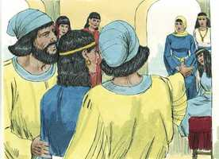
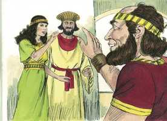
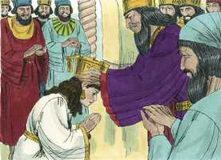
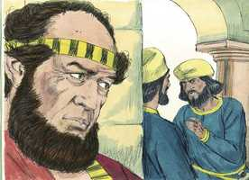
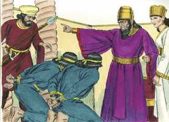

# Ester Cap 02

**1** 	PASSADAS estas coisas, e apaziguado já o furor do rei Assuero, lembrou-se de Vasti, e do que fizera, e do que se tinha decretado a seu respeito.

> **Cmt MHenry**: *Vv. 1-20.* Observemos que coisas absurdas chegam a cometer os que foram despojados da revelação divina, e a necessidade que há do Evangelho de Cristo para purificar aos homens de suas luxúrias carnais, e restaurá-los à instituição original do casamento. Ester foi escolhida como rainha. Os que sugerem ter Ester cometido pecado por chegar a esta dignidade, não consideram os costumes daqueles tempos nem daqueles países. Cada uma das mulheres que o rei tomava estava casada com ele, e era sua esposa, ainda que de classe inferior. Porém, quão afundada está a natureza humana, quando coisas como estas são a principal busca da suprema felicidade dos homens! A decepção e o vexame devem sobrevir, os que mais sabiamente consideram seu gozo, ainda nesta vida presente, são os que obedecem mais exatamente aos preceitos da lei divina. Porém, voltemos a considerar a sábia providência de Deus, que executa seus profundos e santos desígnios, em meio a tudo isto. E que nenhuma mudança de nossa condição seja pretexto para esquecermos nossos deveres para com os pais, ou amigos que têm ocupado o seu lugar.

**2** 	Então disseram os servos do rei, que lhe serviam: Busquem-se para o rei moças virgens e formosas.

> **Cmt MHenry**: *[Ester 2](../17A-Et/02.md#0)*

**3** 	E ponha o rei oficiais em todas as províncias do seu reino, que ajuntem a todas as moças virgens e formosas, na fortaleza de Susã, na casa das mulheres, aos cuidados de Hegai, camareiro do rei, guarda das mulheres, e dêem-se-lhes os seus enfeites.

**4** 	E a moça que parecer bem aos olhos do rei, reine em lugar de Vasti. E isto pareceu bem aos olhos do rei, e ele assim fez.

**5** 	Havia então um homem judeu na fortaleza de Susã, cujo nome era Mardoqueu, filho de Jair, filho de Simei, filho de Quis, homem benjamita,

**6** 	Que fora transportado de Jerusalém, com os cativos que foram levados com Jeconias, rei de Judá, o qual transportara Nabucodonosor, rei de Babilônia.

**7** 	Este criara a Hadassa (que é Ester, filha de seu tio), porque não tinha pai nem mãe; e era jovem bela de presença e formosa; e, morrendo seu pai e sua mãe, Mardoqueu a tomara por sua filha.

**8** 	Sucedeu que, divulgando-se o mandado do rei e a sua lei, e ajuntando-se muitas moças na fortaleza de Susã, aos cuidados de Hegai, também levaram Ester à casa do rei, sob a custódia de Hegai, guarda das mulheres.

 

**9** 	E a moça pareceu formosa aos seus olhos, e alcançou graça perante ele; por isso se apressou a dar-lhe os seus enfeites, e os seus quinhões, como também em lhe dar sete moças de respeito da casa do rei; e a fez passar com as suas moças ao melhor lugar da casa das mulheres.

 

**10** 	Ester, porém, não declarou o seu povo e a sua parentela, porque Mardoqueu lhe tinha ordenado que o não declarasse.

**11** 	E passeava Mardoqueu cada dia diante do pátio da casa das mulheres, para se informar de como Ester passava, e do que lhe sucederia.

**12** 	E, chegando a vez de cada moça, para vir ao rei Assuero, depois que fora feito a ela segundo a lei das mulheres, por doze meses (porque assim se cumpriam os dias das suas purificações, seis meses com óleo de mirra, e seis meses com especiarias, e com as coisas para a purificação das mulheres),

**13** 	Desta maneira, pois, vinha a moça ao rei; dava-se-lhe tudo quanto ela desejava, para levar consigo da casa das mulheres à casa do rei;

**14** 	À tarde entrava, e pela manhã tornava à segunda casa das mulheres, sob os cuidados de Saasgaz, camareiro do rei, guarda das concubinas; não tornava mais ao rei, salvo se o rei a desejasse, e fosse chamada pelo nome.

**15** 	Chegando, pois, a vez de Ester, filha de Abiail, tio de Mardoqueu (que a tomara por sua filha), para ir ao rei, coisa nenhuma pediu, senão o que disse Hegai, camareiro do rei, guarda das mulheres; e alcançava Ester graça aos olhos de todos quantos a viam.

**16** 	Assim foi levada Ester ao rei Assuero, à sua casa real, no décimo mês, que é o mês de tebete, no sétimo ano do seu reinado.

**17** 	E o rei amou a Ester mais do que a todas as mulheres, e alcançou perante ele graça e benevolência mais do que todas as virgens; e pôs a coroa real na sua cabeça, e a fez rainha em lugar de Vasti.

 

**18** 	Então o rei deu um grande banquete a todos os seus príncipes e aos seus servos; era o banquete de Ester; e deu alívio às províncias, e fez presentes segundo a generosidade do rei.

**19** 	E reunindo-se segunda vez as virgens, Mardoqueu estava assentado à porta do rei.

**20** 	Ester, porém, não declarava a sua parentela e o seu povo, como Mardoqueu lhe ordenara; porque Ester cumpria o mandado de Mardoqueu, como quando a criara.

**21** 	Naqueles dias, assentando-se Mardoqueu à porta do rei, dois camareiros do rei, dos guardas da porta, Bigtã e Teres, grandemente se indignaram, e procuraram atentar contra o rei Assuero.

> **Cmt MHenry**: *Vv. 21-23.* Os bons súditos não devem ocultar algum mau desígnio contra o príncipe ou a paz pública. Mardoqueu não foi recompensado no momento, mas foi escrita uma memória de seu feito. Desta maneira, os que servem a Cristo, ainda que sua recompensa não seja até a ressurreição dos justos, é conservado um registro de sua obra de fé e amor, das quais Deus não é injusto para esquecer-se. Se parece esquecido agora, será lembrado mais tarde. Nenhuma de nossas ações pode ser esquecida, e mesmo nossos pensamentos mais secretos estão escritos em registros eternos ([Ap 20.12](../66N-Ap/20.md#12)).

 

**22** 	E veio isto ao conhecimento de Mardoqueu, e ele o fez saber à rainha Ester; e Ester o disse ao rei, em nome de Mardoqueu.

**23** 	E inquiriu-se o negócio, e se descobriu, e ambos foram pendurados numa forca; e foi escrito nas crônicas perante o rei.

 

> **Cmt MHenry** Intro: *Versículos 1-20: Ester é eleita rainha; 21-22: Mardoqueu descobre um complô contra o rei.*