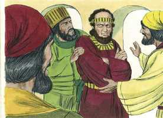
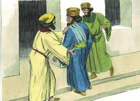
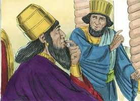
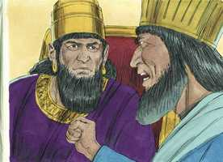
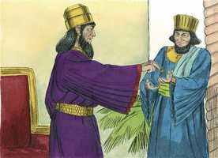

# Ester Cap 03

**1** 	DEPOIS destas coisas o rei Assuero engrandeceu a Hamã, filho de Hamedata, agagita, e o exaltou, e pôs o seu assento acima de todos os príncipes que estavam com ele.

> **Cmt MHenry**: *Vv. 1-6.* Mardoqueu nega-se a reverenciar Hamã. A religião do judeu o proíbe de dar honras com sabor de idolatria a qualquer mortal, especialmente a um homem tão mau como Hamã. Todos somos idólatras por natureza, e o "eu" é o nosso ídolo preferido. Nos comprazemos quando tratados como se tudo estivesse a nossa disposição. Ainda que a religião não se oponha em absoluto aos bons modos e ensine a render honras a quem é devido, contudo, o cidadão de Sião despreza não somente em seu coração, mas a seus olhos, alguém tão vil como Hamã (SI 15.4). O verdadeiro crente não pode obedecer a decretos, nem conformar-se com as normas que infringem as leis de Deus. Deve antes obedecer ao Senhor que aos homens, e deixar em suas mãos as conseqüências. Hamã estava totalmente enfurecido, seu desígnio foi inspirado pelo espírito mau, homicida desde o princípio, cuja inimizade contra Cristo e sua Igreja governa a todos os seus filhos.

 

**2** 	E todos os servos do rei, que estavam à porta do rei, se inclinavam e se prostravam perante Hamã; porque assim tinha ordenado o rei acerca dele; porém Mardoqueu não se inclinava nem se prostrava.

 

**3** 	Então os servos do rei, que estavam à porta do rei, disseram a Mardoqueu: Por que transgrides o mandado do rei?

> **Cmt MHenry**: *[Ester 3](../17A-Et/03.md#0)*

 

**4** 	Sucedeu, pois, que, dizendo-lhe eles isto, dia após dia, e não lhes dando ele ouvidos, o fizeram saber a Hamã, para verem se as palavras de Mardoqueu se sustentariam, porque ele lhes tinha declarado que era judeu.

 

**5** 	Vendo, pois, Hamã que Mardoqueu não se inclinava nem se prostrava diante dele, Hamã se encheu de furor.

**6** 	Porém teve como pouco, nos seus propósitos, o pôr as mãos só em Mardoqueu (porque lhe haviam declarado de que povo era Mardoqueu); Hamã, pois, procurou destruir a todos os judeus, o povo de Mardoqueu, que havia em todo o reino de Assuero.

 

**7** 	No primeiro mês (que é o mês de Nisã), no ano duodécimo do rei Assuero, se lançou Pur, isto é, a sorte, perante Hamã, para cada dia, e para cada mês, até ao duodécimo mês, que é o mês de Adar.

> **Cmt MHenry**: *Vv. 7-15.* Sem saber algo do coração humano e da historia da humanidade, não imaginaríamos que um príncipe pudesse consentir com uma proposta tão horrenda e nociva para ele mesmo. Agradeçamos a Deus pelos governos bons e justos. Hamã consulta, conforme suas próprias superstições, para achar um dia de sorte para realizar o massacre decretado! A sabedoria de Deus cumpre seus propósitos por intermédio das atitudes néscias dos homens. Hamã apelou para a sorte, e a sorte, ao demorar a sua execução, dá um juízo contra ele mesmo. O sucesso explica a doutrina de uma providência particular que rege todos os assuntos dos homens, e o cuidado de Deus por sua Igreja. Hamã temeu que a consciência do rei o golpearia pelo que havia feito; então, o manteve bêbado, para impedi-lo. Este método maldito é o que muitos seguem para afogar as condenações e endurecer com pecado seus corações e os corações dos demais. Tudo parecia seguir um curso favorável para que o projeto fosse cumprido; porém, ainda que seja permitido que os pecadores cheguem até a um ponto para o qual se encaminham, há uma providência invisível poderosa, que os obriga a voltar atrás. Quão vãos e desprezíveis são os ataques mais fortes contra Jeová! Se Hamã houvesse conseguido o que desejava, e a nação judaica tivesse perecido, o que teria acontecido com as promessas? como teriam se cumprido as profecias acerca do Salvador e Redentor do mundo? Assim, pois, o próprio pacto eterno podería falhar se este projeto diabólico houvesse tido êxito. "

**8** 	E Hamã disse ao rei Assuero: Existe espalhado e dividido entre os povos em todas as províncias do teu reino um povo, cujas leis são diferentes das leis de todos os povos, e que não cumpre as leis do rei; por isso não convém ao rei deixá-lo ficar.

 

**9** 	Se bem parecer ao rei, decrete-se que os matem; e eu porei nas mãos dos que fizerem a obra dez mil talentos de prata, para que entrem nos tesouros do rei.

 

**10** 	Então tirou o rei o anel da sua mão, e o deu a Hamã, filho de Hamedata, agagita, adversário dos judeus.

 

**11** 	E disse o rei a Hamã: Essa prata te é dada como também esse povo, para fazeres dele o que bem parecer aos teus olhos.

**12** 	Então chamaram os escrivães do rei no primeiro mês, no dia treze do mesmo e, conforme a tudo quanto Hamã mandou, se escreveu aos príncipes do rei, e aos governadores que havia sobre cada província, e aos líderes, de cada povo; a cada província segundo a sua escrita, e a cada povo segundo a sua língua; em nome do rei Assuero se escreveu, e com o anel do rei se selou.

  

**13** 	E enviaram-se as cartas por intermédio dos correios a todas as províncias do rei, para que destruíssem, matassem, e fizessem perecer a todos os judeus, desde o jovem até ao velho, crianças e mulheres, em um mesmo dia, a treze do duodécimo mês (que é o mês de Adar), e que saqueassem os seus bens.

**14** 	Uma cópia do despacho que determinou a divulgação da lei em cada província, foi enviada a todos os povos, para que estivessem preparados para aquele dia.

**15** 	Os correios, pois, impelidos pela palavra do rei, saíram, e a lei se proclamou na fortaleza de Susã. E o rei e Hamã se assentaram a beber, porém a cidade de Susã estava confusa.

> **Cmt MHenry** Intro: *Versículos 1-6: Hamã procura destruir aos judeus; 7-15: Ele consegue um decreto contra os judeus.*