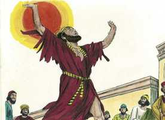
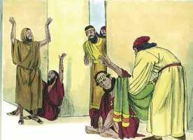
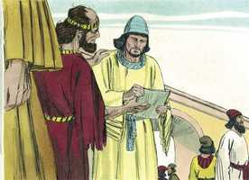
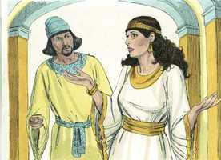
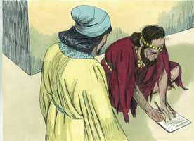
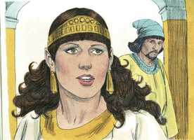

# Ester Cap 04

**1** 	QUANDO Mardoqueu soube tudo quanto se havia passado, rasgou as suas vestes, e vestiu-se de saco e de cinza, e saiu pelo meio da cidade, e clamou com grande e amargo clamor;

> **Cmt MHenry**: *Vv. 1-4.* Mardoqueu confessa a sua relação com os judeus. As calamidades públicas que oprimem a Igreja devem afetar nosso coração mais que qualquer aflição pessoal. Deus protegerá os que estão expostos ao mal pela ternura de suas consciências.

 

**2** 	E chegou até diante da porta do rei, porque ninguém vestido de saco podia entrar pelas portas do rei.

**3** 	E em todas as províncias aonde a palavra do rei e a sua lei chegava, havia entre os judeus grande luto, com jejum, e choro, e lamentação; e muitos estavam deitados em saco e em cinza.

**4** 	Então vieram as servas de Ester, e os seus camareiros, e fizeram-na saber, do que a rainha muito se doeu; e mandou roupas para vestir a Mardoqueu, e tirar-lhe o pano de saco; porém ele não as aceitou.

> **Cmt MHenry**: *[Ester 4](../17A-Et/04.md#0)*

 

**5** 	Então Ester chamou a Hatá (um dos camareiros do rei, que este tinha posto para servi-la), e deu-lhe ordem para ir a Mardoqueu, para saber que era aquilo, e porquê.

> **Cmt MHenry**: *Vv. 5-17.* Somos dados a retroceder diante dos serviços que trazem consigo perigos ou perdas. Porém, quando demandam a causa de Cristo e de seu povo, devemos tomar a cruz e segui-lo. Os cristãos devem levar a sua culpa quando se dispõem a consultar primeiro o seu próprio conforto ou segurança antes do bem público. A lei era expressa; todos a conheciam. Não é assim na corte do Rei dos reis: podemos nos aproximar do estrado do trono de sua graça, com a segurança de uma resposta de paz para a oração da fé. somos bem-vindos ao Lugar santíssimo pelo sangue de Jesus. A providência divina dispôs o rei de tal maneira que seus afetos se renovaram para com Ester; a fé e a coragem dela enfrentaram uma prova mais dura; e a bondade de Deus, expressa no favor que agora encontrou por parte do rei, brilharia ainda mais. sem duvida, Ester corria o risco de perder a vida, ao chegar até a presença do rei sem ser chamada. Mardoqueu, porém, argumentou que aquela era uma causa que de uma ou de outra maneira seria levada a cabo; portanto, ela podería arriscar-se com segurança. Esta era a linguagem de uma fé firme, que não vacila diante da promessa, quando o perigo se mostra mais ameaçador, crê com esperança contra todas as expectativas. O que salva a sua vida com artifícios pecaminosos, sem encomendá-la a Deus na senda do dever, irá perdê-la na senda do pecado. Deus providenciou para que Ester fosse rainha. Em conseqüência, ela está ligada por gratidão a prestar este serviço a Deus e à sua religião; caso contrário, não correspondería à finalidade de haver sido elevada a esta alta posição. Há sábio conselho e desígnio em todas as providências de Deus, que demonstram haver sido concebidas para o bem de sua Igreja, cada um de nós deve considerar para que propósito Deus nos tem colocado no lugar em que estamos, e meditar em nossa resposta a este objetivo, e cuidar de não deixá-lo resvalar. Depois de havermos solenemente encomendado nossa alma e nossa causa a Deus, podemos nos dedicar a servi-lo. Todos os perigos são triviais quando comparados ao perigo de perder a nossa alma. Porém, muitas vezes o pecador, trêmulo, teme lançar-se sem reservas à gratuita misericórdia do Senhor, como Ester temia apresentar-se diante do rei. Dedique-se como ela fez, com fervorosa oração e súplicas, e saiba que a sua vida irá tão bem ou ainda melhor do que foi a dela. A causa de Deus deve prevalecer, e estaremos a salvo se estivermos unidos a ela.

**6** 	E, saindo Hatá a Mardoqueu, à praça da cidade, que estava diante da porta do rei,

**7** 	Mardoqueu lhe fez saber tudo quanto lhe tinha sucedido; como também a soma exata do dinheiro, que Hamã dissera que daria para os tesouros do rei, pelos judeus, para destruí-los.

 

**8** 	Também lhe deu a cópia da lei escrita, que se publicara em Susã, para os destruir, para que a mostrasse a Ester, e a fizesse saber; e para lhe ordenar que fosse ter com o rei, e lhe pedisse e suplicasse na sua presença pelo seu povo.

**9** 	Veio, pois, Hatá, e fez saber a Ester as palavras de Mardoqueu.

**10** 	Então falou Ester a Hatá, mandando-o dizer a Mardoqueu:

**11** 	Todos os servos do rei, e o povo das províncias do rei, bem sabem que todo o homem ou mulher que chegar ao rei no pátio interior, sem ser chamado, não há senão uma sentença, a de morte, salvo se o rei estender para ele o cetro de ouro, para que viva; e eu nestes trinta dias não tenho sido chamada para ir ao rei.

 

**12** 	E fizeram saber a Mardoqueu as palavras de Ester.

**13** 	Então Mardoqueu mandou que respondessem a Ester: Não imagines no teu íntimo que, por estares na casa do rei, escaparás só tu entre todos os judeus.

 

**14** 	Porque, se de todo te calares neste tempo, socorro e livramento de outra parte sairá para os judeus, mas tu e a casa de teu pai perecereis; e quem sabe se para tal tempo como este chegaste a este reino?

**15** 	Então disse Ester que tornassem a dizer a Mardoqueu:

**16** 	Vai, ajunta a todos os judeus que se acharem em Susã, e jejuai por mim, e não comais nem bebais por três dias, nem de dia nem de noite, e eu e as minhas servas também assim jejuaremos. E assim irei ter com o rei, ainda que não seja segundo a lei; e se perecer, pereci.

 

**17** 	Então Mardoqueu foi, e fez conforme a tudo quanto Ester lhe ordenou.

> **Cmt MHenry** Intro: *Versículos 1-4: Os judeus lamentam seu perigo; 5-17: Ester se propõe a interceder pelos judeus.*