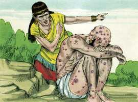
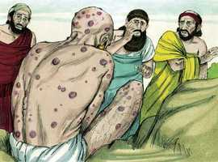
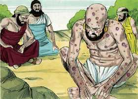

# Jó Cap 02

**1** 	E, VINDO outro dia, em que os filhos de Deus vieram apresentar-se perante o Senhor, veio também Satanás entre eles, apresentar-se perante o Senhor.

> **Cmt MHenry**: *Vv. 1-6.* Quão bom é para nós que nem os homens nem o Diabo sejam nossos juizes, mas que todo nosso julgamento venha do Senhor, que nunca erra. Jó luta firmemente em defesa de sua integridade, como sua arma. Deus fala com prazer do poder de sua própria graça. O amor e a conservação de si mesmo são mui fortes nos corações humanos. Porém, Satanás acusa Jó, e apresenta-o como egoísta, sem que nada lhe importe, salvo o seu próprio bem estar e segurança. Deste mesmo modo o povo de Deus e os seus caminhos são freqüente e falsamente acusados pelo Diabo e seus agentes. E dada permissão a Satanás para que faça provas, mas com limites. Se Deus não nos desse poder contra o que ruge como leão, quão prontamente ele nos devoraria! Jó, caluniado dessa maneira por Satanás, foi um tipo de Cristo, cuja primeira profecia foi que Satanás lhe feriria o calcanhar, mas seria aniquilado.

**2** 	Então o Senhor disse a Satanás: Donde vens? E respondeu Satanás ao Senhor, e disse: De rodear a terra, e passear por ela.

> **Cmt MHenry**: *[Jó 2](../18A-Jo/02.md#0)*

**3** 	E disse o Senhor a Satanás: Observaste o meu servo Jó? Porque ninguém há na terra semelhante a ele, homem íntegro e reto, temente a Deus e que se desvia do mal, e que ainda retém a sua sinceridade, havendo-me tu incitado contra ele, para o consumir sem causa.

**4** 	Então Satanás respondeu ao Senhor, e disse: Pele por pele, e tudo quanto o homem tem dará pela sua vida.

 

**5** 	Porém estende a tua mão, e toca-lhe nos ossos, e na carne, e verás se não blasfema contra ti na tua face!

**6** 	E disse o Senhor a Satanás: Eis que ele está na tua mão; porém guarda a sua vida.

**7** 	Então saiu Satanás da presença do Senhor, e feriu a Jó de úlceras malignas, desde a planta do pé até ao alto da cabeça.

> **Cmt MHenry**: *Vv. 7-10.* O Diabo tenta os seus próprios adeptos, leva-os a pecar e atormenta-os logo depois de tê-los levado à ruína, mas atormentou também a este filho de Deus, e tentou-o para que ele se comportasse de maneira má em sua aflição. Ele provocou Jó a amaldiçoar a Deus, mas não obteve êxito. A enfermidade de Jó era muito dolorosa. Se em algum momento somos provados com doenças penosas e doloridas, não creiamos que seremos tratados de maneira diferente da que o Senhor Deus às vezes trata o melhor de seus santos e servos. Jó humilhou-se debaixo da poderosa mão de Deus e nivelou sua mente ao seu estado. Satanás ainda procura tirar os homens da presença de Deus, como fez com os nossos primeiros pais, a fim de provocá-los com pensamentos de tentação. Nós, criaturas culpáveis e contaminadas, recebemos tantas bênçãos imerecidas de um Deus santo e justo, mas recusamo-nos a aceitar o castigo de nossos pecados quando sofremos muito menos do que merecemos. Acabemos de uma vez por todas com as queixas, como também com a soberba. Até agora Jó tem suportado a prova e apresentou-se mais brilhante no forno da aflição. Podem ter brotado muitos focos de corrupção em seu coração, mas a graça sempre venceu.

 

**8** 	E Jó tomou um caco para se raspar com ele; e estava assentado no meio da cinza.

**9** 	Então sua mulher lhe disse: Ainda reténs a tua sinceridade? Amaldiçoa a Deus, e morre.

 

**10** 	Porém ele lhe disse: Como fala qualquer doida, falas tu; receberemos o bem de Deus, e não receberíamos o mal? Em tudo isto não pecou Jó com os seus lábios.

**11** 	Ouvindo, pois, três amigos de Jó todo este mal que tinha vindo sobre ele, vieram cada um do seu lugar: Elifaz o temanita, e Bildade o suíta, e Zofar o naamatita; e combinaram condoer-se dele, para o consolarem.

> **Cmt MHenry**: *Vv. 11-13.* Os amigos de Jó pareciam ser pessoas notáveis por sua sabedoria e piedade, bem como por sua classe social. Grande parte dos consolos desta vida está fundamentada na amizade com o prudente e virtuoso. Os amigos de Jó, quando foram lamentar-se com ele, manifestaram a pena que realmente sentiam, e sentaram-se com ele para consolá-lo. Parece que suspeitavam que seus problemas sem precedentes eram juízos por delitos que ele, Jó, escondera sob a sua professa santidade. Muitos consideram que é um gesto amável visitar os amigos afligidos; porém, devemos considerar isto como um dever: se a verdadeira religião vive no coração, isto será um fruto da vida. E se o exemplo dos amigos de Jó não bastarem para nos levar a compadecermo- nos do aflito, busquemos ter a mente de Cristo.

 

**12** 	E, levantando de longe os seus olhos, não o conheceram; e levantaram a sua voz e choraram, e rasgaram cada um o seu manto, e sobre as suas cabeças lançaram pó ao ar.

 

**13** 	E assentaram-se com ele na terra, sete dias e sete noites; e nenhum lhe dizia palavra alguma, porque viam que a dor era muito grande.

 

> **Cmt MHenry** Intro: *Versículos 1-6. Satanás consegue permissão para provar a Jó;* 7­*10: Os sofrimentos deJó; 11-13: Seus amigos vêm consolá-lo.*