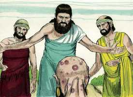

# Jó Cap 04

**1** 	ENTÃO respondeu Elifaz o temanita, e disse:

> **Cmt MHenry**: *Vv. 1-6.* Satanás tentou provar que Jó era um hipócrita, através da aflição. E seus amigos, ao notarem quão aflito ele estava e que se mostrava impaciente, concluíram que realmente era um hipócrita. Devemos ter isto em mente, para entendermos o que aconteceu. Elifaz fala de Jó e de sua aflição com ternura; porém, acusa-o de fraqueza e de ter o coração covarde. Os homens são muito estritos com aqueles que ensinam aos demais, e mesmo os amigos mais piedosos podem considerar como um simples arranhão o que sentimos seruma ferida. Aprendamos a desviar o pensamento do que sofre, para que não remoa a sua aflição, e olhe para o Deus das misericórdias em suas dores. E isto só pode ser bem feito quando se olha para Jesus Cristo, em cujos sofrimentos inigualáveis todo o filho de Deus aprende a esquecer os seus próprios sofrimentos rapidamente.

**2** 	Se intentarmos falar-te, enfadar-te-ás? Mas quem poderia conter as palavras?

 

**3** 	Eis que ensinaste a muitos, e tens fortalecido as mãos fracas.

**4** 	As tuas palavras firmaram os que tropeçavam e os joelhos desfalecentes tens fortalecido.

> **Cmt MHenry**: *[Jó 4](../18A-Jo/04.md#0)*

**5** 	Mas agora, que se trata de ti, te enfadas; e tocando-te a ti, te perturbas.

**6** 	Porventura não é o teu temor de Deus a tua confiança, e a tua esperança a integridade dos teus caminhos?

**7** 	Lembra-te agora qual é o inocente que jamais pereceu? E onde foram os sinceros destruídos?

> **Cmt MHenry**: *Vv. 7-11.* Elifaz argumenta: - Os homens bons nunca sofreram uma ruína como a de Jó. O mesmo sucede ao justo e ao ímpio ([Ec 9.2](../21A-Ec/09.md#2)), na vida e na morte; a grande e certa diferença está depois da morte. Os nossos piores erros acontecem porque tiramos más conclusões. - Os maus costumam ser arruinados da seguinte maneira: para prová-lo, Elifaz apresenta a sua própria observação. Podemos ver o mesmo a cada dia.

**8** 	Segundo eu tenho visto, os que lavram iniqüidade, e semeiam mal, segam o mesmo.

**9** 	Com o hálito de Deus perecem; e com o sopro da sua ira se consomem.

**10** 	O rugido do leão, e a voz do leão feroz, e os dentes dos leõezinhos se quebram.

**11** 	Perece o leão velho, porque não tem presa; e os filhos da leoa andam dispersos.

**12** 	Uma coisa me foi trazida em segredo; e os meus ouvidos perceberam um sussurro dela.

> **Cmt MHenry**: *Vv. 12-21.* Elifaz narra uma visão: Quando estamos em comunhão com nossos corações, e calados ([sl 4.4](../19A-Sl/04.md#4)), o Espírito santo tem comunhão conosco. Esta visão traz-lhe um medo muito grande. Desde que o homem pecou, tem sido terrível para ele receber uma mensagem do céu, consciente de que não pode esperar boas noticias de lá. Homem pecador! Pretenderás ser mais justo e mais puro do que Deus, o qual, por ser teu Criador, é teu Senhor e Dono? Quão horrível então é o orgulho e a presunção do homem! E quão grande é a paciência de Deus. Observai um homem em sua vida! O mesmo fundamento desta casa de barro na qual o homem habita, está no pó, e afundar-se-á sob o seu próprio peso. Nós nos sustentamos sobre pó e nada mais. Alguns têm uma quantidade maior de pó sobre a qual se firmam, de maneira que ultrapassam aos demais; porém, sempre será terra, o que nos sustém e em pouco tempo nos tragará. O homem é prontamente ferido; não resistirá se alguma doença persistente, que consuma como traça, vier a destruí-lo. Esta classe de criaturas deve culpar a Deus por seus desígnios? Observe um homem em sua morte. A vida é curta e em pouco tempo os homens são cortados. Beleza, força e sabedoria não podem livrá-lo da morte, pois estas coisas também morrem com ele; tampouco a pompa, a riqueza e o poder continuam depois deles. Uma criatura pecadora, moribunda e fraca pretenderá ser mais justa que Deus, e mais pura que seu Criador? Não: ao invés de amargurar as suas aflições, deve se maravilhar de não estar no inferno. Pode um homem ser limpo sem seu Criador? Deus justificará aos mortais pecadores, e os limpará da culpa? Ou o fará sem que eles tenham interesse na justiça e na bondosa ajuda de seu prometido Redentor, quando até um grupo de anjos, que foram espíritos ministradores, diante de seu trono receberam a justa recompensa por seus pecados? Apesar da aparente impunidade dos homens por curto tempo, ainda que vivam sem Deus no mundo, sua condenação é tão certa como a dos anjos caídos, contudo, os pecadores negligentes estão tão despercebidos que não esperam a mudança, nem são sábios para considerar o seu fim.

**13** 	Entre pensamentos vindos de visões da noite, quando cai sobre os homens o sono profundo,

**14** 	Sobrevieram-me o espanto e o tremor, e todos os meus ossos estremeceram.

**15** 	Então um espírito passou por diante de mim; fez-me arrepiar os cabelos da minha carne.

**16** 	Parou ele, porém não conheci a sua feição; um vulto estava diante dos meus olhos; houve silêncio, e ouvi uma voz que dizia:

**17** 	Seria porventura o homem mais justo do que Deus? Seria porventura o homem mais puro do que o seu Criador?

**18** 	Eis que ele não confia nos seus servos e aos seus anjos atribui loucura;

**19** 	Quanto menos àqueles que habitam em casas de lodo, cujo fundamento está no pó, e são esmagados como a traça!

**20** 	Desde a manhã até à tarde são despedaçados; e eternamente perecem sem que disso se faça caso.

**21** 	Porventura não passa com eles a sua excelência? Morrem, mas sem sabedoria.

> **Cmt MHenry** Intro: *Versículos 1-6. Elifaz repreende a Jó; 7-11: Ele afirma que os juízos de Deus são para os ímpios; 12-21: A visão de Elifaz.*