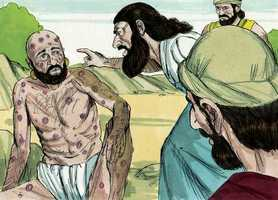

# Jó Cap 15

**1** 	ENTÃO respondeu Elifaz o temanita, e disse:

> **Cmt MHenry**: *Vv. 1-16.* Elifaz inicia um segundo ataque a Jó, em lugar de abrandar-se com suas queixas. Ele acusa injustamente o amigo de abandonar o temor de Deus e toda a consideração para com Ele: e de reprimir a oração. Observe no que se resume a religião: temer a Deus e orar a Ele; o primeiro é o princípio mais necessário; e o ultimo, o costume mais necessário. Elifaz acusa Jó de enganar-se a si mesmo. Acusa-o de desprezar os conselhos e consolos dados por seus amigos, somos propensos a pensar que o que dizemos é o mais importante, quando todos os demais às vezes o consideram como algo de pouca importância com toda a razão, Ele o acusa de opor-se a Deus. Elifaz não deveria ter interpretado duramente as palavras de alguém bem conhecido como piedoso, e que agora se encontrava em tentação. Claro que estes causadores de polêmicas estavam profundamente convencidos da doutrina errônea do pecado original, e da depravação total da natureza humana. Não devemos admirar a paciência de Deus para nos suportar? E ainda mais seu amor por nós através da redenção de Cristo Jesus, seu Amado Filho?

**2** 	Porventura proferirá o sábio vã sabedoria? E encherá do vento oriental o seu ventre,

 

**3** 	Argüindo com palavras que de nada servem, e com razões, de que nada aproveita?

**4** 	E tu tens feito vão o temor, e diminuis os rogos diante de Deus.

**5** 	Porque a tua boca declara a tua iniqüidade; e tu escolhes a língua dos astutos.

**6** 	A tua boca te condena, e não eu, e os teus lábios testificam contra ti.

**7** 	És tu porventura o primeiro homem que nasceu? Ou foste formado antes dos outeiros?

**8** 	Ou ouviste o secreto conselho de Deus e a ti só limitaste a sabedoria?

**9** 	Que sabes tu, que nós não saibamos? Que entendes, que não haja em nós?

**10** 	Também há entre nós encanecidos e idosos, muito mais idosos do que teu pai.

**11** 	Porventura fazes pouco caso das consolações de Deus, e da suave palavra que te dirigimos?

**12** 	Por que te arrebata o teu coração, e por que piscam os teus olhos?

**13** 	Para virares contra Deus o teu espírito, e deixares sair tais palavras da tua boca?

**14** 	Que é o homem, para que seja puro? E o que nasce da mulher, para ser justo?

**15** 	Eis que ele não confia nos seus santos, e nem os céus são puros aos seus olhos.

> **Cmt MHenry**: *[Jó 15](../18A-Jo/15.md#0)*

**16** 	Quanto mais abominável e corrupto é o homem que bebe a iniqüidade como a água?

**17** 	Escuta-me, mostrar-te-ei; e o que tenho visto te contarei

> **Cmt MHenry**: *Vv. 17-35.* Elifaz sustenta que os maus certamente são desgraçados, e infere-se que os desgraçados são certamente maus; portanto, Jó o era. Porém, devido ao fato de que muitos dentre o povo de Deus têm prosperado neste mundo, não significa que aqueles iracundos e empobrecidos, como Jó, não sejam povo de Deus. Elifaz também destaca que os homens maus, particularmente os opressores, estão sujeitos ao terror contínuo, vivem desconfortavelmente e perecem miseráveis. A prosperidade dos pecadores presunçosos terminará miseravelmente, como aqui é descrito? Então, que as calamidades que recaem sobre os demais sejam advertências para nós. Ainda que no presente nenhuma disciplina pareça ser motivo de gozo, mas penosa, posteriormente produzirá os frutos aprazíveis da justiça nos exercitados por ela. Nenhuma calamidade ou transtorno, por mais duro e severo que seja, pode tirar o favor do Senhor de algum de seus seguidores. O que nos separará do amor de Cristo?

**18** 	(O que os sábios anunciaram, ouvindo-o de seus pais, e o não ocultaram;

**19** 	Aos quais somente se dera a terra, e nenhum estranho passou por entre eles):

**20** 	Todos os dias o ímpio é atormentado, e se reserva, para o tirano, um certo número de anos.

**21** 	O sonido dos horrores está nos seus ouvidos; até na paz lhe sobrevém o assolador.

**22** 	Não crê que tornará das trevas, mas que o espera a espada.

**23** 	Anda vagueando por pão, dizendo: Onde está? Bem sabe que já o dia das trevas lhe está preparado, à mão.

**24** 	Assombram-no a angústia e a tribulação; prevalecem contra ele, como o rei preparado para a peleja;

**25** 	Porque estendeu a sua mão contra Deus, e contra o Todo-Poderoso se embraveceu.

**26** 	Arremete contra ele com a dura cerviz, e contra os pontos grossos dos seus escudos.

**27** 	Porquanto cobriu o seu rosto com a sua gordura, e criou gordura nas ilhargas.

**28** 	E habitou em cidades assoladas, em casas em que ninguém morava, que estavam a ponto de fazer-se montões de ruínas.

**29** 	Não se enriquecerá, nem subsistirá a sua fazenda, nem se estenderão pela terra as suas possessões.

**30** 	Não escapará das trevas; a chama do fogo secará os seus renovos, e ao sopro da sua boca desaparecerá.

**31** 	Não confie, pois, na vaidade, enganando-se a si mesmo, porque a vaidade será a sua recompensa.

**32** 	Antes do seu dia ela se consumará; e o seu ramo não reverdecerá.

**33** 	Sacudirá as suas uvas verdes, como as da vide, e deixará cair a sua flor como a oliveira,

**34** 	Porque a congregação dos hipócritas se fará estéril, e o fogo consumirá as tendas do suborno.

**35** 	Concebem a malícia, e dão à luz a iniqüidade, e o seu ventre prepara enganos.

> **Cmt MHenry** Intro: *Versículos 1-16. Elifaz repreende a Jó; 17-35: A inquietude dos homens ímpios.*