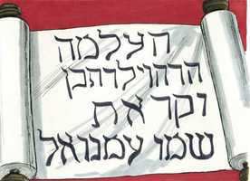

# Isaías Cap 07

**1** 	SUCEDEU, pois, nos dias de Acaz, filho de Jotão, filho de Uzias, rei de Judá, que Rezim, rei da Síria, e Peca, filho de Remalias, rei de Israel, subiram a Jerusalém, para pelejarem contra ela, mas nada puderam contra ela.

> **Cmt MHenry**: *Vv. 1-9.* Os ímpios costumam ser castigados por outros tão maus quanto eles. Estando em grande angústia e confusão, os judeus consideraram tudo como perdido. Haviam feito de Deus seu inimigo e não sabiam como torná-lo amigo. O profeta deveria ensiná-los a desprezar os seus inimigos tendo fé em Deus e dependendo dEle. Acaz, temeroso, disse que eram dois poderosos príncipes, e o profeta lhe disse que eles eram apenas pedaços de tições fumegantes, já queimados. Os reinos da Síria e Israel estavam quase acabados. Enquanto Deus tem trabalho para os tições da terra, eles consomem tudo o que existe diante de si; porém, quando Deus houver completado seu trabalho, serão extintos como fumaça. Aquilo que Acaz considerava formidável, tornou-se o terreno de derrota deles, porque eles têm seguido maus conselhos contra o Senhor, o que é uma ofensa a Deus, que zomba dos escamecedores, e empenha a sua Palavra dizendo que tal intento não triunfará, o homem propõe, mas é Deus quem determina. Era uma atitude néscia que aqueles que estavam próximos da destruição, estivessem procurando arruinar o seu próximo. Isaias deve insistir com os judeus para que confiem nas seguranças dadas a eles. A fé é absolutamente necessária para aquietar e compor a mente que passa por provas.

**2** 	E deram aviso à casa de Davi, dizendo: A Síria fez aliança com Efraim. Então se moveu o seu coração, e o coração do seu povo, como se movem as árvores do bosque com o vento.

**3** 	Então disse o Senhor a Isaías: Agora, tu e teu filho Sear-Jasube, saí ao encontro de Acaz, ao fim do canal do tanque superior, no caminho do campo do lavandeiro.

**4** 	E dize-lhe: Acautela-te, e aquieta-te; não temas, nem se desanime o teu coração por causa destes dois pedaços de tições fumegantes; por causa do ardor da ira de Rezim, e da Síria, e do filho de Remalias.

**5** 	Porquanto a Síria teve contra ti maligno conselho, com Efraim, e com o filho de Remalias, dizendo:

**6** 	Vamos subir contra Judá, e molestemo-lo e repartamo-lo entre nós, e façamos reinar no meio dele o filho de Tabeal.

**7** 	Assim diz o Senhor Deus: Isto não subsistirá, nem tampouco acontecerá.

> **Cmt MHenry**: *[Isaías 7](../23A-Is/07.md#0)*

**8** 	Porém a cabeça da Síria será Damasco, e a cabeça de Damasco Rezim; e dentro de sessenta e cinco anos Efraim será destruído, e deixará de ser povo.

**9** 	Entretanto a cabeça de Efraim será Samaria, e a cabeça de Samaria o filho de Remalias; se não o crerdes, certamente não haveis de permanecer.

**10** 	E continuou o Senhor a falar com Acaz, dizendo:

> **Cmt MHenry**: *Vv. 10-16.* A secreta falta de afeto para com Deus costuma ser disfarçada com o calor do respeito por Ele. E aqueles que estão resolvidos a não confiar em Deus ainda imaginam que não o tentarão, o profeta repreende Acaz e a sua corte pelo pouco valor que dão à revelação divina. Nada é mais triste para Deus do que a desconfiança; porém, a incredulidade do homem não invalidará a promessa de Deus; o próprio Senhor dará o sinal. Por maior que fosse a sua angústia e perigo, dos judeus nascerá o Messias, e não poderíam ser destruídos enquanto esta bênção estivesse com eles. Acontecerá de maneira gloriosa; e as consolações mais fortes nos tempos de problemas provêm de Cristo; nossa relação com Ele, nosso interesse nEle, nossas expectativas em relação a Ele e da parte dEle. Crescería como as demais crianças, através do uso da dieta destes países; mas ao contrário das outras crianças, recusaria o mal e escolheria o bem de maneira coerente. Ainda que o seu nascimento seria pelo poder do Espírito Santo, de todo modo, Ele não seria nutrido com a comida dos anjos. Então segue um sinal da pronta destruição dos príncipes, agora terror para Judá. "Antes que este menino", leia, "este menino que agora tenho em meus braços" (sear-jasube, o filho do profeta, versículo 3), tenha três ou quatro anos de idade, estas forças inimigas serão abandonadas por ambos reis. A profecia é solene e marcante, como dado pelo próprio Deus; porém, depois Acaz recusa a oferta, que deve haver suscitado esperanças muito além do que sugeria a ocasião presente. E se a perspectiva da vinda do salvador divino era um apoio que nunca falha para as esperanças dos crentes antigos, que razão temos para agradecer que a Palavra tenha sido feita carne! Confiemos nEle, amemo- lo e imitemos o seu exemplo.

**11** 	Pede para ti ao Senhor teu Deus um sinal; pede-o, ou em baixo nas profundezas, ou em cima nas alturas.

**12** 	Acaz, porém, disse: Não pedirei, nem tentarei ao Senhor.

**13** 	Então ele disse: Ouvi agora, ó casa de Davi: Pouco vos é afadigardes os homens, senão que também afadigareis ao meu Deus?

**14** 	Portanto o mesmo Senhor vos dará um sinal: Eis que a virgem conceberá, e dará à luz um filho, e chamará o seu nome Emanuel.

 

**15** 	Manteiga e mel comerá, quando ele souber rejeitar o mal e escolher o bem.

**16** 	Na verdade, antes que este menino saiba rejeitar o mal e escolher o bem, a terra, de que te enfadas, será desamparada dos seus dois reis.

**17** 	Porém o Senhor fará vir sobre ti, e sobre o teu povo, e sobre a casa de teu pai, pelo rei da Assíria, dias tais, quais nunca vieram, desde o dia em que Efraim se separou de Judá.

> **Cmt MHenry**: *Vv. 17-25.* Os que não querem crer nas promessas de Deus esperam ouvir o alarme de suas ameaças, porque ninguém pode resistir ou escapar dos seus juízos, o Senhor eliminará tudo e pagará aqueles que tem empregado em qualquer serviço para Ele. Tudo fala sobre uma triste mudança na face desta terra agradável, pois o pecado a realiza em qualquer povo. A agricultura terminaria, e penas de todos os tipos sobrevirão a todos os que desprezam a grande salvação. Se continuarmos sob os meios da graça sem dar frutos, o Senhor dirá: Nunca mais nasça de ti fruto, de agora em diante, e para sempre. "

**18** 	Porque há de acontecer que naquele dia assobiará o Senhor às moscas, que há no extremo dos rios do Egito, e às abelhas que estão na terra da Assíria;

**19** 	E todas elas virão, e pousarão nos vales desertos e nas fendas das rochas, e em todos os espinheiros e em todos os arbustos.

**20** 	Naquele mesmo dia rapará o Senhor com uma navalha alugada, que está além do rio, isto é, com o rei da Assíria, a cabeça e os cabelos dos pés; e até a barba totalmente tirará.

**21** 	E sucederá naquele dia que um homem criará uma novilha e duas ovelhas.

**22** 	E acontecerá que por causa da abundância do leite que elas hão de dar, comerá manteiga; e manteiga e mel comerá todo aquele que restar no meio da terra.

**23** 	Sucederá também naquele dia que todo o lugar, em que houver mil vides, do valor de mil siclos de prata, será para as sarças e para os espinheiros.

**24** 	Com arco e flecha se entrará ali, porque toda a terra será sarças e espinheiros.

**25** 	E quanto a todos os montes, que costumavam cavar com enxadas, para ali não irás por causa do temor das sarças e dos espinheiros; porém servirão para se mandarem para lá os bois e para serem pisados pelas ovelhas.

> **Cmt MHenry** Intro: *Versículos 1-9: Acaz é ameaçado por Israel e pela Síria, lhe é assegurado que o ataque destes será em vão; 10-16: Deus dá um sinal seguro através da promessa do Messias ansiosamente esperado; 17-25: O pecado e a atitude néscia de se buscar socorro na Assíria, são reprovados.*