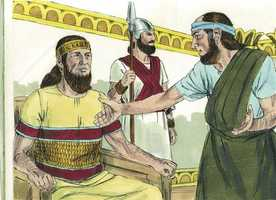
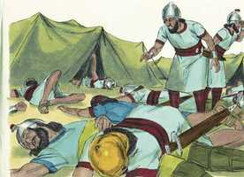
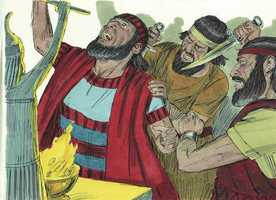

# Isaías Cap 37

**1** 	E ACONTECEU que, tendo ouvido isso, o rei Ezequias rasgou as suas vestes, e se cobriu de saco, e entrou na casa do Senhor.

**2** 	Então enviou Eliaquim, o mordomo, e Sebna, o escrivão, e os anciãos dos sacerdotes, cobertos de sacos, ao profeta Isaías, filho de Amós.

**3** 	E disseram-lhe: Assim diz Ezequias: Este dia é dia de angústia, e de vitupério, e de blasfêmias; porque chegados são os filhos ao parto, e força não há para dá-los à luz.

**4** 	Porventura o Senhor teu Deus terá ouvido as palavras de Rabsaqué, a quem o rei da Assíria, seu senhor, enviou para afrontar o Deus vivo, e para vituperá-lo com as palavras que o Senhor teu Deus tem ouvido; faze oração pelo remanescente que ficou.

**5** 	E os servos do rei Ezequias foram ter com Isaías.

**6** 	E Isaías lhes disse: Assim direis a vosso senhor: Assim diz o Senhor: Não temas à vista das palavras que ouviste, com as quais os servos do rei da Assíria me blasfemaram.

**7** 	Eis que porei nele um espírito, e ele ouvirá um rumor, e voltará para a sua terra; e fá-lo-ei cair morto à espada na sua terra.

**8** 	Voltou, pois, Rabsaqué, e achou ao rei da Assíria pelejando contra Libna; porque ouvira que já se havia retirado de Laquis.

**9** 	E, ouviu ele dizer que Tiraca, rei da Etiópia, tinha saído para lhe fazer guerra. Assim que ouviu isto, enviou mensageiros a Ezequias, dizendo:

**10** 	Assim falareis a Ezequias, rei de Judá, dizendo: Não te engane o teu Deus, em quem confias, dizendo: Jerusalém não será entregue na mão do rei da Assíria.

**11** 	Eis que já tens ouvido o que fizeram os reis da Assíria a todas as terras, destruindo-as totalmente; e escaparias tu?

**12** 	Porventura as livraram os deuses das nações que meus pais destruíram: Gozã, e Harã, e Rezefe, e os filhos de Éden, que estavam em Telassar?

**13** 	Onde está o rei de Hamate, e o rei de Arpade, e o rei da cidade de Sefarvaim, Hena e Iva?

**14** 	Recebendo, pois, Ezequias as cartas das mãos dos mensageiros, e lendo-as, subiu à casa do Senhor; e Ezequias as estendeu perante o Senhor.

 

**15** 	E orou Ezequias ao Senhor, dizendo:

**16** 	Ó Senhor dos Exércitos, Deus de Israel, que habitas entre os querubins; tu mesmo, só tu és Deus de todos os reinos da terra; tu fizeste os céus e a terra.

**17** 	Inclina, ó Senhor, o teu ouvido, e ouve; abre, Senhor, os teus olhos, e vê; e ouve todas as palavras de Senaqueribe, as quais ele enviou para afrontar o Deus vivo.

**18** 	Verdade é, Senhor, que os reis da Assíria assolaram todas as nações e suas terras.

**19** 	E lançaram no fogo os seus deuses; porque deuses não eram, senão obra de mãos de homens, madeira e pedra; por isso os destruíram.

**20** 	Agora, pois, ó Senhor nosso Deus, livra-nos da sua mão; e assim saberão todos os reinos da terra, que só tu és o Senhor.

**21** 	Então Isaías, filho de Amós, mandou dizer a Ezequias: Assim diz o Senhor Deus de Israel: Quanto ao que pediste acerca de Senaqueribe, rei da Assíria,

 

**22** 	Esta é a palavra que o Senhor falou a respeito dele: A virgem, a filha de Sião, te despreza, de ti zomba; a filha de Jerusalém meneia a cabeça por detrás de ti.

**23** 	A quem afrontaste e blasfemaste? E contra quem alçaste a voz, e ergueste os teus olhos ao alto? Contra o Santo de Israel.

**24** 	Por meio de teus servos afrontaste o Senhor, e disseste: Com a multidão dos meus carros subi eu aos cumes dos montes, aos últimos recessos do Líbano; e cortarei os seus altos cedros e as suas faias escolhidas, e entrarei na altura do seu cume, ao bosque do seu campo fértil.

**25** 	Eu cavei, e bebi as águas; e com as plantas de meus pés sequei todos os rios dos lugares sitiados.

**26** 	Porventura não ouviste que já há muito tempo eu fiz isto, e já desde os dias antigos o tinha formado? Agora porém o fiz vir, para que tu fosses o que destruísse as cidades fortificadas, e as reduzisse a montões de ruínas.

**27** 	Por isso os seus moradores, dispondo de pouca força, andaram atemorizados e envergonhados; tornaram-se como a erva do campo, e a relva verde, e o feno dos telhados, e o trigo queimado antes da seara.

**28** 	Porém eu conheço o teu assentar, e o teu sair, e o teu entrar, e o teu furor contra mim.

**29** 	Por causa do teu furor contra mim, e porque a tua arrogância subiu até aos meus ouvidos, portanto porei o meu anzol no teu nariz e o meu freio nos teus lábios, e te farei voltar pelo caminho por onde vieste.

**30** 	E isto te será por sinal: Este ano se comerá o que espontaneamente nascer, e no segundo ano o que daí proceder; porém no terceiro ano semeai e segai, e plantai vinhas, e comei os frutos delas.

**31** 	Porque o que escapou da casa de Judá, e restou, tornará a lançar raízes para baixo, e dará fruto para cima.

**32** 	Porque de Jerusalém sairá o restante, e do monte de Sião os que escaparem; o zelo do Senhor dos Exércitos fará isto.

**33** 	Portanto, assim diz o Senhor acerca do rei da Assíria: Não entrará nesta cidade, nem lançará nela flecha alguma; tampouco virá perante ela com escudo, ou levantará trincheira contra ela.

**34** 	Pelo caminho por onde vier, por esse voltará; porém nesta cidade não entrará, diz o Senhor.

**35** 	Porque eu ampararei esta cidade, para livrá-la, por amor de mim e por amor do meu servo Davi.

**36** 	Então saiu o anjo do Senhor, e feriu no arraial dos assírios a cento e oitenta e cinco mil deles; e, quando se levantaram pela manhã cedo, eis que todos estes eram corpos mortos.

 

**37** 	Assim Senaqueribe, rei da Assíria, se retirou, e se foi, e voltou, e habitou em Nínive.

> **Cmt MHenry**: *[Isaías 37](../23A-Is/37.md#0)*

**38** 	E sucedeu que, estando ele prostrado na casa de Nisroque, seu deus, Adrameleque e Sarezer, seus filhos, o feriram à espada; escaparam para a terra de Ararate; e Esar-Hadom, seu filho, reinou em seu lugar.

 

> **Cmt MHenry** Intro: *[Este capítulo é igual](#d457){.dict}* 34A-Na 43N-Joa bible-acf2007.csv bible-ara_strongs.csv bible_markdown.sh biblia-sagrada-almeida-corrigida-fiel.pdf comment-AdamOT.csv Images images-catalog.csv images-old_bible_pictures.csv Images.zip markdown2html.sh Notas Bíblia de Estudo NVI-out_images.txt Simple_Bible_Reader_v2.9-bible_converter.exe *[2 Reis 19](../12A-2Rs/19.md#0).\> 00-Pref 01A-Gn 02A-Ex 03A-Lv 04A-Nm 05A-Dt 06A-Js 07A-Jz 08A-Rt 09A-1Sm 10A-2Sm 11A-1Rs 12A-2Rs 13A-1Cr 14A-2Cr 15A-Es 16A-Ne 17A-Et 18A-Jo 19A-Sl 20A-Pv 21A-Ec 22A-Ct 23A-Is 24A-Jr 25A-Lm 26A-Ez 27A-Dn 28A-Os 29A-Jl 30A-Am 31A-Ob 32A-Jn 33A-Mq 34A-Na 35A-Hc 36A-Sf 37A-Ag 38A-Zc 39A-Ml 40N-Mt 41N-Mc 42N-Lc 43N-Joa 44N-At 45N-Rm 46N-1Co 47N-2Co 48N-Gl 49N-Ef 50N-Fp 51N-Cl 52N-1Ts 53N-2Ts 54N-1Tm 55N-2Tm 56N-Tt 57N-Fm 58N-Hb 59N-Tg 60N-1Pe 61N-2Pe 62N-1Jo 63N-2Jo 64N-3Jo 65N-Jd 66N-Ap bible-acf2007.csv bible-ara_strongs.csv bible_markdown.sh biblia-sagrada-almeida-corrigida-fiel.pdf comment-AdamOT.csv comment-McArthur.csv comment-MHenry.csv comment-NVI.csv Images images-catalog.csv images-old_bible_pictures.csv Images.zip markdown2html.sh Notas Bíblia de Estudo NVI-out_images.txt Simple_Bible_Reader_v2.9-bible_converter.exe working-comment-nvi.csv working.csv working-imgs.txt