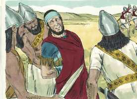

# Jeremías Cap 27

**1** 	NO princípio do reinado de Jeoiaquim, filho de Josias, rei de Judá, veio esta palavra a Jeremias da parte do Senhor, dizendo:

> **Cmt MHenry**: *Vv. 1-9.* Ananias proferiu uma falsa profecia. Aqui não há uma boa palavra de conselho, que inste para que os judeus arrependam-se e regressem a Deus. Ele promete misericórdias temporais no nome de Deus, mas não menciona as misericórdias espirituais que Deus sempre tem prometido com as bênçãos terrenas. Não era a primeira vez que Jeremias orava pelo povo, mesmo que profetizasse contra eles. Apela ao que havia feito para provar a falsidade de Ananias. O profeta falou somente de paz e prosperidade, sem acrescentar que não devem deter os favores de Deus com os seus pecados voluntários; por esta razão, é um falso profeta. Aqueles anunciam que não chamam os homens ao arrependimento, à fé e à santidade, andam nas pisadas dos falsos profetas, o Evangelho de Cristo anima os homens a fazerem obras dignas de arrependimento, porém não anima para continuarem em pecado.

**2** 	Assim me disse o Senhor: Faze uns grilhões e jugos, e põe-nos ao teu pescoço.

**3** 	E envia-os ao rei de Edom, e ao rei de Moabe, e ao rei dos filhos de Amom, e ao rei de Tiro, e ao rei de Sidom, pela mão dos mensageiros que vêm a Jerusalém a ter com Zedequias, rei de Judá.

**4** 	E lhes ordenarás, que digam aos seus senhores: Assim diz o Senhor dos Exércitos, o Deus de Israel: Assim direis a vossos senhores:

**5** 	Eu fiz a terra, o homem, e os animais que estão sobre a face da terra, com o meu grande poder, e com o meu braço estendido, e a dou a quem é reto aos meus olhos.

**6** 	E agora eu entreguei todas estas terras na mão de Nabucodonosor, rei de Babilônia, meu servo; e ainda até os animais do campo lhe dei, para que o sirvam.

**7** 	E todas as nações servirão a ele, e a seu filho, e ao filho de seu filho, até que também venha o tempo da sua própria terra, quando muitas nações e grandes reis se servirão dele.

**8** 	E acontecerá que, se alguma nação e reino não servirem o mesmo Nabucodonosor, rei de Babilônia, e não puserem o seu pescoço debaixo do jugo do rei de Babilônia, a essa nação castigarei com espada, e com fome, e com peste, diz o Senhor, até que a consuma pela sua mão;

**9** 	E vós não deis ouvidos aos vossos profetas, e aos vossos adivinhos, e aos vossos sonhos, e aos vossos agoureiros, e aos vossos encantadores, que vos falam, dizendo: Não servireis ao rei de Babilônia.

**10** 	Porque mentiras vos profetizam, para vos mandarem para longe da vossa terra, e para que eu vos expulse dela, e pereçais.

> **Cmt MHenry**: *Vv. 10-17.* Ananias é sentenciado a morrer, e Jeremias declara isto sob as ordens de Deus. Aqueles que dizem aos pecadores que terão paz, ainda que endureçam os seus corações desprezando a Palavra de Deus, têm muito a responder, o servo de Deus deve ser amável com todos os homens. Até deve ceder o seu direito e deixar que o Senhor defenda a sua causa. Todo o intento dos ímpios, por tomar os propósitos de Deus vãos, serão somados às suas misérias.

**11** 	Mas a nação que colocar o seu pescoço sob o jugo do rei de Babilônia, e o servir, eu a deixarei na sua terra, diz o Senhor, e lavrá-la-á e habitará nela.

**12** 	E falei com Zedequias, rei de Judá, conforme todas estas palavras, dizendo: Colocai os vossos pescoços no jugo do rei de Babilônia, e servi-o, a ele e ao seu povo, e vivereis.

**13** 	Por que morrerias tu e o teu povo, à espada, e à fome, e de peste, como o Senhor disse contra a nação que não servir ao rei de Babilônia?

**14** 	E não deis ouvidos às palavras dos profetas, que vos falam, dizendo: Não servireis ao rei de Babilônia; porque vos profetizam mentiras.

**15** 	Porque não os enviei, diz o Senhor, e profetizam falsamente em meu nome; para que eu vos lance fora, e pereçais, vós e os profetas que vos profetizam.

**16** 	Também falei aos sacerdotes, e a todo este povo, dizendo: Assim diz o Senhor: Não deis ouvidos às palavras dos vossos profetas, que vos profetizam, dizendo: Eis que os utensílios da casa do Senhor cedo voltarão de Babilônia, porque vos profetizam mentiras.

**17** 	Não lhes deis ouvidos, servi ao rei de Babilônia, e vivereis; por que se tornaria esta cidade em desolação?

**18** 	Porém, se são profetas, e se há palavras do Senhor com eles, orem agora ao Senhor dos Exércitos, para que os utensílios que ficaram na casa do Senhor, e na casa do rei de Judá, e em Jerusalém, não vão para a Babilônia.

**19** 	Porque assim diz o Senhor dos Exércitos acerca das colunas, e do mar, e das bases, e dos demais utensílios que ficaram na cidade,

**20** 	Os quais Nabucodonosor, rei de Babilônia, não levou, quando transportou de Jerusalém para Babilônia a Jeconias, filho de Jeoiaquim, rei de Judá, como também a todos os nobres de Judá e de Jerusalém;

**21** 	Assim, pois, diz o Senhor dos Exércitos, o Deus de Israel, acerca dos utensílios que ficaram na casa do Senhor, e na casa do rei de Judá, e em Jerusalém:

**22** 	À Babilônia serão levados, e ali ficarão até o dia em que eu os visitarei, diz o Senhor; então os farei subir, e os tornarei a trazer a este lugar.

 

> **Cmt MHenry** Intro: *[Jeremias 28](../24A-Jr/28.md#0)*> *Versículos 1-9: Um falso profeta se opõe a Jeremias; 10-17: E advertido ao falso profeta que a sua morte se aproxima.*