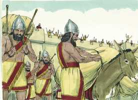
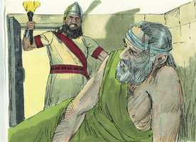

# Jeremías Cap 37

**1** 	E ZEDEQUIAS, filho de Josias, a quem Nabucodonosor, rei de Babilônia, constituiu rei na terra de Judá, reinou em lugar de Conias, filho de Jeoiaquim.

> **Cmt MHenry**: *Vv. 1-10.* Multidões presenciam os efeitos fatais dos pecados de outros homens, mas sem pensar, envolvem-se em seus caminhos e seguem o mesmo rumo destruidor. Quando estivermos angustiados, devemos desejar as orações dos ministros e as amizades cristãs. E comum as pessoas que não recebem o conselho desejarem receber oração; contudo, os pecadores costumam se endurecer novamente quando é feita uma pausa em seus juízos.

**2** 	Mas nem ele, nem os seus servos, nem o povo da terra deram ouvidos às palavras do Senhor que falou pelo ministério de Jeremias, o profeta.

**3** 	Contudo mandou o rei Zedequias a Jucal, filho de Selemias, e a Sofonias, filho de Maaséias, o sacerdote, ao profeta Jeremias, para lhe dizer: Roga agora por nós ao Senhor nosso Deus.

**4** 	E entrava e saía Jeremias entre o povo, porque não o tinham posto na prisão.

**5** 	E o exército de Faraó saíra do Egito; e quando os caldeus, que tinham sitiado Jerusalém, ouviram esta notícia, retiraram-se de Jerusalém.

 

**6** 	Então veio a Jeremias, o profeta, a palavra do Senhor, dizendo:

**7** 	Assim diz o Senhor, Deus de Israel: Assim direis ao rei de Judá, que vos enviou a mim para me consultar: Eis que o exército de Faraó, que saiu em vosso socorro, voltará para a sua terra no Egito.

**8** 	E voltarão os caldeus, e pelejarão contra esta cidade, e a tomarão, e a queimarão a fogo.

**9** 	Assim diz o Senhor: Não enganeis as vossas almas, dizendo: Sem dúvida se retirarão os caldeus de nós, pois não se retirarão.

**10** 	Porque ainda que ferísseis a todo o exército dos caldeus, que peleja contra vós, e só ficassem deles homens feridos, cada um levantar-se-ia na sua tenda, e queimaria a fogo esta cidade.

**11** 	E sucedeu que, subindo de Jerusalém o exército dos caldeus, por causa do exército de Faraó,

> **Cmt MHenry**: *Vv. 11-21.* Há momentos em que a sabedoria dos homens bons os incita a retirarem-se, entrar em seus aposentos e fechar a porta ([Is 26. 20](../23A-Is/26.md#20)). Jeremias foi preso como desertor e lançado na prisão, mas não é novidade que os melhores amigos da Igreja sejam traídos pelos interesses dos seus piores inimigos. Quando somos falsamente acusados, podemos negar a acusação e encomendar a nossa causa àquEle que julga com justiça. Jeremias alcançou misericórdia do Senhor para ser fiel, e não quis obter misericórdia do homem para não ser infiel a Deus nem ao seu príncipe; ele disse toda a verdade ao rei. Quando Jeremias entregou a mensagem de Deus, falou com ousadia, mas quando fez o seu próprio pedido, falou com submissão. O leão da causa de Deus deve ser o cordeiro da nossa. Deus concedeu favor a Jeremias diante dos olhos do rei, o Senhor Deus pode fazer que até as celas de um cárcere se convertam em pastos verdej antes para o seu povo, e levantará amigos que supram as suas necessidades, de modo que nos dias de fome sejam satisfeitos.

**12** 	Saiu Jeremias de Jerusalém, a fim de ir à terra de Benjamim, para dali se separar no meio do povo.

**13** 	Mas, estando ele à porta de Benjamim, achava-se ali um capitão da guarda, cujo nome era Jerias, filho de Selemias, filho de Hananias, o qual prendeu a Jeremias, o profeta, dizendo: Tu foges para os caldeus.

**14** 	E Jeremias disse: Isso é falso, não fujo para os caldeus. Mas ele não lhe deu ouvidos; e assim Jerias prendeu a Jeremias, e o levou aos príncipes.

**15** 	E os príncipes se iraram muito contra Jeremias, e o feriram; e puseram-no na prisão, na casa de Jônatas, o escrivão; porque a tinham transformado em cárcere.

**16** 	Entrando, pois, Jeremias nas celas do calabouço, ali ficou muitos dias.

 

**17** 	E mandou o rei Zedequias soltá-lo; e o rei lhe perguntou em sua casa, em segredo: Há porventura alguma palavra do Senhor? E disse Jeremias: Há. E disse ainda: Na mão do rei de Babilônia serás entregue.

**18** 	Disse mais Jeremias ao rei Zedequias: Em que tenho pecado contra ti, e contra os teus servos, e contra este povo, para que me pusésseis na prisão?

**19** 	Onde estão agora os vossos profetas, que vos profetizavam, dizendo: O rei de Babilônia não virá contra vós nem contra esta terra?

**20** 	Ora, pois, ouve agora, ó rei meu senhor: Seja aceita agora a minha súplica diante de ti, e não me deixes tornar à casa de Jônatas, o escriba, para que eu não venha a morrer ali.

**21** 	Então ordenou o rei Zedequias que pusessem a Jeremias no átrio da guarda; e deram-lhe um pão cada dia, da rua dos padeiros, até que se acabou todo o pão da cidade; assim ficou Jeremias no átrio da guarda.

> **Cmt MHenry** Intro: *[Jeremias 37](../24A-Jr/37.md#0)*> *Versículos 1-10: O exército caldeu retomará; 11-21: Jeremias é apressado.*