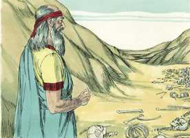
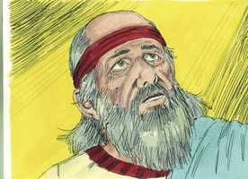
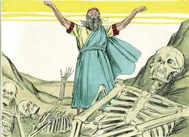
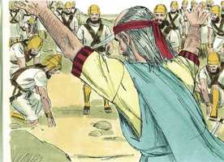

# Ezequiel Cap 37

**1** 	VEIO sobre mim a mão do Senhor, e ele me fez sair no Espírito do Senhor, e me pôs no meio de um vale que estava cheio de ossos.

> **Cmt MHenry**: *Vv. 1-14.* Nenhum poder criado pode restaurar ossos humanos e dar-lhes vida. Só Deus pode fazê-los viver, os ossos foram cobertos por pele e carne e foi ordenado que o vento soprasse sobre os corpos; e estes receberam vida novamente, o vento é a figura do Espírito de Deus e representa o seu poder vivificante. A visão serviría para alentar os judeus que desfaleciam; para anunciar a restauração deles depois do cativeiro, e a recuperação de sua dispersão, que era então tão prolongada. Também fazia uma clara alusão à ressurreição dos mortos; e representa o poder e a graça de Deus na conversão a Ele dos pecadores mais desesperançados. Olhemos para aquEle que ao final abrirá as nossas sepulturas e nos tirará dela para juízo, para que nos livre do pecado, coloque em nós o seu Espírito, e nos guarde para a salvação por seu poder por meio da fé.

 

**2** 	E me fez passar em volta deles; e eis que eram mui numerosos sobre a face do vale, e eis que estavam sequíssimos.

**3** 	E me disse: Filho do homem, porventura viverão estes ossos? E eu disse: Senhor Deus, tu o sabes.

 

**4** 	Então me disse: Profetiza sobre estes ossos, e dize-lhes: Ossos secos, ouvi a palavra do Senhor.

**5** 	Assim diz o Senhor Deus a estes ossos: Eis que farei entrar em vós o espírito, e vivereis.

**6** 	E porei nervos sobre vós e farei crescer carne sobre vós, e sobre vós estenderei pele, e porei em vós o espírito, e vivereis, e sabereis que eu sou o Senhor.

**7** 	Então profetizei como se me deu ordem. E houve um ruído, enquanto eu profetizava; e eis que se fez um rebuliço, e os ossos se achegaram, cada osso ao seu osso.

 

**8** 	E olhei, e eis que vieram nervos sobre eles, e cresceu a carne, e estendeu-se a pele sobre eles por cima; mas não havia neles espírito.

**9** 	E ele me disse: Profetiza ao espírito, profetiza, ó filho do homem, e dize ao espírito: Assim diz o Senhor Deus: Vem dos quatro ventos, ó espírito, e assopra sobre estes mortos, para que vivam.

**10** 	E profetizei como ele me deu ordem; então o espírito entrou neles, e viveram, e se puseram em pé, um exército grande em extremo.

 

**11** 	Então me disse: Filho do homem, estes ossos são toda a casa de Israel. Eis que dizem: Os nossos ossos se secaram, e pereceu a nossa esperança; nós mesmos estamos cortados.

**12** 	Portanto profetiza, e dize-lhes: Assim diz o Senhor Deus: Eis que eu abrirei os vossos sepulcros, e vos farei subir das vossas sepulturas, ó povo meu, e vos trarei à terra de Israel.

**13** 	E sabereis que eu sou o Senhor, quando eu abrir os vossos sepulcros, e vos fizer subir das vossas sepulturas, ó povo meu.

**14** 	E porei em vós o meu Espírito, e vivereis, e vos porei na vossa terra; e sabereis que eu, o Senhor, disse isto, e o fiz, diz o Senhor.

**15** 	E outra vez veio a mim a palavra do Senhor, dizendo:

> **Cmt MHenry**: *Vv. 15-28.* Este símbolo mostraria ao povo que o Senhor uniría Judá e Israel. Cristo é o verdadeiro Davi, o Rei de Israel; e aqueles que Ele tomar voluntários no dia do seu poder, fará andar em seus juízos e obedecer os seus estatutos, os acontecimentos que ainda hão de acontecer explicarão melhor esta profecia. Nada tem prejudicado mais o êxito do Evangelho do que as divisões. Estudemos uma maneira de conservar a unidade do Espírito pelo vínculo da paz; busquemos a graça divina para que nos guarde das coisas detestáveis; e oremos para que todas as nações possam ser como súditos obedientes e felizes do Filho de Davi, que o Senhor seja nosso Deus e nós sejamos seu povo para sempre,

**16** 	Tu, pois, ó filho do homem, toma um pedaço de madeira, e escreve nele: Por Judá e pelos filhos de Israel, seus companheiros. E toma outro pedaço de madeira, e escreve nele: Por José, vara de Efraim, e por toda a casa de Israel, seus companheiros.

**17** 	E ajunta um ao outro, para que se unam, e se tornem uma só vara na tua mão.

**18** 	E quando te falarem os filhos do teu povo, dizendo: Porventura não nos declararás o que significam estas coisas?

**19** 	Tu lhes dirás: Assim diz o Senhor Deus: Eis que eu tomarei a vara de José que esteve na mão de Efraim, e a das tribos de Israel, suas companheiras, e as ajuntarei à vara de Judá, e farei delas uma só vara, e elas se farão uma só na minha mão.

**20** 	E as varas, sobre que houveres escrito, estarão na tua mão, perante os olhos deles.

**21** 	Dize-lhes pois: Assim diz o Senhor Deus: Eis que eu tomarei os filhos de Israel dentre os gentios, para onde eles foram, e os congregarei de todas as partes, e os levarei à sua terra.

**22** 	E deles farei uma nação na terra, nos montes de Israel, e um rei será rei de todos eles, e nunca mais serão duas nações; nunca mais para o futuro se dividirão em dois reinos.

**23** 	E nunca mais se contaminarão com os seus ídolos, nem com as suas abominações, nem com as suas transgressões, e os livrarei de todas as suas habitações, em que pecaram, e os purificarei. Assim eles serão o meu povo, e eu serei o seu Deus.

**24** 	E meu servo Davi será rei sobre eles, e todos eles terão um só pastor; e andarão nos meus juízos e guardarão os meus estatutos, e os observarão.

**25** 	E habitarão na terra que dei a meu servo Jacó, em que habitaram vossos pais; e habitarão nela, eles e seus filhos, e os filhos de seus filhos, para sempre, e Davi, meu servo, será seu príncipe eternamente.

**26** 	E farei com eles uma aliança de paz; e será uma aliança perpétua. E os estabelecerei, e os multiplicarei, e porei o meu santuário no meio deles para sempre.

**27** 	E o meu tabernáculo estará com eles, e eu serei o seu Deus e eles serão o meu povo.

**28** 	E os gentios saberão que eu sou o Senhor que santifico a Israel, quando estiver o meu santuário no meio deles para sempre.

> **Cmt MHenry** Intro: *[Ezequiel 37](../26A-Ez/37.md#0)*> *Versículos 1-14: Deus restaura à vida os ossos secos; 15-28: Toda a casa de Israel é apresentada desfrutando as bênçãos do reino de Cristo.*