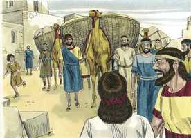
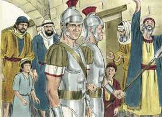
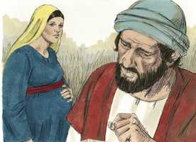
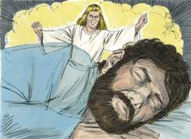
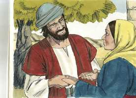

# Mateus Cap 01

**1** 	LIVRO da geração de Jesus Cristo, filho de Davi, filho de Abraão.

**2** 	Abraão gerou a Isaque; e Isaque gerou a Jacó; e Jacó gerou a Judá e a seus irmãos;

**3** 	E Judá gerou, de Tamar, a Perez e a Zerá; e Perez gerou a Esrom; e Esrom gerou a Arão;

**4** 	E Arão gerou a Aminadabe; e Aminadabe gerou a Naassom; e Naassom gerou a Salmom;

**5** 	E Salmom gerou, de Raabe, a Boaz; e Boaz gerou de Rute a Obede; e Obede gerou a Jessé;

**6** 	E Jessé gerou ao rei Davi; e o rei Davi gerou a Salomão da que foi mulher de Urias.

**7** 	E Salomão gerou a Roboão; e Roboão gerou a Abias; e Abias gerou a Asa;

**8** 	E Asa gerou a Josafá; e Josafá gerou a Jorão; e Jorão gerou a Uzias;

**9** 	E Uzias gerou a Jotão; e Jotão gerou a Acaz; e Acaz gerou a Ezequias;

**10** 	E Ezequias gerou a Manassés; e Manassés gerou a Amom; e Amom gerou a Josias;

**11** 	E Josias gerou a Jeconias e a seus irmãos na deportação para Babilônia.

**12** 	E, depois da deportação para a Babilônia, Jeconias gerou a Salatiel; e Salatiel gerou a Zorobabel;

**13** 	E Zorobabel gerou a Abiúde; e Abiúde gerou a Eliaquim; e Eliaquim gerou a Azor;

**14** 	E Azor gerou a Sadoque; e Sadoque gerou a Aquim; e Aquim gerou a Eliúde;

**15** 	E Eliúde gerou a Eleazar; e Eleazar gerou a Matã; e Matã gerou a Jacó;

**16** 	E Jacó gerou a José, marido de Maria, da qual nasceu JESUS, que se chama o Cristo.

**17** 	De sorte que todas as gerações, desde Abraão até Davi, são catorze gerações; e desde Davi até a deportação para a Babilônia, catorze gerações; e desde a deportação para a Babilônia até Cristo, catorze gerações.

**18** 	Ora, o nascimento de Jesus Cristo foi assim: Que estando Maria, sua mãe, desposada com José, antes de se ajuntarem, achou-se ter concebido do Espírito Santo.

  

**19** 	Então José, seu marido, como era justo, e a não queria infamar, intentou deixá-la secretamente.

 

**20** 	E, projetando ele isto, eis que em sonho lhe apareceu um anjo do Senhor, dizendo: José, filho de Davi, não temas receber a Maria, tua mulher, porque o que nela está gerado é do Espírito Santo;

 

**21** 	E dará à luz um filho e chamarás o seu nome JESUS; porque ele salvará o seu povo dos seus pecados.

**22** 	Tudo isto aconteceu para que se cumprisse o que foi dito da parte do Senhor, pelo profeta, que diz;

**23** 	Eis que a virgem conceberá, e dará à luz um filho, E chamá-lo-ão pelo nome de EMANUEL, Que traduzido é: Deus conosco.

 

**24** 	E José, despertando do sono, fez como o anjo do Senhor lhe ordenara, e recebeu a sua mulher;

 

**25** 	E não a conheceu até que deu à luz seu filho, o primogênito; e pôs-lhe por nome JESUS.

> **Cmt MHenry** Intro: Olhemos as circunstâncias em que entrou o Filho de Deus a este mundo inferior, até que aprendamos a desprezar as vãs honras deste mundo, quando comparadas com a piedade e a santidade.\ O mistério de Cristo feito homem deve ser adorado; não é para perguntar acerca disto por curiosidade. Foi assim ordenado que Cristo participasse de nossa natureza, porém puro da contaminação do pecado original, que tinha sido comunicado a toda a raça de Adão. Atente que é ao que reflexiona a quem Deus guiará, não ao que não pensa. O tempo de Deus para chegar com instrução a seu povo se dá quando estão perdidos. Os consolos divinos confortam mais a alma quando está pressionada por pensamentos que confundem. É dito a José que Maria devia trazer o Salvador ao mundo. Devia dar-lhe o nome de Jesus, Salvador. Jesus é o mesmo nome de Josué. A razão deste nome é clara, porque aqueles aos que Cristo salva, são salvos de seus pecados; da culpa do pecado pelo mérito de sua morte e do poder do pecado pelo Espírito de Sua graça. Ao salvá-los do pecado, os salva da ira e da maldição, e de toda desgraça, aqui e depois. Cristo veio salvar seu povo não *em* seus pecados, senão Notas Bíblia de Estudo NVI-out_images.txt Simple_Bible_Reader_v2.9-bible_converter.exe seus pecados; e, assim, a redimi-los dentre os homens para si, que é separado dos pecadores. José fez como lhe ordenou o anjo do Senhor, rapidamente e sem demora, jubilosamente, sem discutir. Aplicando as regras gerais da palavra escrita, devemos seguir a direção de Deus em todos os passos de nossa vida, particularmente em suas grandes mudanças, que são dirigidas por Deus, e acharemos que isto é seguro e consolador.> Acerca desta genealogia de nosso Salvador, observe-se a intenção principal. Não é uma genealogia desnecessária. Não é por vanglória, como costumam ser as dos grandes homens. Demonstra que nosso Senhor Jesus é da nação e família da qual ia surgir o Messias. A promessa da bênção foi feita a Abraão e a sua descendência; a do domínio, a Davi e a sua descendência. Foi prometido a Abraão que Cristo desceria dele ([Gn 12.3](../01A-Gn/12.md#3); [22.18](../01A-Gn/22.md#18)); e a Davi que desceria dele ([2 Samuel 7.12](../10A-2Sm/07.md#12); [Salmo 89.3](../19A-Sl/89.md#3) e seguintes; 132.11); portanto, a menos que Jesus seja filho de Davi, e filho de Abraão, não é o Messias. Isto se prova aqui com registros bem conhecidos. Quando aprouve ao Filho de Deus tomar nossa natureza, Ele se aproximou de nós em nossa condição caída, miserável; mas estava perfeitamente livre de pecado: e enquanto lemos os nomes de sua genealogia, não esqueçamos quão baixo se inclinou o Senhor da glória para salvar a raça humana.