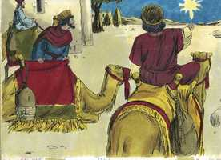
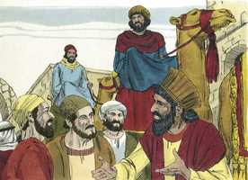
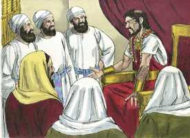
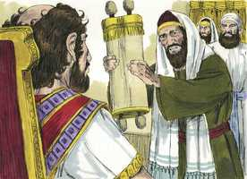
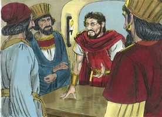
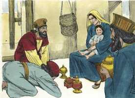
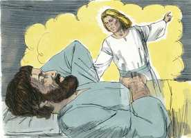
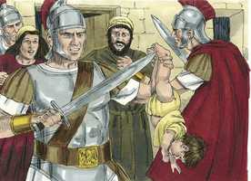
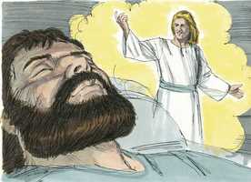
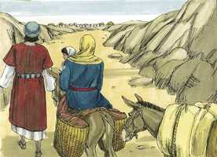

# Mateus Cap 02

**1** 	E, TENDO nascido Jesus em Belém de Judéia, no tempo do rei Herodes, eis que uns magos vieram do oriente a Jerusalém,

 

**2** 	Dizendo: Onde está aquele que é nascido rei dos judeus? porque vimos a sua estrela no oriente, e viemos a adorá-lo.

 

**3** 	E o rei Herodes, ouvindo isto, perturbou-se, e toda Jerusalém com ele.

**4** 	E, congregados todos os príncipes dos sacerdotes, e os escribas do povo, perguntou-lhes onde havia de nascer o Cristo.

 

**5** 	E eles lhe disseram: Em Belém de Judéia; porque assim está escrito pelo profeta:

 

**6** 	E tu, Belém, terra de Judá, De modo nenhum és a menor entre as capitais de Judá; Porque de ti sairá o Guia Que há de apascentar o meu povo Israel.

**7** 	Então Herodes, chamando secretamente os magos, inquiriu exatamente deles acerca do tempo em que a estrela lhes aparecera.

 

**8** 	E, enviando-os a Belém, disse: Ide, e perguntai diligentemente pelo menino e, quando o achardes, participai-mo, para que também eu vá e o adore.

**9** 	E, tendo eles ouvido o rei, partiram; e eis que a estrela, que tinham visto no oriente, ia adiante deles, até que, chegando, se deteve sobre o lugar onde estava o menino.

 

**10** 	E, vendo eles a estrela, regozijaram-se muito com grande alegria.

**11** 	E, entrando na casa, acharam o menino com Maria sua mãe e, prostrando-se, o adoraram; e abrindo os seus tesouros, ofertaram-lhe dádivas: ouro, incenso e mirra.

 

**12** 	E, sendo por divina revelação avisados num sonho para que não voltassem para junto de Herodes, partiram para a sua terra por outro caminho.

 

**13** 	E, tendo eles se retirado, eis que o anjo do Senhor apareceu a José num sonho, dizendo: Levanta-te, e toma o menino e sua mãe, e foge para o Egito, e demora-te lá até que eu te diga; porque Herodes há de procurar o menino para o matar.

 

**14** 	E, levantando-se ele, tomou o menino e sua mãe, de noite, e foi para o Egito.

**15** 	E esteve lá, até à morte de Herodes, para que se cumprisse o que foi dito da parte do Senhor pelo profeta, que diz: Do Egito chamei o meu Filho.

**16** 	Então Herodes, vendo que tinha sido iludido pelos magos, irritou-se muito, e mandou matar todos os meninos que havia em Belém, e em todos os seus contornos, de dois anos para baixo, segundo o tempo que diligentemente inquirira dos magos.

 

**17** 	Então se cumpriu o que foi dito pelo profeta Jeremias, que diz:

**18** 	Em Ramá se ouviu uma voz, Lamentação, choro e grande pranto: Raquel chorando os seus filhos, E não quer ser consolada, porque já não existem.

**19** 	Morto, porém, Herodes, eis que o anjo do Senhor apareceu num sonho a José no Egito,

 

**20** 	Dizendo: Levanta-te, e toma o menino e sua mãe, e vai para a terra de Israel; porque já estão mortos os que procuravam a morte do menino.

**21** 	Então ele se levantou, e tomou o menino e sua mãe, e foi para a terra de Israel.

**22** 	E, ouvindo que Arquelau reinava na Judéia em lugar de Herodes, seu pai, receou ir para lá; mas avisado num sonho, por divina revelação, foi para as partes da Galiléia.

 

**23** 	E chegou, e habitou numa cidade chamada Nazaré, para que se cumprisse o que fora dito pelos profetas: Ele será chamado Nazareno.

> **Cmt MHenry** Intro: Egito pode servir por um tempo como estadia ou refúgio, mas não para ficar a viver. Cristo foi enviado às ovelhas perdidas da casa de Israel, e a elas deve retornar. Se olharmos o mundo como o nosso Egito, o lugar de nossa escravidão e exílio, e somente o céu como a nossa Canaã, nosso lar, nosso repouso, deveremos levantar-nos logo e partir daqui quando sejamos chamados, como José quando saiu do Egito. A família deve estabelecer-se na Galiléia. Nazaré era lugar tido em pobre estimação, e Cristo foi crucificado sob esta acusação, Jesus Nazareno. Onde quer que nos indique a providência os limites de nossa habitação, devemos esperar compartir a admoestação de Cristo; embora possamos gloriar-nos de sermos chamados por seu nome, seguros de que, se sofremos com Ele, também seremos glorificados com Ele.> Herodes matou os meninos varões, não somente de Belém, senão de todas as aldeias dessa cidade. A ira desenfreada, armada com um poder ilícito, freqüentemente leva os homens a crueldades absurdas. Não foi coisa injusta que Deus permitisse isto; cada vida é entregue a sua justiça tão logo como começa. As doenças e as mortes dos pequenos são prova do pecado original. Mas o assassinato destas crianças foi seu martírio. Que cedo começou a perseguição contra Cristo e seu reinado! Herodes acreditava ter destruído as profecias do Antigo Testamento, e os esforços dos magos para acharem Cristo; mas o conselho do Senhor permanecerá, por astutas e cruéis que sejam as artimanhas do coração dos homens.> Egito tinha sido um lar de escravidão para Israel, e particularmente cruel para as crianças de Israel; mais será um lugar de refúgio para o santo menino Jesus. Quando a Deus lhe apraz, pode fazer com que o pior dos lugares sirva para o melhor dos propósitos. Esta foi uma prova de fé para José e Maria. Mas a fé deles, sendo provada, foi achada firme. Se nós e nossos filhos estivermos em problemas em qualquer tempo, lembremos as dificuldades em que esteve Cristo quando era um menino.> " Quanto gozo sentiram estes sábios ao ver a estrela, ninguém o sabe tão bEnquanto aqueles que, depois de uma longa e triste noite de tentação e abandono sob o poder de um espírito de escravidão, finalmente recebem o Espírito de adoção, dando testemunho a seus espíritos de que são filhos de Deus. podemos pensar que desilusão foi para eles quando encontraram que uma barraca era seu palácio, e sua própria e coitada mãe era a única servidão que tinha. Contudo, estes magos não se acreditaram impedidos, pois tendo achado o Rei que buscavam, lhe ofereceram seus presentes. Quem procura humildemente a Cristo não tropeçará se achar Ele e seus discípulos em casebres escuros, depois de tê-los procurado em vão nos palácios e cidades populosas. Há uma alma ocupada em buscar a Cristo? Quererá adorá-lo e dizer "sim!, eu sou uma criatura pobre e néscia e nada tenho a oferecer? Nada!" Não tem coração, ainda que indigno dEle, escuro, duro e néscio? Entregue-o a Ele tal como é, e se prepare para que Ele o use e dispunha dele como lhe apraz; Ele o tomará e o fará melhor, e nunca te arrependerás de ter agido assim. Ele o moldará a sua semelhança, e Ele mesmo se entregará a você e será seu para sempre. Os presentes dos magos eram ouro, incenso e mirra. A providência os enviou como socorro oportuno para José e Maria em sua atual condição de pobreza. Assim nosso Pai celestial, que conhece o que necessitam seus filhos, usa a alguns como mordomos para suprir as necessidades dos outros e provê-los ainda desde os confins da terra "> Os que vivem completamente afastados dos meios de graça costumam usar a máxima diligência e aprendem a conhecer o máximo de Cristo e de sua salvação. Porém, nenhuma arte da curiosidade nem o puro aprendizado humano podem levar os homens até Ele. Devemos aprender de Cristo atentando à palavra de Deus, como luz que brilha num lugar escuro, e buscando o ensino do Espírito Santo. Aqueles em cujo coração se levanta a estrela da manhã, para dar-lhes o necessário conhecimento de Cristo, fazem de sua adoração sua atividade preferencial. Embora Herodes era muito velho, e nunca tinha demonstrado afeto pela sua família, e era improvável que vivesse até que o recém-nascido chegasse à idade adulta, começou a turbar-se com o temor de um rival. Não compreendeu a natureza espiritual do reino do Messias. cuidamo-nos da fé morta. O homem pode estar persuadido de muitas verdades e ainda pode adiá-las, porque interferem com sua ambição ou licença pecaminosa. Tal crença lhe incomodará, e se decidirá mais a opor-se à verdade e à causa de Deus; e pode ser o suficientemente néscio como para esperar ter êxito nisso.