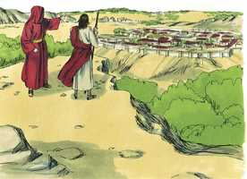

# Mateus Cap 04

**1** 	ENTÃO foi conduzido Jesus pelo Espírito ao deserto, para ser tentado pelo diabo.

 

**2** 	E, tendo jejuado quarenta dias e quarenta noites, depois teve fome;

**3** 	E, chegando-se a ele o tentador, disse: Se tu és o Filho de Deus, manda que estas pedras se tornem em pães.

 

**4** 	Ele, porém, respondendo, disse: Está escrito: Nem só de pão viverá o homem, mas de toda a palavra que sai da boca de Deus.

 

**5** 	Então o diabo o transportou à cidade santa, e colocou-o sobre o pináculo do templo,

 

**6** 	E disse-lhe: Se tu és o Filho de Deus, lança-te de aqui abaixo; porque está escrito: Que aos seus anjos dará ordens a teu respeito, E tomar-te-ão nas mãos, Para que nunca tropeces com o teu pé em alguma pedra.

 

**7** 	Disse-lhe Jesus: Também está escrito: Não tentarás o Senhor teu Deus.

**8** 	Novamente o transportou o diabo a um monte muito alto; e mostrou-lhe todos os reinos do mundo, e a glória deles.

 

**9** 	E disse-lhe: Tudo isto te darei se, prostrado, me adorares.

**10** 	Então disse-lhe Jesus: Vai-te, Satanás, porque está escrito: Ao Senhor teu Deus adorarás, e só a ele servirás.

 

**11** 	Então o diabo o deixou; e, eis que chegaram os anjos, e o serviam.

 

**12** 	Jesus, porém, ouvindo que João estava preso, voltou para a Galiléia;

 

**13** 	E, deixando Nazaré, foi habitar em Cafarnaum, cidade marítima, nos confins de Zebulom e Naftali;

**14** 	Para que se cumprisse o que foi dito pelo profeta Isaías, que diz:

**15** 	A terra de Zebulom, e a terra de Naftali, Junto ao caminho do mar, além do Jordão, A Galiléia das nações;

**16** 	O povo, que estava assentado em trevas, Viu uma grande luz; E, aos que estavam assentados na região e sombra da morte, A luz raiou.

**17** 	Desde então começou Jesus a pregar, e a dizer: Arrependei-vos, porque é chegado o reino dos céus.

**18** 	E Jesus, andando junto ao mar da Galiléia, viu a dois irmãos, Simão, chamado Pedro, e André, seu irmão, os quais lançavam as redes ao mar, porque eram pescadores;

**19** 	E disse-lhes: Vinde após mim, e eu vos farei pescadores de homens.

**20** 	Então eles, deixando logo as redes, seguiram-no.

**21** 	E, adiantando-se dali, viu outros dois irmãos, Tiago, filho de Zebedeu, e João, seu irmão, num barco com seu pai, Zebedeu, consertando as redes;

**22** 	E chamou-os; eles, deixando imediatamente o barco e seu pai, seguiram-no.

**23** 	E percorria Jesus toda a Galiléia, ensinando nas suas sinagogas e pregando o evangelho do reino, e curando todas as enfermidades e moléstias entre o povo.

**24** 	E a sua fama correu por toda a Síria, e traziam-lhe todos os que padeciam, acometidos de várias enfermidades e tormentos, os endemoninhados, os lunáticos, e os paralíticos, e ele os curava.

**25** 	E seguia-o uma grande multidão da Galiléia, de Decápolis, de Jerusalém, da Judéia, e de além do Jordão.

> **Cmt MHenry** Intro: Aonde ia Cristo, confirmava sua missão divina por meio de milagres, que foram emblema do poder curador de sua doutrina e do poder do Espírito que o acompanhava. Agora não encontramos em nossos corpos o miraculoso poder curador do Salvador, mas se formos curados pela medicina, o louvor é igualmente dEle. Aqui se usam três palavras gerais. Ele sanou toda enfermidade ou doença; nenhuma foi demasiado má, nenhuma demasiado terrível como para que Cristo não a curasse com uma palavra. Mencionam-se três doenças: a paralisia que é a suprema debilidade do corpo; a loucura, que é a doença maior da mente; e a possessão demoníaca, que é a maior desgraça e calamidade de todas elas; porém Cristo curou todo e, assim, ao curar as enfermidades do corpo, demonstrou que sua grande missão no mundo era curar os males espirituais. O pecado é enfermidades, doença e tormento da alma; Cristo veio para tirar o pecado e, assim, curar a alma.> Quando Cristo começou a pregar, principiou a reunir discípulos que deviam ser ouvintes, e depois pregadores, de sua doutrina, que deviam ser testemunhas de seus milagres, e depois testemunhar acerca deles. Não foi à corte de Herodes, nem foi à Jerusalém aos sumos sacerdotes nem aos anciãos, senão ao mar da Galiléia, aos pescadores. O mesmo poder que chamou a Pedro e a André poderia ter trazido a Anás e a Caifás, porque nada é impossível a Deus. mas Cristo escolhe o simples do mundo para confundir o sábio. A diligência é um chamado honesto a comprazer a Cristo; e não é um obstáculo para a vida santa. A gente ociosa está mais aberta às tentações de Satanás que aos chamados de Deus. é coisa feliz e cheia de esperança ver filhos que cuidam de seus pais e cumprem com seus dever. Quando Cristo voltar, será bom ser achado agindo assim. Estou em Cristo? É uma pergunta muito necessária que devemos fazer-nos, e depois dela, estou em meu chamado? Tinham seguido antes a Cristo como discípulos comuns ([João 1.37](../43N-Joa/01.md#37)); agora devem deixar seu ofício. Os que seguem bem a Cristo devem, a seu mandado, deixar todas as coisas para segui-lo a Ele, devem estar dispostos a separar-se delas. Esta instância do poder do Senhor Jesus nos exorta a dependermos de sua graça. Ele fala e está feito.> Justo é que Deus retire o evangelho e os meios de graça dos que os desprezam e os lançam de si. Cristo não ficará muito tempo onde não seja bem-vindo. Os que estão sem Cristo estão nas trevas. Estão instalados nessa condição, numa postura comprazida; a escolhem antes que a luz; são voluntariamente ignorantes. Quando chega o evangelho, vem a luz; quando este chega a qualquer parte, quando chega a uma alma, aí se faz o dia. A luz revela e dirige; assim o faz o evangelho. A doutrina do arrependimento é boa doutrina do evangelho. Não somente o austero João Batista, senão o bondoso Jesus pregou o arrependimento. Ainda existe a mesma razão para fazê-lo assim. Não se reconheceu por completo que o Reino dos Céus tinha chegado até a vinda do Espírito Santo, depois da ascensão de Cristo.> " Com referência à tentação de Cristo, observe-se que foi tentado imediatamente depois de ser declarado Filho de Deus e Salvador do mundo; os grandes privilégios e os sinais especiais do favor divino não asseguram a ninguém que não será tentado. Mas se o Espírito Santo dá testemunho de que temos sido adotados como filhos de Deus, isso responderá todas as sugestões do espírito mau. Cristo foi levado ao combate. Se fizermos ostentação de nossa própria força, e desafiarmos o diabo a tentar-nos, provocamos que Deus nos deixe livrados a nós mesmos. Outros são tentados, quando são desviados por sua própria concupiscência, e são seduzidos([Tiago 1.14](../59N-Tg/01.md#14)); porém nosso Senhor Jesus não tinha natureza corrupta, portanto Ele foi tentado somente pelo diabo. Manifesta-se na tentação de Cristo que nosso inimigo é sutil, mal-intencionado e muito atrevido, mas que podemos resisti-lo. consolo para nós é o fato de que Cristo sofreu sendo tentado, pois, assim, se manifesta que nossas tentações, enquanto não cedamos a elas, não são pecado e são somente aflições. Em todas suas tentações, Satanás atacava para que Cristo pecasse contra Deus. 1\) O tentou a desesperar da bondade de seu Pai, e a desconfiar do cuidado de seu Pai. Uma das tretas de Satanás é tirar vantagem de nossa condição externa; e os que são colocados em apertos devem duplicar sua guarda. Cristo respondeu todas as tentações de Satanás com um "Está escrito", para dar-nos o exemplo ao apelar ao que está escrito na Bíblia. Nós devemos adotar este método cada vez que formos tentados a pecar. Aprendamos a não seguir rumos errados a nossa provisão, quando nossas necessidades são sempre tão urgentes: o Senhor proverá de uma ou de outra forma. 2\) Satanás tentou Cristo a que presumisse do poder e proteção de seu Pai em matéria de seguridade. Não há extremos mais perigosos que o desespero e a presunção, especialmente no que diz respeito aos assuntos de nossa alma. Satanás não objeta lugares sagrados como cenário de seus assaltos. Não baixemos a guarda em lugar nenhum. A cidade santa é o lugar onde, com a maior vantagem, tenta aos homens ao orgulho e à presunção. Todos os elevados são lugares escorregadios; o avanço no mundo faz do homem um alvo para que Satanás dispare suas setas de fogo. Satanás está tão bem versado nas Escrituras que é capaz de citá-las facilmente? Sim, ele está. É possível que um homem tenha sua cabeça cheia de noções das Escrituras, e sua boca cheia de expressões das Escrituras, enquanto seu coração está cheio de forte inimizade contra Deus e contra toda bondade. Satanás citou mal as palavras. Se nos sairmos de nosso caminho, fora da senda de nosso dever, abandonamos a promessa e nos colocamos fora da proteção de Deus. Esta passagem, [Deuteronômio 8.3](../05A-Dt/08.md#3), foi feita contra o tentador, portanto ele omitiu uma parte. Esta promessa é firme e resiste bem. Mas seguiremos em pecado para que a graça abunde? Não. 3\) Satanás tentou a Cristo na idolatria com o oferecimento dos reinos do mundo e a glória deles. A glória do mundo é a tentação mais encantadora para quem não pensa e não percebe; isto é o que mais facilmente vence aos homens. Cristo foi tentado a adorar Satanás. Rejeitou com aborrecimento a proposta. *"Retire-se, Satanás!".* Algumas tentações são abertamente más; e não são para serem simplesmente resistidas, senão para serem rejeitadas de imediato. Bom é ser rápido e firme para resistir a tentação. Se resistirmos o diabo, ele fugirá de nós. Mas a alma que delibera está quase vencida. Encontramos somente uns poucos que podem rejeitar resolutamente tais iscas, como as que oferece Satanás, embora de que aproveita a um homem se ganhar o mundo e perder sua alma? Cristo foi socorrido depois da tentação para estimulá-lo a continuar em seu esforço, e para estimular-nos a confiarmos nEle, porque soube, por experiência, o que é sofrer sendo tentado, de modo que sabia o que é ser socorrido na tentação; portanto, podemos esperar não só que sinta por seu povo tentado, senão que venha com o oportuno socorro. "