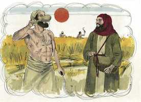

# Mateus Cap 06

**1** 	GUARDAI-VOS de fazer a vossa esmola diante dos homens, para serdes vistos por eles; aliás, não tereis galardão junto de vosso Pai, que está nos céus.

 

**2** 	Quando, pois, deres esmola, não faças tocar trombeta diante de ti, como fazem os hipócritas nas sinagogas e nas ruas, para serem glorificados pelos homens. Em verdade vos digo que já receberam o seu galardão.

**3** 	Mas, quando tu deres esmola, não saiba a tua mão esquerda o que faz a tua direita;

**4** 	Para que a tua esmola seja dada em secreto; e teu Pai, que vê em secreto, ele mesmo te recompensará publicamente.

**5** 	E, quando orares, não sejas como os hipócritas; pois se comprazem em orar em pé nas sinagogas, e às esquinas das ruas, para serem vistos pelos homens. Em verdade vos digo que já receberam o seu galardão.

**6** 	Mas tu, quando orares, entra no teu aposento e, fechando a tua porta, ora a teu Pai que está em secreto; e teu Pai, que vê em secreto, te recompensará publicamente.

**7** 	E, orando, não useis de vãs repetições, como os gentios, que pensam que por muito falarem serão ouvidos.

**8** 	Não vos assemelheis, pois, a eles; porque vosso Pai sabe o que vos é necessário, antes de vós lho pedirdes.

**9** 	Portanto, vós orareis assim: Pai nosso, que estás nos céus, santificado seja o teu nome;

**10** 	Venha o teu reino, seja feita a tua vontade, assim na terra como no céu;

**11** 	O pão nosso de cada dia nos dá hoje;

**12** 	E perdoa-nos as nossas dívidas, assim como nós perdoamos aos nossos devedores;

**13** 	E não nos conduzas à tentação; mas livra-nos do mal; porque teu é o reino, e o poder, e a glória, para sempre. Amém.

**14** 	Porque, se perdoardes aos homens as suas ofensas, também vosso Pai celestial vos perdoará a vós;

**15** 	Se, porém, não perdoardes aos homens as suas ofensas, também vosso Pai vos não perdoará as vossas ofensas.

**16** 	E, quando jejuardes, não vos mostreis contristados como os hipócritas; porque desfiguram os seus rostos, para que aos homens pareça que jejuam. Em verdade vos digo que já receberam o seu galardão.

**17** 	Tu, porém, quando jejuares, unge a tua cabeça, e lava o teu rosto,

**18** 	Para não pareceres aos homens que jejuas, mas a teu Pai, que está em secreto; e teu Pai, que vê em secreto, te recompensará publicamente.

**19** 	Não ajunteis tesouros na terra, onde a traça e a ferrugem tudo consomem, e onde os ladrões minam e roubam;

 

**20** 	Mas ajuntai tesouros no céu, onde nem a traça nem a ferrugem consomem, e onde os ladrões não minam nem roubam.

**21** 	Porque onde estiver o vosso tesouro, aí estará também o vosso coração.

**22** 	A candeia do corpo são os olhos; de sorte que, se os teus olhos forem bons, todo o teu corpo terá luz;

**23** 	Se, porém, os teus olhos forem maus, o teu corpo será tenebroso. Se, portanto, a luz que em ti há são trevas, quão grandes serão tais trevas!

**24** 	Ninguém pode servir a dois senhores; porque ou há de odiar um e amar o outro, ou se dedicará a um e desprezará o outro. Não podeis servir a Deus e a Mamom.

**25** 	Por isso vos digo: Não andeis cuidadosos quanto à vossa vida, pelo que haveis de comer ou pelo que haveis de beber; nem quanto ao vosso corpo, pelo que haveis de vestir. Não é a vida mais do que o mantimento, e o corpo mais do que o vestuário?

**26** 	Olhai para as aves do céu, que nem semeiam, nem segam, nem ajuntam em celeiros; e vosso Pai celestial as alimenta. Não tendes vós muito mais valor do que elas?

**27** 	E qual de vós poderá, com todos os seus cuidados, acrescentar um côvado à sua estatura?

**28** 	E, quanto ao vestuário, por que andais solícitos? Olhai para os lírios do campo, como eles crescem; não trabalham nem fiam;

**29** 	E eu vos digo que nem mesmo Salomão, em toda a sua glória, se vestiu como qualquer deles.

**30** 	Pois, se Deus assim veste a erva do campo, que hoje existe, e amanhã é lançada no forno, não vos vestirá muito mais a vós, homens de pouca fé?

**31** 	Não andeis, pois, inquietos, dizendo: Que comeremos, ou que beberemos, ou com que nos vestiremos?

 

**32** 	Porque todas estas coisas os gentios procuram. Decerto vosso Pai celestial bem sabe que necessitais de todas estas coisas;

**33** 	Mas, buscai primeiro o reino de Deus, e a sua justiça, e todas estas coisas vos serão acrescentadas.

**34** 	Não vos inquieteis, pois, pelo dia de amanhã, porque o dia de amanhã cuidará de si mesmo. Basta a cada dia o seu mal.

> **Cmt MHenry** Intro: Escassamente há um outro pecado contra o qual mais advirta nosso Senhor Jesus a seus discípulos que as preocupações inquietantes, que distraem e fazem desconfiar pelas coisas desta vida. Amiúde isto enreda tanto o pobre como o amor pela riqueza ao rico. Mas há uma despreocupação pelas coisas temporárias que é dever, embora não devamos levar a um extremo estas preocupações licitas. Não se preocupem por sua vida. Nem pela extensão dela, senão refiram-na a Deus para que a alongue ou encurte segundo lhe apraz; nossos tempos estão em sua mão e estão em boa mão. nem pelas comodidades desta vida, deixem que Deus a amargue ou adoce segundo lhe pareça. Deus tem prometido a comida e o vestido, portanto podemos esperá-los. Não pensem no amanhã, no tempo vindouro. Não se preocupem pelo futuro, como viverão no ano próximo, ou quando sejam velhos, ou que vão deixar trás de si. Como não devemos jactar-nos do amanhã, assim tampouco devemos preocupar-nos pelo amanhã ou seus acontecimentos. Deus nos tem dado vida e nos tem dado o corpo. E que não pode fazer por nós quem fez isso? Se nos preocuparmos de nossas almas e da eternidade, que são mais importantes que o corpo e que esta vida, podemos deixar em mãos de Deus que nos proveja comida e vestido, que são o menos importante. Melhorem isto como exortação a confiar em Deus. devemos reconciliar-nos com nosso patrimônio no mundo como o fazemos com nossa estatura. Não podemos alterar as disposições da providência, portanto devemos submeter-nos e resignar-nos a elas. O cuidado considerado por nossas almas é a melhor cura da consideração cuidado pelo mundo. Busquem primeiro o reino de Deus, e façam da religião a sua ocupação: não digam que este é o modo de passar fome; não é o jeito de estar bem provido, ainda neste mundo. A conclusão de todo o assunto é que é a vontade e o mandamento do Senhor Jesus, que pelas orações diárias possamos obter força para sustentar-nos sob nossos problemas cotidianos, e armar-nos contra as tentações que os acompanham e não deixar que nenhuma dessas coisas nos comovam.\ Bem-aventurados os que tomam o Senhor como seu Deus, e dão plena prova disso confiando-se totalmente a sua sabia disposição. Que teu Espírito nos dê convicção do pecado na necessidade desta disposição e tire o mundano de nossos corações.> A mentalidade mundana é sintoma fatal e corriqueiro da hipocrisia, porque por nenhum pecado pode Satanás ter um suporte mais seguro e mais firme na alma que sob o manto de uma profissão de fé. Algo terá a alma que olhar como o melhor, aquilo no qual se compraz e confia acima de todas as demais coisas. Há tesouros no céu. Sabedoria nossa é realizar toda diligência para assegurar nosso direito à vida eterna por meio de Jesus Cristo, e olharmos para todas as coisas daqui embaixo como indignas de serem comparadas com aquelas, e não ficarmos contentes com nada inferior a elas. É felicidade superior e além das mudanças e azares do tempo, é herança incorruptível. O homem mundano erra em seu primeiro princípio; portanto, todos seus arrazoamentos e ações que daí surgem devem ser maus. Isto se aplica por igual à falsa religião; o que é considerado luz é a escuridão mais densa. Este é um exemplo espantoso, mas comum; portanto, devemos examinar cuidadosamente nossos princípios diretrizes à luz da palavra de Deus, pedindo com oração fervorosa o ensino de seu Espírito. Um homem pode servir um pouco a dois amos, mas pode consagrar-se ao serviço de não mais que um. Deus requer todo o coração e não o dividirá com o mundo. Quando dois amos se opõem entre si, nenhum homem pode servir ambos. Ele se aferra e ama o mundo, e deve desprezar a Deus; o que ama a Deus deve deixar a amizade do mundo.> O jejum religioso é um dever requerido aos discípulos de Cristo, mas não é tanto um dever em si mesmo, senão como meio para dispor-nos para outros deveres. Jejuar é humilhar a alma ([Salmo 35.13](../19A-Sl/35.md#13)); esta é a face interna do dever; portanto, que seja teu principal interesse, e Enquanto à externa, não permitas que se veja cobiça. Deus vê no secreto, e te recompensará em público.> Cristo viu que era necessário mostrar a seus discípulos qual deve ser correntemente o tema e o método de sua oração. Não se trata de que estejamos obrigados somente a usar a mesma oração sempre, porém, sem dúvida, é muito bom orar segundo um modelo. Diz muito em poucas palavras; se usa em forma aceitável não mais do que se usa com entendimento e sem vãs repetições. Seis são as petições: as primeiras três se relacionam mais expressamente com Deus e sua honra; as outras três, com nossas preocupações temporárias e espirituais. Esta oração nos ensina a buscar primeiro o reino de Deus e sua justiça, e todas as outras coisas serão agregadas. Depois das coisas da glória, do reino e da vontade de Deus, oramos pelo sustento e o consolo necessário na vida presente. Aqui cada palavra contém uma lição. Pedimos *pão*: isso nos ensina sobriedade e temperança; e somente pedimos pão, não o que não necessitamos. Pedimos por *nosso* pão: isso nos ensina honestidade e trabalho; não devemos pedir o pão de outrem nem o pão do engano ([Provérbios 20.17](../20A-Pv/20.md#17)). Nem o pão do ócio ([Provérbios 31.27](../20A-Pv/31.md#27)), senão o pão honestamente obtido. Pedimos por nosso pão *diário*, o que nos ensina a depender constantemente da providência divina. Rogamos a Deus que no-lo *dê*: não que o venda ou o empreste, senão que o dê. O maior dos homens deve dirigir-se à misericórdia de Deus para seu pão diário. Oramos: *dá-nos*. Isto nos ensina compaixão pelos pobres. Também que devemos orar com nossa família. Oramos para que Deus no-lo dê *neste dia*, o que nos ensina a renovar os desejos de nossas almas Enquanto a Deus, como são renovadas as necessidades de nossos corpos. Ao chegar o dia, devemos orar a nosso Pai celestial e reconhecer que poderíamos passar muito bem o dia sem comida, mas não sem oração. Se nos ensina a odiar e aborrecer o pecado enquanto esperamos misericórdia, a desconfiar de nós, a confiar na providência e na graça de Deus para impedir-nos pecar, a estarmos preparados para resistir o tentador, e a não voltar-nos tentadores dos outros.\ Aqui há uma promessa: se perdoar, teu Pai celestial também te perdoará. Devemos perdoar porque esperamos ser perdoados. Os que desejam achar misericórdia de Deus devem mostrar misericórdia a seus irmãos. Cristo veio ao mundo como o grande Pacificador não só para reconciliar-nos com Deus, senão também os uns com os outros.> " Se tem como verdadeiro que todos os que são discípulos de Cristo oram. Pode que seja mais rápido achar um homem vivo que não respire que um cristão vivo que não ore. Se não há oração, então não há graça. Os escribas e fariseus eram culpáveis de duas grandes faltas na oração: a vangloria e a vã repetição. *"Eu lhes asseguro que eles já receberam sua plena recompensa"*; se em algo tão grande entre nós e Deus, quando estamos orando, podemos levar em conta uma coisa tão pobre como a adulação dos homens, justo é que isso seja toda a nossa recompensa. Mas não há um murmurar secreto e repetido em busca de Deus que Ele não veja. É chamado recompensa, mas é de graça, não por dívida; que mérito pode haver em mendigar? Se não dá a seu povo o que lhe pedem, deve-se a que sabe que não o necessitam e que não é para seu bem. Tanto dista Deus de ser convencido pela largura ou as palavras de nossas orações, que as intercessões mais fortes são as que se emitem com gemidos inexprimíveis. Estudemos bem o que mostra a atitude mental em que devemos oferecer nossas orações, e aprendamos diariamente de Cristo como orar. "> Logo, nosso Senhor advertiu contra a hipocrisia e a simulação externas nos deveres religiosos. o que deve ser feito, devemos fazê-lo a partir de um princípio interior de sermos aprovados por Deus, não pela busca do elogio dos homens. Nestes versículos se nos adverte contra a hipocrisia de dar esmola. Atenção a isto. É pecado sutil; é a vangloria se infiltra no que fazemos, antes de percebermos. Mas o dever não é menos necessário nem menos excelente porque os hipócritas abusam dele para servirem seu orgulho. A condena que Cristo dita parece primeiro uma promessa, mas é *sua* recompensa; não é a recompensa que promete Deus aos que fazem o bem, senão a recompensa que os hipócritas se prometem a si mesmos, e pobre recompensa é; eles o fizeram para serem vistos pelos homens, e são vistos por eles. Quanto menos percebemos nossas boas obras, Deus as nota mais. Ele te recompensará; não como amo que dá a seu servo o que se ganha, e nada mais, senão como Pai que dá abundantemente a seu filho o que lhe serve.