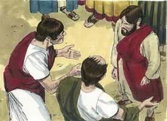
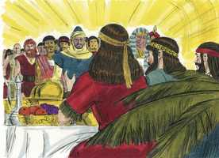

# Mateus Cap 08

**1** 	E, DESCENDO ele do monte, seguiu-o uma grande multidão.

**2** 	E, eis que veio um leproso, e o adorou, dizendo: Senhor, se quiseres, podes tornar-me limpo.

**3** 	E Jesus, estendendo a mão, tocou-o, dizendo: Quero; sê limpo. E logo ficou purificado da lepra.

**4** 	Disse-lhe então Jesus: Olha, não o digas a alguém, mas vai, mostra-te ao sacerdote, e apresenta a oferta que Moisés determinou, para lhes servir de testemunho.

**5** 	E, entrando Jesus em Cafarnaum, chegou junto dele um centurião, rogando-lhe,

**6** 	E dizendo: Senhor, o meu criado jaz em casa, paralítico, e violentamente atormentado.

**7** 	E Jesus lhe disse: Eu irei, e lhe darei saúde.

 

**8** 	E o centurião, respondendo, disse: Senhor, não sou digno de que entres debaixo do meu telhado, mas dize somente uma palavra, e o meu criado há de sarar.

**9** 	Pois também eu sou homem sob autoridade, e tenho soldados às minhas ordens; e digo a este: Vai, e ele vai; e a outro: Vem, e ele vem; e ao meu criado: Faze isto, e ele o faz.

**10** 	E maravilhou-se Jesus, ouvindo isto, e disse aos que o seguiam: Em verdade vos digo que nem mesmo em Israel encontrei tanta fé.

 

**11** 	Mas eu vos digo que muitos virão do oriente e do ocidente, e assentar-se-ão à mesa com Abraão, e Isaque, e Jacó, no reino dos céus;

 

**12** 	E os filhos do reino serão lançados nas trevas exteriores; ali haverá pranto e ranger de dentes.

 

**13** 	Então disse Jesus ao centurião: Vai, e como creste te seja feito. E naquela mesma hora o seu criado sarou.

  

**14** 	E Jesus, entrando em casa de Pedro, viu a sogra deste acamada, e com febre.

 

**15** 	E tocou-lhe na mão, e a febre a deixou; e levantou-se, e serviu-os.

 

**16** 	E, chegada a tarde, trouxeram-lhe muitos endemoninhados, e ele com a sua palavra expulsou deles os espíritos, e curou todos os que estavam enfermos;

**17** 	Para que se cumprisse o que fora dito pelo profeta Isaías, que diz: Ele tomou sobre si as nossas enfermidades, e levou as nossas doenças.

**18** 	E Jesus, vendo em torno de si uma grande multidão, ordenou que passassem para o outro lado;

**19** 	E, aproximando-se dele um escriba, disse-lhe: Mestre, aonde quer que fores, eu te seguirei.

**20** 	E disse Jesus: As raposas têm covis, e as aves do céu têm ninhos, mas o Filho do homem não tem onde reclinar a cabeça.

**21** 	E outro de seus discípulos lhe disse: Senhor, permite-me que primeiramente vá sepultar meu pai.

**22** 	Jesus, porém, disse-lhe: Segue-me, e deixa os mortos sepultar os seus mortos.

**23** 	E, entrando ele no barco, seus discípulos o seguiram;

 

**24** 	E eis que no mar se levantou uma tempestade, tão grande que o barco era coberto pelas ondas; ele, porém, estava dormindo.

 

**25** 	E os seus discípulos, aproximando-se, o despertaram, dizendo: Senhor, salva-nos! que perecemos.

 

**26** 	E ele disse-lhes: Por que temeis, homens de pouca fé? Então, levantando-se, repreendeu os ventos e o mar, e seguiu-se uma grande bonança.

  

**27** 	E aqueles homens se maravilharam, dizendo: Que homem é este, que até os ventos e o mar lhe obedecem?

 

**28** 	E, tendo chegado ao outro lado, à província dos gergesenos, saíram-lhe ao encontro dois endemoninhados, vindos dos sepulcros; tão ferozes eram que ninguém podia passar por aquele caminho.

**29** 	E eis que clamaram, dizendo: Que temos nós contigo, Jesus, Filho de Deus? Vieste aqui atormentar-nos antes do tempo?

 

**30** 	E andava pastando distante deles uma manada de muitos porcos.

 

**31** 	E os demônios rogaram-lhe, dizendo: Se nos expulsas, permite-nos que entremos naquela manada de porcos.

**32** 	E ele lhes disse: Ide. E, saindo eles, se introduziram na manada dos porcos; e eis que toda aquela manada de porcos se precipitou no mar por um despenhadeiro, e morreram nas águas.

 

**33** 	Os porqueiros fugiram e, chegando à cidade, divulgaram tudo o que acontecera aos endemoninhados.

**34** 	E eis que toda aquela cidade saiu ao encontro de Jesus e, vendo-o, rogaram-lhe que se retirasse dos seus termos.

> **Cmt MHenry** Intro: " Os demônios nada têm a ver com Cristo como Salvador; eles não têm nem esperam nenhum benefício dEle. Oh, a profundidade deste mistério do amor divino: que o homem caído tenha tanto a ver com Cristo, quando os anjos caídos nada têm a ver com Ele! ([Hebreus 2.16](../58N-Hb/02.md#16)). Seguramente que aqui sofreram um tormento, ao serem forçados a reconhecer a excelência que há em Cristo, e ainda assim, não ter parte com Ele. Os demônios não desejam ter nada a ver com Cristo como *Rei*. Veja que linguagem falam os que não terão nada a ver com o evangelho de Cristo. Contudo, não é verdade que os demônios não tenham nada a ver com Cristo como *Juiz*, pois tem tudo a ver, e sabem disso; assim é para com todos os filhos dos homens. Satanás e seus instrumentos não podem ir além do que o Senhor permita; eles devem deixar a possessão quando Ele ordena. Não podem romper o cerco de proteção em volta de seu povo; nem sequer podem entrar num porco sem Sua permissão. Receberam a permissão. Freqüentemente Deus permite, por objetivos santos e sábios, os esforços da ira de Satanás. Assim, pois, o diabo apressa a gente a pecar; os apressa ao que têm resolvido em contra, do qual sabem que será vergonha e dor para eles; miserável é a condição dos que são levados cativos por ele a sua vontade. Existem muitos que preferem seus porcos ao Salvador e, assim, não alcançam a Cristo e a salvação por Ele. Eles desejam que Cristo se vá de seus corações, e não suportam que Sua Palavra tenha lugar neles, porque Ele e sua palavra destruiriam suas concupiscências brutais, isso que se entrega aos porcos como alimento. Justo é que Cristo abandone aos que estão cansados dEle; e depois diga: *"Apartem-se de mim, malditos"*, aos que dizem ao Todo Poderoso: "Saí de nós". "> Consolo para os que se lançam ao mar em barcos, e costumam passar perigo ali, é refletir que têm um Salvador em quem confiar e ao qual orar, que sabe que é estar na água e estar em tormentas. Os que estão passando pelo oceano deste mundo com Cristo, devem esperar tormentas. Sua natureza humana, semelhante a nós em tudo, porém sem pecado, estava fatigada e adormeceu nesse momento para provar a fé de seus discípulos. Eles foram a seu Mestre em seu temor. Assim é na alma; quando as luxúrias e as tentações se levantam a rugem, e Deus está aparentemente dormido para o que está acontecendo, isto nos conduz à beira do desespero. Então, se clama por uma palavra de sua boca: Senhor Jesus, não fiques calado ou estou acabado. Muitos que têm fé verdadeira são fracos nela. Sem discípulos de Cristo eram dados a inquietar-se com temores num dia tempestuoso; atormentavam-se a si mesmos com as coisas que estavam mal para eles, e com pensamentos desalentadores de que virá algo pior. As grandes tormentas da dúvida e temor na alma, sob o poder do espírito de escravidão, costumam acabar numa maravilhosa calma, criada e dirigida pelo Espírito de adoção. Eles ficaram estupefatos. Nunca tinham visto que uma tormenta fosse de imediato acalmada tão perfeitamente. Ele pode fazer isso, pode fazer qualquer coisa, o que estimula a confiança e o consolo nEle, no dia mais tempestuoso de dentro ou de fora ([Isaias 26.4](../23A-Is/26.md#4)).> " Um dos escribas se apressou a prometer; se diz seguidor de Cristo. Parece muito resoluto. Muitas decisões religiosas são produzidas por uma súbita convicção do pecado, e assumidas sem uma devida reflexão; estas dão em nada. Quando este escriba ofereceu seguir a Cristo, se poderia pensar que Jesus deve ter-se sentido animado; um escriba podia dar mais crédito e serviço que doze pescadores; porém Cristo viu seu coração, e respondeu a seus pensamentos, e ensina a todos como ir a Cristo. Sua resolução parece surgir de um princípio mundano e cobiçoso; mas Cristo não tinha onde reclinar sua cabeça, e se ele o seguisse, não devia esperar que lhe iria melhor. Temos razão para pensar que este escriba se afastou. Outro era demasiado lento. A demora em fazer e, por um lado, tão negativa como a pressa por resolver-se por outro lado. Pediu permissão para ocupar-se de enterrar seu pai, e que depois se colocaria ao serviço de Cristo. Isto parecia razoável, embora não fosse justo. Não tinha zelo verdadeiro pela obra. Enterrar o morto, especialmente um pai morto, é uma boa obra, mas não é tua obra neste momento. Se Cristo requer nosso serviço, deve ceder-se ainda o afeto pelos parentes mais próximos e queridos, e pelas coisas que não são nosso dever. Para a mente sem disposição nunca faltam as desculpas. Jesus lhe disse "Siga-me" e, sem dúvida, saiu poder com esta palavra para ele como para os outros; seguiu a Cristo e se aferrou a Ele. O escriba disse "eu te seguirei"; a este outro homem, Cristo disse "Siga-me"; comparando-os, se vê que somos levados a Cristo pela força de seu chamado pessoal ([Romanos 9.16](../45N-Rm/09.md#16)). "> Pedro tinha uma esposa embora fosse apóstolo de Cristo, o que demonstra que Ele aprovava o estado do matrimônio, sendo bondoso com a mãe da esposa de Pedro. A igreja de Roma, que proíbe que seus ministros se casem, contradiz a este apóstolo, sobre o qual tanto se apóiam. Tinha sua sogra consigo em sua família, o que é exemplo de ser bom com nossos pais. Na sanidade espiritual, a Escritura diz a palavra, o Espírito dá o toque, toca o coração, toca a mão. Aqueles que se recuperam de uma febre costumam ficar fracos durante um tempo; más para mostrar que esta cura estava acima do poder da natureza, a manhã ficou tão bem que de imediato se dedicou aos afazeres da casa. Os milagres que fez Jesus foram publicados amplamente, de modo que muitos se agruparam vindo até Ele, e curou a todos os que estavam doentes, embora o paciente estivesse fraco demais e o caso fosse do pior. Muitas são as doenças e as calamidades do corpo às que estamos propensos; e há mais nestas palavras do evangelho que dizem que Jesus Cristo levou nossas doenças e nossas dores, para sustentar-nos e consolar-nos quando estamos submetidos a elas, que em todos os escritos dos filósofos. Não nos queixamos pelo trabalho, o problema ou o gasto ao fazermos o bem ao próximo.> Este centurião era pagão, um soldado romano. Embora soldado, não obstante, era um bom homem. Nenhuma vocação nem posição do homem serão desculpa para a incredulidade e o pecado. Vejam como expõe o caso de seu servo. Devemos interessar-nos pelas almas de nossos filhos e servos, espiritualmente doentes, que não sentem os males espirituais, e não conhecem o que é espiritualmente bom; devemos levá-los a Cristo por fé e por oração. Observe-se sua humilhação. As almas humildes se fazem mais humildes pela graça de Cristo no trato com eles. Observe-se sua grande fé. Enquanto menos os confiemos em nós mesmos, mais forte será nossa confiança em Cristo. Aqui o centurião lhe reconhece o mando com poder divino e pleno sobre todas as criaturas e poderes da natureza, como um amo sobre seus servos. Este tipo de servos devemos ser todos para Deus; devemos ir e vir, conforme com os mandados de Sua palavra e com as disposições de sua providência. Mas quando o Filho do Homem vem, encontra pouca fé, portanto, acha pouco fruto. Uma profissão externa faz que sejamos chamados filhos do reino, porém se descarnarmos nisso e nada mais podemos mostrar, seremos rejeitados. O servo obteve a sanidade de sua doença e o amo obteve a aprovação de sua fé. O que foi dito a ele, se diz a todos: Crê, e receberás; somente crê. Veja o poder de Cristo e o poder da fé. A cura de nossas almas é, logo, o efeito e a prova de nosso interesse no sangue de Cristo.> Nestes versículos temos o relato da limpeza de um leproso feita por Cristo; o leproso se aproximou dEle e o adorou como a Um investido de poder divino. Esta purificação não somente nos guia a acudirmos a Cristo, que tem poder sobre as doenças físicas, para a sanidade delas; também nos ensina a maneira de apelas a Ele. Quando não podemos estar seguros da vontade de Deus, podemos estar seguros de sua sabedoria e misericórdia. Por grande que seja a culpa, no sangue de Ct há aquilo que a expia; nenhuma corrupção é tão forte que não haja em sua graça o que possa submetê-la. Para sermos purificados, devemos encomendar-nos a sua piedade; não podemos demandá-lo como dívida; devemos pedi-lo humildemente como um favor. Os que pela fé apelam a Cristo por misericórdia e graça, podem estar seguros de que Ele está dando-lhes livremente a misericórdia e a graça que eles assim procuram. Benditas sejam as aflições que nos levam a conhecer a Cristo, e nos fazem procurar sua ajuda e sua salvação. Os que são limpos de sua lepra espiritual, vão aos ministros de Cristo e exponham seu caso, para serem aconselhados, consolados e para que orem por eles.> Este versículo se refere ao final do sermão anterior. Aqueles aos que Cristo tem-se dado a conhecer, desejam saber mais dEle.