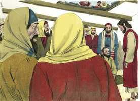
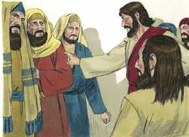
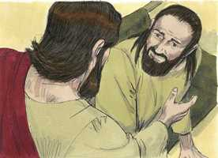
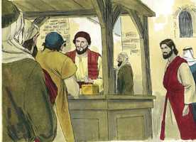
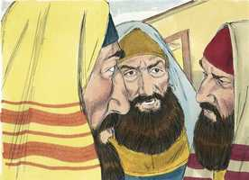

# Mateus Cap 09

**1** 	E, ENTRANDO no barco, passou para o outro lado, e chegou à sua cidade. E eis que lhe trouxeram um paralítico, deitado numa cama.

**2** 	E Jesus, vendo a fé deles, disse ao paralítico: Filho, tem bom ânimo, perdoados te são os teus pecados.

  

**3** 	E eis que alguns dos escribas diziam entre si: Ele blasfema.

 

**4** 	Mas Jesus, conhecendo os seus pensamentos, disse: Por que pensais mal em vossos corações?

 

**5** 	Pois, qual é mais fácil? dizer: Perdoados te são os teus pecados; ou dizer: Levanta-te e anda?

**6** 	Ora, para que saibais que o Filho do homem tem na terra autoridade para perdoar pecados (disse então ao paralítico): Levanta-te, toma a tua cama, e vai para tua casa.

 

**7** 	E, levantando-se, foi para sua casa.

 

**8** 	E a multidão, vendo isto, maravilhou-se, e glorificou a Deus, que dera tal poder aos homens.

**9** 	E Jesus, passando adiante dali, viu assentado na recebedoria um homem, chamado Mateus, e disse-lhe: Segue-me. E ele, levantando-se, o seguiu.

  

**10** 	E aconteceu que, estando ele em casa sentado à mesa, chegaram muitos publicanos e pecadores, e sentaram-se juntamente com Jesus e seus discípulos.

 

**11** 	E os fariseus, vendo isto, disseram aos seus discípulos: Por que come o vosso Mestre com os publicanos e pecadores?

  

**12** 	Jesus, porém, ouvindo, disse-lhes: Não necessitam de médico os sãos, mas, sim, os doentes.

**13** 	Ide, porém, e aprendei o que significa: Misericórdia quero, e não sacrifício. Porque eu não vim a chamar os justos, mas os pecadores, ao arrependimento.

 

**14** 	Então, chegaram ao pé dele os discípulos de João, dizendo: Por que jejuamos nós e os fariseus muitas vezes, e os teus discípulos não jejuam?

**15** 	E disse-lhes Jesus: Podem porventura andar tristes os filhos das bodas, enquanto o esposo está com eles? Dias, porém, virão, em que lhes será tirado o esposo, e então jejuarão.

**16** 	Ninguém deita remendo de pano novo em roupa velha, porque semelhante remendo rompe a roupa, e faz-se maior a rotura.

**17** 	Nem se deita vinho novo em odres velhos; aliás rompem-se os odres, e entorna-se o vinho, e os odres estragam-se; mas deita-se vinho novo em odres novos, e assim ambos se conservam.

**18** 	Dizendo-lhes ele estas coisas, eis que chegou um chefe, e o adorou, dizendo: Minha filha faleceu agora mesmo; mas vem, impõe-lhe a tua mão, e ela viverá.

 

**19** 	E Jesus, levantando-se, seguiu-o, ele e os seus discípulos.

**20** 	E eis que uma mulher que havia já doze anos padecia de um fluxo de sangue, chegando por detrás dele, tocou a orla de sua roupa;

 

**21** 	Porque dizia consigo: Se eu tão-somente tocar a sua roupa, ficarei sã.

 

**22** 	E Jesus, voltando-se, e vendo-a, disse: Tem ânimo, filha, a tua fé te salvou. E imediatamente a mulher ficou sã.

  

**23** 	E Jesus, chegando à casa daquele chefe, e vendo os instrumentistas, e o povo em alvoroço,

 

**24** 	Disse-lhes: Retirai-vos, que a menina não está morta, mas dorme. E riam-se dele.

**25** 	E, logo que o povo foi posto fora, entrou Jesus, e pegou-lhe na mão, e a menina levantou-se.

   

**26** 	E espalhou-se aquela notícia por todo aquele país.

**27** 	E, partindo Jesus dali, seguiram-no dois cegos, clamando, e dizendo: Tem compaixão de nós, filho de Davi.

**28** 	E, quando chegou à casa, os cegos se aproximaram dele; e Jesus disse-lhes: Credes vós que eu possa fazer isto? Disseram-lhe eles: Sim, Senhor.

**29** 	Tocou então os olhos deles, dizendo: Seja-vos feito segundo a vossa fé.

**30** 	E os olhos se lhes abriram. E Jesus ameaçou-os, dizendo: Olhai que ninguém o saiba.

**31** 	Mas, tendo eles saído, divulgaram a sua fama por toda aquela terra.

**32** 	E, havendo-se eles retirado, trouxeram-lhe um homem mudo e endemoninhado.

**33** 	E, expulso o demônio, falou o mudo; e a multidão se maravilhou, dizendo: Nunca tal se viu em Israel.

**34** 	Mas os fariseus diziam: Ele expulsa os demônios pelo príncipe dos demônios.

**35** 	E percorria Jesus todas as cidades e aldeias, ensinando nas sinagogas deles, e pregando o evangelho do reino, e curando todas as enfermidades e moléstias entre o povo.

**36** 	E, vendo as multidões, teve grande compaixão delas, porque andavam cansadas e desgarradas, como ovelhas que não têm pastor.

**37** 	Então, disse aos seus discípulos: A seara é realmente grande, mas poucos os ceifeiros.

**38** 	Rogai, pois, ao Senhor da seara, que mande ceifeiros para a sua seara.

> **Cmt MHenry** Intro: Jesus visitou não somente as cidades grandes e ricas, senão as aldeias pobres e escuras, e ali pregou e curou. As almas dos mais vis do mundo são tão preciosas para Cristo, e devem sê-lo para nós, como as almas dos que mais figuram. Havia sacerdotes, levitas e escribas em toda a terra; mas eram pastores de ídolos ([Zacarias 11.17](../38A-Zc/11.md#17)); portanto, Cristo teve compaixão do povo como ovelhas desamparadas e dispersas, como homens que perecem por falta de conhecimento. Hoje também há multidões enormes que são como ovelhas sem pastor, e devemos ter compaixão e fazer tudo quanto pudermos para ajudá-los. As multidões desejosas de instrução espiritual formam uma colheita abundante que necessitava muitos operários ativos; mas poucos mereciam esse caráter. Cristo é o Senhor da seara. Oremos que muitos sejam levantados e enviados a trabalhar para levar amas a Cristo. É sinal de que Deus está por conceder alguma misericórdia especial a um povo quando os convida a orar por isso. as missões encomendadas aos operários como resposta à oração, são as que mais provavelmente terão êxito.> De ambos, melhor é um demônio mudo que um que blasfeme. As curas de Cristo vão direto à raiz, e eliminam o efeito tirando a causa; abrem os lábios rompendo o poder de Satanás na alma. Nada pode convencer aos que estão sob o poder do orgulho. Acreditarão em qualquer coisa, por falsa e absurda que seja, antes que nas Sagradas Escrituras; assim, demonstram a inimizade de seus corações contra o Santo Deus.> Nesta época os judeus esperavam que aparecesse o Messias; estes cegos souberam e proclamaram nas ruas de Cafarnaum que tinha vindo, e que era Jesus. os que, pela providência de Deus, perderam a vista física, pela graça de Deus podem ter plenamente iluminados os olhos de seu entendimento. Sejam quais forem nossas necessidades e cargas, não necessitamos mais provisão e apoio que participar na misericórdia de nosso Senhor Jesus. em Cristo há suficiente para todos. Eles o seguiram gritando em voz alta. Provaria sua fé, e nos ensinaria a orar sempre e a não desmaiar, embora a resposta não chegue logo. Eles seguiram a Cristo e o seguiram clamando, mas a grande pergunta é: Você crê? A natureza pode fazer-nos fervorosos, porém é só a graça a que pode operar a fé. Cristo tocou seus olhos, ele dá visão às almas cegas pelo poder de sua graça que vá unida à sua palavra, e reparte a cura sobre a fé deles. Os que apelam a Jesus Cristo serão tratados não conforme a suas fantasias nem a sua profissão, senão conforme a sua fé. Às vezes Cristo ocultava seus milagres pois não queria dar pé ao engano que prevalecia entre os judeus de que seu Messias seria um príncipe temporal, e assim, dar ocasião a que o povo tentasse tumultos e sedições.> " A morte de nossos familiares deve levar-nos a Cristo, que é nossa vida. Grande honra para os maiores reis é esperar no Senhor; e os que recebam misericórdia de Cristo devem honrá-lo. A variedade de métodos que Cristo usou para fazer seus milagres talvez se deveu às diferentes disposições mentais e temperamentos com que vinham os que a Ele acudiam; tudo isto o conhecia perfeitamente Aquele que esquadrinha os corações. Uma pobre mulher apelou a Cristo e recebeu dEle misericórdia, ao passar pelo caminho. Se somente tocarmos, como se assim fosse, a borda da túnica de Cristo, pela fé viva, serão sarados nossos piores males; não há outra cura verdadeira nem devemos temer que saiba coisas que são dor e carga para nós, e que não contaríamos a nenhum amigo terreno. Quando Cristo entrou na casa do homem principal disse: "Afastem-se". Às vezes, quando prevalece a dor do mundo, é difícil que entrem Cristo e suas consolações. A filha do principal estava realmente morta, mas não para Cristo. A morte do justo, de maneira especial, deve ser considerada somente um dormir. As palavras e as obras de Cristo podem não ser entendidas no começo, e, contudo, não por isso devem ser desprezadas. A gente foi fortalecida. Os escarnecedores que riem do que não entendem não são testemunhas apropriadas das maravilhosas obras de Cristo. As almas mortas não são ressuscitadas para a vida espiritual, a menos que Cristo as tome pela mão; foi feito no dia de seu poder. Se este único caso em que Cristo ressuscitou a um morto recente aumentou tanto sua fama, que será de sua glória quando todos os que estão nos sepulcros ouçam sua voz e saiam; os que fizeram o bem, para a ressurreição da vida, e os que fizeram o mal, para a ressurreição da condenação! "> Nesta época João estava preso; suas circunstâncias, seu caráter e a natureza da mensagem que foi enviado a dar, conduziu os que estavam peculiarmente afetos a ele a realizarem jejuns freqüentes. Cristo os referiu ao testemunho que João dá dEle ([João 3.29](../43N-Joa/03.md#29)). ainda que não há dúvidas de que Jesus e seus discípulos viveram de forma frugal e econômica, seria impróprio que seus discípulos jejuassem enquanto tinham o consolo de sua presença. Quando está com eles, todo está bem. A presença do sol faz o dia, e sua ausência produz a noite. Nosso Senhor lembra depois as regras comuns da prudência. Não era costume Pager um pedaço de tecido de lã crua, que nunca tinha sido preparada, para costurá-lo numa veste velha, pois não ficaria bem ligado nela e o desgarraria ainda mais, e a rasgadura ficaria pior. Nem tampouco os homens colocavam vinho novo em odres velhos, que apodreceriam e arrebentariam pela fermentação do vinho; ao colocar o vinho novo em odres novos e fortes, ambos seriam preservados. Requere-se grande prudência e cautela para que os novos convertidos não recebam idéias sombrias e proibitivas do serviço de nosso Senhor; antes deverão ser estimulados nos deveres a medida que sejam capazes de suportá-los.> Tempo depois de seu chamado, Mateus procurou levar seus antigos sócios a que ouvissem a Cristo. Sabia por experiência o que podia fazer a graça de Cristo e não desesperou a esse respeito. Os que são eficazmente levados a Cristo não podem senão desejar que os outros também sejam levados a Ele. Aqueles que supõem que suas almas estão sem doença não acolherão o Médico espiritual. este era o caso dos fariseus; eles desprezaram a Cristo porque se criam íntegros; mas os pobres publicanos e pecadores sentiam que lhes faltava instrução e emenda. Fácil é, e também corriqueiro, colocar as piores interpretações sobre as melhores palavras e ações. Pode suspeitar-se com justiça que os que não têm a graça de Deus não se comprazem com que outros a consigam. Aqui se chama misericórdia que Cristo converse com os pecadores, porque fomentar a conversação das almas é o maior ato de misericórdia. O chamado do evangelho é um chamado ao arrependimento; um chamado para que mudemos nosso modo de pensar e mudemos nossos caminhos. Se os filhos dos homens não fossem pecadores, não teria sido necessário que Cristo viesse a eles. Examinemos se investigamos nossa doença e se aprendemos a seguir as ordens de nosso grande médico.> Mateus foi em atenção a seu chamado, como os outros aos que Cristo chamou. Como Satanás vem com suas tentações ao ocioso, assim vem Cristo com seus chamados aos que estão ocupados. Todos temos natural aversão a ti, oh Deus; chama-nos a seguir-te, atrai-nos por tua poderosa palavra e correremos atrás de ti. Fala pela palavra do Espírito a nossos corações, o mundo não pode reter-nos, Satanás não pode deter nosso caminho, nos levantaremos e te seguiremos. Cristo como autor, e sua palavra como o meio, opera uma mudança salvadora na alma. Nem o cargo de Mateus nem seus lucros, puderam detê-lo quando Cristo o chamou. Ele o deixou tudo, e embora depois, ocasionalmente, aos discípulos que eram pescadores os achamos pescando de novo, nunca mais acharemos a Mateus em seus ganhos pecaminosos.> A fé dos amigos do paralítico ao levá-lo a Cristo era uma fé firme; eles criam firmemente que Jesus Cristo podia e quereria curá-lo. Uma fé forte não considera os obstáculos ao ir em busca de Cristo. Era uma fé humilde; eles o levaram a esperar em Cristo. Era uma fé ativa. O pecado pode ser perdoado, mas não ser eliminada a doença; a enfermidade pode ser tirada, mas não ser perdoado o pecado; porém se temos o consolo da paz com Deus, com o consola da recuperação da enfermidade, isto faz com que, sem dúvida, a sanidade seja uma misericórdia. Isto não é exortação para pecar. Se você leva seus pecados a Jesus Cristo, como sua doença e sua desgraça para ser curado disso, e livrado daqueles, é bom; porém ir com eles, como teus amores e deleites, pensando ainda em retê-los e recebê-lo a Ele, é um tremendo erro, um engano miserável. A grande intenção do bendito Jesus na redenção que operou é separar nossos corações do pecado. Nosso Senhor Jesus tem perfeito conhecimento de todo o que dizemos dentro de nós mesmos. Existe muito mal nos pensamentos pecaminosos, que resulta muito ofensivo para o Senhor Jesus. a Cristo lhe interessa mostrar que sua grande missão para o mundo era salvar seu povo de seus pecados. Deixou o debate com os escribas e pronunciou as palavras de sanidade para o doente. Não só não teve mais necessidade de que o levassem em seu leito, senão que teve forças para levá-lo ele mesmo. Deus deve ser glorificado em todo o poder que se dá para fazer o bem.