# Mateus Cap 14

**1** 	NAQUELE tempo ouviu Herodes, o tetrarca, a fama de Jesus,

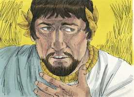 

**2** 	E disse aos seus criados: Este é João o Batista; ressuscitou dos mortos, e por isso estas maravilhas operam nele.

**3** 	Porque Herodes tinha prendido João, e tinha-o maniatado e encerrado no cárcere, por causa de Herodias, mulher de seu irmão Filipe;

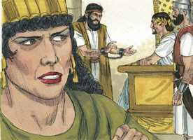 

**4** 	Porque João lhe dissera: Não te é lícito possuí-la.

**5** 	E, querendo matá-lo, temia o povo; porque o tinham como profeta.

**6** 	Festejando-se, porém, o dia natalício de Herodes, dançou a filha de Herodias diante dele, e agradou a Herodes.

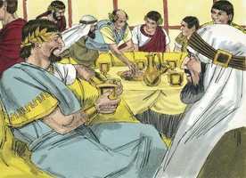 

**7** 	Por isso prometeu, com juramento, dar-lhe tudo o que pedisse;

**8** 	E ela, instruída previamente por sua mãe, disse: Dá-me aqui, num prato, a cabeça de João o Batista.

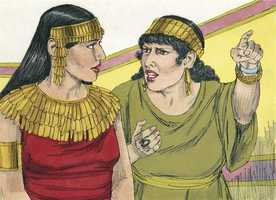 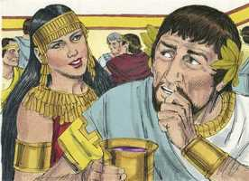 

**9** 	E o rei afligiu-se, mas, por causa do juramento, e dos que estavam à mesa com ele, ordenou que se lhe desse.

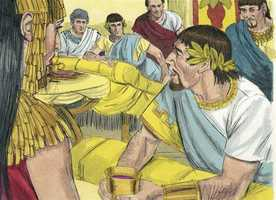 

**10** 	E mandou degolar João no cárcere.

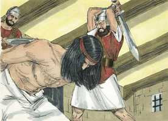 

**11** 	E a sua cabeça foi trazida num prato, e dada à jovem, e ela a levou a sua mãe.

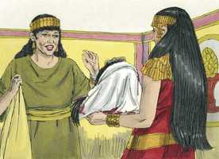 

**12** 	E chegaram os seus discípulos, e levaram o corpo, e o sepultaram; e foram anunciá-lo a Jesus.

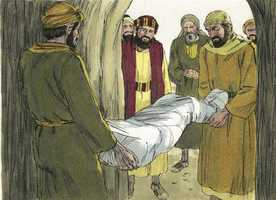 

**13** 	E Jesus, ouvindo isto, retirou-se dali num barco, para um lugar deserto, apartado; e, sabendo-o o povo, seguiu-o a pé desde as cidades.

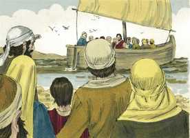 

**14** 	E, Jesus, saindo, viu uma grande multidão, e possuído de íntima compaixão para com ela, curou os seus enfermos.

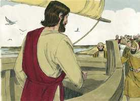 

**15** 	E, sendo chegada a tarde, os seus discípulos aproximaram-se dele, dizendo: O lugar é deserto, e a hora é já avançada; despede a multidão, para que vão pelas aldeias, e comprem comida para si.

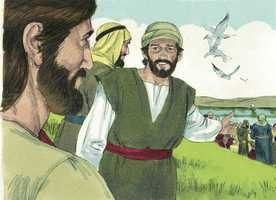 

**16** 	Jesus, porém, lhes disse: Não é mister que vão; dai-lhes vós de comer.

 

**17** 	Então eles lhe disseram: Não temos aqui senão cinco pães e dois peixes.

 

**18** 	E ele disse: Trazei-mos aqui.

**19** 	E, tendo mandado que a multidão se assentasse sobre a erva, tomou os cinco pães e os dois peixes, e, erguendo os olhos ao céu, os abençoou, e, partindo os pães, deu-os aos discípulos, e os discípulos à multidão.

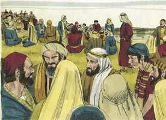   

**20** 	E comeram todos, e saciaram-se; e levantaram dos pedaços, que sobejaram, doze alcofas cheias.

 

**21** 	E os que comeram foram quase cinco mil homens, além das mulheres e crianças.

**22** 	E logo ordenou Jesus que os seus discípulos entrassem no barco, e fossem adiante para o outro lado, enquanto despedia a multidão.

**23** 	E, despedida a multidão, subiu ao monte para orar, à parte. E, chegada já a tarde, estava ali só.

 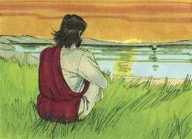 

**24** 	E o barco estava já no meio do mar, açoitado pelas ondas; porque o vento era contrário;

 

**25** 	Mas, à quarta vigília da noite, dirigiu-se Jesus para eles, andando por cima do mar.

 

**26** 	E os discípulos, vendo-o andando sobre o mar, assustaram-se, dizendo: É um fantasma. E gritaram com medo.

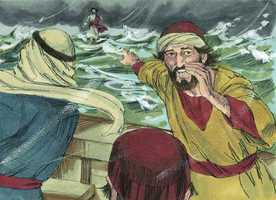 

**27** 	Jesus, porém, lhes falou logo, dizendo: Tende bom ânimo, sou eu, não temais.

 

**28** 	E respondeu-lhe Pedro, e disse: Senhor, se és tu, manda-me ir ter contigo por cima das águas.

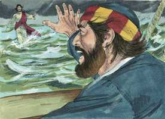 

**29** 	E ele disse: Vem. E Pedro, descendo do barco, andou sobre as águas para ir ter com Jesus.

 

**30** 	Mas, sentindo o vento forte, teve medo; e, começando a ir para o fundo, clamou, dizendo: Senhor, salva-me!

 

**31** 	E logo Jesus, estendendo a mão, segurou-o, e disse-lhe: Homem de pouca fé, por que duvidaste?

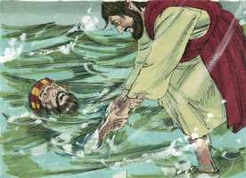 

**32** 	E, quando subiram para o barco, acalmou o vento.

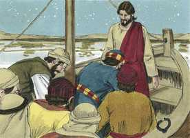 

**33** 	Então aproximaram-se os que estavam no barco, e adoraram-no, dizendo: És verdadeiramente o Filho de Deus.

**34** 	E, tendo passado para o outro lado, chegaram à terra de Genesaré.

**35** 	E, quando os homens daquele lugar o conheceram, mandaram por todas aquelas terras em redor e trouxeram-lhe todos os que estavam enfermos.

**36** 	E rogavam-lhe que ao menos eles pudessem tocar a orla da sua roupa; e todos os que a tocavam ficavam sãos.

> **Cmt MHenry** Intro: Onde quer que fosse, Cristo fazia o bem. Eles levavam ante Ele a todos os que estavam doentes. Acudiam humildemente implorando sua ajuda. As experiências do próximo podem conduzir-nos e estimular-nos a buscar a Cristo. A tantos como tocou, fez perfeitamente íntegros. Aos que Cristo Sara, os Sara perfeitamente. Se os homens estivessem mais familiarizados com Cristo e com o estado enfermo de suas almas, se amontoariam para receber seu poder curador. A virtude curadora não estava no dedo, mas na fé deles; ou, melhor, estava no Cristo ao qual se aferrou a fé deles.> Não são seguidores de Cristo os que não podem desfrutar o estar a sós com Deus e seus corações. Em ocasiões especiais, e quando achamos alargados nossos corações, é bom continuar orando secretamente por longo tempo, e derramar nossos corações ante o Senhor. Não é coisa nova para os discípulos de Cristo encontrar-se com tormentas no caminho do dever, todavia, por isso Ele se mostra com maior graça e favor a eles. Ele pode tomar o caminho que lhe apraz para salvar a seu povo. mas até as aparências de liberação ocasionam às vezes problemas e perplexidade ao povo de Deus pelos erros que têm acerca de Cristo. Nada deveria assustar os que têm a Cristo junto deles e que sabem que é seu; nem a mesma morte. Pedro caminhou sobre a água, não por diversão nem por vanglória, senão para ir a Jesus, e nisso foi sustentado maravilhosamente. É prometido sustento especial, e deve esperar-se, mas só nas empresas espirituais; tampouco podemos sequer ir a Jesus a menos que sejamos sustentados pelo seu poder. Cristo lhe disse a Pedro que fosse a Ele, não só para que pudesse andar sobre a água, e assim conhecer o poder de seu Senhor, senão para que conhecesse sua própria fraqueza. Freqüentemente o Senhor permite que seus servos tenham o que escolhem, para humilhá-los e prová-los, e para mostrar a grandeza de seu poder e de sua graça. Quando deixamos de olhar a Cristo para mirar a grandeza das dificuldades que se nos opõem, começamos a desfalecer, mas quando O invocamos, Ele estende seu braço e nos salva. Cristo é o grande Salvador; os que serão salvos devem ir a Ele e clamar pedindo salvação; nunca somos levados a este ponto, senão até que nos achamos naufragando: o sentido da necessidade nos leva a Ele. Repreendeu a Pedro. Se pudermos acreditar mais, sofreríamos menos. A fraqueza da fé e o predomínio de nossas dúvidas desagradam a nosso Senhor Jesus, porque não há uma boa razão para que os discípulos de Cristo tenham dúvidas. Ainda num dia tempestuoso, Ele é para eles uma ajuda muito presente. Ninguém senão o Criador do mundo podia multiplicar os pães, ninguém senão seu Governador poderia andar sobre as águas do mar: os discípulos se renderam à evidência e confessaram sua fé. Eles foram apropriadamente afetados e adoraram a Cristo. O que vá a Deus deve crer; e o que crê em Deus irá a Ele ([Hebreus 11.6](../58N-Hb/11.md#6)).> Quando se retiram Cristo e sua palavra, é melhor para nós segui-lo, procurando os médios de graça para nossa alma antes que qualquer vantagem mundana. A presença de Cristo e de seu evangelho, não só fazem suportável o deserto, senão também desejável. A pequena provisão de pão foi aumentada pelo poder criador de Cristo, até que toda a multidão se satisfez. Ao buscar o bem-estar para a alma dos homens, devemos ter compaixão igualmente de seus corpos. Também lembremos de anelar sempre uma bênção para nossa comida, e aprendamos a evitar todo desperdiço, porque a frugalidade é a fonte apropriada da generosidade. Veja-se neste milagre um emblema do Pão de vida que desceu do céu para sustentar nossa alma que perecia. As providências do Evangelho de Cristo parecem magras e escassas para o mundo, porém satisfazem a todos os que por fé se alimentam dEle em seus corações com ação de graças.> O terror e a admoestação da consciência que Herodes, como outros ofensores ousados, não puderam tirar-se de cima, são prova e advertência de um juízo futuro e de sua miséria futura. Mas pode haver terror pela convicção de pecado onde não está a verdade da conversão. Quando os homens pretendem favorecer o evangelho, mas ainda vivem no mal, não devemos permitir que se iludam a si mesmos, senão livrar nossa consciência como fez João. o mundo pode dizer que isto é rudeza e zelo cego. Os professantes falsos ou os cristãos tímidos podem censurá-lo como falta de civilização, mas os inimigos mais poderosos não podem ir além de onde ao Senhor lhe apraz permitir. Herodes temia que mandar matar a João pudesse levantar uma revolta no povo, o que este não fez; mas nunca temeu que pudesse despertar sua própria consciência em sua contra, o que sim aconteceu. Os homens temem ser enforcados pelo que não temem ser condenados. As épocas de alegria e júbilo carnal são temporadas convenientes para executar maus desígnios contra o povo de Deus. Herodes recompensou profusamente uma dança indigna, enquanto a prisão e a morte foram a recompensa para o homem de Deus que procurava salvar sua alma. Mas havia uma verdadeira maldade contra João após seu consentimento ou, do contrário, Herodes teria achado formas de livrar-se de sua promessa. Quando os pastores de embaixo são derrubados, as ovelhas não têm que dispersar-se, enquanto tenham o Grande Pastor ao qual acudir. É melhor ser levado a Cristo por necessidade e por perda que deixar de ir a Ele completamente.