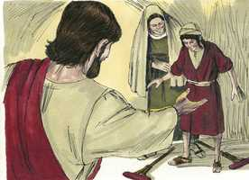

# Mateus Cap 15

**1** 	ENTÃO chegaram ao pé de Jesus uns escribas e fariseus de Jerusalém, dizendo:

**2** 	Por que transgridem os teus discípulos a tradição dos anciãos? pois não lavam as mãos quando comem pão.

**3** 	Ele, porém, respondendo, disse-lhes: Por que transgredis vós, também, o mandamento de Deus pela vossa tradição?

**4** 	Porque Deus ordenou, dizendo: Honra a teu pai e a tua mãe; e: Quem maldisser ao pai ou à mãe, certamente morrerá.

**5** 	Mas vós dizeis: Qualquer que disser ao pai ou à mãe: É oferta ao Senhor o que poderias aproveitar de mim; esse não precisa honrar nem a seu pai nem a sua mãe,

**6** 	E assim invalidastes, pela vossa tradição, o mandamento de Deus.

**7** 	Hipócritas, bem profetizou Isaías a vosso respeito, dizendo:

**8** 	Este povo se aproxima de mim com a sua boca e me honra com os seus lábios, mas o seu coração está longe de mim.

**9** 	Mas, em vão me adoram, ensinando doutrinas que são preceitos dos homens.

**10** 	E, chamando a si a multidão, disse-lhes: Ouvi, e entendei:

**11** 	O que contamina o homem não é o que entra na boca, mas o que sai da boca, isso é o que contamina o homem.

**12** 	Então, acercando-se dele os seus discípulos, disseram-lhe: Sabes que os fariseus, ouvindo essas palavras, se escandalizaram?

**13** 	Ele, porém, respondendo, disse: Toda a planta, que meu Pai celestial não plantou, será arrancada.

**14** 	Deixai-os; são cegos condutores de cegos. Ora, se um cego guiar outro cego, ambos cairão na cova.

**15** 	E Pedro, tomando a palavra, disse-lhe: Explica-nos essa parábola.

**16** 	Jesus, porém, disse: Até vós mesmos estais ainda sem entender?

**17** 	Ainda não compreendeis que tudo o que entra pela boca desce para o ventre, e é lançado fora?

**18** 	Mas, o que sai da boca, procede do coração, e isso contamina o homem.

**19** 	Porque do coração procedem os maus pensamentos, mortes, adultérios, fornicação, furtos, falsos testemunhos e blasfêmias.

**20** 	São estas coisas que contaminam o homem; mas comer sem lavar as mãos, isso não contamina o homem.

**21** 	E, partindo Jesus dali, foi para as partes de Tiro e de Sidom.

**22** 	E eis que uma mulher cananéia, que saíra daquelas cercanias, clamou, dizendo: Senhor, Filho de Davi, tem misericórdia de mim, que minha filha está miseravelmente endemoninhada.

**23** 	Mas ele não lhe respondeu palavra. E os seus discípulos, chegando ao pé dele, rogaram-lhe, dizendo: Despede-a, que vem gritando atrás de nós.

**24** 	E ele, respondendo, disse: Eu não fui enviado senão às ovelhas perdidas da casa de Israel.

**25** 	Então chegou ela, e adorou-o, dizendo: Senhor, socorre-me!

**26** 	Ele, porém, respondendo, disse: Não é bom pegar no pão dos filhos e deitá-lo aos cachorrinhos.

**27** 	E ela disse: Sim, Senhor, mas também os cachorrinhos comem das migalhas que caem da mesa dos seus senhores.

**28** 	Então respondeu Jesus, e disse-lhe: Ó mulher, grande é a tua fé! Seja isso feito para contigo como tu desejas. E desde aquela hora a sua filha ficou sã.

**29** 	Partindo Jesus dali, chegou ao pé do mar da Galiléia, e, subindo a um monte, assentou-se lá.

 

**30** 	E veio ter com ele grandes multidões, que traziam coxos, cegos, mudos, aleijados, e outros muitos, e os puseram aos pés de Jesus, e ele os sarou,

**31** 	De tal sorte, que a multidão se maravilhou vendo os mudos a falar, os aleijados sãos, os coxos a andar, e os cegos a ver; e glorificava o Deus de Israel.

**32** 	E Jesus, chamando os seus discípulos, disse: Tenho compaixão da multidão, porque já está comigo há três dias, e não tem o que comer; e não quero despedi-la em jejum, para que não desfaleça no caminho.

**33** 	E os seus discípulos disseram-lhe: De onde nos viriam, num deserto, tantos pães, para saciar tal multidão?

**34** 	E Jesus disse-lhes: Quantos pães tendes? E eles disseram: Sete, e uns poucos de peixinhos.

**35** 	Então mandou à multidão que se assentasse no chão,

**36** 	E, tomando os sete pães e os peixes, e dando graças, partiu-os, e deu-os aos seus discípulos, e os discípulos à multidão.

**37** 	E todos comeram e se saciaram; e levantaram, do que sobejou, sete cestos cheios de pedaços.

**38** 	Ora, os que tinham comido eram quatro mil homens, além de mulheres e crianças.

**39** 	E, tendo despedido a multidão, entrou no barco, e dirigiu-se ao território de Magadã.

> **Cmt MHenry** Intro: Qualquer seja nosso caso, a única maneira de achar bem-estar e alívio é deixá-lo aos pés de Cristo, submetê-lo a Ele e referi-lo a sua disposição. Os que desejam saúde espiritual de Cristo, devem ser governados como Ele se agrada. Veja-se o trabalho que tem feito o pecado: a quanta variedade de doenças estão submetidos os corpos humanos. Aqui havia tais enfermidades que a fantasia não podia sequer suportar sua causa nem sua cura; contudo, estavam sujeitas ao mando de Cristo. As curas espirituais que opera Cristo são maravilhosas. Quando faz que as almas cegas enxerguem pela fé, que o mudo fale pela oração, o coxo e o manco andem em santa obediência, é para maravilhar-se. Seu poder também foi demonstrado à multidão na abundante provisão que fez para eles: a forma é muito semelhante à anterior. Todos comeram e ficaram satisfeitos. Cristo enche aos que alimenta. Com Cristo há pão suficiente e para guardar; provisões de graça de mais para os que as procuram, e para os que as buscam mais. Cristo despediu a gente. Embora os havia alimentado duas vezes, não devem esperar milagres para encontrar seu pão diário. Voltem a casa, a suas ocupações e a suas mesas. Senhor, aumenta nossa fé, e perdoa nossa incredulidade, ensinando-nos a viver de tua plenitude e tua abundância para todas as coisas que pertencem a esta vida e a vindoura.> Os mais longínquos e escuros cantos do país recebem as influências de Cristo; depois, os confins da terra verão sua salvação.\ A angústia e o transtorno de sua família levou a uma manhã a Cristo; embora seja a necessidade a que nos empurra a Cristo, contudo, não seremos rejeitados por Ele. Ela não limitou a Cristo a nenhum caso particular de misericórdia, mas misericórdia, misericórdia, foi o que ela rogou: ela não aduz méritos, senão que depende da misericórdia. Dever dos pais é orar pelos filhos, e serem fervorosos para orar por eles, especialmente por suas almas. Vocês têm um filho ou uma filha, dolorosamente afligidos por um demônio de orgulho, ou um demônio imundo, um demônio de maldade, que estão cativos por sua vontade? Este é um caso mais deplorável que o da possessão corporal, e vocês devem levá-los por fé e oração a Cristo, que somente Ele é capaz de sará-los. Muitos métodos da providência de Cristo para tratar com seu povo, e especialmente de sua graça, que resultam escuros e confundem, podem ser explicados por este relato, que ensina que pode haver amor no coração de Cristo ainda que seu rosto esteja carrancudo; e nos anima a confiar todavia nEle, embora pareça pronto para matar-nos. Aos que Cristo pensa honrar mais, os humilha para que sintam sua indignidade. Um coração orgulhoso sem humilhar não suportaria isso; ela o converteu em argumento para validar sua petição. O estado desta mulher é um emblema do estado do pecador, profundamente ciente da miséria de sua alma. O mínimo de Cristo é precioso para um crente, até as mesmas migalhas do Pão da vida. De todas as graças, é a fé a que mais honra a Cristo; portanto, de todas as graças, Cristo honra mais a fé. Ele sarou a filha. Ele falou e foi feito. Daqui, os que buscam a ajuda do Senhor e não recebem resposta de graça, aprendam a converter ainda sua indignidade e desalento em rogos de misericórdia.> Cristo mostra que a contaminação que deviam temer não era a que entrava pela boca como alimento, senão o que saia de suas bocas, que demonstrava a maldade de seus corações. Nada durará na alma, senão a graça regeneradora do Espírito Santo; e nada deve ser admitido na igreja, senão o que é do alto; portanto, não devemos perturbar-nos por quem se ofenda pela afirmação clara e oportuna da verdade. Os discípulos pedem que lhes ensine melhor sobre esta matéria. Onde uma cabeça débil duvida de uma palavra de Cristo, o coração reto e a mente disposta buscam instrução. O coração é perverso ([Jeremias 17.9](../24A-Jr/17.md#9)), porque não há pecado em palavra e obra que não esteja primeiro no coração. Saem todos do homem, e são frutos da maldade que está no coração, e ali opera. Quando Cristo ensina, mostra aos homens o engano e a maldade de seus corações; ensina-lhes a humilhar-se e buscar serem purificados de seus pecados e de sua imundícia no manancial aberto.> " As adições às leis de Deus desacreditam sua sabedoria, como se Ele tiver deixado fora algo necessário que o homem possa suprir; de uma ou de outra forma, levam sempre a que os homens desobedeçam a Deus. Quão agradecidos devemos estar pela palavra escrita de Deus! nunca pensemos que a religião da Bíblia pode ser melhorada por algum agregado humano, seja em doutrina ou na prática. Nosso bendito Senhor falou de suas tradições como inventos próprios deles, e indicou um exemplo em que isto era muito claro: as transgressões do quinto mandamento. Quando se pedia a eles que ajudassem às necessidades de um pai, eles alegavam que tinham dedicado ao templo aquilo de que podiam dispor para ajudá-los, ainda quando não se separavam dessas coisas, e portanto seus pais não deviam esperar nada deles. Isto era anular a efetividade do mandamento de Deus. A sina dos hipócritas está num pequeno parêntese: *"Em vão me adoram".* Não comprazerá a Deus nem aproveitará a eles; eles confiam na vaidade, e a vaidade será sua recompensa. "