# Mateus Cap 17

**1** 	SEIS dias depois, tomou Jesus consigo a Pedro, e a Tiago, e a João, seu irmão, e os conduziu em particular a um alto monte,

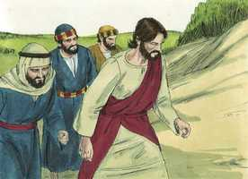 

**2** 	E transfigurou-se diante deles; e o seu rosto resplandeceu como o sol, e as suas vestes se tornaram brancas como a luz.

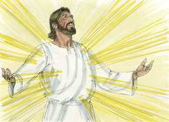 

**3** 	E eis que lhes apareceram Moisés e Elias, falando com ele.

 

**4** 	E Pedro, tomando a palavra, disse a Jesus: Senhor, bom é estarmos aqui; se queres, façamos aqui três tabernáculos, um para ti, um para Moisés, e um para Elias.

 

**5** 	E, estando ele ainda a falar, eis que uma nuvem luminosa os cobriu. E da nuvem saiu uma voz que dizia: Este é o meu amado Filho, em quem me comprazo; escutai-o.

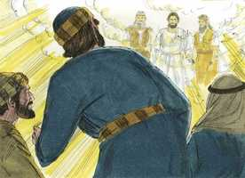 

**6** 	E os discípulos, ouvindo isto, caíram sobre os seus rostos, e tiveram grande medo.

**7** 	E, aproximando-se Jesus, tocou-lhes, e disse: Levantai-vos, e não tenhais medo.

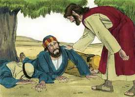 

**8** 	E, erguendo eles os olhos, ninguém viram senão unicamente a Jesus.

**9** 	E, descendo eles do monte, Jesus lhes ordenou, dizendo: A ninguém conteis a visão, até que o Filho do homem seja ressuscitado dentre os mortos.

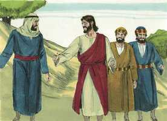 

**10** 	E os seus discípulos o interrogaram, dizendo: Por que dizem então os escribas que é mister que Elias venha primeiro?

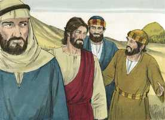 

**11** 	E Jesus, respondendo, disse-lhes: Em verdade Elias virá primeiro, e restaurará todas as coisas;

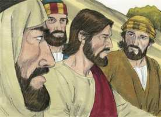 

**12** 	Mas digo-vos que Elias já veio, e não o conheceram, mas fizeram-lhe tudo o que quiseram. Assim farão eles também padecer o Filho do homem.

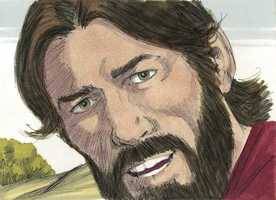 

**13** 	Então entenderam os discípulos que lhes falara de João o Batista.

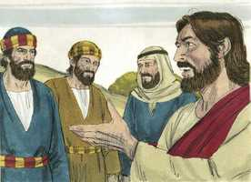 

**14** 	E, quando chegaram à multidão, aproximou-se-lhe um homem, pondo-se de joelhos diante dele, e dizendo:

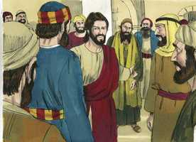 

**15** 	Senhor, tem misericórdia de meu filho, que é lunático e sofre muito; pois muitas vezes cai no fogo, e muitas vezes na água;

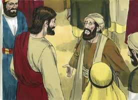 

**16** 	E trouxe-o aos teus discípulos; e não puderam curá-lo.

 

**17** 	E Jesus, respondendo, disse: Ó geração incrédula e perversa! até quando estarei eu convosco, e até quando vos sofrerei? Trazei-mo aqui.

 

**18** 	E, repreendeu Jesus o demônio, que saiu dele, e desde aquela hora o menino sarou.

 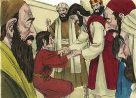 

**19** 	Então os discípulos, aproximando-se de Jesus em particular, disseram: Por que não pudemos nós expulsá-lo?

**20** 	E Jesus lhes disse: Por causa de vossa incredulidade; porque em verdade vos digo que, se tiverdes fé como um grão de mostarda, direis a este monte: Passa daqui para acolá, e há de passar; e nada vos será impossível.

**21** 	Mas esta casta de demônios não se expulsa senão pela oração e pelo jejum.

**22** 	Ora, achando-se eles na Galiléia, disse-lhes Jesus: O Filho do homem será entregue nas mãos dos homens;

**23** 	E matá-lo-ão, e ao terceiro dia ressuscitará. E eles se entristeceram muito.

**24** 	E, chegando eles a Cafarnaum, aproximaram-se de Pedro os que cobravam as dracmas, e disseram: O vosso mestre não paga as dracmas?

**25** 	Disse ele: Sim. E, entrando em casa, Jesus se lhe antecipou, dizendo: Que te parece, Simão? De quem cobram os reis da terra os tributos, ou o censo? Dos seus filhos, ou dos alheios?

**26** 	Disse-lhe Pedro: Dos alheios. Disse-lhe Jesus: Logo, estão livres os filhos.

**27** 	Mas, para que os não escandalizemos, vai ao mar, lança o anzol, tira o primeiro peixe que subir, e abrindo-lhe a boca, encontrarás um estáter; toma-o, e dá-o por mim e por ti.

> **Cmt MHenry** Intro: Pedro estava seguro de que seu Mestre estava pronto para fazer o justo. Cristo falou primeiro de dar-lhe provas de que não se podia esconder dEle nenhum pensamento. Nunca devemos renunciar a nosso dever por temor a ofender, mas às vezes devemos negar-nos a nós mesmos em nossos interesses mundanos para não ofender. Contudo, o dinheiro estava no peixe; unicamente Aquele que conhece todas as coisas podia saber disso, e só o poder onipotente podia levá-lo ao anzol de Pedro.\ O poder e a pobreza de Cristo devem mencionar-se juntos. Se formos chamados pela providência a sermos pobres como nosso Senhor, confiemos em seu poder e nosso Deus satisfará toda nossa necessidade, conforme a suas riquezas em glória por Cristo Jesus. na senda da obediência, no curso, talvez, de nossa vocação habitual, como ajudou a Pedro, assim nos ajudará. Caso se apresentar uma emergência repentina, que não estejamos preparados para enfrentar, não recorramos ao próximo sem antes buscar a Cristo.> Cristo sabia perfeitamente todas as coisas que lhe aconteceriam, mas empreendeu a obra de nossa redenção, o qual demonstra fortemente seu amor. Que humilhação exterior e glória divina foi a vida do Redentor! Toda sua humilhação terminou em sua exaltação. Aprendamos a suportar a cruz, a desprezar as riquezas e as honras mundanas e a estar contentes com sua vontade.> O caso dos filhos afligidos deve apresentar-se a Deus com oração fervorosa e fiel. Cristo curou o menino. Embora a gente era perversa e Cristo era provocado, de qualquer jeito atendeu a criança. quando falham todas as outras ajudas e socorros, somos bem-vindos a Cristo, podemos confiar nEle e em seu poder e bondade. Veja-se aqui um sinal do esforço de Cristo como nosso Redentor. Dá alento aos pais para que levem seus filhos a Cristo, cujas almas estão sob o poder de Satanás. Ele é capaz de sará-los e está tão disposto como poderoso w. não só levai-os a Cristo com oração, senão levem-nos à palavra de Cristo; aos médios pelos quais se derrubam as fortalezas de Satanás na alma. Bom é que desconfiemos de nós mesmos e de nossa força, mas é desagradável para Cristo quando desconfiamos de qualquer poder derivado dEle ou outorgado por Ele. também havia algo na doença que dificultava a cura. O poder extraordinário de Satanás não deve desalentar nossa fé, senão estimular-nos a um maior fervor ao orar a Deus para que seja aumentada. Nos maravilhamos ao ver que Satanás tinha a possessão corporal deste jovem, desde criança, quando tem a possessão espiritual de todo filho de Adão desde a queda!> Agora, os discípulos contemplaram algo da glória de Cristo, como do unigênito do Pai. Tinha o propósito de sustentar a fé deles quando tivessem que presenciar sua crucifixão; lhes daria uma idéia da glória preparada para eles, quando fossem transformados por seu poder e fossem feitos como Ele. Os apóstolos ficaram surpreendidos pela visão gloriosa. Pedro pensou que era mais desejável continuar ali, e não tornar a descer para encontrar-se com os sofrimentos, dos quais tinha tão pouca disposição para ouvir. Nisto não sabia o que dizia. Erramos se esperamos um céu aqui na terra. Sejam quais forem os tabernáculos que nos proponhamos fazer para nós neste mundo, sempre devemos lembrar-nos de pedir permissão a Cristo. ainda não tinha sido oferecido o sacrifício sem o qual as almas dos homens pecadores não podem ser salvas; havia serviços importantes que Pedro e seus irmãos deviam cumprir. Enquanto Pedro falava, uma nuvem brilhante os cobriu, sinal da presença e glória divina. Desde que o homem pecou, e ouviu a voz de Deus no jardim, as aparências desacostumadas de Deus têm sido terríveis para o homem. Caíram prostrados por terra até que Jesus lhes deu ânimos; quando olharam em volta viram somente seu Senhor como o viam correntemente. Devemos passar por diversas experiências em nosso caminho à glória, e quando regressamos ao mundo depois de participar num meio de graça, devemos ter cuidado de levar a Cristo conosco, para que assim seja nosso consolo saber que Ele está conosco.