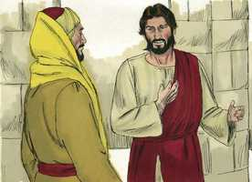
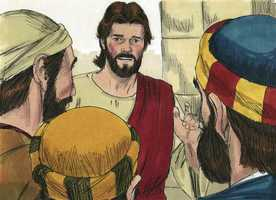

# Mateus Cap 19

**1** 	E ACONTECEU que, concluindo Jesus estes discursos, saiu da Galiléia, e dirigiu-se aos confins da Judéia, além do Jordão;

**2** 	E seguiram-no grandes multidões, e curou-as ali.

**3** 	Então chegaram ao pé dele os fariseus, tentando-o, e dizendo-lhe: É lícito ao homem repudiar sua mulher por qualquer motivo?

**4** 	Ele, porém, respondendo, disse-lhes: Não tendes lido que aquele que os fez no princípio macho e fêmea os fez,

**5** 	E disse: Portanto, deixará o homem pai e mãe, e se unirá à sua mulher, e serão dois numa só carne?

**6** 	Assim não são mais dois, mas uma só carne. Portanto, o que Deus ajuntou não o separe o homem.

**7** 	Disseram-lhe eles: Então, por que mandou Moisés dar-lhe carta de divórcio, e repudiá-la?

**8** 	Disse-lhes ele: Moisés, por causa da dureza dos vossos corações, vos permitiu repudiar vossas mulheres; mas ao princípio não foi assim.

**9** 	Eu vos digo, porém, que qualquer que repudiar sua mulher, não sendo por causa de fornicação, e casar com outra, comete adultério; e o que casar com a repudiada também comete adultério.

**10** 	Disseram-lhe seus discípulos: Se assim é a condição do homem relativamente à mulher, não convém casar.

**11** 	Ele, porém, lhes disse: Nem todos podem receber esta palavra, mas só aqueles a quem foi concedido.

**12** 	Porque há eunucos que assim nasceram do ventre da mãe; e há eunucos que foram castrados pelos homens; e há eunucos que se castraram a si mesmos, por causa do reino dos céus. Quem pode receber isto, receba-o.

**13** 	Trouxeram-lhe, então, alguns meninos, para que sobre eles pusesse as mãos, e orasse; mas os discípulos os repreendiam.

**14** 	Jesus, porém, disse: Deixai os meninos, e não os estorveis de vir a mim; porque dos tais é o reino dos céus.

**15** 	E, tendo-lhes imposto as mãos, partiu dali.

**16** 	E eis que, aproximando-se dele um jovem, disse-lhe: Bom Mestre, que bem farei para conseguir a vida eterna?

 

**17** 	E ele disse-lhe: Por que me chamas bom? Não há bom senão um só, que é Deus. Se queres, porém, entrar na vida, guarda os mandamentos.

 

**18** 	Disse-lhe ele: Quais? E Jesus disse: Não matarás, não cometerás adultério, não furtarás, não dirás falso testemunho;

**19** 	Honra teu pai e tua mãe, e amarás o teu próximo como a ti mesmo.

**20** 	Disse-lhe o jovem: Tudo isso tenho guardado desde a minha mocidade; que me falta ainda?

 

**21** 	Disse-lhe Jesus: Se queres ser perfeito, vai, vende tudo o que tens e dá-o aos pobres, e terás um tesouro no céu; e vem, e segue-me.

 

**22** 	E o jovem, ouvindo esta palavra, retirou-se triste, porque possuía muitas propriedades.

 

**23** 	Disse então Jesus aos seus discípulos: Em verdade vos digo que é difícil entrar um rico no reino dos céus.

 

**24** 	E, outra vez vos digo que é mais fácil passar um camelo pelo fundo de uma agulha do que entrar um rico no reino de Deus.

**25** 	Os seus discípulos, ouvindo isto, admiraram-se muito, dizendo: Quem poderá pois salvar-se?

 

**26** 	E Jesus, olhando para eles, disse-lhes: Aos homens é isso impossível, mas a Deus tudo é possível.

 

**27** 	Então Pedro, tomando a palavra, disse-lhe: Eis que nós deixamos tudo, e te seguimos; que receberemos?

 

**28** 	E Jesus disse-lhes: Em verdade vos digo que vós, que me seguistes, quando, na regeneração, o Filho do homem se assentar no trono da sua glória, também vos assentareis sobre doze tronos, para julgar as doze tribos de Israel.

 

**29** 	E todo aquele que tiver deixado casas, ou irmãos, ou irmãs, ou pai, ou mãe, ou mulher, ou filhos, ou terras, por amor de meu nome, receberá cem vezes tanto, e herdará a vida eterna.

**30** 	Porém, muitos primeiros serão os derradeiros, e muitos derradeiros serão os primeiros.

> **Cmt MHenry** Intro: Embora Cristo falou com tanta força, poucos dos que têm riqueza confiam em suas palavras. Quão poucos dos pobres não são tentados e criar dívidas! Mas o fervor do homem neste assunto é como se tratassem de edificar um muro elevado para encerrar a si mesmos e seus filhos longe do céu. Deve ser satisfatório para os que estamos em condição baixa o não estarmos expostos à tentação de uma situação próspera e elevada. Se eles vivem com maior dureza que o rico neste mundo, se vão com maior facilidade a um mundo melhor, não terão razão de queixar-se. As palavras de Cristo mostram que custa muito que um rico seja um bom cristão e seja salvo. O caminho ao céu é caminho estreito para todos, e a porta que ali conduz, é porta apertada; particularmente para a gente rica. Esperam-se mais deveres deles que dos outros, e os pecados os acossam com mais facilidade. Custa não ser fascinado por um mundo sorridente. A gente rica tem por sobre o resto uma grande conta a pagar por suas oportunidades. É absolutamente impossível que um homem que deposita seu coração em suas riqueza vá para o céu. Cristo usou uma expressão que denota uma dificuldade absolutamente insuperável pelo poder do homem. Nada menos que a todo-poderosa graça de Deus fará que um rico supere esta dificuldade. Então, quem poderá ser salvo? Se as riquezas estorvam a gente rica, não são achados o orgulho e a concupiscência pecaminosa nos que não são ricos, e resultam tão perigosos para eles? Quem pode ser salvo?, dizem os discípulos. Ninguém, diz Cristo, por nenhum poder criado. O começo, a profissão e o aperfeiçoamento da obra de salvação dependem inteiramente da onipotência de Deus, para Quem todas as coisas são possíveis. Não se trata de que a gente rica seja salva *em* seu mundanismo, senão que sejam salvos Notas Bíblia de Estudo NVI-out_images.txt Simple_Bible_Reader_v2.9-bible_converter.exe seu mundanismo. Pedro disse: Nós temos deixado tudo. Ai! Não era senão um pobre, somente com uns poucos barcos e redes, mas observe-se como fala Pedro, como se tivesse entregado grande coisa. Somos demasiado capazes de dar o valor máximo a nossos serviços e sofrimentos, nossas perdas e gastos por Cristo. Todavia, Cristo não os repreende porque era pouco o que eles tinham deixado, pois era tudo o que tinham, e tão querido para eles como se tivesse sido mais. Cristo levou a bem que eles deixassem tudo para segui-lo; aceita segundo o que tem o homem. A promessa de nosso Senhor para os apóstolos é que quando o Filho do homem se assentar no trono de sua glória, fará novas todas as coisas, e eles se assentaram com Ele em juízo contra os que serão julgados conforme a sua doutrina. Isto estabelece a honra, a dignidade e a autoridade do ofício e ministério deles. Nosso Senhor agrega que qualquer que tenha deixado casa ou possessões ou comodidades por Ele e pelo Evangelho, seria recompensado no final. Que Deus nos dê fé para que nossa esperança descanse nesta promessa Sua; então, estaremos dispostos para todo serviço e sacrifício. Nosso Salvador, no último versículo, elimina o erro de alguns. A herança celestial não é entregue como as terrenas, senão conforme com o beneplácito de Deus. não confiemos em aparências promissórias, nem na profissão externa. Outros podem chegar a ser eminentes em fé e santidade, até onde nos toca saber.> Cristo sabia que a cobiça era o pecado que mais facilmente incomodava a este jovem; embora tiver obtido honestamente que possuía, não podia, contudo, separar-se daquilo com alegria, e assim demonstrava sua falta de sinceridade. As promessas de Cristo facilitam seus preceitos e fazem que seu jugo seja ligeiro e muito consolador; mas esta promessa foi tanto um juízo da fé do jovem, como o preceito o foi de sua caridade e desprezo do mundo. É-nos requerido seguir a Cristo atentando devidamente suas ordenanças, seguindo estritamente seu padrão e submetendo-nos alegremente a suas disposições, e isto por amor dEle e por dependermos dEle. Vender tudo e dá-lo aos pobres não servirá se não vamos seguir a Cristo. O evangelho é o único remédio para os pecadores perdidos. Muitos dos que se abstêm de vícios grosseiros são os que não atentam sua obrigação para com Deus. milhares de casos de desobediência de pensamento, palavra e obra são registrados contra eles no livro de Deus. assim, pois, são muitos os que abandonam a Cristo por amar este mundo presente: eles se sentem convictos e desejosos, porém se afastam tristes, talvez tremendo. Nos convém provar-nos nestes assuntos porque o Senhor nos julgará.> É bom quando acudimos a Cristo e levamos nossos filhos. Os pequenos podem ser levados a Cristo porque necessitam e podem receber bênçãos dEle, e por ter um interesse em sua intercessão. Nós não podemos senão pedir uma bênção para eles: somente Cristo pode mandar a bênção. Bom para nós é que Cristo tenha mais amor e ternura em si dos que tem o melhor de seus discípulos. Aprendamos dEle a não descartar nenhuma alma disposta e bem-intencionada em sua busca de Cristo, embora não sejam senão fracos. Os que se dão a Cristo como parte de sua compra, não os lançará fora de jeito nenhum. Portanto, não gosta dos que proíbem e tratam de deixar fora os que Ele tem recebido. Todos os cristãos devem levar seus filhos ao Salvador para que os abençoe com bênçãos espirituais.> Os fariseus desejavam surpreender a Jesus em algo que pudessem apresentar como ofensa à lei de Moisés. Os casos matrimoniais eram numerosos e, às vezes, paradoxais; feito assim não pela lei de Deus mas pelas injúrias e torpezas dos homens, a gente costuma resolver o que quer fazer antes de pedir conselho. Jesus replicou perguntando se não haviam lido o relato da criação, e o primeiro exemplo do matrimônio; deste modo, indica que todo desvio disto era má. A melhor condição para nós, que devemos escolher e manter em forma coerente, é o melhor para nossas almas, e é a que tencione a preparar-nos melhor para o Reino dos Céus.\> \ Quando se abraça em realidade o evangelho, faz bons pais e amigos fiéis dos homens; ensina-lhes a levar a carga e a suportar as doenças daqueles com os que se relacionam, a considerar a paz e a felicidade deles mais que as próprias. Enquanto às pessoas ímpias, é próprio que sejam refreadas por leis para que não rompam a paz da sociedade. Aprendemos que o estado do matrimônio deve assumir-se com grande seriedade e com oração fervorosa.> Grandes multidões seguiam a Cristo. quando Ele parte, o melhor para nós é segui-lo. em todas partes o achavam tão capaz e disposto a ajudar, como tinha sido na Galiléia; onde quer que saísse o Sol de Justiça, era com saúde em suas asas.