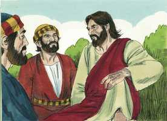

# Mateus Cap 24

**1** 	E, QUANDO Jesus ia saindo do templo, aproximaram-se dele os seus discípulos para lhe mostrarem a estrutura do templo.

 

**2** 	Jesus, porém, lhes disse: Não vedes tudo isto? Em verdade vos digo que não ficará aqui pedra sobre pedra que não seja derrubada.

 

**3** 	E, estando assentado no Monte das Oliveiras, chegaram-se a ele os seus discípulos em particular, dizendo: Dize-nos, quando serão essas coisas, e que sinal haverá da tua vinda e do fim do mundo?

 

**4** 	E Jesus, respondendo, disse-lhes: Acautelai-vos, que ninguém vos engane;

 

**5** 	Porque muitos virão em meu nome, dizendo: Eu sou o Cristo; e enganarão a muitos.

**6** 	E ouvireis de guerras e de rumores de guerras; olhai, não vos assusteis, porque é mister que isso tudo aconteça, mas ainda não é o fim.

**7** 	Porquanto se levantará nação contra nação, e reino contra reino, e haverá fomes, e pestes, e terremotos, em vários lugares.

**8** 	Mas todas estas coisas são o princípio de dores.

**9** 	Então vos hão de entregar para serdes atormentados, e matar-vos-ão; e sereis odiados de todas as nações por causa do meu nome.

 

**10** 	Nesse tempo muitos serão escandalizados, e trair-se-ão uns aos outros, e uns aos outros se odiarão.

**11** 	E surgirão muitos falsos profetas, e enganarão a muitos.

**12** 	E, por se multiplicar a iniqüidade, o amor de muitos esfriará.

**13** 	Mas aquele que perseverar até ao fim, esse será salvo.

**14** 	E este evangelho do reino será pregado em todo o mundo, em testemunho a todas as nações, e então virá o fim.

**15** 	Quando, pois, virdes que a abominação da desolação, de que falou o profeta Daniel, está no lugar santo; quem lê, entenda;

**16** 	Então, os que estiverem na Judéia, fujam para os montes;

**17** 	E quem estiver sobre o telhado não desça a tirar alguma coisa de sua casa;

**18** 	E quem estiver no campo não volte atrás a buscar as suas vestes.

**19** 	Mas ai das grávidas e das que amamentarem naqueles dias!

**20** 	E orai para que a vossa fuga não aconteça no inverno nem no sábado;

**21** 	Porque haverá então grande aflição, como nunca houve desde o princípio do mundo até agora, nem tampouco há de haver.

**22** 	E, se aqueles dias não fossem abreviados, nenhuma carne se salvaria; mas por causa dos escolhidos serão abreviados aqueles dias.

**23** 	Então, se alguém vos disser: Eis que o Cristo está aqui, ou ali, não lhe deis crédito;

**24** 	Porque surgirão falsos cristos e falsos profetas, e farão tão grandes sinais e prodígios que, se possível fora, enganariam até os escolhidos.

**25** 	Eis que eu vo-lo tenho predito.

**26** 	Portanto, se vos disserem: Eis que ele está no deserto, não saiais. Eis que ele está no interior da casa; não acrediteis.

**27** 	Porque, assim como o relâmpago sai do oriente e se mostra até ao ocidente, assim será também a vinda do Filho do homem.

**28** 	Pois onde estiver o cadáver, aí se ajuntarão as águias.

**29** 	E, logo depois da aflição daqueles dias, o sol escurecerá, e a lua não dará a sua luz, e as estrelas cairão do céu, e as potências dos céus serão abaladas.

**30** 	Então aparecerá no céu o sinal do Filho do homem; e todas as tribos da terra se lamentarão, e verão o Filho do homem, vindo sobre as nuvens do céu, com poder e grande glória.

**31** 	E ele enviará os seus anjos com rijo clamor de trombeta, os quais ajuntarão os seus escolhidos desde os quatro ventos, de uma à outra extremidade dos céus.

**32** 	Aprendei, pois, esta parábola da figueira: Quando já os seus ramos se tornam tenros e brotam folhas, sabeis que está próximo o verão.

**33** 	Igualmente, quando virdes todas estas coisas, sabei que ele está próximo, às portas.

**34** 	Em verdade vos digo que não passará esta geração sem que todas estas coisas aconteçam.

**35** 	O céu e a terra passarão, mas as minhas palavras não hão de passar.

**36** 	Mas daquele dia e hora ninguém sabe, nem os anjos do céu, mas unicamente meu Pai.

**37** 	E, como foi nos dias de Noé, assim será também a vinda do Filho do homem.

**38** 	Porquanto, assim como, nos dias anteriores ao dilúvio, comiam, bebiam, casavam e davam-se em casamento, até ao dia em que Noé entrou na arca,

**39** 	E não o perceberam, até que veio o dilúvio, e os levou a todos, assim será também a vinda do Filho do homem.

**40** 	Então, estando dois no campo, será levado um, e deixado o outro;

**41** 	Estando duas moendo no moinho, será levada uma, e deixada outra.

**42** 	Vigiai, pois, porque não sabeis a que hora há de vir o vosso Senhor.

**43** 	Mas considerai isto: se o pai de família soubesse a que vigília da noite havia de vir o ladrão, vigiaria e não deixaria minar a sua casa.

**44** 	Por isso, estai vós apercebidos também; porque o Filho do homem há de vir à hora em que não penseis.

**45** 	Quem é, pois, o servo fiel e prudente, que o seu senhor constituiu sobre a sua casa, para dar o sustento a seu tempo?

**46** 	Bem-aventurado aquele servo que o seu senhor, quando vier, achar servindo assim.

**47** 	Em verdade vos digo que o porá sobre todos os seus bens.

**48** 	Mas se aquele mau servo disser no seu coração: O meu senhor tarde virá;

**49** 	E começar a espancar os seus conservos, e a comer e a beber com os ébrios,

**50** 	Virá o senhor daquele servo num dia em que o não espera, e à hora em que ele não sabe,

**51** 	E separá-lo-á, e destinará a sua parte com os hipócritas; ali haverá pranto e ranger de dentes.

> **Cmt MHenry** Intro: Vigiar pela vinda de Cristo é manter o temperamento mental em que desejamos que nos encontre nosso Senhor. Sabemos que temos pouco tempo para viver, não podemos saber se temos longo tempo para viver; muito menos conhecemos o tempo fixado para o juízo. A vinda de nosso Senhor será feliz para os que estejam preparados, mas será muito espantosa para os que não estejam. Se um homem, que professa ser servo de Cristo, é incrédulo, cobiçoso, ambicioso ou amante do prazer, será cortado. Os que escolhem por porção o mundo nesta vida, terão o inferno como porção na outra. Que nosso Senhor, quando vir, nos sentencie bem-aventurados e nos apresente diante do Pai, lavados em seu sangue, purificados por seu Espírito, e aptos para sermos participes da sorte dos santos em luz.> " Cristo prediz sua segunda vinda. É habitual que os profetas falem de coisas próximas e à mão para expressar a grandeza e certeza delas. Enquanto à segunda vinda de Cristo, se anuncia que haverá uma grande mudança para fazer novas todas as coisas. Então verão o Filho do homem que vem nas nuvens. Em sua primeira vinda foi colocado como sinal que seria contradito, porém em sua segunda vinda, um sinal que deve ser admirado. Tarde ou cedo, todos os pecadores se lamentarão, mas os pecadores arrependidos olham a Cristo e se doem de maneira santa; e os que semeiam com lágrimas colherão com gozo dentro de pouco. Os pecadores impenitentes verão Àquele que traspassaram que, embora agora riem, então lamentarão e choraram com horror e desesperação intermináveis. Os eleitos de Deus estão dispersos em todas partes; os há em todo lugar e em todas as nações, mas quando chegue esse grande dia de reunião não haverá nem um só deles que falte. A distância do lugar não deixará a ninguém fora do céu. Nosso Senhor declara que os judeus nunca cessarão de ser um povo distinto até que se cumpram todas as coisas que tinha predito. Sua profecia chega até o dia do juízo final; portanto, aqui, versículo 34, anuncia que Judá nunca deixará de existir como povo distinto, enquanto durar este mundo. Os homens do mundo conspiram e planejam de geração em geração, mas não planejam com referência ao fato mais seguro da segunda vinda de Cristo, que se aproxima pavorosamente, o qual terminará com todo estratagema humana, e fará a um lado para sempre todo o que Deus proíbe. Esse dia será um dia tão assombroso como o dilúvio para o mundo antigo. Aplique-se isto, primeiro, aos juízos temporários, particularmente o que então chegava apressadamente à nação e povo dos judeus. segundo, ao juízo eterno. Aqui Cristo mostra o estado do mundo antigo quando chegou o dilúvio; e eles não acreditavam. Se nós soubéssemos com certeza que todas as coisas terrenas devem passar daqui a pouco, não colocaríamos nossos olhos e nosso coração nelas tanto assim como fazemos. Que palavras podem descrever com maior força o súbito da chegada de nosso Salvador! Os homens estarão em suas respectivas ocupações e repentinamente se manifestará o Senhor da glória. As mulheres estarão em suas tarefas domésticas, e esse momento toda outra obra será deixada de lado, e todo coração se voltará para dentro e dirá "É o Senhor! Estou preparado para encontrá-lo? Posso estar diante dEle?" E, de fato, que é o dia do juízo para todo o mundo, senão o dia da morte de cada um? "> Os discípulos perguntaram acerca dos tempos. *Quando* serão estas coisas? Cristo ao lês respondeu isso, mas eles também tinham perguntado: *Qual* será o sinal? Esta pergunta a respondeu plenamente. A profecia trata primeiro dos acontecimentos próximos, a destruição de Jerusalém, o fim da igreja e do estado judeus, o chamado aos gentios, e o estabelecimento do reino de Cristo no mundo; mas também olha o juízo geral; e no próximo, aponta mais em detalhe a este último. O que Cristo disse a seus discípulos tendia mais a fomentar a cautela que a satisfazer sua curiosidade; mais a prepará-los para os acontecimentos que aconteceriam que lhes dar uma idéia clara dos fatos. Este é o bom entendimento dos tempos que todos devemos cobiçar, para disso inferir o que Israel deve fazer. Nosso Salvador adverte a seus discípulos que estejam em guarda contra os falsos mestres. Anuncia guerras e grandes comoções entre as nações. Desde o tempo em que os judeus rejeitaram a Cristo e Ele deixou sua casa desolada, a espada nunca se afastou deles. Veja o que acontece por rejeitar o Evangelho. Aos que não ouçam os mensageiros da paz, serão obrigados a ouvir os mensageiros da guerra. Mas onde esteja depositado o coração, confiando em Deus, se mantém a paz e não se assusta. Contrário à mente de Cristo é que seu povo tenha corações perturbados ainda em tempos turbulentos. Quando olhamos adiante, à eternidade da miséria que está ante os obstinados que rejeitam a Cristo e seu Evangelho, podemos dizer em verdade: os juízos terrenos maiores são somente o princípio das dores. Consola que alguns perseverem até o fim. Nosso Senhor prediz a pregação do evangelho em todo o mundo. O fim do mundo somente virá quando o evangelho tenha feito sua obra. Cristo anuncia a ruína que sobrevirá ao povo judeu; e o que aqui diz, servirá a seus discípulos para sua conduta e para consolo. Se Deus abrir uma porta de escape, devemos fugir, do contrário não confiamos em Deus, senão que o tentamos. Em tempos de transtorno público corresponde aos discípulos de Cristo estar orando muito: isso nunca é inoportuno, porém se torna especialmente oportuno quando estamos angustiados por todas partes. Embora devemos aceitar o que Deus envia, ainda podemos orar contra os sofrimentos; e algo que prova muito ao homem bom é ser tirado por uma obra de necessidade do serviço e adoração solenes de Deus no dia do repouso. Mas aqui há uma palavra de consolo, que por amos dos escolhidos esses dias serão encurtados em relação ao que conceberam seus inimigos, que os teriam cortado a todos se Deus, que usou estes inimigos para servir a seus propósitos, não tiver colocado um limite à ira deles. Cristo anuncia a rápida difusão do evangelho no mundo. É visto simplesmente como o raio. Cristo pregou abertamente seu evangelho. Os romanos eram como a águia e a insígnia de seus exércitos era esta ave. Quando um povo, por seu pecado, se transforma em nojentos esqueletos, nada pode esperar-se, senão que Deus envie inimigos para destruí-lo. isto é muito Aplicável ao dia do juízo, à vinda de nosso Senhor Jesus Cristo nesse dia (2 Tessalonicenses 2.1-2). Apliquemo-nos para assegurar nossa eleição e vocação; então poderemos saber que nenhum inimigo nem enganador prevalecerá contra nós.> Cristo prediz a total ruína e a destruição futura do templo. Uma crédula visão em fé da desaparição de toda glória mundana, nos servirá para que evitemos admirá-la e valorizá-la excessivamente. O corpo mais belo será logo comida para os vermes, e o edifício mais magnífico, um monte de escombros. Não vê estas coisas? Nos fará bem que as olhemos como vendo através delas e vendo o fim delas. Nosso Senhor, tendo ido embora com seus discípulos ao Monte das Oliveiras, pôs ante eles a ordem dos tempos Enquanto aos judeus, até a destruição de Jerusalém, e Enquanto aos homens em geral até o fim do mundo.