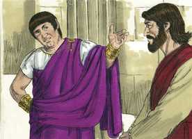
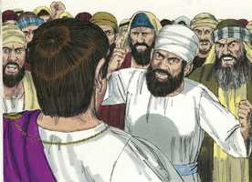
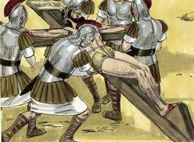
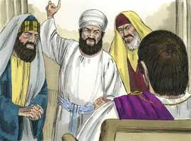

# Mateus Cap 27

**1** 	E, CHEGANDO a manhã, todos os príncipes dos sacerdotes, e os anciãos do povo, formavam juntamente conselho contra Jesus, para o matarem;

 

**2** 	E maniatando-o, o levaram e entregaram ao presidente Pôncio Pilatos.

**3** 	Então Judas, o que o traíra, vendo que fora condenado, trouxe, arrependido, as trinta moedas de prata aos príncipes dos sacerdotes e aos anciãos,

**4** 	Dizendo: Pequei, traindo o sangue inocente. Eles, porém, disseram: Que nos importa? Isso é contigo.

**5** 	E ele, atirando para o templo as moedas de prata, retirou-se e foi-se enforcar.

**6** 	E os príncipes dos sacerdotes, tomando as moedas de prata, disseram: Não é lícito colocá-las no cofre das ofertas, porque são preço de sangue.

**7** 	E, tendo deliberado em conselho, compraram com elas o campo de um oleiro, para sepultura dos estrangeiros.

**8** 	Por isso foi chamado aquele campo, até ao dia de hoje, Campo de Sangue.

**9** 	Então se realizou o que vaticinara o profeta Jeremias: Tomaram as trinta moedas de prata, preço do que foi avaliado, que certos filhos de Israel avaliaram,

**10** 	E deram-nas pelo campo do oleiro, segundo o que o Senhor me determinou.

**11** 	E foi Jesus apresentado ao presidente, e o presidente o interrogou, dizendo: És tu o Rei dos Judeus? E disse-lhe Jesus: Tu o dizes.

  

**12** 	E, sendo acusado pelos príncipes dos sacerdotes e pelos anciãos, nada respondeu.

 

**13** 	Disse-lhe então Pilatos: Não ouves quanto testificam contra ti?

**14** 	E nem uma palavra lhe respondeu, de sorte que o presidente estava muito maravilhado.

**15** 	Ora, por ocasião da festa, costumava o presidente soltar um preso, escolhendo o povo aquele que quisesse.

**16** 	E tinham então um preso bem conhecido, chamado Barrabás.

**17** 	Portanto, estando eles reunidos, disse-lhes Pilatos: Qual quereis que vos solte? Barrabás, ou Jesus, chamado Cristo?

**18** 	Porque sabia que por inveja o haviam entregado.

**19** 	E, estando ele assentado no tribunal, sua mulher mandou-lhe dizer: Não entres na questão desse justo, porque num sonho muito sofri por causa dele.

**20** 	Mas os príncipes dos sacerdotes e os anciãos persuadiram à multidão que pedisse Barrabás e matasse Jesus.

**21** 	E, respondendo o presidente, disse-lhes: Qual desses dois quereis vós que eu solte? E eles disseram: Barrabás.

**22** 	Disse-lhes Pilatos: Que farei então de Jesus, chamado Cristo? Disseram-lhe todos: Seja crucificado.

**23** 	O presidente, porém, disse: Mas que mal fez ele? E eles mais clamavam, dizendo: Seja crucificado.

**24** 	Então Pilatos, vendo que nada aproveitava, antes o tumulto crescia, tomando água, lavou as mãos diante da multidão, dizendo: Estou inocente do sangue deste justo. Considerai isso.

**25** 	E, respondendo todo o povo, disse: O seu sangue caia sobre nós e sobre nossos filhos.

**26** 	Então soltou-lhes Barrabás, e, tendo mandado açoitar a Jesus, entregou-o para ser crucificado.

**27** 	E logo os soldados do presidente, conduzindo Jesus à audiência, reuniram junto dele toda a coorte.

 

**28** 	E, despindo-o, o cobriram com uma capa de escarlate;

**29** 	E, tecendo uma coroa de espinhos, puseram-lha na cabeça, e em sua mão direita uma cana; e, ajoelhando diante dele, o escarneciam, dizendo: Salve, Rei dos judeus.

**30** 	E, cuspindo nele, tiraram-lhe a cana, e batiam-lhe com ela na cabeça.

**31** 	E, depois de o haverem escarnecido, tiraram-lhe a capa, vestiram-lhe as suas vestes e o levaram para ser crucificado.

 

**32** 	E, quando saíam, encontraram um homem cireneu, chamado Simão, a quem constrangeram a levar a sua cruz.

 

**33** 	E, chegando ao lugar chamado Gólgota, que se diz: Lugar da Caveira,

 

**34** 	Deram-lhe a beber vinagre misturado com fel; mas ele, provando-o, não quis beber.

**35** 	E, havendo-o crucificado, repartiram as suas vestes, lançando sortes, para que se cumprisse o que foi dito pelo profeta: Repartiram entre si as minhas vestes, e sobre a minha túnica lançaram sortes.

 

**36** 	E, assentados, o guardavam ali.

**37** 	E por cima da sua cabeça puseram escrita a sua acusação: ESTE É JESUS, O REI DOS JUDEUS.

**38** 	E foram crucificados com ele dois salteadores, um à direita, e outro à esquerda.

 

**39** 	E os que passavam blasfemavam dele, meneando as cabeças,

 

**40** 	E dizendo: Tu, que destróis o templo, e em três dias o reedificas, salva-te a ti mesmo. Se és Filho de Deus, desce da cruz.

**41** 	E da mesma maneira também os príncipes dos sacerdotes, com os escribas, e anciãos, e fariseus, escarnecendo, diziam:

 

**42** 	Salvou os outros, e a si mesmo não pode salvar-se. Se é o Rei de Israel, desça agora da cruz, e crê-lo-emos.

**43** 	Confiou em Deus; livre-o agora, se o ama; porque disse: Sou Filho de Deus.

**44** 	E o mesmo lhe lançaram também em rosto os salteadores que com ele estavam crucificados.

**45** 	E desde a hora sexta houve trevas sobre toda a terra, até à hora nona.

 

**46** 	E perto da hora nona exclamou Jesus em alta voz, dizendo: Eli, Eli, lamá sabactâni; isto é, Deus meu, Deus meu, por que me desamparaste?

**47** 	E alguns dos que ali estavam, ouvindo isto, diziam: Este chama por Elias,

**48** 	E logo um deles, correndo, tomou uma esponja, e embebeu-a em vinagre, e, pondo-a numa cana, dava-lhe de beber.

**49** 	Os outros, porém, diziam: Deixa, vejamos se Elias vem livrá-lo.

**50** 	E Jesus, clamando outra vez com grande voz, rendeu o espírito.

 

**51** 	E eis que o véu do templo se rasgou em dois, de alto a baixo; e tremeu a terra, e fenderam-se as pedras;

**52** 	E abriram-se os sepulcros, e muitos corpos de santos que dormiam foram ressuscitados;

**53** 	E, saindo dos sepulcros, depois da ressurreição dele, entraram na cidade santa, e apareceram a muitos.

**54** 	E o centurião e os que com ele guardavam a Jesus, vendo o terremoto, e as coisas que haviam sucedido, tiveram grande temor, e disseram: Verdadeiramente este era o Filho de Deus.

 

**55** 	E estavam ali, olhando de longe, muitas mulheres que tinham seguido Jesus desde a Galiléia, para o servir;

 

**56** 	Entre as quais estavam Maria Madalena, e Maria, mãe de Tiago e de José, e a mãe dos filhos de Zebedeu.

**57** 	E, vinda já a tarde, chegou um homem rico, de Arimatéia, por nome José, que também era discípulo de Jesus.

 

**58** 	Este foi ter com Pilatos, e pediu-lhe o corpo de Jesus. Então Pilatos mandou que o corpo lhe fosse dado.

**59** 	E José, tomando o corpo, envolveu-o num fino e limpo lençol,

 

**60** 	E o pôs no seu sepulcro novo, que havia aberto em rocha, e, rodando uma grande pedra para a porta do sepulcro, retirou-se.

**61** 	E estavam ali Maria Madalena e a outra Maria, assentadas defronte do sepulcro.

**62** 	E no dia seguinte, que é o dia depois da Preparação, reuniram-se os príncipes dos sacerdotes e os fariseus em casa de Pilatos,

 

**63** 	Dizendo: Senhor, lembramo-nos de que aquele enganador, vivendo ainda, disse: Depois de três dias ressuscitarei.

**64** 	Manda, pois, que o sepulcro seja guardado com segurança até ao terceiro dia, não se dê o caso que os seus discípulos vão de noite, e o furtem, e digam ao povo: Ressuscitou dentre os mortos; e assim o último erro será pior do que o primeiro.

**65** 	E disse-lhes Pilatos: Tendes a guarda; ide, guardai-o como entenderdes.

 

**66** 	E, indo eles, seguraram o sepulcro com a guarda, selando a pedra.

 

> **Cmt MHenry** Intro: Os principais sacerdotes e fariseus estavam em tratos com Pilatos para assegurar o sepulcro, quando deveriam ter estado dedicados a suas devoções por ser o dia do repouso judeu. Isto foi permitido para que houvesse prova certa da ressurreição de nosso Senhor. Pilatos lhes disse que podiam segurar o sepulcro tão cuidadosamente como achassem. Eles selaram a pedra, colocaram guardas e se satisfizeram com que tudo o necessário fosse realizado. Mas era néscio resguardar assim o sepulcro contra os coitados e fracos discípulos, por desnecessário; ao tempo que era absurdo pensar em resguardá-lo contra o poder de Deus, por fútil e insensato; contudo, eles pensaram que agiam sabiamente. O Senhor prende o sábio em sua sabedoria. Assim será feito que toda a ira e os planos dos inimigos de Cristo fomentem sua glória.> Nada de pompa nem de solenidades houve no sepultamento de Cristo. como não teve casa própria onde reclinar sua cabeça enquanto viveu, tampouco assim teve túmulo próprio onde repousar seu corpo enquanto esteve morto. Nosso Senhor Jesus, que não teve pecado próprio, não teve túmulo próprio. Os judeus determinaram que devia ter sepultura com os maus, que devia ser enterrado com os ladrões com os que foi crucificado, porém Deus passou por alto isso, para que pudesse estar com os ricos em sua morte ([Isaias 53.9](../23A-Is/53.md#9)). Embora ao olho humano possa causar terror contemplar o funeral, deveria causar-nos regozijo se lembramos como Cristo, por seu sepultamento, mudou a natureza do túmulo para os crentes. Devemos imitar sempre o sepultamento de Cristo estando continuamente ocupados no funeral espiritual de nossos pecados.> A rasgadura do véu significou que Cristo, por sua morte, abriu um caminho a Deus. agora temos o caminho aberto através de Cristo ao trono da graça, o trono da misericórdia, e ao trono da glória do além. Quando consideramos devidamente a morte de Cristo, nossos corações endurecidos e empedernidos deveriam rasgar-se; o coração, não as roupas. o coração que não se rende, que não se derrete onde sem apresenta claramente a Jesus Cristo crucificado, é mais duro que uma pedra. Os sepulcros se abriram, e se levantaram muitos corpos de santos que dormiam. Não se nos diz a quem se apareceram, de que modo e como desapareceram; e não devemos desejar saber mais do que está escrito. As aparições aterradoras de Deus em sua providência às vezes operam estranhamente para a convicção e o despertar dos pecadores. Isto foi expressado no terror que caiu sobre o centurião e o soldados romanos. Podemos refletir com consolo nos abundantes testemunhos dados do caráter de Jesus; e procurando não dar causa justa de ofensa, deixar em mãos do Senhor que absolva nossos caracteres se vivermos para Ele. nós, com os olhos da fé, contemplemos a Cristo, e este crucificado, e sejamos afetados com o grande amor com que nos amou. Todavia, seus amigos não puderam mais que lançar uns olhares; eles o contemplaram, mas não puderam ajudá-lo. Nunca foram expostos em forma tão tremenda a natureza e os efeitos horríveis do pecado como naquele dia, em que o Filho do Pai pendeu da cruz, sofrendo pelo pecado, o Justo pelo injusto, para levar-nos a Deus. rendamo-nos voluntariamente a seu serviço.> Durante as três horas que continuaram as trevas, Jesus esteve em agonia, lutando com as potestades das trevas e sofrendo o desagrado de seu Pai contra o pecado do homem, pelo qual agora oferecia sua alma. Nunca houve três horas como essas desde o dia em que Deus criou o homem na terra, nunca houve uma cena tão tenebrosa e espantosa; foi o ponto sem retorno desse grande assunto, a redenção e salvação do homem. Jesus expressou uma queixa no [Salmo 22.1](../19A-Sl/22.md#1). Aí nos ensina o útil que é a palavra de Deus para dirigir-nos em oração, e nos recomenda usar as expressões das Escrituras para orar. O crente pode ter saboreado algumas gotas de amargura, mas somente pode fazer-se uma idéia muito fraca da grandeza dos sofrimentos de Cristo. contudo, daí aprende algo acerca do amor do Salvador pelos pecadores; dali obtém uma convicção mais profunda da vileza e mal do pecado, e do que ele deve a Cristo, que o livra da ira vindoura. Seus inimigos ridicularizaram perversamente seu lamento. Muitas das reprovações lançadas contra a palavra de Deus e o povo de Deus surgem, como aqui, de erros grosseiros. Cristo falou com toda sua força, justo antes de expirar, para demonstrar que sua vida não lhe era tirada, senão que a entregava livremente em mãos de seu Pai. Teve forças para desafiar às potestades da morte; e para mostrar que pelo Espírito eterno se ofereceu a si mesmo, sendo o Sacerdote e o Sacrifício, e clamou a grande voz. Então, entregou o espírito. O Filho de Deus, na cruz, morreu pela violência da dor a que foi submetido. Sua alma foi separada de seu corpo e, assim, seu corpo ficou real e verdadeiramente morto. Foi verdade que Cristo morreu porque era necessário que morresse. Tinha-se comprometido a fazer-se oferta pelo pecado e o fez quando entregou voluntariamente sua vida.> Costumava-se envergonhar os malfeitores com uma placa que notificava o delito pelo qual sofriam. Assim, colocaram uma sobre a cabeça de Cristo. A conceberam para recriminação dEle, mas Deus a passou por alto, pois ainda a acusação foi em sua honra. Havia dois ladrões crucificados com Ele ao mesmo tempo. em sua morte, foi contado com os pecadores para que, em nossa morte, sejamos contados com os santos. As burlas e afrontas que recebeu estão aqui registradas. Os inimigos de Cristo trabalham forte para fazer que os outros acreditem coisas da religião e do povo de Deus que eles mesmos sabem ser falsas. Os principais sacerdotes e escribas, e os anciãos, zombaram de Cristo por ser o Rei de Israel. Muita gente poderia gostar muito do Rei de Israel, se tivesse descido da cruz; se eles pudessem ter seu reino sem a tribulação através da qual devem entrar agora. Porém, se não há cruz, não há Cristo nem coroa. Os que irão reinar com Ele devem estar dispostos a sofrer com Ele. Assim, pois, nosso Senhor Jesus, tendo empreendido a satisfação da justiça de Deus, o fez submetendo-se ao pior castigo dos homens. E em cada registro minuciosamente detalhado dos sofrimentos de Cristo, achamos cumprida alguma predição dos profetas ou dos salmos.> Cristo foi levado como Cordeiro ao matadouro, como Sacrifício ao altar. Até as misericórdias dos ímpios são realmente cruéis. Tirando-lhe a cruz, eles obrigaram a um tal Simão a carregá-la. Prepara-nos, Senhor, para levarmos a cruz que Tu nos designas, para tomá-la diariamente com júbilo e seguir-te. Houve alguma vez dor como a sua dor? Quando contemplamos o tipo de morte que a qual Ele morreu, nisso contemplemos com que tipo de amor Ele nos amou. Como se a morte, uma morte tão dolorosa, não for suficiente, eles agregaram várias coisas a sua amargura e terror.> A crucifixão era uma morte empregada somente pelos romanos; muito terrível e miserável. Colocava-se no chão a cruz, na qual se pregavam mãos e pés, então as levantavam e afirmavam em forma vertical, de modo que o peso do corpo pendesse dos pregos até que o sofredor morresse com tremenda dor. Cristo corresponde assim ao tipo da serpente de bronze levantada no pau do estandarte. Cristo passou por toda a miséria a vergonha aqui relatada para adquirir para nós a vida eterna, gozo e glória.> Não tendo maldade contra Jesus, Pilatos o instou para aclarar as coisas, e se esforçou por declará-lo sem culpa. A mensagem de sua esposa foi uma advertência. Deus tem muitas formas de advertir aos pecadores sobre suas empresas pecaminosas, sendo uma grande misericórdia ter tais restrições de parte da Providência, de parte de amigos fiéis e de nossas próprias consciências. Oh, não faças esta coisa abominável que o Senhor odeia! É algo que podemos ouvir que se nos diz quando estamos entrando em tentação, se quisermos considerá-lo. Sendo dominado pelos sacerdotes, o povo optou por Barrabás. As multidões que escolhem o mundo antes que a Deus, como rei e porção deles, escolhem assim seu próprio engano. Os judeus insistiam tanto na morte de Cristo que Pilatos pensou que recusar seria perigoso, e esta luta mostra o poder da consciência ainda nos piores homens. Mas todo estava ordenado para deixar em evidência que Cristo sofreu não por faltas próprias senão pelos pecados de seu povo. Que vão foi que Pilatos esperasse livrar-se da culpa do sangue inocente de uma pessoa justa, a qual estava obrigado a proteger por seu ofício! A maldição dos judeus contra eles mesmos tem sido espantosamente contestada nos sofrimentos de sua nação. Ninguém pode levar o pecado de outrem, salvo aquele que não tinha pecado próprio pelo qual responder. E não estamos todos interessados? Não foi Barrabás preferido a Jesus quando os pecadores rejeitaram a salvação para conversar seus amados pecados, que roubam sua glória a Deus, e assassinam as almas deles? Agora o sangue de Cristo está *sobre* nós, para sempre por meio da misericórdia, dado que os judeus a rejeitaram. Oh, fujamos a ela para refugiar-nos!> " Os ímpios pouco vêem das conseqüências de seus delitos quando os perpetram, mas devem render contas por tudo. Judas reconheceu da forma mais completa ante os principais sacerdotes, que ele tinha pecado e traído a uma pessoa inocente. Este foi um testemunho total do caráter de Cristo; porém os governantes estavam endurecidos. Judas foi embora, jogando fora o dinheiro, e se enforcou por ser incapaz se suportar o terror da ira divina, e a angústia da desesperação. Pouca dúvida cabe de que a morte de Judas foi anterior a nosso bendito Senhor. Mas, foi nada para eles ter tido sede deste sangue, e ter contratado a Judas para traí-lo, e que a tivessem condenado a ser derramada injustamente? Assim fazem os néscios que zombam do pecado. Assim fazem muitos que levam à ligeira a Cristo crucificado. E é casso corriqueiro do enganoso de nossos corações levar à ligeira nosso próprio pecado insistindo nos pecados do próximo. Mas o juízo de Deus é segundo a verdade. Muitos aplicam esta passagem da compra do campo com o dinheiro que Judas devolveu para significar o favor concedido pelo sangue de Cristo para com os estranhos e os pecadores gentios. Isso cumpriu uma profecia ([Zacarias 11.12](../38A-Zc/11.md#12)). Judas avançou muito no arrependimento, mas não foi para a salvação. Confessou, mas não a Deus; ele não acudiu a Ele e disse: "Pai, pequei contra o céu". Ninguém se satisfaça com as convicções parciais que possa ter um homem, se continua cheio de orgulho, inimizade e rebeldia. "