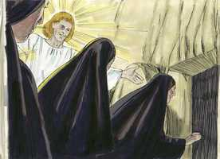
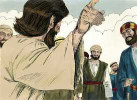

# Mateus Cap 28

**1** 	E, NO fim do sábado, quando já despontava o primeiro dia da semana, Maria Madalena e a outra Maria foram ver o sepulcro.

 

**2** 	E eis que houvera um grande terremoto, porque um anjo do Senhor, descendo do céu, chegou, removendo a pedra da porta, e sentou-se sobre ela.

 

**3** 	E o seu aspecto era como um relâmpago, e as suas vestes brancas como neve.

**4** 	E os guardas, com medo dele, ficaram muito assombrados, e como mortos.

**5** 	Mas o anjo, respondendo, disse às mulheres: Não tenhais medo; pois eu sei que buscais a Jesus, que foi crucificado.

 

**6** 	Ele não está aqui, porque já ressuscitou, como havia dito. Vinde, vede o lugar onde o Senhor jazia.

 

**7** 	Ide pois, imediatamente, e dizei aos seus discípulos que já ressuscitou dentre os mortos. E eis que ele vai adiante de vós para a Galiléia; ali o vereis. Eis que eu vo-lo tenho dito.

 

**8** 	E, saindo elas pressurosamente do sepulcro, com temor e grande alegria, correram a anunciá-lo aos seus discípulos.

 

**9** 	E, indo elas a dar as novas aos seus discípulos, eis que Jesus lhes sai ao encontro, dizendo: Eu vos saúdo. E elas, chegando, abraçaram os seus pés, e o adoraram.

**10** 	Então Jesus disse-lhes: Não temais; ide dizer a meus irmãos que vão à Galiléia, e lá me verão.

**11** 	E, quando iam, eis que alguns da guarda, chegando à cidade, anunciaram aos príncipes dos sacerdotes todas as coisas que haviam acontecido.

**12** 	E, congregados eles com os anciãos, e tomando conselho entre si, deram muito dinheiro aos soldados,

**13** 	Dizendo: Dizei: Vieram de noite os seus discípulos e, dormindo nós, o furtaram.

**14** 	E, se isto chegar a ser ouvido pelo presidente, nós o persuadiremos, e vos poremos em segurança.

**15** 	E eles, recebendo o dinheiro, fizeram como estavam instruídos. E foi divulgado este dito entre os judeus, até ao dia de hoje.

**16** 	E os onze discípulos partiram para a Galiléia, para o monte que Jesus lhes tinha designado.

 

**17** 	E, quando o viram, o adoraram; mas alguns duvidaram.

**18** 	E, chegando-se Jesus, falou-lhes, dizendo: É-me dado todo o poder no céu e na terra.

 

**19** 	Portanto ide, fazei discípulos de todas as nações, batizando-os em nome do Pai, e do Filho, e do Espírito Santo;

**20** 	Ensinando-os a guardar todas as coisas que eu vos tenho mandado; e eis que eu estou convosco todos os dias, até a consumação dos séculos. Amém.

> **Cmt MHenry** Intro: Este evangelista passa por alto outras aparições de Cristo registradas por Lucas e João, e se apressa a relatar a mais solene; uma estabelecida desde antes de sua morte, e depois de sua ressurreição. Todos os que olham para o Senhor Jesus com os olhos da fé, o adorarão. Mas a fé do sincero pode ser muito fraca e instável. Todavia, Cristo deu provas bem convincentes de sua ressurreição, para fazer que sua fé triunfasse sobre as dúvidas. Agora encarrega solenemente aos apóstolos e a seus ministros que vão para todas as nações. A salvação que iam pregar é salvação comum; quem a quiser, que venha e tome o benefício; todos são bem-vindos em Cristo Jesus. O cristianismo é a religião de um pecador que pede salvação da merecida ira e do pecado; recorre à misericórdia do Pai por meio da expiação feita pelo Filho encarnado e pela santificação do Espírito Santo, e se entrega a ser adorador e servo de Deus, como Pai, Filho e Espírito Santo, três Pessoas, mas um só Deus, em todas suas ordenanças e mandamentos.\> \ O batismo é um sinal externo do lavamento interno ou santificação do Espírito, que sela e demonstra a justificação do crente. Examinemo-nos se realmente possuímos a graça espiritual interna da morte para o pecado e o novo nascimento para a justiça, pelos quais os que eram filhos da ira chegam a ser filhos de Deus. Os crentes terão sempre a presença constante de seu Senhor; todos os dias, cada dia. Não há dia, nem hora do dia, em que nosso Senhor Jesus não esteja presente em suas igrejas e com seus ministros; se houver, nesse dia, naquela hora, eles seriam desfeitos. O Deus de Israel, o Salvador, é às vezes um Deus que se esconde, mas nunca é um Deus distante. A essas preciosas palavras se agrega o Amém. Ainda assim, Senhor Jesus, seja conosco e com todo seu povo; faça que seu rosto brilhe sobre nós, que seu caminho seja conhecido na terra, sua saúde salvadora entre todas as nações.> Que maldade os homens não cometerão por amor do dinheiro! Aqui se deu muito dinheiro aos soldados para dizer, a sabendas, uma mentira, mas muitos resmungaram porque é pouco o dinheiro por dizer o que sabem que é verdade. nunca deixemos morrer uma boa causa quando vemos aos malvados tão generosamente sustentados. Os sacerdotes se dedicaram a proteger-se da espada de Pilatos, mas não protegeram os soldados da espada da justiça de Deus, que pende sobre as cabeças dos que amam e falam uma mentira. Prometem mais do que podem fazer os que tratam de tirar sem mácula a um homem que comete pecado voluntário. Mas esta falsidade refuta-se a si mesma. Se todos os soldados tivessem estado dormindo, não teriam podido saber o que aconteceu. Se algum deles tivesse estado acordado, teria despertado aos outros e impedido o roubo; se estavam dormidos, certamente que nunca se teriam atrevido a confessá-lo, porque os governantes judeus teriam sido os primeiros em pedir seu castigo. De novo, se houver algo de verdade no informe, os dirigentes teriam julgado com severidade os apóstolos por isso. O conjunto demonstra que a história era falsa por completo. Não devemos culpar de tais coisas a fraqueza do entendimento, senão a maldade do coração. Deus os deixou delatar seu próprio curso. O grande argumento para provar que Cristo é o Filho de Deus é sua ressurreição; e ninguém podia dar provas mais convincentes da verdade que aquela dos soldados; mas eles aceitaram o suborno para impedir que outros cressem. A evidência mais clara não afetará os homens, sem a obra do Espírito Santo.> As visitas da graça de Deus costumam achar-nos no caminho do dever; e mais será dado aos que usam o que têm para proveito do próximo. Esta entrevista com Cristo era inesperada, mas Ele estava perto deles e ainda está perto de nós na Palavra. O saúdo fala da boa vontade de Cristo para com o homem, ainda depois de ter entrado a seu estado de exaltação. É a vontade de Cristo que seu povo seja um povo alegre e jubiloso, e sua ressurreição dá abundante material para o gozo. Não temam. Cristo ressuscitou dentre os mortos para silenciar os temores de seu povo e há suficiente nisso para acalmá-los. Os discípulos o haviam abandonado, vergonhosamente, em seus sofrimentos, mas para mostrar que pode perdoar, e para ensinar-nos a assim fazê-lo, os chama de irmãos. Apesar de sua majestade e pureza, e de nossa baixeza e indignidade, Ele ainda condescende em chamar de seus irmãos aos crentes.> " Cristo se levantou no terceiro dia depois de sua morte; esse era o tempo do qual tinha falado freqüentemente. O primeiro dia da primeira semana Deus mandou que das trevas brilhasse a luz. Neste dia o que é a Luz do mundo saiu resplandecendo desde as trevas do túmulo; e este dia é, desde então, mencionado amiúde no Novo Testamento como o dia em que os cristãos celebraram religiosamente assembléias solenes para honrar a Cristo. Nosso Senhor Jesus poderia ter tirado a pedra por seu poder, mas optou por fazê-lo por meio de um anjo.\> \ A ressurreição de Cristo é o gozo de seus amigos e o terror e a confusão de seus inimigos. O anjo exorta às mulheres contra seus temores. Os pecadores de Sião é que devem temer. Vocês não temam pois sua ressurreição será seu consolo. Nossa comunhão com Ele deve ser espiritual, por fé em sua palavra; quando estejamos prontos para fazer deste mundo nosso lar, e a dizer "É bom estar aqui", lembremos então que nosso Senhor Jesus não está aqui. Ele ressuscitou, portanto, que nossos corações se elevem, e busquem as coisas de cima. Ressuscitou, como disse. Nunca pensemos que é estranho o que a palavra de Cristo nos disse para esperar; sejam os sofrimentos deste tempo presente ou a glória que será revelada. Pode ter bom efeito em nós ilharmos por fé o lugar onde jaz o Senhor. Vão logo. Foi bom estar ali, mas os servos de Deus têm designada outra obra. A utilidade pública tem prioridade sobre o prazer da comunhão secreta com Deus. Digam aos discípulos que eles podem ser consolados em suas tristezas. Cristo sabe onde moram seus discípulos e os visitará. Ele se manifestará, por graça, ainda a aqueles que estão gente da abundância dos meios da graça. O temor e o gozo unidos aceleraram seu passo. Os discípulos de Cristo devem ser estimulados a dar-se a conhecer mutuamente suas experiências de comunhão com seu Senhor, e devem contar a outrem o que Deus tem feito por suas almas. "