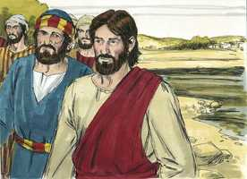
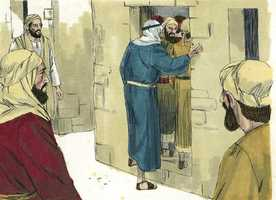
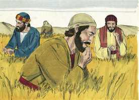
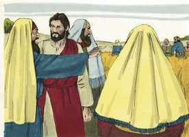
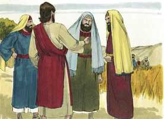

# Marcos Cap 02

**1** 	E ALGUNS dias depois entrou outra vez em Cafarnaum, e soube-se que estava em casa.

  

**2** 	E logo se ajuntaram tantos, que nem ainda nos lugares junto à porta cabiam; e anunciava-lhes a palavra.

 

**3** 	E vieram ter com ele conduzindo um paralítico, trazido por quatro.

 

**4** 	E, não podendo aproximar-se dele, por causa da multidão, descobriram o telhado onde estava, e, fazendo um buraco, baixaram o leito em que jazia o paralítico.

  

**5** 	E Jesus, vendo a fé deles, disse ao paralítico: Filho, perdoados estão os teus pecados.

 

**6** 	E estavam ali assentados alguns dos escribas, que arrazoavam em seus corações, dizendo:

 

**7** 	Por que diz este assim blasfêmias? Quem pode perdoar pecados, senão Deus?

**8** 	E Jesus, conhecendo logo em seu espírito que assim arrazoavam entre si, lhes disse: Por que arrazoais sobre estas coisas em vossos corações?

 

**9** 	Qual é mais fácil? dizer ao paralítico: Estão perdoados os teus pecados; ou dizer-lhe: Levanta-te, e toma o teu leito, e anda?

**10** 	Ora, para que saibais que o Filho do homem tem na terra poder para perdoar pecados (disse ao paralítico),

**11** 	A ti te digo: Levanta-te, toma o teu leito, e vai para tua casa.

 

**12** 	E levantou-se e, tomando logo o leito, saiu em presença de todos, de sorte que todos se admiraram e glorificaram a Deus, dizendo: Nunca tal vimos.

 

**13** 	E tornou a sair para o mar, e toda a multidão ia ter com ele, e ele os ensinava.

**14** 	E, passando, viu Levi, filho de Alfeu, sentado na recebedoria, e disse-lhe: Segue-me. E, levantando-se, o seguiu.

  

**15** 	E aconteceu que, estando sentado à mesa em casa deste, também estavam sentados à mesa com Jesus e seus discípulos muitos publicanos e pecadores; porque eram muitos, e o tinham seguido.

 

**16** 	E os escribas e fariseus, vendo-o comer com os publicanos e pecadores, disseram aos seus discípulos: Por que come e bebe ele com os publicanos e pecadores?

  

**17** 	E Jesus, tendo ouvido isto, disse-lhes: Os sãos não necessitam de médico, mas, sim, os que estão doentes; eu não vim chamar os justos, mas, sim, os pecadores ao arrependimento.

 

**18** 	Ora, os discípulos de João e os fariseus jejuavam; e foram e disseram-lhe: Por que jejuam os discípulos de João e os dos fariseus, e não jejuam os teus discípulos?

**19** 	E Jesus disse-lhes: Podem porventura os filhos das bodas jejuar enquanto está com eles o esposo? Enquanto têm consigo o esposo, não podem jejuar;

**20** 	Mas dias virão em que lhes será tirado o esposo, e então jejuarão naqueles dias.

**21** 	Ninguém deita remendo de pano novo em roupa velha; doutra sorte o mesmo remendo novo rompe o velho, e a rotura fica maior.

**22** 	E ninguém deita vinho novo em odres velhos; doutra sorte, o vinho novo rompe os odres e entorna-se o vinho, e os odres estragam-se; o vinho novo deve ser deitado em odres novos.

**23** 	E aconteceu que, passando ele num sábado pelas searas, os seus discípulos, caminhando, começaram a colher espigas.

 

**24** 	E os fariseus lhe disseram: Vês? Por que fazem no sábado o que não é lícito?

 

**25** 	Mas ele disse-lhes: Nunca lestes o que fez Davi, quando estava em necessidade e teve fome, ele e os que com ele estavam?

 

**26** 	Como entrou na casa de Deus, no tempo de Abiatar, sumo sacerdote, e comeu os pães da proposição, dos quais não era lícito comer senão aos sacerdotes, dando também aos que com ele estavam?

**27** 	E disse-lhes: O sábado foi feito por causa do homem, e não o homem por causa do sábado.

 

**28** 	Assim o Filho do homem até do sábado é Senhor.

> **Cmt MHenry** Intro: O dia do descanso é uma instituição divina sagrada; privilégio e benefício, não é tarefa nem escravidão. Deus nunca o concebeu para que fosse uma carga para nós; portanto, não devemos fazer com que seja assim. O dia do repouso foi instituído para o bem da humanidade, por quanto vive em sociedade tendo muitas necessidades e problemas, e se prepara para um estado de felicidade ou infelicidade. O homem não foi feito para o dia do repouso como se guardá-lo pudesse ser um serviço para Deus, nem lhe foi ordenado que guardasse suas formas externas para seu prejuízo real. Toda obediência a este respeito deve interpretar-se pela regra da misericórdia.> Os professantes estritos são bons para achar falta em tudo o que não concorda plenamente com seus pontos de vista. Cristo não escapou das calúnias; nós devemos estar dispostos a suportá-las e ter cuidado de não merecê-las; devemos atender cada parte de nosso dever em sua ordem e momento apropriado.> Mateus não era uma boa pessoa, ao contrário, pois sendo judeu nunca deveria ter sido publicano, isto é, cobrador de impostos para os romanos. Contudo, Cristo chamou a este publicano para que o seguisse. Com Deus, através de Cristo, há misericórdia para perdoar os pecados mais grandes, e graça para mudar os maiores pecadores e fazê-los santos. Um publicano fiel que tratara com equidade era coisa rara. Devido a que os judeus tinham um ódio particular por um ofício que demonstrava que eles estavam submetidos aos romanos, deram um mal nome aos cobradores de impostos. Porém nosso bendito Senhor não vacilou em conversar com os tais quando se manifestou em semelhança de carne de pecado. não é novidade que o que está bem feito e bem desenhado, seja caluniado e convertido em recriminação para os melhores homens e mais sábios. Cristo não se desdiria ainda que se ofendessem os fariseus. Se o mundo tiver sido justo, não teria havido ocasião para sua vinda nem para pregar o arrependimento ou comprar o perdão. Não devemos continuar em companhia dos ímpios por amor a sua conversão vã; porém devemos mostrar amor por suas almas, lembrando que nosso bom Médico tinha em si o poder de sarar, e que não corria perigo de contagiar-se a doença, mas não acontece assim conosco. Ao tratar de fazermos o bem ao próximo, tenhamos cuidado de não fazer mal a nós mesmos.> Era a desgraça deste homem que tivessem que transportá-lo deste modo, e que mostra o estado de sofrimento da vida humana; foi uma amostra de bondade dos que assim o levavam e ensina a compaixão que deveria haver no homem para seus congêneres que têm dificuldades. A fé verdadeira e a fé firme podem operar de diversas maneiras, mas será aceita e aprovada por Jesus Cristo. O pecado é a causa de todas nossas dores e enfermidades. A maneira de eliminar o efeito é eliminando a causa. O perdão do pecado golpeia a raiz de todas as doenças. Cristo provou seu poder para perdoar o pecado mostrando seu poder para curar o homem doente de paralisia. A cura das doenças era figura do perdão do pecado, porque o pecado é a doença da alma; quando é perdoado, é curada. Quando vemos o que Cristo faz ao sarar almas, devemos reconhecer que nunca vimos algo igual. A maioria dos homens se acham íntegros; não sentem necessidade de um médico, portanto desprezam ou rejeitam a Cristo e seu Evangelho. Mas o pecador humilde e convicto, que desespera de toda ajuda, exceto o Salvador, mostrará sua fé recorrendo a Ele sem demora.