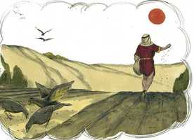
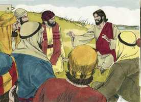
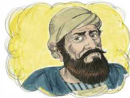
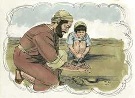
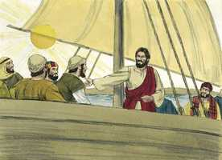

# Marcos Cap 04

**1** 	E OUTRA vez começou a ensinar junto do mar, e ajuntou-se a ele grande multidão, de sorte que ele entrou e assentou-se num barco, sobre o mar; e toda a multidão estava em terra junto do mar.

**2** 	E ensinava-lhes muitas coisas por parábolas, e lhes dizia na sua doutrina:

**3** 	Ouvi: Eis que saiu o semeador a semear.

**4** 	E aconteceu que semeando ele, uma parte da semente caiu junto do caminho, e vieram as aves do céu, e a comeram;

 

**5** 	E outra caiu sobre pedregais, onde não havia muita terra, e nasceu logo, porque não tinha terra profunda;

 

**6** 	Mas, saindo o sol, queimou-se; e, porque não tinha raiz, secou-se.

**7** 	E outra caiu entre espinhos e, crescendo os espinhos, a sufocaram e não deu fruto.

 

**8** 	E outra caiu em boa terra e deu fruto, que vingou e cresceu; e um produziu trinta, outro sessenta, e outro cem.

 

**9** 	E disse-lhes: Quem tem ouvidos para ouvir, ouça.

**10** 	E, quando se achou só, os que estavam junto dele com os doze interrogaram-no acerca da parábola.

 

**11** 	E ele disse-lhes: A vós vos é dado saber os mistérios do reino de Deus, mas aos que estão de fora todas estas coisas se dizem por parábolas,

 

**12** 	Para que, vendo, vejam, e não percebam; e, ouvindo, ouçam, e não entendam; para que não se convertam, e lhes sejam perdoados os pecados.

**13** 	E disse-lhes: Não percebeis esta parábola? Como, pois, entendereis todas as parábolas?

**14** 	O que semeia, semeia a palavra;

**15** 	E, os que estão junto do caminho são aqueles em quem a palavra é semeada; mas, tendo-a eles ouvido, vem logo Satanás e tira a palavra que foi semeada nos seus corações.

 

**16** 	E da mesma forma os que recebem a semente sobre pedregais; os quais, ouvindo a palavra, logo com prazer a recebem;

 

**17** 	Mas não têm raiz em si mesmos, antes são temporãos; depois, sobrevindo tribulação ou perseguição, por causa da palavra, logo se escandalizam.

**18** 	E outros são os que recebem a semente entre espinhos, os quais ouvem a palavra;

 

**19** 	Mas os cuidados deste mundo, e os enganos das riquezas e as ambições de outras coisas, entrando, sufocam a palavra, e fica infrutífera.

**20** 	E estes são os que foram semeados em boa terra, os que ouvem a palavra e a recebem, e dão fruto, um trinta, e outro sessenta, e outro cem.

 

**21** 	E disse-lhes: Vem porventura a candeia para se meter debaixo do alqueire, ou debaixo da cama? não vem antes para se colocar no velador?

**22** 	Porque nada há encoberto que não haja de ser manifesto; e nada se faz para ficar oculto, mas para ser descoberto.

**23** 	Se alguém tem ouvidos para ouvir, ouça.

**24** 	E disse-lhes: Atendei ao que ides ouvir. Com a medida com que medirdes vos medirão a vós, e ser-vos-á ainda acrescentada a vós que ouvis.

**25** 	Porque ao que tem, ser-lhe-á dado; e, ao que não tem, até o que tem lhe será tirado.

**26** 	E dizia: O reino de Deus é assim como se um homem lançasse semente à terra.

**27** 	E dormisse, e se levantasse de noite ou de dia, e a semente brotasse e crescesse, não sabendo ele como.

**28** 	Porque a terra por si mesma frutifica, primeiro a erva, depois a espiga, por último o grão cheio na espiga.

**29** 	E, quando já o fruto se mostra, mete-se-lhe logo a foice, porque está chegada a ceifa.

**30** 	E dizia: A que assemelharemos o reino de Deus? ou com que parábola o representaremos?

**31** 	É como um grão de mostarda, que, quando se semeia na terra, é a menor de todas as sementes que há na terra;

 

**32** 	Mas, tendo sido semeado, cresce; e faz-se a maior de todas as hortaliças, e cria grandes ramos, de tal maneira que as aves do céu podem aninhar-se debaixo da sua sombra.

 

**33** 	E com muitas parábolas tais lhes dirigia a palavra, segundo o que podiam compreender.

**34** 	E sem parábolas nunca lhes falava; porém, tudo declarava em particular aos seus discípulos.

**35** 	E, naquele dia, sendo já tarde, disse-lhes: Passemos para o outro lado.

**36** 	E eles, deixando a multidão, o levaram consigo, assim como estava, no barco; e havia também com ele outros barquinhos.

**37** 	E levantou-se grande temporal de vento, e subiam as ondas por cima do barco, de maneira que já se enchia.

 

**38** 	E ele estava na popa, dormindo sobre uma almofada, e despertaram-no, dizendo-lhe: Mestre, não se te dá que pereçamos?

 

**39** 	E ele, despertando, repreendeu o vento, e disse ao mar: Cala-te, aquieta-te. E o vento se aquietou, e houve grande bonança.

 

**40** 	E disse-lhes: Por que sois tão tímidos? Ainda não tendes fé?

 

**41** 	E sentiram um grande temor, e diziam uns aos outros: Mas quem é este, que até o vento e o mar lhe obedecem?

 

> **Cmt MHenry** Intro: " Cristo estava dormido durante a tormenta para provar a fé de seus discípulos, e instá-los a orar. A fé deles se mostrou débil, e suas orações, poderosas. Quando nosso coração malvado é como o mar tempestuoso que não tem repouso, quando nossas paixões são ingovernáveis, pensemos que ouvimos a lei de Cristo dizendo: "Cala, emudece". Quando fora há pleitos, e dentro, temores, e os espíritos estão inquietos, sem ele dizer "paz, tenha calma", haverá grande calma de imediato. Por que estão assim amedrontados? Ainda que há causa para temer, de todos modos não é para ter um semelhante terror. Poderiam suspeitar de sua fé os que pensam que a Jesus não lhe importava muito que sua gente perecesse. Quão imperfeitos são os melhores santos! A fé e o temor se revezam enquanto estejamos neste mundo, porém, daqui a pouco, o temor será vencido e a fé se perdera na vista. "> Estas declarações estavam concebidas para atrair a atenção dos discípulos à palavra de Cristo. por este tipo de instrução, foram capacitados para instruir outrem; como as velas se acendem, não para serem cobertas, senão para serem colocadas num candeeiro para que dêem luz na habitação. Esta parábola da boa semente, mostra a forma em que o Reino de Deus avança no mundo. Que nada senão a palavra de Cristo tenha o lugar que deve ter na alma, e se demonstrará na boa conversação. Cresce paulatinamente: primeiro o broto, depois a folha, depois disso, o trigo maduro a espiga. Depois que brotou, continuará crescendo. A obra de graça na alma é, primeiro, somente o dia das pequenas coisas; contudo, já tem produtos poderosos, enquanto cresce; mas o que será quando seja aperfeiçoada no céu!> Esta parábola continha instruções tão importantes que todos os capazes de ouvir estavam obrigados a atender. Há muitas coisas que devemos saber, e se não entendemos as verdades claras do evangelho, como aprenderemos as mais difíceis? Nos servirá valorizar os privilégios que desfrutamos como discípulos de Cristo, se meditamos seriamente no estado deplorável de todos os que não têm tais privilégios. No grande campo da Igreja, se dispensa a todos a Palavra de Deus. dos muitos que ouvem a Palavra do Evangelho, uns poucos a recebem como para dar fruto. Muitos que são muito afetados por esta palavra momentaneamente não recebem um benefício perdurável. A palavra não deixa impressões permanentes na mente dos homens porque seus corações não estão devidamente dispostos a recebê-la. O diabo está muito ocupado com os ouvintes negligentes, como as aves do ar o estão com a semente que está sobre o solo. Muitos seguem uma profissão falsa e estéril, e vão para o inferno. As impressões que não são profundas, não durarão. A muitos não lhes importa a obra de coração sem a qual a religião é nada. A abundância do mundo impede que outros sejam beneficiados pela palavra de Deus. os que têm pouco do mundo, podem ser destruídos ainda por dar gosto ao corpo. Deus espera e requer fruto daqueles que desfrutam do evangelho, um temperamento mental e as graças cristãs exercidos diariamente, os deveres cristãos devidamente desempenhados. Olhemos para o Senhor para que por sua graça regeneradora, nossos corações possam chegar a ser boa terra, e que a boa semente da palavra produza em nossa vida essas boas palavras e obras que vêm por meio de Jesus Cristo para louvor e glória de Deus Pai.