# Marcos Cap 05

**1** 	E CHEGARAM ao outro lado do mar, à província dos gadarenos.

 

**2** 	E, saindo ele do barco, lhe saiu logo ao seu encontro, dos sepulcros, um homem com espírito imundo;

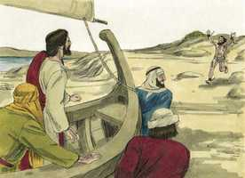 

**3** 	O qual tinha a sua morada nos sepulcros, e nem ainda com cadeias o podia alguém prender;

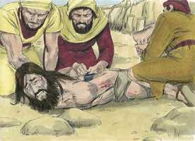 

**4** 	Porque, tendo sido muitas vezes preso com grilhões e cadeias, as cadeias foram por ele feitas em pedaços, e os grilhões em migalhas, e ninguém o podia amansar.

 

**5** 	E andava sempre, de dia e de noite, clamando pelos montes, e pelos sepulcros, e ferindo-se com pedras.

**6** 	E, quando viu Jesus ao longe, correu e adorou-o.

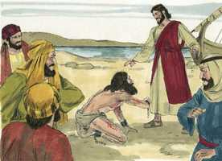 

**7** 	E, clamando com grande voz, disse: Que tenho eu contigo, Jesus, Filho do Deus Altíssimo? conjuro-te por Deus que não me atormentes.

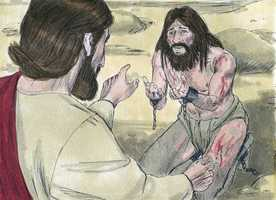 

**8** 	(Porque lhe dizia: Sai deste homem, espírito imundo.)

**9** 	E perguntou-lhe: Qual é o teu nome? E lhe respondeu, dizendo: Legião é o meu nome, porque somos muitos.

**10** 	E rogava-lhe muito que os não enviasse para fora daquela província.

**11** 	E andava ali pastando no monte uma grande manada de porcos.

**12** 	E todos aqueles demônios lhe rogaram, dizendo: Manda-nos para aqueles porcos, para que entremos neles.

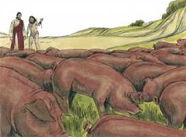 

**13** 	E Jesus logo lho permitiu. E, saindo aqueles espíritos imundos, entraram nos porcos; e a manada se precipitou por um despenhadeiro no mar (eram quase dois mil), e afogaram-se no mar.

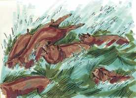 

**14** 	E os que apascentavam os porcos fugiram, e o anunciaram na cidade e nos campos; e saíram muitos a ver o que era aquilo que tinha acontecido.

**15** 	E foram ter com Jesus, e viram o endemoninhado, o que tivera a legião, assentado, vestido e em perfeito juízo, e temeram.

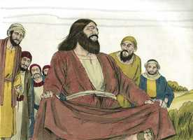 

**16** 	E os que aquilo tinham visto contaram-lhes o que acontecera ao endemoninhado, e acerca dos porcos.

**17** 	E começaram a rogar-lhe que saísse dos seus termos.

**18** 	E, entrando ele no barco, rogava-lhe o que fora endemoninhado que o deixasse estar com ele.

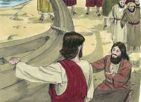 

**19** 	Jesus, porém, não lho permitiu, mas disse-lhe: Vai para tua casa, para os teus, e anuncia-lhes quão grandes coisas o Senhor te fez, e como teve misericórdia de ti.

 

**20** 	E ele foi, e começou a anunciar em Decápolis quão grandes coisas Jesus lhe fizera; e todos se maravilharam.

 

**21** 	E, passando Jesus outra vez num barco para o outro lado, ajuntou-se a ele uma grande multidão; e ele estava junto do mar.

**22** 	E eis que chegou um dos principais da sinagoga, por nome Jairo, e, vendo-o, prostrou-se aos seus pés,

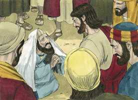 

**23** 	E rogava-lhe muito, dizendo: Minha filha está à morte; rogo-te que venhas e lhe imponhas as mãos, para que sare, e viva.

**24** 	E foi com ele, e seguia-o uma grande multidão, que o apertava.

**25** 	E certa mulher que, havia doze anos, tinha um fluxo de sangue,

 

**26** 	E que havia padecido muito com muitos médicos, e despendido tudo quanto tinha, nada lhe aproveitando isso, antes indo a pior;

**27** 	Ouvindo falar de Jesus, veio por detrás, entre a multidão, e tocou na sua veste.

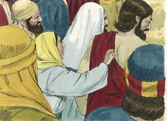 

**28** 	Porque dizia: Se tão-somente tocar nas suas vestes, sararei.

**29** 	E logo se lhe secou a fonte do seu sangue; e sentiu no seu corpo estar já curada daquele mal.

**30** 	E logo Jesus, conhecendo que a virtude de si mesmo saíra, voltou-se para a multidão, e disse: Quem tocou nas minhas vestes?

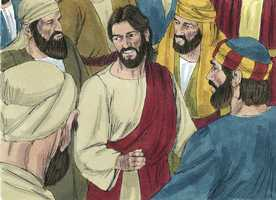 

**31** 	E disseram-lhe os seus discípulos: Vês que a multidão te aperta, e dizes: Quem me tocou?

**32** 	E ele olhava em redor, para ver a que isto fizera.

**33** 	Então a mulher, que sabia o que lhe tinha acontecido, temendo e tremendo, aproximou-se, e prostrou-se diante dele, e disse-lhe toda a verdade.

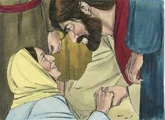 

**34** 	E ele lhe disse: Filha, a tua fé te salvou; vai em paz, e sê curada deste teu mal.

**35** 	Estando ele ainda falando, chegaram alguns do principal da sinagoga, a quem disseram: A tua filha está morta; para que enfadas mais o Mestre?

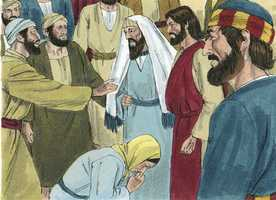 

**36** 	E Jesus, tendo ouvido estas palavras, disse ao principal da sinagoga: Não temas, crê somente.

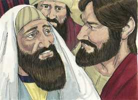 

**37** 	E não permitiu que alguém o seguisse, a não ser Pedro, Tiago, e João, irmão de Tiago.

**38** 	E, tendo chegado à casa do principal da sinagoga, viu o alvoroço, e os que choravam muito e pranteavam.

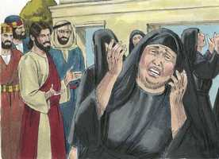 

**39** 	E, entrando, disse-lhes: Por que vos alvoroçais e chorais? A menina não está morta, mas dorme.

**40** 	E riam-se dele; porém ele, tendo-os feito sair, tomou consigo o pai e a mãe da menina, e os que com ele estavam, e entrou onde a menina estava deitada.

**41** 	E, tomando a mão da menina, disse-lhe: Talita cumi; que, traduzido, é: Menina, a ti te digo, levanta-te.

 

**42** 	E logo a menina se levantou, e andava, pois já tinha doze anos; e assombraram-se com grande espanto.

 

**43** 	E mandou-lhes expressamente que ninguém o soubesse; e disse que lhe dessem de comer.

 

> **Cmt MHenry** Intro: Podemos supor que Jairo vacilou acerca se devia ou não pedir a Cristo que fosse para sua casa quando lhe disseram que sua filha estava morta. Mas, não temos a mesma oportunidade para a graça de Deus, e o consolo de seu Espírito, para as orações de nossos ministros e amigos cristãos, quando a morte está na casa, como quando ali está a doença? A fé é o único remédio contra a tristeza e o temor em momentos como esses. Crês na ressurreição e então não temes. Ressuscitou a menina morta por uma palavra de poder. Tal é o chamado do evangelho para os que por natureza estão mortos em delitos e pecados. Pela palavra de Cristo é que se dá a vida espiritual. todos os que viram e ouviram, se maravilharam ante o milagre e dAquele que o fez. Ainda que não possamos esperar que nossos filhos ou familiares mortos sejam ressuscitados, podemos esperar consolo quando estamos em provações.> Um evangelho desprezado ira para onde seja melhor recebido. Um dos dirigentes de uma sinagoga procurou fervorosamente a Cristo porque sua filinha, de uns doze anos, estava morrendo. A caminho Ele realizou outra sanidade. Devemos fazer o bem não só quando estamos em casa, senão quando vamos pelo caminho ([Deuteronômio 6.7](../05A-Dt/06.md#7)). Comum é que a gente não recorra a Cristo, senão quando já tenham experimentado em vão todas as outras ajudas e acharam, como certamente costuma acontecer, que eram médicos sem valor. Alguns correm em direção das diversões e das companhias alegres; outros mergulham nos negócios e até na embriaguez; outros se dedicam a estabelecer sua própria justiça ou se atormentam com vãs superstições. Muitos perecem em tais caminhos, mas ninguém achará jamais repouso para a alma com tais métodos; ao tempo que aqueles aos quais Cristo cura da enfermidade do pecado, acham em si mesmo uma mudança total para melhor. Como os atos secretos do pecado, assim os atos secretos de fé são conhecidos pelo Senhor Jesus. A mulher disse toda a verdade. É a vontade de Cristo que seu povo seja consolado e Ele tem o poder para mandar consolo aos espíritos turvados. Enquanto mais claramente dependamos dEle, e esperemos grandes coisas dEle, mais encontraremos em nós mesmos que Ele tem chegado a ser nossa salvação. Os que por fé são sarados de suas doenças espirituais têm razão para ir em paz.> Alguns pecadores francamente intencionados são como este maluco. Os mandamentos da lei são como correntes e grilhões para refrear os pecadores em seus maus rumos; mas eles rompem esses freios, e isso é prova do poder do diabo neles. Uma legião de soldados estava composta por seis mil homens ou mais. Quantas multidões de espíritos caídos deve haver, e todos inimigos de Deus e do homem, quando aqui havia uma legião num único coitado infeliz! Muitos há que se levantam contra nós. Não somos adversários que possamos enfrentar os inimigos espirituais com nossa própria força, mas no Senhor, e com o poder de sua força, seremos capazes de resisti-los ainda que haja legiões deles,. Quando o transgressor mais vil é libertado da escravidão de Satanás pelo poder de Jesus, senta-se feliz aos pés de seu Libertador e ouve sua palavra, que libera os desditados escravos de Satanás, e os conta entre seus santos e servos.\> \ Quando a gente soube que seus porcos tinham-se perdido, já não gostaram de Cristo. a paciência e a misericórdia podem ver-se ainda nas medidas corretivas pelas quais os homens perdem seus pertences, e salvam as vidas, e são advertidos de que busquem a salvação de suas almas. O homem proclamou jubilosamente as grandes coisas que Jesus tinha feito por ele. Todos os homens se maravilharam, mas poucos o seguiram. Muitos que não podem senão maravilhar-se pelas obras de Cristo, não ficam prendados dEle como deveriam.