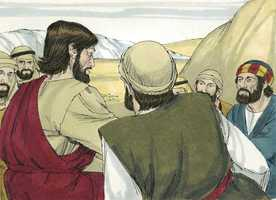
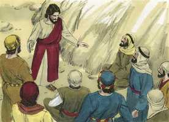

# Marcos Cap 08

**1** 	NAQUELES dias, havendo uma grande multidão, e não tendo o que comer, Jesus chamou a si os seus discípulos, e disse-lhes:

**2** 	Tenho compaixão da multidão, porque há já três dias que estão comigo, e não têm o que comer.

**3** 	E, se os deixar ir em jejum, para suas casas, desfalecerão no caminho, porque alguns deles vieram de longe.

**4** 	E os seus discípulos responderam-lhe: De onde poderá alguém satisfazê-los de pão aqui no deserto?

**5** 	E perguntou-lhes: Quantos pães tendes? E disseram-lhe: Sete.

**6** 	E ordenou à multidão que se assentasse no chão. E, tomando os sete pães, e tendo dado graças, partiu-os, e deu-os aos seus discípulos, para que os pusessem diante deles, e puseram-nos diante da multidão.

**7** 	Tinham também alguns peixinhos; e, tendo dado graças, ordenou que também lhos pusessem diante.

**8** 	E comeram, e saciaram-se; e dos pedaços que sobejaram levantaram sete cestos.

**9** 	E os que comeram eram quase quatro mil; e despediu-os.

**10** 	E, entrando logo no barco, com os seus discípulos, foi para as partes de Dalmanuta.

**11** 	E saíram os fariseus, e começaram a disputar com ele, pedindo-lhe, para o tentarem, um sinal do céu.

**12** 	E, suspirando profundamente em seu espírito, disse: Por que pede esta geração um sinal? Em verdade vos digo que a esta geração não se dará sinal algum.

**13** 	E, deixando-os, tornou a entrar no barco, e foi para o outro lado.

**14** 	E eles se esqueceram de levar pão e, no barco, não tinham consigo senão um pão.

**15** 	E ordenou-lhes, dizendo: Olhai, guardai-vos do fermento dos fariseus e do fermento de Herodes.

**16** 	E arrazoavam entre si, dizendo: É porque não temos pão.

**17** 	E Jesus, conhecendo isto, disse-lhes: Para que arrazoais, que não tendes pão? não considerastes, nem compreendestes ainda? tendes ainda o vosso coração endurecido?

**18** 	Tendo olhos, não vedes? e tendo ouvidos, não ouvis? e não vos lembrais,

**19** 	Quando parti os cinco pães entre os cinco mil, quantas alcofas cheias de pedaços levantastes? Disseram-lhe: Doze.

**20** 	E, quando parti os sete entre os quatro mil, quantos cestos cheios de pedaços levantastes? E disseram-lhe: Sete.

**21** 	E ele lhes disse: Como não entendeis ainda?

**22** 	E chegou a Betsaida; e trouxeram-lhe um cego, e rogaram-lhe que o tocasse.

**23** 	E, tomando o cego pela mão, levou-o para fora da aldeia; e, cuspindo-lhe nos olhos, e impondo-lhe as mãos, perguntou-lhe se via alguma coisa.

**24** 	E, levantando ele os olhos, disse: Vejo os homens; pois os vejo como árvores que andam.

**25** 	Depois disto, tornou a pôr-lhe as mãos sobre os olhos, e o fez olhar para cima: e ele ficou restaurado, e viu a todos claramente.

**26** 	E mandou-o para sua casa, dizendo: Nem entres na aldeia, nem o digas a ninguém na aldeia.

**27** 	E saiu Jesus, e os seus discípulos, para as aldeias de Cesaréia de Filipe; e no caminho perguntou aos seus discípulos, dizendo: Quem dizem os homens que eu sou?

 

**28** 	E eles responderam: João o Batista; e outros: Elias; mas outros: Um dos profetas.

**29** 	E ele lhes disse: Mas vós, quem dizeis que eu sou? E, respondendo Pedro, lhe disse: Tu és o Cristo.

   

**30** 	E admoestou-os, para que a ninguém dissessem aquilo dele.

 

**31** 	E começou a ensinar-lhes que importava que o Filho do homem padecesse muito, e que fosse rejeitado pelos anciãos e príncipes dos sacerdotes, e pelos escribas, e que fosse morto, mas que depois de três dias ressuscitaria.

 

**32** 	E dizia abertamente estas palavras. E Pedro o tomou à parte, e começou a repreendê-lo.

 

**33** 	Mas ele, virando-se, e olhando para os seus discípulos, repreendeu a Pedro, dizendo: Retira-te de diante de mim, Satanás; porque não compreendes as coisas que são de Deus, mas as que são dos homens.

 

**34** 	E chamando a si a multidão, com os seus discípulos, disse-lhes: Se alguém quiser vir após mim, negue-se a si mesmo, e tome a sua cruz, e siga-me.

 

**35** 	Porque qualquer que quiser salvar a sua vida, perdê-la-á, mas, qualquer que perder a sua vida por amor de mim e do evangelho, esse a salvará.

**36** 	Pois, que aproveitaria ao homem ganhar todo o mundo e perder a sua alma?

**37** 	Ou, que daria o homem pelo resgate da sua alma?

**38** 	Porquanto, qualquer que, entre esta geração adúltera e pecadora, se envergonhar de mim e das minhas palavras, também o Filho do homem se envergonhará dele, quando vier na glória de seu Pai, com os santos anjos.

> **Cmt MHenry** Intro: Se dá notícia freqüente da grande aglomeração que havia em volta de Cristo para que ajudasse em diversos casos. A todos corresponde saber disto, se esperam que cure suas almas. Eles não devem ser indulgentes para a comodidade da carne. Como a felicidade do céu com Cristo é suficiente para compensar a perda da própria vida por amor a Ele, assim, se ganhar todo o mundo por meio do pecado não compensa a destruição da alma pelo pecado. chega o dia em que a causa de Cristo aparecerá tão gloriosa, como agora alguns acreditam pouca coisa e desprezível. Pensemos nessa época e vejamos todo objeto terreno como o veremos naquele grande dia.> Estas coisas estão escritas ´ç que acreditemos que Jesus é o Cristo, o Filho de Deus. os milagres de nosso Senhor nos asseguram que não foi vencido, senão que foi vencedor. Agora, os discípulos estão convencidos de que Jesus é o Cristo; estão em condições de suportar se conhecem seus sofrimentos, os quais Cristo começa aqui a dar a conhecer a eles. Ele vê o errado no que dizemos e fazemos, do qual nós mesmos não temos consciência, e sabe de que espírito somos, ainda quando nós não. A sabedoria do homem é coisa néscia se pretende limitar os conselhos divinos. Pedro não entendia corretamente a natureza do Reino de Cristo.> Eis aqui um cego levado a Cristo por seus amigos. Daí se demonstra a fé dos que o trouxeram. Se os que estão espiritualmente cegos não oram por si mesmos, de todos modos suas amizades e parentes devem orar por eles, para que Cristo queira tocá-los. A sanidade foi operada em forma paulatina, o que estava fora do padrão comum dos milagres de nosso Senhor. Cristo demonstra seu método comum para sarar por sua graça aos que, por natureza, estão espiritual cegos. primeiro, seu conhecimento é confuso, todavia, como a luz da aurora vai em aumento até o dia ser perfeito e, então, eles enxergam claramente todas as coisas. Tomar à ligeira os favores de Cristo é renunciar a eles; e aos que assim agem, lhes dará a conhecer o valor de seus benefícios por meio da necessidade.> A incredulidade obstinada terá algo a dizer ainda que seja muito irracional. Cristo recusou responder a demanda deles. Se não sentem convicção de pecado, nunca se convencerão. Ai, quanta razão temos para lamentar-nos pelos que nos rodeiam, e se destroem a si mesmos e aos outros com sua incredulidade perversa e obcecada, e por sua inimizade com o evangelho! Quando esquecemos as obras de Deus e desconfiamos dEle, devemos repreender-nos severamente como Cristo repreende aqui a seus discípulos. Como é que tão freqüentemente erramos com sua significação, rejeitamos suas advertências e desconfiamos de sua providência?> Nosso Senhor Jesus exortou os mais vis que acudiram a Ele em busca de vida e graça. Cristo conhece e considera nosso estado de ânimo. A generosidade de Cristo está sempre preparada; para mostrar isto repete este milagre. Seus favores se renovam, como acontece com nossas carências e necessidades. Não deve temer a escassez o que tem a Cristo para viver por fé, e deve dar ação de graças.