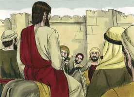
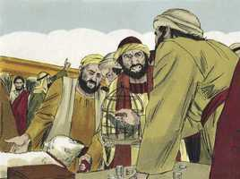
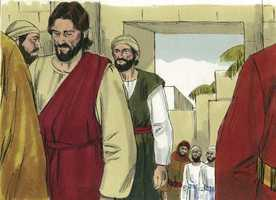

# Marcos Cap 11

**1** 	E, LOGO que se aproximaram de Jerusalém, de Betfagé e de Betânia, junto do Monte das Oliveiras, enviou dois dos seus discípulos,

 

**2** 	E disse-lhes: Ide à aldeia que está defronte de vós; e, logo que ali entrardes, encontrareis preso um jumentinho, sobre o qual ainda não montou homem algum; soltai-o, e trazei-mo.

**3** 	E, se alguém vos disser: Por que fazeis isso? dizei-lhe que o Senhor precisa dele, e logo o deixará trazer para aqui.

**4** 	E foram, e encontraram o jumentinho preso fora da porta, entre dois caminhos, e o soltaram.

 

**5** 	E alguns dos que ali estavam lhes disseram: Que fazeis, soltando o jumentinho?

**6** 	Eles, porém, disseram-lhes como Jesus lhes tinha mandado; e deixaram-nos ir.

**7** 	E levaram o jumentinho a Jesus, e lançaram sobre ele as suas vestes, e assentou-se sobre ele.

 

**8** 	E muitos estendiam as suas vestes pelo caminho, e outros cortavam ramos das árvores, e os espalhavam pelo caminho.

 

**9** 	E aqueles que iam adiante, e os que seguiam, clamavam, dizendo: Hosana, bendito o que vem em nome do Senhor;

 

**10** 	Bendito o reino do nosso pai Davi, que vem em nome do Senhor. Hosana nas alturas.

**11** 	E Jesus entrou em Jerusalém, no templo e, tendo visto tudo em redor, como fosse já tarde, saiu para Betânia com os doze.

 

**12** 	E, no dia seguinte, quando saíram de Betânia, teve fome.

**13** 	E, vendo de longe uma figueira que tinha folhas, foi ver se nela acharia alguma coisa; e, chegando a ela, não achou senão folhas, porque não era tempo de figos.

**14** 	E Jesus, falando, disse à figueira: Nunca mais coma alguém fruto de ti. E os seus discípulos ouviram isto.

**15** 	E vieram a Jerusalém; e Jesus, entrando no templo, começou a expulsar os que vendiam e compravam no templo; e derrubou as mesas dos cambiadores e as cadeiras dos que vendiam pombas.

  

**16** 	E não consentia que alguém levasse algum vaso pelo templo.

**17** 	E os ensinava, dizendo: Não está escrito: A minha casa será chamada, por todas as nações, casa de oração? Mas vós a tendes feito covil de ladrões.

 

**18** 	E os escribas e príncipes dos sacerdotes, tendo ouvido isto, buscavam ocasião para o matar; pois eles o temiam, porque toda a multidão estava admirada acerca da sua doutrina.

 

**19** 	E, sendo já tarde, saiu para fora da cidade.

 

**20** 	E eles, passando pela manhã, viram que a figueira se tinha secado desde as raízes.

**21** 	E Pedro, lembrando-se, disse-lhe: Mestre, eis que a figueira, que tu amaldiçoaste, se secou.

**22** 	E Jesus, respondendo, disse-lhes: Tende fé em Deus;

**23** 	Porque em verdade vos digo que qualquer que disser a este monte: Ergue-te e lança-te no mar, e não duvidar em seu coração, mas crer que se fará aquilo que diz, tudo o que disser lhe será feito.

**24** 	Por isso vos digo que todas as coisas que pedirdes, orando, crede receber, e tê-las-eis.

**25** 	E, quando estiverdes orando, perdoai, se tendes alguma coisa contra alguém, para que vosso Pai, que está nos céus, vos perdoe as vossas ofensas.

**26** 	Mas, se vós não perdoardes, também vosso Pai, que está nos céus, vos não perdoará as vossas ofensas.

**27** 	E tornaram a Jerusalém, e, andando ele pelo templo, os principais dos sacerdotes, e os escribas, e os anciãos, se aproximaram dele.

**28** 	E lhe disseram: Com que autoridade fazes tu estas coisas? ou quem te deu tal autoridade para fazer estas coisas?

**29** 	Mas Jesus, respondendo, disse-lhes: Também eu vos perguntarei uma coisa, e respondei-me; e então vos direi com que autoridade faço estas coisas:

**30** 	O batismo de João era do céu ou dos homens? respondei-me.

**31** 	E eles arrazoavam entre si, dizendo: Se dissermos: Do céu, ele nos dirá: Então por que o não crestes?

**32** 	Se, porém, dissermos: Dos homens, tememos o povo. Porque todos sustentavam que João verdadeiramente era profeta.

**33** 	E, respondendo, disseram a Jesus: Não sabemos. E Jesus lhes replicou: Também eu vos não direi com que autoridade faço estas coisas.

> **Cmt MHenry** Intro: Nossos Salvadores demonstram quanto tinham a ver sua doutrina e seu batismo com os de João; tinham o mesmo desígnio e tendência: trazer o evangelho do reino. Estes anciãos não mereciam que lhes ensinassem; porque estava claro que não contendiam pela verdade senão pela vitória; nem tampouco precisou dizê-lo, porque as obras que Ele fez diziam claramente que tinha a autoridade de Deus; já que nenhum homem podia fazer os milagres que fazia a menos que Deus estivesse com ele.> Os discípulos não podiam pensar por que a figueira murchou tão de repente, mas todos os que rejeitam a Cristo murcham: isso representa o estado da igreja judia. Não devemos descansar em nenhuma religião que não nos faça férteis em boas obras. A partir disso, Cristo lhes ensinou a orar com fé. Pode aplicar-se à fé poderosa de que são dotados todos os cristãos verdadeiros e que faz maravilhas nas coisas espirituais. Nos justifica, e assim elimina montanhas de culpa, que nunca voltarão a levantar-se em juízo contra nós. Purifica o coração e, assim, elimina montanhas de corrupção, e as aplana ante a graça de Deus. Uma diligencia grande ante o trono da graça é orar pelo perdão de nossos pecados; e preocupar-se por isto deveria ser nosso esforço diário.> Cristo olhou buscando algum fruto, porque o tempo de colher figos, embora perto, não tinha ainda chegado, mas não achou nenhum. Fez da figueira um exemplo, não para as árvores, senão para os homens dessa geração. Era uma figura da condenação para a igreja judaica, à qual veio em busca de frutos sem achar nenhum. Cristo foi ao templo e começou a reformar os abusos de seus átrios, para indicar que quando o Redentor vier a Sião, eliminaria a impiedade de Jacó. Os escribas e os principais sacerdotes procuravam, não como puder ter paz com Ele, senão como destruí-lo. Uma tentativa desesperada na qual somente podiam temer, porque era pelejar contra Deus.> A chegada de Cristo a Jerusalém mostra em forma notável que Ele não temia o poder nem a maldade de seus inimigos. Isto alentaria seus discípulos que estavam cheios de medo. Além disso, não o inquietavam os pensamentos sobre seus sofrimentos que se aproximavam. Todavia, todo marcava sua humilhação; e estes assuntos nos ensinam a não preocupar-nos por alcançar as coisas de alto nível, senão a condescender com as de baixo nível. Que mal faz aos cristãos dar-se categorias elevadas, quando Cristo esteve tão longe de reclamá-las! Deram as boas-vindas a sua pessoa: Bendito o que vem! O que devia vir: tão freqüentemente prometido; tanto tempo esperado; vem em nome do Senhor. Que tenha nossos melhores afetos; Ele é um Salvador bendito e nos traz bênçãos, e bendito seja o que o enviou. Os louvores sejam a nosso Deus que está nos céus mais altos, e por sobre todo é bendito para sempre.