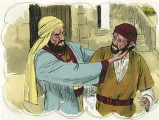

# Marcos Cap 12

**1** 	E COMEÇOU a falar-lhes por parábolas: Um homem plantou uma vinha, e cercou-a de um valado, e fundou nela um lagar, e edificou uma torre, e arrendou-a a uns lavradores, e partiu para fora da terra.

  

**2** 	E, chegado o tempo, mandou um servo aos lavradores para que recebesse, dos lavradores, do fruto da vinha.

 

**3** 	Mas estes, apoderando-se dele, o feriram e o mandaram embora vazio.

 

**4** 	E tornou a enviar-lhes outro servo; e eles, apedrejando-o, o feriram na cabeça, e o mandaram embora, tendo-o afrontado.

 

**5** 	E tornou a enviar-lhes outro, e a este mataram; e a outros muitos, dos quais a uns feriram e a outros mataram.

 

**6** 	Tendo ele, pois, ainda um seu filho amado, enviou-o também a estes por derradeiro, dizendo: Ao menos terão respeito ao meu filho.

 

**7** 	Mas aqueles lavradores disseram entre si: Este é o herdeiro; vamos, matemo-lo, e a herança será nossa.

 

**8** 	E, pegando dele, o mataram, e o lançaram fora da vinha.

**9** 	Que fará, pois, o senhor da vinha? Virá, e destruirá os lavradores, e dará a vinha a outros.

**10** 	Ainda não lestes esta Escritura: A pedra, que os edificadores rejeitaram, Esta foi posta por cabeça de esquina;

 

**11** 	Isto foi feito pelo Senhor E é coisa maravilhosa aos nossos olhos?

**12** 	E buscavam prendê-lo, mas temiam a multidão; porque entendiam que contra eles dizia esta parábola; e, deixando-o, foram-se.

  

**13** 	E enviaram-lhe alguns dos fariseus e dos herodianos, para que o apanhassem nalguma palavra.

 

**14** 	E, chegando eles, disseram-lhe: Mestre, sabemos que és homem de verdade, e de ninguém se te dá, porque não olhas à aparência dos homens, antes com verdade ensinas o caminho de Deus; é lícito dar o tributo a César, ou não? Daremos, ou não daremos?

 

**15** 	Então ele, conhecendo a sua hipocrisia, disse-lhes: Por que me tentais? Trazei-me uma moeda, para que a veja.

  

**16** 	E eles lha trouxeram. E disse-lhes: De quem é esta imagem e inscrição? E eles lhe disseram: De César.

 

**17** 	E Jesus, respondendo, disse-lhes: Dai pois a César o que é de César, e a Deus o que é de Deus. E maravilharam-se dele.

  

**18** 	Então os saduceus, que dizem que não há ressurreição, aproximaram-se dele, e perguntaram-lhe, dizendo:

**19** 	Mestre, Moisés nos escreveu que, se morresse o irmão de alguém, e deixasse a mulher e não deixasse filhos, seu irmão tomasse a mulher dele, e suscitasse descendência a seu irmão.

**20** 	Ora, havia sete irmãos, e o primeiro tomou a mulher, e morreu sem deixar descendência;

**21** 	E o segundo também a tomou e morreu, e nem este deixou descendência; e o terceiro da mesma maneira.

**22** 	E tomaram-na os sete, sem, contudo, terem deixado descendência. Finalmente, depois de todos, morreu também a mulher.

**23** 	Na ressurreição, pois, quando ressuscitarem, de qual destes será a mulher? porque os sete a tiveram por mulher.

**24** 	E Jesus, respondendo, disse-lhes: Porventura não errais vós em razão de não saberdes as Escrituras nem o poder de Deus?

 

**25** 	Porquanto, quando ressuscitarem dentre os mortos, nem casarão, nem se darão em casamento, mas serão como os anjos que estão nos céus.

**26** 	E, acerca dos mortos que houverem de ressuscitar, não tendes lido no livro de Moisés como Deus lhe falou na sarça, dizendo: Eu sou o Deus de Abraão, e o Deus de Isaque, e o Deus de Jacó?

 

**27** 	Ora, Deus não é de mortos, mas sim, é Deus de vivos. Por isso vós errais muito.

**28** 	Aproximou-se dele um dos escribas que os tinha ouvido disputar, e sabendo que lhes tinha respondido bem, perguntou-lhe: Qual é o primeiro de todos os mandamentos?

**29** 	E Jesus respondeu-lhe: O primeiro de todos os mandamentos é: Ouve, Israel, o Senhor nosso Deus é o único Senhor.

**30** 	Amarás, pois, ao Senhor teu Deus de todo o teu coração, e de toda a tua alma, e de todo o teu entendimento, e de todas as tuas forças; este é o primeiro mandamento.

**31** 	E o segundo, semelhante a este, é: Amarás o teu próximo como a ti mesmo. Não há outro mandamento maior do que estes.

**32** 	E o escriba lhe disse: Muito bem, Mestre, e com verdade disseste que há um só Deus, e que não há outro além dele;

**33** 	E que amá-lo de todo o coração, e de todo o entendimento, e de toda a alma, e de todas as forças, e amar o próximo como a si mesmo, é mais do que todos os holocaustos e sacrifícios.

**34** 	E Jesus, vendo que havia respondido sabiamente, disse-lhe: Não estás longe do reino de Deus. E já ninguém ousava perguntar-lhe mais nada.

**35** 	E, falando Jesus, dizia, ensinando no templo: Como dizem os escribas que o Cristo é filho de Davi?

 

**36** 	O próprio Davi disse pelo Espírito Santo: O Senhor disse ao meu Senhor: Assenta-te à minha direita Até que eu ponha os teus inimigos por escabelo dos teus pés.

**37** 	Pois, se Davi mesmo lhe chama Senhor, como é logo seu filho? E a grande multidão o ouvia de boa vontade.

**38** 	E, ensinando-os, dizia-lhes: Guardai-vos dos escribas, que gostam de andar com vestes compridas, e das saudações nas praças,

**39** 	E das primeiras cadeiras nas sinagogas, e dos primeiros assentos nas ceias;

**40** 	Que devoram as casas das viúvas, e isso com pretexto de largas orações. Estes receberão mais grave condenação.

**41** 	E, estando Jesus assentado defronte da arca do tesouro, observava a maneira como a multidão lançava o dinheiro na arca do tesouro; e muitos ricos deitavam muito.

  

**42** 	Vindo, porém, uma pobre viúva, deitou duas pequenas moedas, que valiam meio centavo.

 

**43** 	E, chamando os seus discípulos, disse-lhes: Em verdade vos digo que esta pobre viúva deitou mais do que todos os que deitaram na arca do tesouro;

 

**44** 	Porque todos ali deitaram do que lhes sobejava, mas esta, da sua pobreza, deitou tudo o que tinha, todo o seu sustento.

 

> **Cmt MHenry** Intro: Não esqueçamos que Jesus ainda observa a arca das ofertas. Ele sabe quanto e por que motivos dão para sua causa os homens. Ele atenta para o coração, e quais são as nossas opiniões ao dar esmola; e se o fizermos como para o Senhor ou somente para sermos vistos pelos homens. é tão raro achar alguém que não culpe a esta viúva, que não podemos esperar achar a muitos que façam como ela; não obstante, nosso Salvador a elogia; portanto, estamos seguros que ela agiu bem e sabiamente. Os fracos esforços do pobre para honrar a seu Salvador serão elogiados no dia quando as ações esplêndidas dos incrédulos sejam expostas ao desprezo.> Quando atentamos para o que declaram as Escrituras, Enquanto à pessoa e os ofícios de Cristo, seremos guiados a confessá-lo como nosso Senhor e Deus; a obedecê-lo como nosso Redentor exaltado. Se a gente comum ouve alegremente estas coisas, enquanto os educados e distinguidos se opõem, aqueles são ditosos e estes devem ser compadecidos. E como o pecado disfarçado com aparência de piedade, e dupla iniqüidade, assim sua condena será duplamente pesada.> Os que desejam sinceramente que o dever lhes seja ensinado, Cristo os guiará em Jz e lhes ensinará o caminho. Diz o escriba que o maior mandamento, que indubitavelmente inclui tudo, é amar a Deus de todo nosso coração. Onde este é o princípio reitor da alma, ali há uma disposição para todo outro dever. Amar a Deus com todo o nosso coração nos compromete com tudo o que Lhe compraz. Os sacrifícios somente representavam a expiação das transgressões da lei moral perpetradas pelos homens; não tinham poder exceto ao expressar o arrependimento e a fé no prometido Salvador, e Enquanto levassem à obediência moral. Como nós não amamos assim a Deus nem ao homem, senão precisamente o contrário, somos pecadores condenados; necessitamos arrependimento e necessitamos misericórdia. Cristo aprovou o que o escriba disse que o animou. Ficou para ulterior conselho, porque este conhecimento da lei conduz à convicção de pecado, ao arrependimento, a descobrir nossa necessidade de misericórdia, e a entender o caminho da justificação por Cristo.> O reto conhecimento da Escritura, como fonte de onde flui agora toda a religião revelada, e o fundamento sobre o qual se constrói, é o melhor preservativo contra o erro. Cristo rejeitou a objeção dos saduceus, que eram infiéis caluniadores da religião daquela época, afirmando a doutrina do estado futuro sob a luz verdadeira. A relação entre marido e mulher, embora estipulada no paraíso terreno, não se conhecerá no celestial. Não é para maravilhar-se se nos confundimos com erros néscios, quando nos formamos nossas idéias do mundo dos espíritos pelos acontecimentos deste mundo dos sentidos. Absurdo é pensar que o Deus vivo seja a porção e a felicidade de um homem se este está morto para sempre; portanto, é certo que a alma de Abraão existe e atua ainda que separada temporariamente do corpo. Aqueles que negam a ressurreição erram muito e isto deve ser-lhes mostrado. Procuremos passar por este mundo moribundo com a esperança jubilosa da felicidade eterna, e da ressurreição gloriosa.> Poderia se pensar que os inimigos de Cristo desejariam conhecer seu dever, quando realmente esperavam que tomasse qualquer partido para acusá-lo. nada resulta mais provável para capturar os seguidores de Cristo que levá-los a meter-se nos debates da política mundana. Jesus evitou a armadilha referindo-se à submissão que eles já tinham efetuado como nação. Muitos elogiarão as palavras de um sermão, mas sem obedecer a suas doutrinas.> Cristo mostrou em parábolas que deixaria de lado a igreja judaica. Entristece pensar o maltrato que acharam os fiéis ministros de Deus em todas as épocas, de parte de quem desfrutaram os privilégios da igreja, mas que não deram o fruto requerido. Deus enviou, finalmente, seu Filho, seu bem-amado; e poderia ter-se esperado que eles também respeitassem e amassem o amado de seu Senhor; não obstante, em lugar de honrá-lo porque era o Filho e herdeiro, o odiaram. Mas a exaltação de Cristo foi obra do Senhor; e é sua obra exaltá-lo em nossos corações, e estabelecer ali seu trono; e se isso é feito, não pode senão ser maravilhoso ante nossos olhos. As Escrituras e os pregadores fiéis, e a próxima vinda de Cristo encarnado, nos chamam a render o devido louvor a Deus em nossa vida. Os pecadores devem cuidar-se do espírito orgulhoso e carnal; se eles injuriam ou desprezam os pregadores de Cristo, o fariam também com o seu Senhor se tivessem vivido quando Ele esteve na terra.